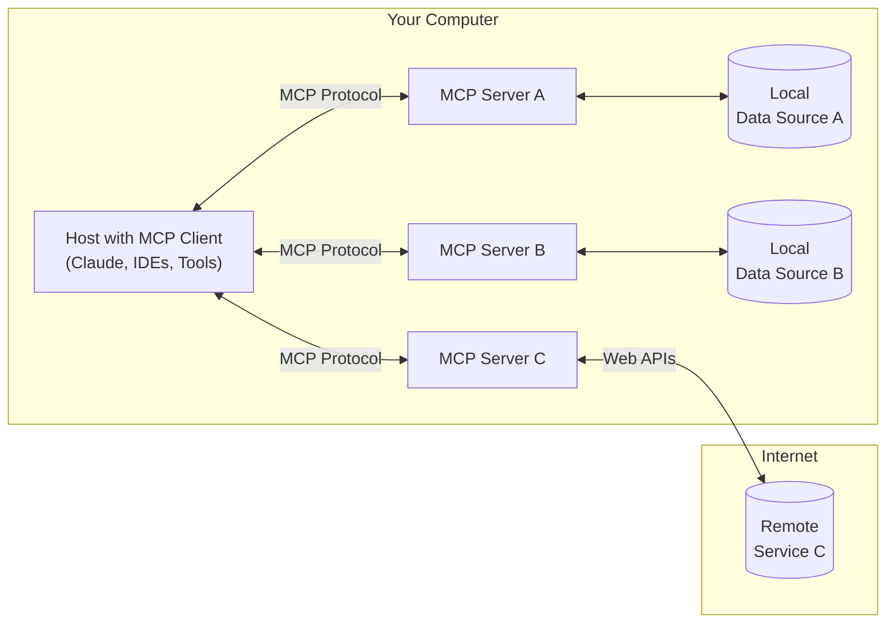

# 1.需求

如下是一个node.js MCP client项目，具体代码在一级标题原项目文件下给出，相关文档在一级标题原项目文档下给出。

注意：请先阅读一级标题MCP client开发下的资料，学习如何开发MCP client

描述项目依赖的package.json：

```json
{
  "name": "mcp-client-nodejs",
  "version": "1.0.2",
  "description": "Node.js MCP Client 实现，基于 Model Context Protocol",
  "type": "commonjs",
  "main": "build/index.js",
  "bin": {
    "mcp-client-nodejs": "./build/index.js"
  },
  "scripts": {
    "build": "tsc && chmod 755 build/index.js",
    "start": "node build/index.js"
  },
  "keywords": ["mcp", "model-context-protocol", "llm", "client"],
  "homepage": "https://github.com/ConardLi/mcp-client-nodejs",
  "author": "ConardLi",
  "license": "Apache License 2.0",
  "dependencies": {
    "@modelcontextprotocol/sdk": "^1.9.0",
    "dotenv": "^16.5.0",
    "openai": "^4.93.0"
  },
  "devDependencies": {
    "@types/node": "^22.14.0",
    "typescript": "^5.8.3"
  }
}
```

现要你将项目改写为nest.js项目，要求：

改写后的项目文件放在packages/MCP-client里

## 1.功能不变

## 2.模块划分转为IoC架构

client模块

- service
  - LLMService
  - ToolService

## 3.日志记录使用AOP

原日志记录逻辑封装为拦截器

## 4.日志清除改为logs中新建文件夹

先获取现在的年、月、日，如果`${年}-${月}-${日}`文件夹不存在则新建。

添加日志的逻辑由写入logs改为写入当前logs/`${年}-${月}-${日}`文件夹

## 5.在ToolService中区分本地MCP server的通信和远程MCP server的通信

如果你不知道MCP client如何与远程MCP server通信，请只提供方法定义，不提供实现

但MCP client如何与本地MCP server通信的相关方法原项目已经实现，请正确地在新项目中实现

# 2.原项目文件

## src/index.ts

```ts
#!/usr/bin/env node

/**
 * MCP Client 主入口文件
 *
 * 这是一个基于Model Context Protocol的客户端实现，使用OpenAI API
 * 用于连接MCP服务器并提供LLM对话能力
 */

// 显式引用Node.js类型以解决process相关问题
/// <reference types="node" />

import { MCPClient } from "./mcpClient.js";
import { validateEnv } from "./utils/config.js";
import { clearLogs } from "./utils/log.js";

/**
 * 显示使用说明
 */
function showUsage(): void {
  console.log("=====================================================");
  console.log("MCP Client - 模型上下文协议客户端");
  console.log("=====================================================");
  console.log("基本用法:");
  console.log("  node build/index.js <服务器脚本路径>");
  console.log("使用配置文件:");
  console.log("  node build/index.js <服务器名称> <配置文件路径>");
  console.log("示例:");
  console.log("  node build/index.js ../mcp-server/build/index.js");
  console.log("  node build/index.js memory ./mcp-servers.json");
  console.log("  node build/index.js default ./mcp-servers.json");
  console.log("=====================================================");
}

/**
 * 主函数
 * 处理命令行参数并启动MCP客户端
 */
async function main() {
  // 清空日志目录
  clearLogs();

  try {
    // 验证环境变量
    validateEnv();

    // 检查命令行参数
    if (process.argv.length < 3) {
      showUsage();
      return;
    }

    const serverIdentifier = process.argv[2];
    const configPath =
      process.argv.length >= 4 ? process.argv[3] : "./mcp-servers.json";

    // 创建MCP客户端实例
    const mcpClient = new MCPClient();

    try {
      // 连接到MCP服务器
      if (configPath) {
        console.log(
          `正在连接到服务器: ${serverIdentifier} (使用配置文件: ${configPath})`,
        );
      } else {
        console.log(`正在连接到服务器: ${serverIdentifier}`);
      }
      await mcpClient.connectToServer(serverIdentifier, configPath);

      // 启动交互式聊天循环
      await mcpClient.chatLoop();
    } catch (error) {
      console.error("\n运行MCP客户端时出错:", error);
    } finally {
      // 确保资源被清理
      await mcpClient.cleanup();
    }
  } catch (error) {
    console.error("初始化MCP客户端失败:", error);
  } finally {
    process.exit(0);
  }
}

// 执行主函数
main();
```

## src/mcpClient.ts

```ts
/**
 * MCP客户端实现类
 *
 * 该类负责管理MCP服务器连接、处理工具调用和实现聊天逻辑
 * 基于Model Context Protocol (MCP)，使用OpenAI API实现对话功能
 */

import { Client } from "@modelcontextprotocol/sdk/client/index.js";
import { StdioClientTransport } from "@modelcontextprotocol/sdk/client/stdio.js";
import OpenAI from "openai";
import * as readline from "readline/promises";

// 导入服务和工具
import { LLMService } from "./services/LLMService.js";
import { ToolService } from "./services/ToolService.js";
import type { OpenAITool } from "./types/index.js";
import {
  defaultConfig,
  getApiKey,
  getBaseURL,
  getModelName,
} from "./utils/config.js";

/**
 * MCP客户端类
 * 负责连接服务器、调用 llm 和处理工具调用，是应用程序的核心组件
 * 通过messages数组实现llm对话历史，来提供context
 */
export class MCPClient {
  private mcp: Client; // MCP客户端
  private transport: StdioClientTransport | null = null; // 传输层
  private tools: OpenAITool[] = []; // 可用工具列表
  private llmService: LLMService; // LLM服务
  private toolService: ToolService; // 工具服务
  /**
   * 默认通过openai模型本身提供的tools功能实现MCP client。
   * 可选system prompt实现MCP client。
   */
  private systemPrompt?: string; // 系统提示词，从配置文件中读取
  private messages: Array<OpenAI.Chat.ChatCompletionMessageParam> = []; // 对话消息历史

  /**
   * 构造函数
   * 初始化服务和客户端
   */
  constructor() {
    // 初始化MCP客户端
    this.mcp = new Client({
      name: defaultConfig.clientName,
      version: defaultConfig.clientVersion,
    });

    // 初始化LLM服务
    this.llmService = new LLMService(getApiKey(), getModelName(), getBaseURL());

    // 初始化工具服务
    this.toolService = new ToolService(this.mcp);
  }

  /**
   * 没有提供服务器配置时, 视为运行本地MCP server。
   * 返回启动服务器的命令及参数作为传输层参数。
   * @param scriptPath 脚本路径
   * @returns 传输层参数 (启动服务器的命令及参数)
   * @private
   */
  private getTransportOptionsForScript(scriptPath: string): {
    command: string;
    args: string[];
    env?: Record<string, string>;
  } {
    // 检查脚本类型
    const isJs = scriptPath.endsWith(".js");
    const isPy = scriptPath.endsWith(".py");

    if (!isJs && !isPy) {
      console.warn("警告: 服务器脚本没有.js或.py扩展名，将尝试使用Node.js运行");
    }

    // 根据脚本类型确定命令
    const command = isPy
      ? process.platform === "win32"
        ? "python"
        : "python3"
      : process.execPath;

    return {
      command,
      args: [scriptPath],
    };
  }

  /**
   * 连接到MCP服务器
   * @param serverIdentifier 服务器标识符（脚本路径或配置中的服务器名称）
   * @param configPath 可选，MCP服务器配置文件路径
   */
  async connectToServer(
    serverIdentifier: string,
    configPath?: string,
  ): Promise<void> {
    try {
      /**
       * 1.MCP server 配置转为传输层参数（MCP）
       * 		传输层参数用于创建transport（MCP），MCP client 和 MCP server 通过 transport进行通信
       */
      // 创建传输层参数
      let transportOptions: {
        command: string;
        args: string[];
        env?: Record<string, string>;
      };

      // 如果提供了配置文件路径，从配置文件加载服务器设置
      if (configPath) {
        try {
          // 使用fs的promise API代替require
          const fs = await import("fs/promises");
          const configContent = await fs.readFile(configPath, "utf8");
          const config = JSON.parse(configContent);

          // 读取系统提示词（如果有）
          this.systemPrompt = config.system;
          this.messages.push({
            role: "system",
            content: this.systemPrompt || "",
          });

          // 检查服务器标识符是否存在于配置中
          if (config.mcpServers && config.mcpServers[serverIdentifier]) {
            const serverConfig = config.mcpServers[serverIdentifier];
            transportOptions = {
              command: serverConfig.command,
              args: serverConfig.args || [],
              env: serverConfig.env,
            };
            console.log(`使用配置文件启动服务器: ${serverIdentifier}`);
          } else if (
            serverIdentifier === "default" &&
            config.defaultServer &&
            config.mcpServers[config.defaultServer]
          ) {
            // 使用默认服务器
            const defaultServerName = config.defaultServer;
            const serverConfig = config.mcpServers[defaultServerName];
            transportOptions = {
              command: serverConfig.command,
              args: serverConfig.args || [],
              env: serverConfig.env,
            };
            console.log(`使用默认服务器: ${defaultServerName}`);
          } else {
            // 如果指定的服务器不在配置中，打印错误消息
            throw new Error(`在配置文件中未找到服务器 ${serverIdentifier}`);
          }
        } catch (error) {
          console.error(
            `读取配置文件错误: ${error instanceof Error ? error.message : String(error)}`,
          );
          // 如果指定了配置文件但未找到查找未指定的服务器，应直接抛出错误
          throw new Error(
            `未能从配置文件 '${configPath}' 中加载服务器 '${serverIdentifier}'`,
          );
        }
      } else {
        // 没有提供配置文件，运行本地 MCP server
        transportOptions = this.getTransportOptionsForScript(serverIdentifier);
      }
      /**
       * 2. MCP client 连接到 MCP server
       * 		通过transport进行连接
       */
      // 创建传输层
      this.transport = new StdioClientTransport(transportOptions);
      // 连接到服务器
      this.mcp.connect(this.transport);
      /**
       * 3. MCP client 获取 MCP server的工具列表
       *
       */
      // 获取可用工具列表
      this.tools = await this.toolService.getTools();
    } catch (error) {
      console.error("连接到MCP服务器失败: ", error);
      throw new Error(
        `连接失败: ${error instanceof Error ? error.message : String(error)}`,
      );
    }
  }

  /**
   * 处理用户查询（调用数据库查询tool）
   * LLM只进行一轮工具调用（由用户驱动进行下一轮工具调用）
   * @param query 用户查询文本
   * @returns 回复文本
   */
  async processQuery(query: string): Promise<string> {
    try {
      //TODO 优化：在system prompt里将表结构的关键信息，和我们的明确要求告诉模型
      // 添加新的用户查询
      this.messages.push({ role: "user", content: query });

      // 获取初始响应
      const response = await this.llmService.sendMessage(
        this.messages,
        this.tools,
      );

      // 提取回复内容
      const finalText: string[] = [];

      if (!response.choices || !response.choices[0]) {
        console.log("error", response);
      }

      // 获取响应消息
      const responseMessage = response.choices[0].message;

      // 添加模型回复文本
      if (responseMessage.content) {
        finalText.push(responseMessage.content);

        // 将简单文本回复也添加到对话历史中
        this.messages.push({
          role: "assistant",
          content: responseMessage.content,
        });
      }

      // 处理工具调用
      if (responseMessage.tool_calls && responseMessage.tool_calls.length > 0) {
        // 添加工具调用到消息历史
        this.messages.push(responseMessage);

        // 处理每个工具调用
        for (const toolCall of responseMessage.tool_calls) {
          if (toolCall.type === "function") {
            const toolName = toolCall.function.name;
            const toolArgs = JSON.parse(toolCall.function.arguments || "{}");

            // 添加工具调用说明
            finalText.push(
              `\n[调用工具 ${toolName}，参数 ${JSON.stringify(toolArgs, null, 2)}]\n`,
            );

            try {
              // 执行工具调用
              const result = await this.toolService.callTool(
                toolName,
                toolArgs,
              );

              // 将工具结果添加到消息历史
              // 确保 content 是字符串类型
              const content =
                typeof result.content === "string"
                  ? result.content
                  : JSON.stringify(result.content);

              this.messages.push({
                role: "tool",
                tool_call_id: toolCall.id,
                content: content,
              });
            } catch (toolError) {
              // 工具调用失败，将错误信息添加到消息历史
              this.messages.push({
                role: "tool",
                tool_call_id: toolCall.id,
                content: `错误: ${
                  toolError instanceof Error
                    ? toolError.message
                    : String(toolError)
                }`,
              });

              finalText.push(
                `[工具调用失败: ${
                  toolError instanceof Error
                    ? toolError.message
                    : String(toolError)
                }]`,
              );
            }
          }
        }

        // 获取模型对工具结果的解释
        try {
          const followupResponse = await this.llmService.sendMessage(
            this.messages,
          );

          const followupContent = followupResponse.choices[0].message.content;

          if (followupContent) {
            finalText.push(followupContent);

            // 将工具调用后的最终回复也添加到对话历史中
            this.messages.push({
              role: "assistant",
              content: followupContent,
            });
          }
        } catch (followupError) {
          finalText.push(
            `[获取后续响应失败: ${
              followupError instanceof Error
                ? followupError.message
                : String(followupError)
            }]`,
          );
        }
      }

      return finalText.join("\n");
    } catch (error) {
      console.error("处理查询失败:", error);
      return `处理查询时出错: ${error instanceof Error ? error.message : String(error)}`;
    }
  }

  /**
   * 处理用户查询
   * 支持LLM连续多轮工具调用
   * @param query 用户查询文本
   * @returns 回复文本
   */
  async processQuery2(query: string): Promise<string> {
    try {
      // 添加新的用户查询
      this.messages.push({ role: "user", content: query });

      // 提取回复内容
      const finalText: string[] = [];

      // 循环处理可能的多轮工具调用，直到LLM不再请求使用工具
      let continueToolCalls = true;

      while (continueToolCalls) {
        // 获取响应
        const response = await this.llmService.sendMessage(
          this.messages,
          this.tools,
        );

        if (!response.choices || !response.choices[0]) {
          console.log("error", response);
          break;
        }

        // 获取响应消息
        const responseMessage = response.choices[0].message;

        // 检查是否有工具调用请求
        const hasToolCalls =
          responseMessage.tool_calls && responseMessage.tool_calls.length > 0;

        // 如果有文本内容且是最后一轮（没有工具调用）或第一轮，添加到最终回复
        if (
          responseMessage.content &&
          (!hasToolCalls || finalText.length === 0)
        ) {
          finalText.push(responseMessage.content);
        }

        // 如果没有工具调用请求，结束循环
        if (!hasToolCalls) {
          // 将文本回复添加到对话历史
          this.messages.push({
            role: "assistant",
            content: responseMessage.content || "",
          });
          continueToolCalls = false;
          continue;
        }

        // 处理工具调用
        // 添加工具调用到消息历史
        this.messages.push(responseMessage);

        // 处理每个工具调用
        for (const toolCall of responseMessage.tool_calls!) {
          if (toolCall.type === "function") {
            const toolName = toolCall.function.name;
            const toolArgs = JSON.parse(toolCall.function.arguments || "{}");

            // 添加工具调用说明
            finalText.push(
              `\n[调用工具 ${toolName}，参数 ${JSON.stringify(toolArgs, null, 2)}]\n`,
            );

            try {
              // 执行工具调用
              const result = await this.toolService.callTool(
                toolName,
                toolArgs,
              );

              // 将工具结果添加到消息历史
              // 确保 content 是字符串类型
              const content =
                typeof result.content === "string"
                  ? result.content
                  : JSON.stringify(result.content);

              this.messages.push({
                role: "tool",
                tool_call_id: toolCall.id,
                content: content,
              });
            } catch (toolError) {
              // 工具调用失败，将错误信息添加到消息历史
              this.messages.push({
                role: "tool",
                tool_call_id: toolCall.id,
                content: `错误: ${
                  toolError instanceof Error
                    ? toolError.message
                    : String(toolError)
                }`,
              });

              finalText.push(
                `[工具调用失败: ${
                  toolError instanceof Error
                    ? toolError.message
                    : String(toolError)
                }]`,
              );
            }
          }
        }
      }

      return finalText.join("\n");
    } catch (error) {
      console.error("处理查询失败:", error);
      return `处理查询时出错: ${error instanceof Error ? error.message : String(error)}`;
    }
  }

  /**
   * 交互式聊天循环
   * 提供命令行交互界面
   */
  async chatLoop(): Promise<void> {
    // 创建命令行交互界面
    const rl = readline.createInterface({
      input: process.stdin,
      output: process.stdout,
    });

    try {
      // 显示欢迎信息
      console.log("\n===============================");
      console.log("  MCP客户端已启动!");
      console.log("  使用模型: " + this.llmService.getModel());
      console.log("  输入您的问题或输入'quit'退出");
      console.log("===============================\n");

      // 主聊天循环
      while (true) {
        const message = await rl.question("\n问题: ");

        // 检查退出命令
        if (message.toLowerCase() === "quit") {
          console.log("感谢使用MCP客户端，再见！");
          break;
        }

        // 处理空输入
        if (!message.trim()) {
          console.log("请输入有效的问题");
          continue;
        }

        try {
          // 处理查询并显示回复
          console.log("\n正在思考...");
          const response = await this.processQuery(message);
          console.log("\n回答：");
          console.log(response);
        } catch (error) {
          console.error("\n处理查询失败:", error);
        }
      }
    } finally {
      // 关闭命令行界面
      rl.close();
    }
  }

  /**
   * 清理资源
   * 在程序退出前调用，确保资源被正确释放
   */
  async cleanup(): Promise<void> {
    // 清空消息历史
    this.messages = [];
    this.messages.push({
      role: "system",
      content: this.systemPrompt || "",
    });

    if (this.mcp) {
      try {
        await this.mcp.close();
        console.log("已断开与MCP服务器的连接");
      } catch (error) {
        console.error("关闭MCP客户端时出错:", error);
      }
    }
  }
}
```

## src/services/LLMService.ts

```ts
/**
 * LLM服务模块
 * 负责与OpenAI API的交互
 */

import OpenAI from "openai";
import type { OpenAITool } from "../types/index.js";
import { addLogs, logType } from "../utils/log.js";

/**
 * LLM服务类
 * 提供发送消息和处理回复的功能
 */
export class LLMService {
  private openai: OpenAI;
  private model: string;

  /**
   * 构造函数
   * @param apiKey OpenAI API密钥
   * @param model 使用的模型名称，默认为gpt-3.5-turbo
   */
  constructor(
    apiKey: string,
    model: string = "gpt-3.5-turbo",
    baseURL: string = "",
  ) {
    // 初始化OpenAI客户端
    this.openai = new OpenAI({
      baseURL,
      apiKey,
    });
    this.model = model;
  }

  /**
   * 发送消息到OpenAI并获取回复
   * @param messages 消息历史记录
   * @param tools 可用的工具列表
   * @returns 模型回复
   */
  async sendMessage(
    messages: Array<OpenAI.Chat.ChatCompletionMessageParam>,
    tools?: OpenAITool[],
  ) {
    try {
      addLogs(
        {
          model: this.model,
          messages,
          tools: tools && tools.length > 0 ? tools : undefined,
          tool_choice: tools && tools.length > 0 ? "auto" : undefined, //设置为auto确保llm有权使用工具
        },
        logType.LLMRequest,
      );

      // 调用OpenAI API创建聊天回复
      const result = await this.openai.chat.completions.create({
        model: this.model,
        messages,
        tools: tools && tools.length > 0 ? tools : undefined,
        tool_choice: tools && tools.length > 0 ? "auto" : undefined,
      });

      // 将请求和响应保存到日志文件

      addLogs(result, logType.LLMResponse);

      return result;
    } catch (error) {
      addLogs(error, logType.LLMError);
      throw new Error(
        `发送消息到LLM失败: ${error instanceof Error ? error.message : String(error)}`,
      );
    }
  }

  /**
   * 获取当前使用的模型名称
   * @returns 模型名称
   */
  getModel(): string {
    return this.model;
  }

  /**
   * 设置使用的模型
   * @param model 模型名称
   */
  setModel(model: string): void {
    this.model = model;
  }
}
```

## src/services/ToolService.ts

```ts
/**
 * 工具服务模块
 * 负责处理与MCP工具相关的逻辑
 */

import type { Client } from "@modelcontextprotocol/sdk/client/index.js";
import type { MCPTool, OpenAITool, ToolCallResult } from "../types/index.js";
import { addLogs, logType } from "../utils/log.js";
import { patchSchemaArrays } from "../utils/schema.js";

/**
 * 工具服务类
 * 提供工具列表获取和工具调用功能
 */
export class ToolService {
  private client: Client;

  /**
   * 构造函数
   * @param client MCP客户端实例
   */
  constructor(client: Client) {
    this.client = client;
  }

  /**
   * 获取服务器提供的工具列表
   * @returns 转换后的OpenAI工具格式数组
   */
  async getTools(): Promise<OpenAITool[]> {
    try {
      // 从MCP服务器获取工具列表
      const toolsResult = await this.client.listTools();

      const logInfo = toolsResult.tools.map((tool) => {
        return { name: tool.name, description: tool.description };
      });

      addLogs(logInfo, logType.GetTools);

      // 将MCP工具转换为OpenAI工具格式
      return toolsResult.tools.map((tool: MCPTool) => ({
        type: "function",
        function: {
          name: tool.name,
          description: tool.description,
          parameters: patchSchemaArrays(tool.inputSchema) || {},
        },
      }));
    } catch (error) {
      addLogs(error, logType.GetToolsError);
      throw new Error(
        `获取工具列表失败: ${error instanceof Error ? error.message : String(error)}`,
      );
    }
  }

  /**
   * 调用MCP工具
   * @param toolName 工具名称
   * @param toolArgs 工具参数
   * @returns 工具调用结果
   */
  async callTool(
    toolName: string,
    toolArgs: Record<string, unknown>,
  ): Promise<ToolCallResult> {
    try {
      addLogs(
        {
          name: toolName,
          arguments: toolArgs,
        },
        logType.ToolCall,
      );
      // 执行工具调用
      const result = await this.client.callTool({
        name: toolName,
        arguments: toolArgs,
      });
      addLogs(result, logType.ToolCallResponse);
      return result;
    } catch (error) {
      addLogs(error, logType.ToolCallError);

      throw new Error(
        `调用工具 ${toolName} 失败: ${error instanceof Error ? error.message : String(error)}`,
      );
    }
  }
}
```

## src/types/config.ts

```ts
/**
 * MCP 服务器配置类型定义
 */

/**
 * 单个 MCP 服务器配置
 */
export interface MCPServerConfig {
  command: string; // 启动命令
  args?: string[]; // 命令参数
  env?: Record<string, string>; // 环境变量
  description?: string; // 服务描述
}

/**
 * MCP 服务器配置映射
 */
export interface MCPServersConfig {
  mcpServers: {
    [key: string]: MCPServerConfig;
  };
  defaultServer?: string; // 默认服务器名称
}
```

## src/types/global.d.ts

```ts
/**
 * 全局类型声明文件
 * 为缺少类型定义的模块提供声明
 */

// 为 @modelcontextprotocol/sdk 提供类型声明
declare module "@modelcontextprotocol/sdk/client/index.js" {
  export class Client {
    constructor(options: { name: string; version: string });
    connect(transport: any): void;
    listTools(): Promise<{
      tools: Array<{ name: string; description: string; inputSchema: any }>;
    }>;
    callTool(params: {
      name: string;
      arguments: any;
    }): Promise<{ content: string; [key: string]: any }>;
    close(): Promise<void>;
  }
}

declare module "@modelcontextprotocol/sdk/client/stdio.js" {
  export class StdioClientTransport {
    constructor(options: { command: string; args: string[] });
  }
}

// 为 readline/promises 提供类型声明
declare module "readline/promises" {
  import { ReadStream, WriteStream } from "fs";

  interface Interface {
    question(query: string): Promise<string>;
    close(): void;
  }

  export function createInterface(options: {
    input: ReadStream;
    output: WriteStream;
  }): Interface;
}

// 为 dotenv 提供类型声明
declare module "dotenv" {
  export function config(): void;
}
```

## src/types/index.ts

```ts
/**
 * MCP Client 类型定义
 *
 * 定义项目中使用的各种接口和类型
 */

/**
 * OpenAI 工具定义接口
 * 用于将 MCP 工具转换为 OpenAI API 可识别的格式
 */
export interface OpenAITool {
  type: "function";
  function: {
    name: string;
    description: string;
    parameters: Record<string, any>;
  };
}

/**
 * MCP 工具定义接口
 * 从 MCP 服务器获取的工具定义
 */
export interface MCPTool {
  name: string;
  description: string;
  inputSchema: Record<string, any>;
}

/**
 * 工具调用结果接口
 * 表示工具调用后返回的结果
 */
export interface ToolCallResult {
  content: string;
  [key: string]: unknown;
}
```

## src/utils/config.ts

```ts
/**
 * 配置工具模块
 * 负责处理环境变量和配置信息
 */

import * as dotenv from "dotenv";

// 加载环境变量
dotenv.config();

/**
 * 检查必要的环境变量是否已配置
 * @throws 如果必需的环境变量未设置，则抛出错误
 */
export const validateEnv = (): void => {
  const OPENAI_API_KEY = process.env.OPENAI_API_KEY;

  if (!OPENAI_API_KEY) {
    throw new Error("OPENAI_API_KEY 未设置，请在.env文件中配置您的API密钥");
  }
};

/**
 * 获取OpenAI API密钥
 * @returns OpenAI API密钥
 */
export const getApiKey = (): string => {
  return process.env.OPENAI_API_KEY || "";
};

/**
 * 获取配置的LLM模型名称
 * 如果环境变量中未指定，则使用默认值
 * @returns 模型名称
 */
export const getModelName = (): string => {
  return process.env.MODEL_NAME || "gpt-3.5-turbo";
};

export const getBaseURL = (): string => {
  return process.env.BASE_URL || "";
};

/**
 * 默认配置
 */
export const defaultConfig = {
  clientName: "mcp-client-cli",
  clientVersion: "1.0.0",
  defaultModel: getModelName(),
};
```

## src/utils/log.ts

```ts
import * as fs from "fs";
import * as path from "path";
/**
 * 在 ES Module（即 type: "module" 或 .mjs 文件）中，node 不再直接提供  __filename 和 __dirname 全局变量。
 * 需要通过 fileURLToPath(import.meta.url) 和 dirname() 手动获取。
 */
// const __filename = fileURLToPath(import.meta.url);
// const __dirname = dirname(__filename);
const logsDir = path.join(__dirname, "../../logs");
let index = 0;

export enum logType {
  GetTools = "[GET Tools]",
  GetToolsError = "[GET Tools Error]",
  ConnectToServer = "[Connect To Server]",
  LLMRequest = "[LLM Request]",
  LLMResponse = "[LLM Response]",
  LLMError = "[LLM Error]",
  LLMStream = "[LLM Stream]",
  ToolCall = "[Tool Call]",
  ToolCallResponse = "[Tool Call Response]",
  ToolCallError = "[Tool Call Error]",
}

/**
 * 清空日志目录
 */
export function clearLogs(): void {
  if (!fs.existsSync(logsDir)) {
    fs.mkdirSync(logsDir);
  }
  fs.readdir(logsDir, (err, files) => {
    if (err) {
      console.error("清空日志目录失败:", err);
      return;
    }
    files.forEach((file) => {
      const filePath = path.join(logsDir, file);
      fs.unlink(filePath, (err) => {
        if (err) {
          console.error(`删除文件 ${filePath} 失败:`, err);
        } else {
          console.log(`已删除历史日志文件 ${filePath}`);
        }
      });
    });
  });
}

/**
 * 添加日志
 * @param logData
 */
export function addLogs(logData: any, logType: logType) {
  // 确保日志目录存在
  if (!fs.existsSync(logsDir)) {
    fs.mkdirSync(logsDir, { recursive: true });
  }

  const now = new Date();
  const year = now.getFullYear();
  const month = String(now.getMonth() + 1).padStart(2, "0");
  const day = String(now.getDate()).padStart(2, "0");
  const hours = String(now.getHours()).padStart(2, "0");
  const minutes = String(now.getMinutes()).padStart(2, "0");
  const seconds = String(now.getSeconds()).padStart(2, "0");

  const logFileName = `[${index++}] ${logType} ${year}-${month}-${day} ${hours}时${minutes}分${seconds}秒`;

  // console.log(logFileName, JSON.stringify(logData, null, 2));

  if (logData) {
    fs.writeFileSync(
      path.join(logsDir, `${logFileName}.json`),
      JSON.stringify(logData, null, 2),
      {
        flag: "w",
      },
    );
  }
}
```

## src/utils/schema.ts

```ts
/**
 * JSON Schema 修复函数
 * 修复 JSON Schema中的数组属性，确保每个数组都有items属性。
 * 兼容性处理：将 type 属性从数组转换为简单值，以兼容某些 AI 模型（如"豆包"）的要求
 * @param schema 原始JSON Schema
 * @param options 配置项（可选）
 * @returns 修补后的Schema（原Schema保持不变）
 */
export function patchSchemaArrays(
  schema: any,
  options: {
    log?: boolean; // 打印修补日志
    defaultItems?: any; // 自定义默认items（默认：{ type: "object" }）
  } = {},
): any {
  const { log, defaultItems = { type: "object" } } = options;
  const newSchema = JSON.parse(JSON.stringify(schema)); // 避免修改原始对象

  function processObject(node: any, path: string[]) {
    // 处理对象的所有属性
    if (node?.properties) {
      Object.entries(node.properties).forEach(([key, prop]: [string, any]) => {
        if (Array.isArray(prop.type) && prop.type.length > 1) {
          // 兼容豆包，type 不能为数组
          prop.type = prop.type[0];
        }
        if (prop.type === "array" && !prop.items) {
          // 发现缺少items的数组属性
          prop.items = defaultItems;
          if (log) {
            console.log(
              `[SimplePatcher] 修补属性: ${path.join(".")}.${key}`,
              prop,
            );
          }
        }
        // 递归处理子对象（如果属性是对象）
        if (prop.type === "object") {
          processObject(prop, [...path, key]);
        }
      });
    }

    // 处理数组的items（如果当前node是数组的items）
    if (node?.items && node.items.type === "array" && !node.items.items) {
      node.items.items = defaultItems;
      if (log) {
        console.log(
          `[SimplePatcher] 修补嵌套数组: ${path.join(".")}.items`,
          node.items,
        );
      }
    }
  }

  // 入口：从根对象开始处理
  if (newSchema.type === "object") {
    processObject(newSchema, []);
  }

  return newSchema;
}
```

# 3.原项目文档

## 功能

- **接通MCP server和LLM**

  - MCP server：可连接任何符合 MCP 标准的服务器
  - LLM：支持兼容 OpenAI API 格式的 LLM 的调用

- **tools**：自动发现和使用服务器提供的工具

- UI：CLI

- 其它：完善的**日志**记录系统，包括 API 请求和工具调用

## 架构

### 结构


### 模块划分


> `LLMService`的`handleResponse()`没实现

## 实现思路

### 流程设计


### 流程解析

一、初始化阶段

1. **客户端启动与工具列表获取**
   - 用户首先启动 MCPClient，完成初始化操作。
   - MCPClient 向 MCPServer 发送 GET /tools/list 请求，获取可用工具的元数据。
   - MCPServer 返回包含工具名称、功能描述、参数要求等信息的 工具列表JSON，供客户端后续构建提示词使用。

二、交互阶段

1. **用户输入与提示词构建**

- 用户通过 MCPClient 输入自然语言请求（如“查询服务器状态”“生成文件报告”等）。
- MCPClient 将用户请求与初始化阶段获取的 工具列表 结合，生成包含任务目标和工具能力的提示词（Prompt），传递给 LLMService（大语言模型服务层）。

> [!NOTE]
>
> **工具描述传递方式（二选一）**
>
> - 方式1（Function Call）：
>   LLMService 通过 LLM_API 调用大语言模型时，在请求中直接携带 工具schema（结构化工具定义，如参数格式、调用格式），告知模型可用工具的调用方式。
> - 方式2（系统提示词嵌入）：
>   LLMService 将工具列表以自然语言描述形式嵌入 系统提示词（System Prompt），让模型在理解用户需求时知晓可用工具的功能边界。

2. **模型决策与响应解析**

- LLM_API 返回包含 tool_decision（工具调用决策）的响应：
  - 若判定 无需工具（如简单文本回复），响应直接包含最终答案；
  - 若判定 需要工具（如需要执行本地命令、调用外部接口），响应中包含所需工具的参数要求（如工具名称、入参格式）。
- LLMService 解析决策结果，将信息传递给 MCPClient。

3. **工具调用分支（需要工具时）**

- 获取命令模板： MCPClient 根据模型指定的工具名称，在初始化时保存的工具配置中取出对应的 命令模板（如Shell命令格式、API调用参数模板）。
- 生成与执行命令： MCPClient 将用户输入参数与命令模板结合，通过 ToolService（工具执行服务）生成完整可执行命令，并提交给 本地系统 执行。
- 结果处理：本地系统 返回原始执行结果（如命令输出文本、API返回数据），ToolService 将其转换为 结构化结果（如JSON格式），反馈给 MCPClient。
- 二次调用模型生成最终回复：MCPClient 将结构化结果与用户原始问题一并提交给 LLMService，通过 LLM_API 调用模型，将技术化的执行结果转化为自然语言描述（如将“服务器CPU使用率80%”转化为“当前服务器CPU负载较高，建议检查进程”）。

4. **直接回复分支（无需工具时）**

- 若模型判定无需工具，MCPClient 直接将模型响应显示给用户（如简单的文本问答、信息总结）。

三、最终输出
无论是否经过工具调用，MCPClient 最终将处理后的 自然语言结果 呈现给用户，完成整个交互流程。

## 使用方式

**接通 llm 和 MCP server 服务**

- 本地 client

  - ```bash
    node build/index.js <服务器脚本路径>
    ```

  - ```bash
    node build/index.js <服务器标识符> <配置文件路径>
    ```

- npx client

  - 同上

# 4.MCP client 开发

````md
# 2. MCP 基础介绍

## Introduction

> Get started with the Model Context Protocol (MCP)

<Note>C# SDK released! Check out [what else is new.](/development/updates)</Note>

MCP is an open protocol that standardizes how applications provide context to LLMs. Think of MCP like a USB-C port for AI applications. Just as USB-C provides a standardized way to connect your devices to various peripherals and accessories, MCP provides a standardized way to connect AI models to different data sources and tools.

### Why MCP?

MCP helps you build agents and complex workflows on top of LLMs. LLMs frequently need to integrate with data and tools, and MCP provides:

- A growing list of pre-built integrations that your LLM can directly plug into
- The flexibility to switch between LLM providers and vendors
- Best practices for securing your data within your infrastructure

#### General architecture

At its core, MCP follows a client-server architecture where a host application can connect to multiple servers:



- **MCP Hosts**: Programs like Claude Desktop, IDEs, or AI tools that want to access data through MCP
- **MCP Clients**: Protocol clients that maintain 1:1 connections with servers
- **MCP Servers**: Lightweight programs that each expose specific capabilities through the standardized Model Context Protocol
- **Local Data Sources**: Your computer's files, databases, and services that MCP servers can securely access
- **Remote Services**: External systems available over the internet (e.g., through APIs) that MCP servers can connect to

### Get started

Choose the path that best fits your needs:

##### Quick Starts

<CardGroup cols={2}>
  <Card title="For Server Developers" icon="bolt" href="/quickstart/server">
    Get started building your own server to use in Claude for Desktop and other clients
  </Card>

  <Card title="For Client Developers" icon="bolt" href="/quickstart/client">
    Get started building your own client that can integrate with all MCP servers
  </Card>

  <Card title="For Claude Desktop Users" icon="bolt" href="/quickstart/user">
    Get started using pre-built servers in Claude for Desktop
  </Card>
</CardGroup>

##### Examples

<CardGroup cols={2}>
  <Card title="Example Servers" icon="grid" href="/examples">
    Check out our gallery of official MCP servers and implementations
  </Card>

  <Card title="Example Clients" icon="cubes" href="/clients">
    View the list of clients that support MCP integrations
  </Card>
</CardGroup>

### Tutorials

<CardGroup cols={2}>
  <Card title="Building MCP with LLMs" icon="comments" href="/tutorials/building-mcp-with-llms">
    Learn how to use LLMs like Claude to speed up your MCP development
  </Card>

  <Card title="Debugging Guide" icon="bug" href="/docs/tools/debugging">
    Learn how to effectively debug MCP servers and integrations
  </Card>

  <Card title="MCP Inspector" icon="magnifying-glass" href="/docs/tools/inspector">
    Test and inspect your MCP servers with our interactive debugging tool
  </Card>

  <Card title="MCP Workshop (Video, 2hr)" icon="person-chalkboard" href="https://www.youtube.com/watch?v=kQmXtrmQ5Zg">
    <iframe src="https://www.youtube.com/embed/kQmXtrmQ5Zg" />
  </Card>
</CardGroup>

### Explore MCP

Dive deeper into MCP's core concepts and capabilities:

<CardGroup cols={2}>
  <Card title="Core architecture" icon="sitemap" href="/docs/concepts/architecture">
    Understand how MCP connects clients, servers, and LLMs
  </Card>

  <Card title="Resources" icon="database" href="/docs/concepts/resources">
    Expose data and content from your servers to LLMs
  </Card>

  <Card title="Prompts" icon="message" href="/docs/concepts/prompts">
    Create reusable prompt templates and workflows
  </Card>

  <Card title="Tools" icon="wrench" href="/docs/concepts/tools">
    Enable LLMs to perform actions through your server
  </Card>

  <Card title="Sampling" icon="robot" href="/docs/concepts/sampling">
    Let your servers request completions from LLMs
  </Card>

  <Card title="Transports" icon="network-wired" href="/docs/concepts/transports">
    Learn about MCP's communication mechanism
  </Card>
</CardGroup>

### Contributing

Want to contribute? Check out our [Contributing Guide](/development/contributing) to learn how you can help improve MCP.

### Support and Feedback

Here's how to get help or provide feedback:

- For bug reports and feature requests related to the MCP specification, SDKs, or documentation (open source), please [create a GitHub issue](https://github.com/modelcontextprotocol)
- For discussions or Q\&A about the MCP specification, use the [specification discussions](https://github.com/modelcontextprotocol/specification/discussions)
- For discussions or Q\&A about other MCP open source components, use the [organization discussions](https://github.com/orgs/modelcontextprotocol/discussions)
- For bug reports, feature requests, and questions related to Claude.app and claude.ai's MCP integration, please see Anthropic's guide on [How to Get Support](https://support.anthropic.com/en/articles/9015913-how-to-get-support)

# 3. MCP 核心架构介绍

## Introduction

> Get started with the Model Context Protocol (MCP)

<Note>C# SDK released! Check out [what else is new.](/development/updates)</Note>

MCP is an open protocol that standardizes how applications provide context to LLMs. Think of MCP like a USB-C port for AI applications. Just as USB-C provides a standardized way to connect your devices to various peripherals and accessories, MCP provides a standardized way to connect AI models to different data sources and tools.

### Why MCP?

MCP helps you build agents and complex workflows on top of LLMs. LLMs frequently need to integrate with data and tools, and MCP provides:

- A growing list of pre-built integrations that your LLM can directly plug into
- The flexibility to switch between LLM providers and vendors
- Best practices for securing your data within your infrastructure

#### General architecture

At its core, MCP follows a client-server architecture where a host application can connect to multiple servers:


- **MCP Hosts**: Programs like Claude Desktop, IDEs, or AI tools that want to access data through MCP
- **MCP Clients**: Protocol clients that maintain 1:1 connections with servers
- **MCP Servers**: Lightweight programs that each expose specific capabilities through the standardized Model Context Protocol
- **Local Data Sources**: Your computer's files, databases, and services that MCP servers can securely access
- **Remote Services**: External systems available over the internet (e.g., through APIs) that MCP servers can connect to

### Get started

Choose the path that best fits your needs:

##### Quick Starts

<CardGroup cols={2}>
  <Card title="For Server Developers" icon="bolt" href="/quickstart/server">
    Get started building your own server to use in Claude for Desktop and other clients
  </Card>

  <Card title="For Client Developers" icon="bolt" href="/quickstart/client">
    Get started building your own client that can integrate with all MCP servers
  </Card>

  <Card title="For Claude Desktop Users" icon="bolt" href="/quickstart/user">
    Get started using pre-built servers in Claude for Desktop
  </Card>
</CardGroup>

##### Examples

<CardGroup cols={2}>
  <Card title="Example Servers" icon="grid" href="/examples">
    Check out our gallery of official MCP servers and implementations
  </Card>

  <Card title="Example Clients" icon="cubes" href="/clients">
    View the list of clients that support MCP integrations
  </Card>
</CardGroup>

### Tutorials

<CardGroup cols={2}>
  <Card title="Building MCP with LLMs" icon="comments" href="/tutorials/building-mcp-with-llms">
    Learn how to use LLMs like Claude to speed up your MCP development
  </Card>

  <Card title="Debugging Guide" icon="bug" href="/docs/tools/debugging">
    Learn how to effectively debug MCP servers and integrations
  </Card>

  <Card title="MCP Inspector" icon="magnifying-glass" href="/docs/tools/inspector">
    Test and inspect your MCP servers with our interactive debugging tool
  </Card>

  <Card title="MCP Workshop (Video, 2hr)" icon="person-chalkboard" href="https://www.youtube.com/watch?v=kQmXtrmQ5Zg">
    <iframe src="https://www.youtube.com/embed/kQmXtrmQ5Zg" />
  </Card>
</CardGroup>

### Explore MCP

Dive deeper into MCP's core concepts and capabilities:

<CardGroup cols={2}>
  <Card title="Core architecture" icon="sitemap" href="/docs/concepts/architecture">
    Understand how MCP connects clients, servers, and LLMs
  </Card>

  <Card title="Resources" icon="database" href="/docs/concepts/resources">
    Expose data and content from your servers to LLMs
  </Card>

  <Card title="Prompts" icon="message" href="/docs/concepts/prompts">
    Create reusable prompt templates and workflows
  </Card>

  <Card title="Tools" icon="wrench" href="/docs/concepts/tools">
    Enable LLMs to perform actions through your server
  </Card>

  <Card title="Sampling" icon="robot" href="/docs/concepts/sampling">
    Let your servers request completions from LLMs
  </Card>

  <Card title="Transports" icon="network-wired" href="/docs/concepts/transports">
    Learn about MCP's communication mechanism
  </Card>
</CardGroup>

### Contributing

Want to contribute? Check out our [Contributing Guide](/development/contributing) to learn how you can help improve MCP.

### Support and Feedback

Here's how to get help or provide feedback:

- For bug reports and feature requests related to the MCP specification, SDKs, or documentation (open source), please [create a GitHub issue](https://github.com/modelcontextprotocol)
- For discussions or Q\&A about the MCP specification, use the [specification discussions](https://github.com/modelcontextprotocol/specification/discussions)
- For discussions or Q\&A about other MCP open source components, use the [organization discussions](https://github.com/orgs/modelcontextprotocol/discussions)
- For bug reports, feature requests, and questions related to Claude.app and claude.ai's MCP integration, please see Anthropic's guide on [How to Get Support](https://support.anthropic.com/en/articles/9015913-how-to-get-support)

# 4. MCP Client 开发教程

## Introduction

> Get started with the Model Context Protocol (MCP)

<Note>C# SDK released! Check out [what else is new.](/development/updates)</Note>

MCP is an open protocol that standardizes how applications provide context to LLMs. Think of MCP like a USB-C port for AI applications. Just as USB-C provides a standardized way to connect your devices to various peripherals and accessories, MCP provides a standardized way to connect AI models to different data sources and tools.

### Why MCP?

MCP helps you build agents and complex workflows on top of LLMs. LLMs frequently need to integrate with data and tools, and MCP provides:

- A growing list of pre-built integrations that your LLM can directly plug into
- The flexibility to switch between LLM providers and vendors
- Best practices for securing your data within your infrastructure

#### General architecture

At its core, MCP follows a client-server architecture where a host application can connect to multiple servers:


- **MCP Hosts**: Programs like Claude Desktop, IDEs, or AI tools that want to access data through MCP
- **MCP Clients**: Protocol clients that maintain 1:1 connections with servers
- **MCP Servers**: Lightweight programs that each expose specific capabilities through the standardized Model Context Protocol
- **Local Data Sources**: Your computer's files, databases, and services that MCP servers can securely access
- **Remote Services**: External systems available over the internet (e.g., through APIs) that MCP servers can connect to

### Get started

Choose the path that best fits your needs:

##### Quick Starts

<CardGroup cols={2}>
  <Card title="For Server Developers" icon="bolt" href="/quickstart/server">
    Get started building your own server to use in Claude for Desktop and other clients
  </Card>

  <Card title="For Client Developers" icon="bolt" href="/quickstart/client">
    Get started building your own client that can integrate with all MCP servers
  </Card>

  <Card title="For Claude Desktop Users" icon="bolt" href="/quickstart/user">
    Get started using pre-built servers in Claude for Desktop
  </Card>
</CardGroup>

##### Examples

<CardGroup cols={2}>
  <Card title="Example Servers" icon="grid" href="/examples">
    Check out our gallery of official MCP servers and implementations
  </Card>

  <Card title="Example Clients" icon="cubes" href="/clients">
    View the list of clients that support MCP integrations
  </Card>
</CardGroup>

### Tutorials

<CardGroup cols={2}>
  <Card title="Building MCP with LLMs" icon="comments" href="/tutorials/building-mcp-with-llms">
    Learn how to use LLMs like Claude to speed up your MCP development
  </Card>

  <Card title="Debugging Guide" icon="bug" href="/docs/tools/debugging">
    Learn how to effectively debug MCP servers and integrations
  </Card>

  <Card title="MCP Inspector" icon="magnifying-glass" href="/docs/tools/inspector">
    Test and inspect your MCP servers with our interactive debugging tool
  </Card>

  <Card title="MCP Workshop (Video, 2hr)" icon="person-chalkboard" href="https://www.youtube.com/watch?v=kQmXtrmQ5Zg">
    <iframe src="https://www.youtube.com/embed/kQmXtrmQ5Zg" />
  </Card>
</CardGroup>

### Explore MCP

Dive deeper into MCP's core concepts and capabilities:

<CardGroup cols={2}>
  <Card title="Core architecture" icon="sitemap" href="/docs/concepts/architecture">
    Understand how MCP connects clients, servers, and LLMs
  </Card>

  <Card title="Resources" icon="database" href="/docs/concepts/resources">
    Expose data and content from your servers to LLMs
  </Card>

  <Card title="Prompts" icon="message" href="/docs/concepts/prompts">
    Create reusable prompt templates and workflows
  </Card>

  <Card title="Tools" icon="wrench" href="/docs/concepts/tools">
    Enable LLMs to perform actions through your server
  </Card>

  <Card title="Sampling" icon="robot" href="/docs/concepts/sampling">
    Let your servers request completions from LLMs
  </Card>

  <Card title="Transports" icon="network-wired" href="/docs/concepts/transports">
    Learn about MCP's communication mechanism
  </Card>
</CardGroup>

### Contributing

Want to contribute? Check out our [Contributing Guide](/development/contributing) to learn how you can help improve MCP.

### Support and Feedback

Here's how to get help or provide feedback:

- For bug reports and feature requests related to the MCP specification, SDKs, or documentation (open source), please [create a GitHub issue](https://github.com/modelcontextprotocol)
- For discussions or Q\&A about the MCP specification, use the [specification discussions](https://github.com/modelcontextprotocol/specification/discussions)
- For discussions or Q\&A about other MCP open source components, use the [organization discussions](https://github.com/orgs/modelcontextprotocol/discussions)
- For bug reports, feature requests, and questions related to Claude.app and claude.ai's MCP integration, please see Anthropic's guide on [How to Get Support](https://support.anthropic.com/en/articles/9015913-how-to-get-support)

# 5. MCP Typescript SDK 文档

## MCP TypeScript SDK  

### Table of Contents

- [Overview](#overview)
- [Installation](#installation)
- [Quickstart](#quickstart)
- [What is MCP?](#what-is-mcp)
- [Core Concepts](#core-concepts)
  - [Server](#server)
  - [Resources](#resources)
  - [Tools](#tools)
  - [Prompts](#prompts)
- [Running Your Server](#running-your-server)
  - [stdio](#stdio)
  - [Streamable HTTP](#streamable-http)
  - [Testing and Debugging](#testing-and-debugging)
- [Examples](#examples)
  - [Echo Server](#echo-server)
  - [SQLite Explorer](#sqlite-explorer)
- [Advanced Usage](#advanced-usage)
  - [Low-Level Server](#low-level-server)
  - [Writing MCP Clients](#writing-mcp-clients)
  - [Server Capabilities](#server-capabilities)
  - [Proxy OAuth Server](#proxy-authorization-requests-upstream)
  - [Backwards Compatibility](#backwards-compatibility)

### Overview

The Model Context Protocol allows applications to provide context for LLMs in a standardized way, separating the concerns of providing context from the actual LLM interaction. This TypeScript SDK implements the full MCP specification, making it easy to:

- Build MCP clients that can connect to any MCP server
- Create MCP servers that expose resources, prompts and tools
- Use standard transports like stdio and Streamable HTTP
- Handle all MCP protocol messages and lifecycle events

### Installation

```bash
npm install @modelcontextprotocol/sdk
```

### Quick Start

Let's create a simple MCP server that exposes a calculator tool and some data:

```typescript
import {
  McpServer,
  ResourceTemplate,
} from "@modelcontextprotocol/sdk/server/mcp.js";
import { StdioServerTransport } from "@modelcontextprotocol/sdk/server/stdio.js";
import { z } from "zod";

// Create an MCP server
const server = new McpServer({
  name: "Demo",
  version: "1.0.0",
});

// Add an addition tool
server.tool("add", { a: z.number(), b: z.number() }, async ({ a, b }) => ({
  content: [{ type: "text", text: String(a + b) }],
}));

// Add a dynamic greeting resource
server.resource(
  "greeting",
  new ResourceTemplate("greeting://{name}", { list: undefined }),
  async (uri, { name }) => ({
    contents: [
      {
        uri: uri.href,
        text: `Hello, ${name}!`,
      },
    ],
  }),
);

// Start receiving messages on stdin and sending messages on stdout
const transport = new StdioServerTransport();
await server.connect(transport);
```

### What is MCP?

The [Model Context Protocol (MCP)](https://modelcontextprotocol.io) lets you build servers that expose data and functionality to LLM applications in a secure, standardized way. Think of it like a web API, but specifically designed for LLM interactions. MCP servers can:

- Expose data through **Resources** (think of these sort of like GET endpoints; they are used to load information into the LLM's context)
- Provide functionality through **Tools** (sort of like POST endpoints; they are used to execute code or otherwise produce a side effect)
- Define interaction patterns through **Prompts** (reusable templates for LLM interactions)
- And more!

### Core Concepts

#### Server

The McpServer is your core interface to the MCP protocol. It handles connection management, protocol compliance, and message routing:

```typescript
const server = new McpServer({
  name: "My App",
  version: "1.0.0",
});
```

#### Resources

Resources are how you expose data to LLMs. They're similar to GET endpoints in a REST API - they provide data but shouldn't perform significant computation or have side effects:

```typescript
// Static resource
server.resource("config", "config://app", async (uri) => ({
  contents: [
    {
      uri: uri.href,
      text: "App configuration here",
    },
  ],
}));

// Dynamic resource with parameters
server.resource(
  "user-profile",
  new ResourceTemplate("users://{userId}/profile", { list: undefined }),
  async (uri, { userId }) => ({
    contents: [
      {
        uri: uri.href,
        text: `Profile data for user ${userId}`,
      },
    ],
  }),
);
```

#### Tools

Tools let LLMs take actions through your server. Unlike resources, tools are expected to perform computation and have side effects:

```typescript
// Simple tool with parameters
server.tool(
  "calculate-bmi",
  {
    weightKg: z.number(),
    heightM: z.number(),
  },
  async ({ weightKg, heightM }) => ({
    content: [
      {
        type: "text",
        text: String(weightKg / (heightM * heightM)),
      },
    ],
  }),
);

// Async tool with external API call
server.tool("fetch-weather", { city: z.string() }, async ({ city }) => {
  const response = await fetch(`https://api.weather.com/${city}`);
  const data = await response.text();
  return {
    content: [{ type: "text", text: data }],
  };
});
```

#### Prompts

Prompts are reusable templates that help LLMs interact with your server effectively:

```typescript
server.prompt("review-code", { code: z.string() }, ({ code }) => ({
  messages: [
    {
      role: "user",
      content: {
        type: "text",
        text: `Please review this code:\n\n${code}`,
      },
    },
  ],
}));
```

### Running Your Server

MCP servers in TypeScript need to be connected to a transport to communicate with clients. How you start the server depends on the choice of transport:

#### stdio

For command-line tools and direct integrations:

```typescript
import { McpServer } from "@modelcontextprotocol/sdk/server/mcp.js";
import { StdioServerTransport } from "@modelcontextprotocol/sdk/server/stdio.js";

const server = new McpServer({
  name: "example-server",
  version: "1.0.0",
});

// ... set up server resources, tools, and prompts ...

const transport = new StdioServerTransport();
await server.connect(transport);
```

#### Streamable HTTP

For remote servers, set up a Streamable HTTP transport that handles both client requests and server-to-client notifications.

##### With Session Management

In some cases, servers need to be stateful. This is achieved by [session management](https://modelcontextprotocol.io/specification/2025-03-26/basic/transports#session-management).

```typescript
import express from "express";
import { randomUUID } from "node:crypto";
import { McpServer } from "@modelcontextprotocol/sdk/server/mcp.js";
import { StreamableHTTPServerTransport } from "@modelcontextprotocol/sdk/server/streamableHttp.js";
import { isInitializeRequest } from "@modelcontextprotocol/sdk/types.js";

const app = express();
app.use(express.json());

// Map to store transports by session ID
const transports: { [sessionId: string]: StreamableHTTPServerTransport } = {};

// Handle POST requests for client-to-server communication
app.post("/mcp", async (req, res) => {
  // Check for existing session ID
  const sessionId = req.headers["mcp-session-id"] as string | undefined;
  let transport: StreamableHTTPServerTransport;

  if (sessionId && transports[sessionId]) {
    // Reuse existing transport
    transport = transports[sessionId];
  } else if (!sessionId && isInitializeRequest(req.body)) {
    // New initialization request
    transport = new StreamableHTTPServerTransport({
      sessionIdGenerator: () => randomUUID(),
      onsessioninitialized: (sessionId) => {
        // Store the transport by session ID
        transports[sessionId] = transport;
      },
    });

    // Clean up transport when closed
    transport.onclose = () => {
      if (transport.sessionId) {
        delete transports[transport.sessionId];
      }
    };
    const server = new McpServer({
      name: "example-server",
      version: "1.0.0",
    });

    // ... set up server resources, tools, and prompts ...

    // Connect to the MCP server
    await server.connect(transport);
  } else {
    // Invalid request
    res.status(400).json({
      jsonrpc: "2.0",
      error: {
        code: -32000,
        message: "Bad Request: No valid session ID provided",
      },
      id: null,
    });
    return;
  }

  // Handle the request
  await transport.handleRequest(req, res, req.body);
});

// Reusable handler for GET and DELETE requests
const handleSessionRequest = async (
  req: express.Request,
  res: express.Response,
) => {
  const sessionId = req.headers["mcp-session-id"] as string | undefined;
  if (!sessionId || !transports[sessionId]) {
    res.status(400).send("Invalid or missing session ID");
    return;
  }

  const transport = transports[sessionId];
  await transport.handleRequest(req, res);
};

// Handle GET requests for server-to-client notifications via SSE
app.get("/mcp", handleSessionRequest);

// Handle DELETE requests for session termination
app.delete("/mcp", handleSessionRequest);

app.listen(3000);
```

##### Without Session Management (Stateless)

For simpler use cases where session management isn't needed:

```typescript
const app = express();
app.use(express.json());

app.post("/mcp", async (req: Request, res: Response) => {
  // In stateless mode, create a new instance of transport and server for each request
  // to ensure complete isolation. A single instance would cause request ID collisions
  // when multiple clients connect concurrently.

  try {
    const server = getServer();
    const transport: StreamableHTTPServerTransport =
      new StreamableHTTPServerTransport({
        sessionIdGenerator: undefined,
      });
    await server.connect(transport);
    await transport.handleRequest(req, res, req.body);
    res.on("close", () => {
      console.log("Request closed");
      transport.close();
      server.close();
    });
  } catch (error) {
    console.error("Error handling MCP request:", error);
    if (!res.headersSent) {
      res.status(500).json({
        jsonrpc: "2.0",
        error: {
          code: -32603,
          message: "Internal server error",
        },
        id: null,
      });
    }
  }
});

app.get("/mcp", async (req: Request, res: Response) => {
  console.log("Received GET MCP request");
  res.writeHead(405).end(
    JSON.stringify({
      jsonrpc: "2.0",
      error: {
        code: -32000,
        message: "Method not allowed.",
      },
      id: null,
    }),
  );
});

app.delete("/mcp", async (req: Request, res: Response) => {
  console.log("Received DELETE MCP request");
  res.writeHead(405).end(
    JSON.stringify({
      jsonrpc: "2.0",
      error: {
        code: -32000,
        message: "Method not allowed.",
      },
      id: null,
    }),
  );
});

// Start the server
const PORT = 3000;
app.listen(PORT, () => {
  console.log(`MCP Stateless Streamable HTTP Server listening on port ${PORT}`);
});
```

This stateless approach is useful for:

- Simple API wrappers
- RESTful scenarios where each request is independent
- Horizontally scaled deployments without shared session state

#### Testing and Debugging

To test your server, you can use the [MCP Inspector](https://github.com/modelcontextprotocol/inspector). See its README for more information.

### Examples

#### Echo Server

A simple server demonstrating resources, tools, and prompts:

```typescript
import {
  McpServer,
  ResourceTemplate,
} from "@modelcontextprotocol/sdk/server/mcp.js";
import { z } from "zod";

const server = new McpServer({
  name: "Echo",
  version: "1.0.0",
});

server.resource(
  "echo",
  new ResourceTemplate("echo://{message}", { list: undefined }),
  async (uri, { message }) => ({
    contents: [
      {
        uri: uri.href,
        text: `Resource echo: ${message}`,
      },
    ],
  }),
);

server.tool("echo", { message: z.string() }, async ({ message }) => ({
  content: [{ type: "text", text: `Tool echo: ${message}` }],
}));

server.prompt("echo", { message: z.string() }, ({ message }) => ({
  messages: [
    {
      role: "user",
      content: {
        type: "text",
        text: `Please process this message: ${message}`,
      },
    },
  ],
}));
```

#### SQLite Explorer

A more complex example showing database integration:

```typescript
import { McpServer } from "@modelcontextprotocol/sdk/server/mcp.js";
import sqlite3 from "sqlite3";
import { promisify } from "util";
import { z } from "zod";

const server = new McpServer({
  name: "SQLite Explorer",
  version: "1.0.0",
});

// Helper to create DB connection
const getDb = () => {
  const db = new sqlite3.Database("database.db");
  return {
    all: promisify<string, any[]>(db.all.bind(db)),
    close: promisify(db.close.bind(db)),
  };
};

server.resource("schema", "schema://main", async (uri) => {
  const db = getDb();
  try {
    const tables = await db.all(
      "SELECT sql FROM sqlite_master WHERE type='table'",
    );
    return {
      contents: [
        {
          uri: uri.href,
          text: tables.map((t: { sql: string }) => t.sql).join("\n"),
        },
      ],
    };
  } finally {
    await db.close();
  }
});

server.tool("query", { sql: z.string() }, async ({ sql }) => {
  const db = getDb();
  try {
    const results = await db.all(sql);
    return {
      content: [
        {
          type: "text",
          text: JSON.stringify(results, null, 2),
        },
      ],
    };
  } catch (err: unknown) {
    const error = err as Error;
    return {
      content: [
        {
          type: "text",
          text: `Error: ${error.message}`,
        },
      ],
      isError: true,
    };
  } finally {
    await db.close();
  }
});
```

### Advanced Usage

#### Dynamic Servers

If you want to offer an initial set of tools/prompts/resources, but later add additional ones based on user action or external state change, you can add/update/remove them _after_ the Server is connected. This will automatically emit the corresponding `listChanged` notificaions:

```ts
import { McpServer } from "@modelcontextprotocol/sdk/server/mcp.js";
import { z } from "zod";

const server = new McpServer({
  name: "Dynamic Example",
  version: "1.0.0",
});

const listMessageTool = server.tool(
  "listMessages",
  { channel: z.string() },
  async ({ channel }) => ({
    content: [{ type: "text", text: await listMessages(channel) }],
  }),
);

const putMessageTool = server.tool(
  "putMessage",
  { channel: z.string(), message: z.string() },
  async ({ channel, message }) => ({
    content: [{ type: "text", text: await putMessage(channel, string) }],
  }),
);
// Until we upgrade auth, `putMessage` is disabled (won't show up in listTools)
putMessageTool.disable();

const upgradeAuthTool = server.tool(
  "upgradeAuth",
  { permission: z.enum(["write', vadmin"]) },
  // Any mutations here will automatically emit `listChanged` notifications
  async ({ permission }) => {
    const { ok, err, previous } = await upgradeAuthAndStoreToken(permission);
    if (!ok) return { content: [{ type: "text", text: `Error: ${err}` }] };

    // If we previously had read-only access, 'putMessage' is now available
    if (previous === "read") {
      putMessageTool.enable();
    }

    if (permission === "write") {
      // If we've just upgraded to 'write' permissions, we can still call 'upgradeAuth'
      // but can only upgrade to 'admin'.
      upgradeAuthTool.update({
        paramSchema: { permission: z.enum(["admin"]) }, // change validation rules
      });
    } else {
      // If we're now an admin, we no longer have anywhere to upgrade to, so fully remove that tool
      upgradeAuthTool.remove();
    }
  },
);

// Connect as normal
const transport = new StdioServerTransport();
await server.connect(transport);
```

#### Low-Level Server

For more control, you can use the low-level Server class directly:

```typescript
import { Server } from "@modelcontextprotocol/sdk/server/index.js";
import { StdioServerTransport } from "@modelcontextprotocol/sdk/server/stdio.js";
import {
  ListPromptsRequestSchema,
  GetPromptRequestSchema,
} from "@modelcontextprotocol/sdk/types.js";

const server = new Server(
  {
    name: "example-server",
    version: "1.0.0",
  },
  {
    capabilities: {
      prompts: {},
    },
  },
);

server.setRequestHandler(ListPromptsRequestSchema, async () => {
  return {
    prompts: [
      {
        name: "example-prompt",
        description: "An example prompt template",
        arguments: [
          {
            name: "arg1",
            description: "Example argument",
            required: true,
          },
        ],
      },
    ],
  };
});

server.setRequestHandler(GetPromptRequestSchema, async (request) => {
  if (request.params.name !== "example-prompt") {
    throw new Error("Unknown prompt");
  }
  return {
    description: "Example prompt",
    messages: [
      {
        role: "user",
        content: {
          type: "text",
          text: "Example prompt text",
        },
      },
    ],
  };
});

const transport = new StdioServerTransport();
await server.connect(transport);
```

#### Writing MCP Clients

The SDK provides a high-level client interface:

```typescript
import { Client } from "@modelcontextprotocol/sdk/client/index.js";
import { StdioClientTransport } from "@modelcontextprotocol/sdk/client/stdio.js";

const transport = new StdioClientTransport({
  command: "node",
  args: ["server.js"],
});

const client = new Client({
  name: "example-client",
  version: "1.0.0",
});

await client.connect(transport);

// List prompts
const prompts = await client.listPrompts();

// Get a prompt
const prompt = await client.getPrompt({
  name: "example-prompt",
  arguments: {
    arg1: "value",
  },
});

// List resources
const resources = await client.listResources();

// Read a resource
const resource = await client.readResource({
  uri: "file:///example.txt",
});

// Call a tool
const result = await client.callTool({
  name: "example-tool",
  arguments: {
    arg1: "value",
  },
});
```

#### Proxy Authorization Requests Upstream

You can proxy OAuth requests to an external authorization provider:

```typescript
import express from "express";
import {
  ProxyOAuthServerProvider,
  mcpAuthRouter,
} from "@modelcontextprotocol/sdk";

const app = express();

const proxyProvider = new ProxyOAuthServerProvider({
  endpoints: {
    authorizationUrl: "https://auth.external.com/oauth2/v1/authorize",
    tokenUrl: "https://auth.external.com/oauth2/v1/token",
    revocationUrl: "https://auth.external.com/oauth2/v1/revoke",
  },
  verifyAccessToken: async (token) => {
    return {
      token,
      clientId: "123",
      scopes: ["openid", "email", "profile"],
    };
  },
  getClient: async (client_id) => {
    return {
      client_id,
      redirect_uris: ["http://localhost:3000/callback"],
    };
  },
});

app.use(
  mcpAuthRouter({
    provider: proxyProvider,
    issuerUrl: new URL("http://auth.external.com"),
    baseUrl: new URL("http://mcp.example.com"),
    serviceDocumentationUrl: new URL("https://docs.example.com/"),
  }),
);
```

This setup allows you to:

- Forward OAuth requests to an external provider
- Add custom token validation logic
- Manage client registrations
- Provide custom documentation URLs
- Maintain control over the OAuth flow while delegating to an external provider

#### Backwards Compatibility

Clients and servers with StreamableHttp tranport can maintain [backwards compatibility](https://modelcontextprotocol.io/specification/2025-03-26/basic/transports#backwards-compatibility) with the deprecated HTTP+SSE transport (from protocol version 2024-11-05) as follows

##### Client-Side Compatibility

For clients that need to work with both Streamable HTTP and older SSE servers:

```typescript
import { Client } from "@modelcontextprotocol/sdk/client/index.js";
import { StreamableHTTPClientTransport } from "@modelcontextprotocol/sdk/client/streamableHttp.js";
import { SSEClientTransport } from "@modelcontextprotocol/sdk/client/sse.js";
let client: Client | undefined = undefined;
const baseUrl = new URL(url);
try {
  client = new Client({
    name: "streamable-http-client",
    version: "1.0.0",
  });
  const transport = new StreamableHTTPClientTransport(new URL(baseUrl));
  await client.connect(transport);
  console.log("Connected using Streamable HTTP transport");
} catch (error) {
  // If that fails with a 4xx error, try the older SSE transport
  console.log(
    "Streamable HTTP connection failed, falling back to SSE transport",
  );
  client = new Client({
    name: "sse-client",
    version: "1.0.0",
  });
  const sseTransport = new SSEClientTransport(baseUrl);
  await client.connect(sseTransport);
  console.log("Connected using SSE transport");
}
```

##### Server-Side Compatibility

For servers that need to support both Streamable HTTP and older clients:

```typescript
import express from "express";
import { McpServer } from "@modelcontextprotocol/sdk/server/mcp.js";
import { StreamableHTTPServerTransport } from "@modelcontextprotocol/sdk/server/streamableHttp.js";
import { SSEServerTransport } from "@modelcontextprotocol/sdk/server/sse.js";

const server = new McpServer({
  name: "backwards-compatible-server",
  version: "1.0.0",
});

// ... set up server resources, tools, and prompts ...

const app = express();
app.use(express.json());

// Store transports for each session type
const transports = {
  streamable: {} as Record<string, StreamableHTTPServerTransport>,
  sse: {} as Record<string, SSEServerTransport>,
};

// Modern Streamable HTTP endpoint
app.all("/mcp", async (req, res) => {
  // Handle Streamable HTTP transport for modern clients
  // Implementation as shown in the "With Session Management" example
  // ...
});

// Legacy SSE endpoint for older clients
app.get("/sse", async (req, res) => {
  // Create SSE transport for legacy clients
  const transport = new SSEServerTransport("/messages", res);
  transports.sse[transport.sessionId] = transport;

  res.on("close", () => {
    delete transports.sse[transport.sessionId];
  });

  await server.connect(transport);
});

// Legacy message endpoint for older clients
app.post("/messages", async (req, res) => {
  const sessionId = req.query.sessionId as string;
  const transport = transports.sse[sessionId];
  if (transport) {
    await transport.handlePostMessage(req, res, req.body);
  } else {
    res.status(400).send("No transport found for sessionId");
  }
});

app.listen(3000);
```

**Note**: The SSE transport is now deprecated in favor of Streamable HTTP. New implementations should use Streamable HTTP, and existing SSE implementations should plan to migrate.

### Documentation

- [Model Context Protocol documentation](https://modelcontextprotocol.io)
- [MCP Specification](https://spec.modelcontextprotocol.io)
- [Example Servers](https://github.com/modelcontextprotocol/servers)

### Contributing

Issues and pull requests are welcome on GitHub at https://github.com/modelcontextprotocol/typescript-sdk.

### License

This project is licensed under the MIT License—see the [LICENSE](LICENSE) file for details.
````
