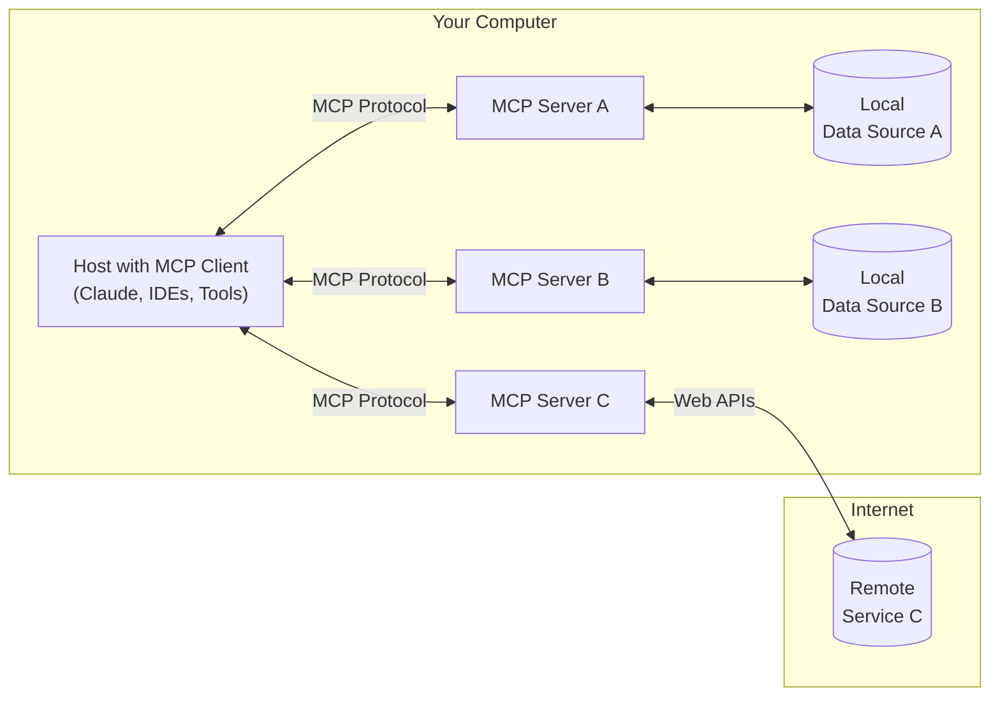

# 1. 需求

我想开发一个 Node.js 版的 MCP Clinet ，下面有一些参考材料，包括 MCP 基础介绍、MCP 核心架构介绍、MCP Clinet 开发教程，请你根据这些参考材料帮我开发一个 MCP Client，注意增加完善的中文注释，以及在开发完成后编写一个完善的中文 Readme 说明文档。

# 2. MCP 基础介绍

## Introduction

> Get started with the Model Context Protocol (MCP)

<Note>C# SDK released! Check out [what else is new.](/development/updates)</Note>

MCP is an open protocol that standardizes how applications provide context to LLMs. Think of MCP like a USB-C port for AI applications. Just as USB-C provides a standardized way to connect your devices to various peripherals and accessories, MCP provides a standardized way to connect AI models to different data sources and tools.

### Why MCP?

MCP helps you build agents and complex workflows on top of LLMs. LLMs frequently need to integrate with data and tools, and MCP provides:

- A growing list of pre-built integrations that your LLM can directly plug into
- The flexibility to switch between LLM providers and vendors
- Best practices for securing your data within your infrastructure

#### General architecture

At its core, MCP follows a client-server architecture where a host application can connect to multiple servers:



- **MCP Hosts**: Programs like Claude Desktop, IDEs, or AI tools that want to access data through MCP
- **MCP Clients**: Protocol clients that maintain 1:1 connections with servers
- **MCP Servers**: Lightweight programs that each expose specific capabilities through the standardized Model Context Protocol
- **Local Data Sources**: Your computer's files, databases, and services that MCP servers can securely access
- **Remote Services**: External systems available over the internet (e.g., through APIs) that MCP servers can connect to

### Get started

Choose the path that best fits your needs:

##### Quick Starts

<CardGroup cols={2}>
  <Card title="For Server Developers" icon="bolt" href="/quickstart/server">
    Get started building your own server to use in Claude for Desktop and other clients
  </Card>

  <Card title="For Client Developers" icon="bolt" href="/quickstart/client">
    Get started building your own client that can integrate with all MCP servers
  </Card>

  <Card title="For Claude Desktop Users" icon="bolt" href="/quickstart/user">
    Get started using pre-built servers in Claude for Desktop
  </Card>
</CardGroup>

##### Examples

<CardGroup cols={2}>
  <Card title="Example Servers" icon="grid" href="/examples">
    Check out our gallery of official MCP servers and implementations
  </Card>

  <Card title="Example Clients" icon="cubes" href="/clients">
    View the list of clients that support MCP integrations
  </Card>
</CardGroup>

### Tutorials

<CardGroup cols={2}>
  <Card title="Building MCP with LLMs" icon="comments" href="/tutorials/building-mcp-with-llms">
    Learn how to use LLMs like Claude to speed up your MCP development
  </Card>

  <Card title="Debugging Guide" icon="bug" href="/docs/tools/debugging">
    Learn how to effectively debug MCP servers and integrations
  </Card>

  <Card title="MCP Inspector" icon="magnifying-glass" href="/docs/tools/inspector">
    Test and inspect your MCP servers with our interactive debugging tool
  </Card>

  <Card title="MCP Workshop (Video, 2hr)" icon="person-chalkboard" href="https://www.youtube.com/watch?v=kQmXtrmQ5Zg">
    <iframe src="https://www.youtube.com/embed/kQmXtrmQ5Zg" />
  </Card>
</CardGroup>

### Explore MCP

Dive deeper into MCP's core concepts and capabilities:

<CardGroup cols={2}>
  <Card title="Core architecture" icon="sitemap" href="/docs/concepts/architecture">
    Understand how MCP connects clients, servers, and LLMs
  </Card>

  <Card title="Resources" icon="database" href="/docs/concepts/resources">
    Expose data and content from your servers to LLMs
  </Card>

  <Card title="Prompts" icon="message" href="/docs/concepts/prompts">
    Create reusable prompt templates and workflows
  </Card>

  <Card title="Tools" icon="wrench" href="/docs/concepts/tools">
    Enable LLMs to perform actions through your server
  </Card>

  <Card title="Sampling" icon="robot" href="/docs/concepts/sampling">
    Let your servers request completions from LLMs
  </Card>

  <Card title="Transports" icon="network-wired" href="/docs/concepts/transports">
    Learn about MCP's communication mechanism
  </Card>
</CardGroup>

### Contributing

Want to contribute? Check out our [Contributing Guide](/development/contributing) to learn how you can help improve MCP.

### Support and Feedback

Here's how to get help or provide feedback:

- For bug reports and feature requests related to the MCP specification, SDKs, or documentation (open source), please [create a GitHub issue](https://github.com/modelcontextprotocol)
- For discussions or Q\&A about the MCP specification, use the [specification discussions](https://github.com/modelcontextprotocol/specification/discussions)
- For discussions or Q\&A about other MCP open source components, use the [organization discussions](https://github.com/orgs/modelcontextprotocol/discussions)
- For bug reports, feature requests, and questions related to Claude.app and claude.ai's MCP integration, please see Anthropic's guide on [How to Get Support](https://support.anthropic.com/en/articles/9015913-how-to-get-support)

# 3. MCP 核心架构介绍

## Introduction

> Get started with the Model Context Protocol (MCP)

<Note>C# SDK released! Check out [what else is new.](/development/updates)</Note>

MCP is an open protocol that standardizes how applications provide context to LLMs. Think of MCP like a USB-C port for AI applications. Just as USB-C provides a standardized way to connect your devices to various peripherals and accessories, MCP provides a standardized way to connect AI models to different data sources and tools.

### Why MCP?

MCP helps you build agents and complex workflows on top of LLMs. LLMs frequently need to integrate with data and tools, and MCP provides:

- A growing list of pre-built integrations that your LLM can directly plug into
- The flexibility to switch between LLM providers and vendors
- Best practices for securing your data within your infrastructure

#### General architecture

At its core, MCP follows a client-server architecture where a host application can connect to multiple servers:


- **MCP Hosts**: Programs like Claude Desktop, IDEs, or AI tools that want to access data through MCP
- **MCP Clients**: Protocol clients that maintain 1:1 connections with servers
- **MCP Servers**: Lightweight programs that each expose specific capabilities through the standardized Model Context Protocol
- **Local Data Sources**: Your computer's files, databases, and services that MCP servers can securely access
- **Remote Services**: External systems available over the internet (e.g., through APIs) that MCP servers can connect to

### Get started

Choose the path that best fits your needs:

##### Quick Starts

<CardGroup cols={2}>
  <Card title="For Server Developers" icon="bolt" href="/quickstart/server">
    Get started building your own server to use in Claude for Desktop and other clients
  </Card>

  <Card title="For Client Developers" icon="bolt" href="/quickstart/client">
    Get started building your own client that can integrate with all MCP servers
  </Card>

  <Card title="For Claude Desktop Users" icon="bolt" href="/quickstart/user">
    Get started using pre-built servers in Claude for Desktop
  </Card>
</CardGroup>

##### Examples

<CardGroup cols={2}>
  <Card title="Example Servers" icon="grid" href="/examples">
    Check out our gallery of official MCP servers and implementations
  </Card>

  <Card title="Example Clients" icon="cubes" href="/clients">
    View the list of clients that support MCP integrations
  </Card>
</CardGroup>

### Tutorials

<CardGroup cols={2}>
  <Card title="Building MCP with LLMs" icon="comments" href="/tutorials/building-mcp-with-llms">
    Learn how to use LLMs like Claude to speed up your MCP development
  </Card>

  <Card title="Debugging Guide" icon="bug" href="/docs/tools/debugging">
    Learn how to effectively debug MCP servers and integrations
  </Card>

  <Card title="MCP Inspector" icon="magnifying-glass" href="/docs/tools/inspector">
    Test and inspect your MCP servers with our interactive debugging tool
  </Card>

  <Card title="MCP Workshop (Video, 2hr)" icon="person-chalkboard" href="https://www.youtube.com/watch?v=kQmXtrmQ5Zg">
    <iframe src="https://www.youtube.com/embed/kQmXtrmQ5Zg" />
  </Card>
</CardGroup>

### Explore MCP

Dive deeper into MCP's core concepts and capabilities:

<CardGroup cols={2}>
  <Card title="Core architecture" icon="sitemap" href="/docs/concepts/architecture">
    Understand how MCP connects clients, servers, and LLMs
  </Card>

  <Card title="Resources" icon="database" href="/docs/concepts/resources">
    Expose data and content from your servers to LLMs
  </Card>

  <Card title="Prompts" icon="message" href="/docs/concepts/prompts">
    Create reusable prompt templates and workflows
  </Card>

  <Card title="Tools" icon="wrench" href="/docs/concepts/tools">
    Enable LLMs to perform actions through your server
  </Card>

  <Card title="Sampling" icon="robot" href="/docs/concepts/sampling">
    Let your servers request completions from LLMs
  </Card>

  <Card title="Transports" icon="network-wired" href="/docs/concepts/transports">
    Learn about MCP's communication mechanism
  </Card>
</CardGroup>

### Contributing

Want to contribute? Check out our [Contributing Guide](/development/contributing) to learn how you can help improve MCP.

### Support and Feedback

Here's how to get help or provide feedback:

- For bug reports and feature requests related to the MCP specification, SDKs, or documentation (open source), please [create a GitHub issue](https://github.com/modelcontextprotocol)
- For discussions or Q\&A about the MCP specification, use the [specification discussions](https://github.com/modelcontextprotocol/specification/discussions)
- For discussions or Q\&A about other MCP open source components, use the [organization discussions](https://github.com/orgs/modelcontextprotocol/discussions)
- For bug reports, feature requests, and questions related to Claude.app and claude.ai's MCP integration, please see Anthropic's guide on [How to Get Support](https://support.anthropic.com/en/articles/9015913-how-to-get-support)

# 4. MCP Client 开发教程

## Introduction

> Get started with the Model Context Protocol (MCP)

<Note>C# SDK released! Check out [what else is new.](/development/updates)</Note>

MCP is an open protocol that standardizes how applications provide context to LLMs. Think of MCP like a USB-C port for AI applications. Just as USB-C provides a standardized way to connect your devices to various peripherals and accessories, MCP provides a standardized way to connect AI models to different data sources and tools.

### Why MCP?

MCP helps you build agents and complex workflows on top of LLMs. LLMs frequently need to integrate with data and tools, and MCP provides:

- A growing list of pre-built integrations that your LLM can directly plug into
- The flexibility to switch between LLM providers and vendors
- Best practices for securing your data within your infrastructure

#### General architecture

At its core, MCP follows a client-server architecture where a host application can connect to multiple servers:


- **MCP Hosts**: Programs like Claude Desktop, IDEs, or AI tools that want to access data through MCP
- **MCP Clients**: Protocol clients that maintain 1:1 connections with servers
- **MCP Servers**: Lightweight programs that each expose specific capabilities through the standardized Model Context Protocol
- **Local Data Sources**: Your computer's files, databases, and services that MCP servers can securely access
- **Remote Services**: External systems available over the internet (e.g., through APIs) that MCP servers can connect to

### Get started

Choose the path that best fits your needs:

##### Quick Starts

<CardGroup cols={2}>
  <Card title="For Server Developers" icon="bolt" href="/quickstart/server">
    Get started building your own server to use in Claude for Desktop and other clients
  </Card>

  <Card title="For Client Developers" icon="bolt" href="/quickstart/client">
    Get started building your own client that can integrate with all MCP servers
  </Card>

  <Card title="For Claude Desktop Users" icon="bolt" href="/quickstart/user">
    Get started using pre-built servers in Claude for Desktop
  </Card>
</CardGroup>

##### Examples

<CardGroup cols={2}>
  <Card title="Example Servers" icon="grid" href="/examples">
    Check out our gallery of official MCP servers and implementations
  </Card>

  <Card title="Example Clients" icon="cubes" href="/clients">
    View the list of clients that support MCP integrations
  </Card>
</CardGroup>

### Tutorials

<CardGroup cols={2}>
  <Card title="Building MCP with LLMs" icon="comments" href="/tutorials/building-mcp-with-llms">
    Learn how to use LLMs like Claude to speed up your MCP development
  </Card>

  <Card title="Debugging Guide" icon="bug" href="/docs/tools/debugging">
    Learn how to effectively debug MCP servers and integrations
  </Card>

  <Card title="MCP Inspector" icon="magnifying-glass" href="/docs/tools/inspector">
    Test and inspect your MCP servers with our interactive debugging tool
  </Card>

  <Card title="MCP Workshop (Video, 2hr)" icon="person-chalkboard" href="https://www.youtube.com/watch?v=kQmXtrmQ5Zg">
    <iframe src="https://www.youtube.com/embed/kQmXtrmQ5Zg" />
  </Card>
</CardGroup>

### Explore MCP

Dive deeper into MCP's core concepts and capabilities:

<CardGroup cols={2}>
  <Card title="Core architecture" icon="sitemap" href="/docs/concepts/architecture">
    Understand how MCP connects clients, servers, and LLMs
  </Card>

  <Card title="Resources" icon="database" href="/docs/concepts/resources">
    Expose data and content from your servers to LLMs
  </Card>

  <Card title="Prompts" icon="message" href="/docs/concepts/prompts">
    Create reusable prompt templates and workflows
  </Card>

  <Card title="Tools" icon="wrench" href="/docs/concepts/tools">
    Enable LLMs to perform actions through your server
  </Card>

  <Card title="Sampling" icon="robot" href="/docs/concepts/sampling">
    Let your servers request completions from LLMs
  </Card>

  <Card title="Transports" icon="network-wired" href="/docs/concepts/transports">
    Learn about MCP's communication mechanism
  </Card>
</CardGroup>

### Contributing

Want to contribute? Check out our [Contributing Guide](/development/contributing) to learn how you can help improve MCP.

### Support and Feedback

Here's how to get help or provide feedback:

- For bug reports and feature requests related to the MCP specification, SDKs, or documentation (open source), please [create a GitHub issue](https://github.com/modelcontextprotocol)
- For discussions or Q\&A about the MCP specification, use the [specification discussions](https://github.com/modelcontextprotocol/specification/discussions)
- For discussions or Q\&A about other MCP open source components, use the [organization discussions](https://github.com/orgs/modelcontextprotocol/discussions)
- For bug reports, feature requests, and questions related to Claude.app and claude.ai's MCP integration, please see Anthropic's guide on [How to Get Support](https://support.anthropic.com/en/articles/9015913-how-to-get-support)

# 5. MCP Typescript SDK 文档

## MCP TypeScript SDK  

### Table of Contents

- [Overview](#overview)
- [Installation](#installation)
- [Quickstart](#quickstart)
- [What is MCP?](#what-is-mcp)
- [Core Concepts](#core-concepts)
  - [Server](#server)
  - [Resources](#resources)
  - [Tools](#tools)
  - [Prompts](#prompts)
- [Running Your Server](#running-your-server)
  - [stdio](#stdio)
  - [Streamable HTTP](#streamable-http)
  - [Testing and Debugging](#testing-and-debugging)
- [Examples](#examples)
  - [Echo Server](#echo-server)
  - [SQLite Explorer](#sqlite-explorer)
- [Advanced Usage](#advanced-usage)
  - [Low-Level Server](#low-level-server)
  - [Writing MCP Clients](#writing-mcp-clients)
  - [Server Capabilities](#server-capabilities)
  - [Proxy OAuth Server](#proxy-authorization-requests-upstream)
  - [Backwards Compatibility](#backwards-compatibility)

### Overview

The Model Context Protocol allows applications to provide context for LLMs in a standardized way, separating the concerns of providing context from the actual LLM interaction. This TypeScript SDK implements the full MCP specification, making it easy to:

- Build MCP clients that can connect to any MCP server
- Create MCP servers that expose resources, prompts and tools
- Use standard transports like stdio and Streamable HTTP
- Handle all MCP protocol messages and lifecycle events

### Installation

```bash
npm install @modelcontextprotocol/sdk
```

### Quick Start

Let's create a simple MCP server that exposes a calculator tool and some data:

```typescript
import {
  McpServer,
  ResourceTemplate,
} from "@modelcontextprotocol/sdk/server/mcp.js";
import { StdioServerTransport } from "@modelcontextprotocol/sdk/server/stdio.js";
import { z } from "zod";

// Create an MCP server
const server = new McpServer({
  name: "Demo",
  version: "1.0.0",
});

// Add an addition tool
server.tool("add", { a: z.number(), b: z.number() }, async ({ a, b }) => ({
  content: [{ type: "text", text: String(a + b) }],
}));

// Add a dynamic greeting resource
server.resource(
  "greeting",
  new ResourceTemplate("greeting://{name}", { list: undefined }),
  async (uri, { name }) => ({
    contents: [
      {
        uri: uri.href,
        text: `Hello, ${name}!`,
      },
    ],
  }),
);

// Start receiving messages on stdin and sending messages on stdout
const transport = new StdioServerTransport();
await server.connect(transport);
```

### What is MCP?

The [Model Context Protocol (MCP)](https://modelcontextprotocol.io) lets you build servers that expose data and functionality to LLM applications in a secure, standardized way. Think of it like a web API, but specifically designed for LLM interactions. MCP servers can:

- Expose data through **Resources** (think of these sort of like GET endpoints; they are used to load information into the LLM's context)
- Provide functionality through **Tools** (sort of like POST endpoints; they are used to execute code or otherwise produce a side effect)
- Define interaction patterns through **Prompts** (reusable templates for LLM interactions)
- And more!

### Core Concepts

#### Server

The McpServer is your core interface to the MCP protocol. It handles connection management, protocol compliance, and message routing:

```typescript
const server = new McpServer({
  name: "My App",
  version: "1.0.0",
});
```

#### Resources

Resources are how you expose data to LLMs. They're similar to GET endpoints in a REST API - they provide data but shouldn't perform significant computation or have side effects:

```typescript
// Static resource
server.resource("config", "config://app", async (uri) => ({
  contents: [
    {
      uri: uri.href,
      text: "App configuration here",
    },
  ],
}));

// Dynamic resource with parameters
server.resource(
  "user-profile",
  new ResourceTemplate("users://{userId}/profile", { list: undefined }),
  async (uri, { userId }) => ({
    contents: [
      {
        uri: uri.href,
        text: `Profile data for user ${userId}`,
      },
    ],
  }),
);
```

#### Tools

Tools let LLMs take actions through your server. Unlike resources, tools are expected to perform computation and have side effects:

```typescript
// Simple tool with parameters
server.tool(
  "calculate-bmi",
  {
    weightKg: z.number(),
    heightM: z.number(),
  },
  async ({ weightKg, heightM }) => ({
    content: [
      {
        type: "text",
        text: String(weightKg / (heightM * heightM)),
      },
    ],
  }),
);

// Async tool with external API call
server.tool("fetch-weather", { city: z.string() }, async ({ city }) => {
  const response = await fetch(`https://api.weather.com/${city}`);
  const data = await response.text();
  return {
    content: [{ type: "text", text: data }],
  };
});
```

#### Prompts

Prompts are reusable templates that help LLMs interact with your server effectively:

```typescript
server.prompt("review-code", { code: z.string() }, ({ code }) => ({
  messages: [
    {
      role: "user",
      content: {
        type: "text",
        text: `Please review this code:\n\n${code}`,
      },
    },
  ],
}));
```

### Running Your Server

MCP servers in TypeScript need to be connected to a transport to communicate with clients. How you start the server depends on the choice of transport:

#### stdio

For command-line tools and direct integrations:

```typescript
import { McpServer } from "@modelcontextprotocol/sdk/server/mcp.js";
import { StdioServerTransport } from "@modelcontextprotocol/sdk/server/stdio.js";

const server = new McpServer({
  name: "example-server",
  version: "1.0.0",
});

// ... set up server resources, tools, and prompts ...

const transport = new StdioServerTransport();
await server.connect(transport);
```

#### Streamable HTTP

For remote servers, set up a Streamable HTTP transport that handles both client requests and server-to-client notifications.

##### With Session Management

In some cases, servers need to be stateful. This is achieved by [session management](https://modelcontextprotocol.io/specification/2025-03-26/basic/transports#session-management).

```typescript
import express from "express";
import { randomUUID } from "node:crypto";
import { McpServer } from "@modelcontextprotocol/sdk/server/mcp.js";
import { StreamableHTTPServerTransport } from "@modelcontextprotocol/sdk/server/streamableHttp.js";
import { isInitializeRequest } from "@modelcontextprotocol/sdk/types.js";

const app = express();
app.use(express.json());

// Map to store transports by session ID
const transports: { [sessionId: string]: StreamableHTTPServerTransport } = {};

// Handle POST requests for client-to-server communication
app.post("/mcp", async (req, res) => {
  // Check for existing session ID
  const sessionId = req.headers["mcp-session-id"] as string | undefined;
  let transport: StreamableHTTPServerTransport;

  if (sessionId && transports[sessionId]) {
    // Reuse existing transport
    transport = transports[sessionId];
  } else if (!sessionId && isInitializeRequest(req.body)) {
    // New initialization request
    transport = new StreamableHTTPServerTransport({
      sessionIdGenerator: () => randomUUID(),
      onsessioninitialized: (sessionId) => {
        // Store the transport by session ID
        transports[sessionId] = transport;
      },
    });

    // Clean up transport when closed
    transport.onclose = () => {
      if (transport.sessionId) {
        delete transports[transport.sessionId];
      }
    };
    const server = new McpServer({
      name: "example-server",
      version: "1.0.0",
    });

    // ... set up server resources, tools, and prompts ...

    // Connect to the MCP server
    await server.connect(transport);
  } else {
    // Invalid request
    res.status(400).json({
      jsonrpc: "2.0",
      error: {
        code: -32000,
        message: "Bad Request: No valid session ID provided",
      },
      id: null,
    });
    return;
  }

  // Handle the request
  await transport.handleRequest(req, res, req.body);
});

// Reusable handler for GET and DELETE requests
const handleSessionRequest = async (
  req: express.Request,
  res: express.Response,
) => {
  const sessionId = req.headers["mcp-session-id"] as string | undefined;
  if (!sessionId || !transports[sessionId]) {
    res.status(400).send("Invalid or missing session ID");
    return;
  }

  const transport = transports[sessionId];
  await transport.handleRequest(req, res);
};

// Handle GET requests for server-to-client notifications via SSE
app.get("/mcp", handleSessionRequest);

// Handle DELETE requests for session termination
app.delete("/mcp", handleSessionRequest);

app.listen(3000);
```

##### Without Session Management (Stateless)

For simpler use cases where session management isn't needed:

```typescript
const app = express();
app.use(express.json());

app.post("/mcp", async (req: Request, res: Response) => {
  // In stateless mode, create a new instance of transport and server for each request
  // to ensure complete isolation. A single instance would cause request ID collisions
  // when multiple clients connect concurrently.

  try {
    const server = getServer();
    const transport: StreamableHTTPServerTransport =
      new StreamableHTTPServerTransport({
        sessionIdGenerator: undefined,
      });
    await server.connect(transport);
    await transport.handleRequest(req, res, req.body);
    res.on("close", () => {
      console.log("Request closed");
      transport.close();
      server.close();
    });
  } catch (error) {
    console.error("Error handling MCP request:", error);
    if (!res.headersSent) {
      res.status(500).json({
        jsonrpc: "2.0",
        error: {
          code: -32603,
          message: "Internal server error",
        },
        id: null,
      });
    }
  }
});

app.get("/mcp", async (req: Request, res: Response) => {
  console.log("Received GET MCP request");
  res.writeHead(405).end(
    JSON.stringify({
      jsonrpc: "2.0",
      error: {
        code: -32000,
        message: "Method not allowed.",
      },
      id: null,
    }),
  );
});

app.delete("/mcp", async (req: Request, res: Response) => {
  console.log("Received DELETE MCP request");
  res.writeHead(405).end(
    JSON.stringify({
      jsonrpc: "2.0",
      error: {
        code: -32000,
        message: "Method not allowed.",
      },
      id: null,
    }),
  );
});

// Start the server
const PORT = 3000;
app.listen(PORT, () => {
  console.log(`MCP Stateless Streamable HTTP Server listening on port ${PORT}`);
});
```

This stateless approach is useful for:

- Simple API wrappers
- RESTful scenarios where each request is independent
- Horizontally scaled deployments without shared session state

#### Testing and Debugging

To test your server, you can use the [MCP Inspector](https://github.com/modelcontextprotocol/inspector). See its README for more information.

### Examples

#### Echo Server

A simple server demonstrating resources, tools, and prompts:

```typescript
import {
  McpServer,
  ResourceTemplate,
} from "@modelcontextprotocol/sdk/server/mcp.js";
import { z } from "zod";

const server = new McpServer({
  name: "Echo",
  version: "1.0.0",
});

server.resource(
  "echo",
  new ResourceTemplate("echo://{message}", { list: undefined }),
  async (uri, { message }) => ({
    contents: [
      {
        uri: uri.href,
        text: `Resource echo: ${message}`,
      },
    ],
  }),
);

server.tool("echo", { message: z.string() }, async ({ message }) => ({
  content: [{ type: "text", text: `Tool echo: ${message}` }],
}));

server.prompt("echo", { message: z.string() }, ({ message }) => ({
  messages: [
    {
      role: "user",
      content: {
        type: "text",
        text: `Please process this message: ${message}`,
      },
    },
  ],
}));
```

#### SQLite Explorer

A more complex example showing database integration:

```typescript
import { McpServer } from "@modelcontextprotocol/sdk/server/mcp.js";
import sqlite3 from "sqlite3";
import { promisify } from "util";
import { z } from "zod";

const server = new McpServer({
  name: "SQLite Explorer",
  version: "1.0.0",
});

// Helper to create DB connection
const getDb = () => {
  const db = new sqlite3.Database("database.db");
  return {
    all: promisify<string, any[]>(db.all.bind(db)),
    close: promisify(db.close.bind(db)),
  };
};

server.resource("schema", "schema://main", async (uri) => {
  const db = getDb();
  try {
    const tables = await db.all(
      "SELECT sql FROM sqlite_master WHERE type='table'",
    );
    return {
      contents: [
        {
          uri: uri.href,
          text: tables.map((t: { sql: string }) => t.sql).join("\n"),
        },
      ],
    };
  } finally {
    await db.close();
  }
});

server.tool("query", { sql: z.string() }, async ({ sql }) => {
  const db = getDb();
  try {
    const results = await db.all(sql);
    return {
      content: [
        {
          type: "text",
          text: JSON.stringify(results, null, 2),
        },
      ],
    };
  } catch (err: unknown) {
    const error = err as Error;
    return {
      content: [
        {
          type: "text",
          text: `Error: ${error.message}`,
        },
      ],
      isError: true,
    };
  } finally {
    await db.close();
  }
});
```

### Advanced Usage

#### Dynamic Servers

If you want to offer an initial set of tools/prompts/resources, but later add additional ones based on user action or external state change, you can add/update/remove them _after_ the Server is connected. This will automatically emit the corresponding `listChanged` notificaions:

```ts
import { McpServer } from "@modelcontextprotocol/sdk/server/mcp.js";
import { z } from "zod";

const server = new McpServer({
  name: "Dynamic Example",
  version: "1.0.0",
});

const listMessageTool = server.tool(
  "listMessages",
  { channel: z.string() },
  async ({ channel }) => ({
    content: [{ type: "text", text: await listMessages(channel) }],
  }),
);

const putMessageTool = server.tool(
  "putMessage",
  { channel: z.string(), message: z.string() },
  async ({ channel, message }) => ({
    content: [{ type: "text", text: await putMessage(channel, string) }],
  }),
);
// Until we upgrade auth, `putMessage` is disabled (won't show up in listTools)
putMessageTool.disable();

const upgradeAuthTool = server.tool(
  "upgradeAuth",
  { permission: z.enum(["write', vadmin"]) },
  // Any mutations here will automatically emit `listChanged` notifications
  async ({ permission }) => {
    const { ok, err, previous } = await upgradeAuthAndStoreToken(permission);
    if (!ok) return { content: [{ type: "text", text: `Error: ${err}` }] };

    // If we previously had read-only access, 'putMessage' is now available
    if (previous === "read") {
      putMessageTool.enable();
    }

    if (permission === "write") {
      // If we've just upgraded to 'write' permissions, we can still call 'upgradeAuth'
      // but can only upgrade to 'admin'.
      upgradeAuthTool.update({
        paramSchema: { permission: z.enum(["admin"]) }, // change validation rules
      });
    } else {
      // If we're now an admin, we no longer have anywhere to upgrade to, so fully remove that tool
      upgradeAuthTool.remove();
    }
  },
);

// Connect as normal
const transport = new StdioServerTransport();
await server.connect(transport);
```

#### Low-Level Server

For more control, you can use the low-level Server class directly:

```typescript
import { Server } from "@modelcontextprotocol/sdk/server/index.js";
import { StdioServerTransport } from "@modelcontextprotocol/sdk/server/stdio.js";
import {
  ListPromptsRequestSchema,
  GetPromptRequestSchema,
} from "@modelcontextprotocol/sdk/types.js";

const server = new Server(
  {
    name: "example-server",
    version: "1.0.0",
  },
  {
    capabilities: {
      prompts: {},
    },
  },
);

server.setRequestHandler(ListPromptsRequestSchema, async () => {
  return {
    prompts: [
      {
        name: "example-prompt",
        description: "An example prompt template",
        arguments: [
          {
            name: "arg1",
            description: "Example argument",
            required: true,
          },
        ],
      },
    ],
  };
});

server.setRequestHandler(GetPromptRequestSchema, async (request) => {
  if (request.params.name !== "example-prompt") {
    throw new Error("Unknown prompt");
  }
  return {
    description: "Example prompt",
    messages: [
      {
        role: "user",
        content: {
          type: "text",
          text: "Example prompt text",
        },
      },
    ],
  };
});

const transport = new StdioServerTransport();
await server.connect(transport);
```

#### Writing MCP Clients

The SDK provides a high-level client interface:

```typescript
import { Client } from "@modelcontextprotocol/sdk/client/index.js";
import { StdioClientTransport } from "@modelcontextprotocol/sdk/client/stdio.js";

const transport = new StdioClientTransport({
  command: "node",
  args: ["server.js"],
});

const client = new Client({
  name: "example-client",
  version: "1.0.0",
});

await client.connect(transport);

// List prompts
const prompts = await client.listPrompts();

// Get a prompt
const prompt = await client.getPrompt({
  name: "example-prompt",
  arguments: {
    arg1: "value",
  },
});

// List resources
const resources = await client.listResources();

// Read a resource
const resource = await client.readResource({
  uri: "file:///example.txt",
});

// Call a tool
const result = await client.callTool({
  name: "example-tool",
  arguments: {
    arg1: "value",
  },
});
```

#### Proxy Authorization Requests Upstream

You can proxy OAuth requests to an external authorization provider:

```typescript
import express from "express";
import {
  ProxyOAuthServerProvider,
  mcpAuthRouter,
} from "@modelcontextprotocol/sdk";

const app = express();

const proxyProvider = new ProxyOAuthServerProvider({
  endpoints: {
    authorizationUrl: "https://auth.external.com/oauth2/v1/authorize",
    tokenUrl: "https://auth.external.com/oauth2/v1/token",
    revocationUrl: "https://auth.external.com/oauth2/v1/revoke",
  },
  verifyAccessToken: async (token) => {
    return {
      token,
      clientId: "123",
      scopes: ["openid", "email", "profile"],
    };
  },
  getClient: async (client_id) => {
    return {
      client_id,
      redirect_uris: ["http://localhost:3000/callback"],
    };
  },
});

app.use(
  mcpAuthRouter({
    provider: proxyProvider,
    issuerUrl: new URL("http://auth.external.com"),
    baseUrl: new URL("http://mcp.example.com"),
    serviceDocumentationUrl: new URL("https://docs.example.com/"),
  }),
);
```

This setup allows you to:

- Forward OAuth requests to an external provider
- Add custom token validation logic
- Manage client registrations
- Provide custom documentation URLs
- Maintain control over the OAuth flow while delegating to an external provider

#### Backwards Compatibility

Clients and servers with StreamableHttp tranport can maintain [backwards compatibility](https://modelcontextprotocol.io/specification/2025-03-26/basic/transports#backwards-compatibility) with the deprecated HTTP+SSE transport (from protocol version 2024-11-05) as follows

##### Client-Side Compatibility

For clients that need to work with both Streamable HTTP and older SSE servers:

```typescript
import { Client } from "@modelcontextprotocol/sdk/client/index.js";
import { StreamableHTTPClientTransport } from "@modelcontextprotocol/sdk/client/streamableHttp.js";
import { SSEClientTransport } from "@modelcontextprotocol/sdk/client/sse.js";
let client: Client | undefined = undefined;
const baseUrl = new URL(url);
try {
  client = new Client({
    name: "streamable-http-client",
    version: "1.0.0",
  });
  const transport = new StreamableHTTPClientTransport(new URL(baseUrl));
  await client.connect(transport);
  console.log("Connected using Streamable HTTP transport");
} catch (error) {
  // If that fails with a 4xx error, try the older SSE transport
  console.log(
    "Streamable HTTP connection failed, falling back to SSE transport",
  );
  client = new Client({
    name: "sse-client",
    version: "1.0.0",
  });
  const sseTransport = new SSEClientTransport(baseUrl);
  await client.connect(sseTransport);
  console.log("Connected using SSE transport");
}
```

##### Server-Side Compatibility

For servers that need to support both Streamable HTTP and older clients:

```typescript
import express from "express";
import { McpServer } from "@modelcontextprotocol/sdk/server/mcp.js";
import { StreamableHTTPServerTransport } from "@modelcontextprotocol/sdk/server/streamableHttp.js";
import { SSEServerTransport } from "@modelcontextprotocol/sdk/server/sse.js";

const server = new McpServer({
  name: "backwards-compatible-server",
  version: "1.0.0",
});

// ... set up server resources, tools, and prompts ...

const app = express();
app.use(express.json());

// Store transports for each session type
const transports = {
  streamable: {} as Record<string, StreamableHTTPServerTransport>,
  sse: {} as Record<string, SSEServerTransport>,
};

// Modern Streamable HTTP endpoint
app.all("/mcp", async (req, res) => {
  // Handle Streamable HTTP transport for modern clients
  // Implementation as shown in the "With Session Management" example
  // ...
});

// Legacy SSE endpoint for older clients
app.get("/sse", async (req, res) => {
  // Create SSE transport for legacy clients
  const transport = new SSEServerTransport("/messages", res);
  transports.sse[transport.sessionId] = transport;

  res.on("close", () => {
    delete transports.sse[transport.sessionId];
  });

  await server.connect(transport);
});

// Legacy message endpoint for older clients
app.post("/messages", async (req, res) => {
  const sessionId = req.query.sessionId as string;
  const transport = transports.sse[sessionId];
  if (transport) {
    await transport.handlePostMessage(req, res, req.body);
  } else {
    res.status(400).send("No transport found for sessionId");
  }
});

app.listen(3000);
```

**Note**: The SSE transport is now deprecated in favor of Streamable HTTP. New implementations should use Streamable HTTP, and existing SSE implementations should plan to migrate.

### Documentation

- [Model Context Protocol documentation](https://modelcontextprotocol.io)
- [MCP Specification](https://spec.modelcontextprotocol.io)
- [Example Servers](https://github.com/modelcontextprotocol/servers)

### Contributing

Issues and pull requests are welcome on GitHub at https://github.com/modelcontextprotocol/typescript-sdk.

### License

This project is licensed under the MIT License—see the [LICENSE](LICENSE) file for details.

# 6. 注意点

- 使用 openai 的 SDK 替换 @anthropic-ai/sdk ，这样可以支持更多的模型，兼容性更好
- 你不要指定依赖的版本，如果遇到安装依赖让我自己来安装，你只负责编写代码
