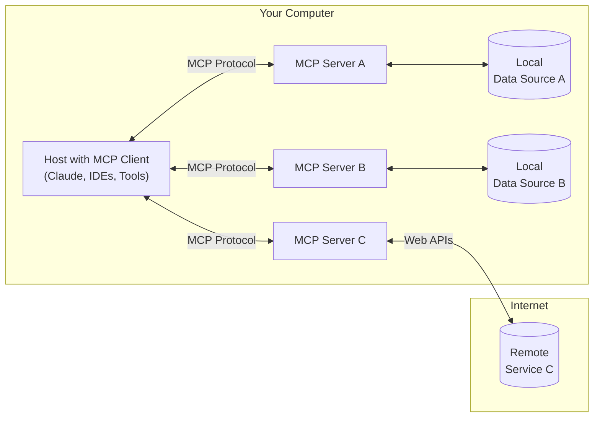
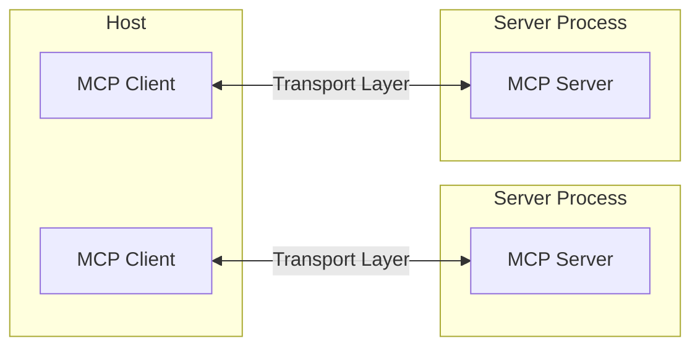
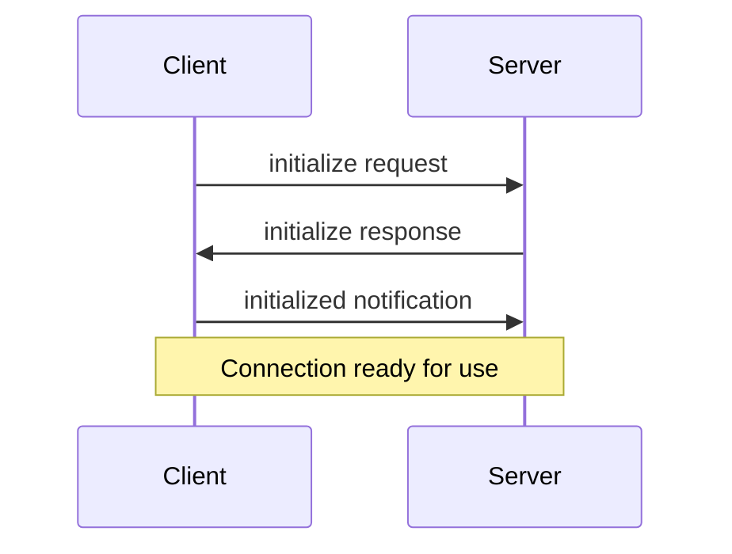

# 1.需求：

基于提供的 MCP 相关资料，帮我构建一个 MCP Server，需求如下：

- 提供一个获取当前时间的工具 //描述、功能
- 接收时区作为参数（可选）//参数
- 编写清晰的注释和说明
- 要求功能简洁、只包含关键功能
- 使用 TypeScript 编写

请参考下面四个资料：

# 2.[参考资料 1] MCP 基础介绍：

## Introduction

> Get started with the Model Context Protocol (MCP)

<Note>C# SDK released! Check out [what else is new.](/development/updates)</Note>

MCP is an open protocol that standardizes how applications provide context to LLMs. Think of MCP like a USB-C port for AI applications. Just as USB-C provides a standardized way to connect your devices to various peripherals and accessories, MCP provides a standardized way to connect AI models to different data sources and tools.

### Why MCP?

MCP helps you build agents and complex workflows on top of LLMs. LLMs frequently need to integrate with data and tools, and MCP provides:

- A growing list of pre-built integrations that your LLM can directly plug into
- The flexibility to switch between LLM providers and vendors
- Best practices for securing your data within your infrastructure

#### General architecture

At its core, MCP follows a client-server architecture where a host application can connect to multiple servers:



- **MCP Hosts**: Programs like Claude Desktop, IDEs, or AI tools that want to access data through MCP
- **MCP Clients**: Protocol clients that maintain 1:1 connections with servers
- **MCP Servers**: Lightweight programs that each expose specific capabilities through the standardized Model Context Protocol
- **Local Data Sources**: Your computer's files, databases, and services that MCP servers can securely access
- **Remote Services**: External systems available over the internet (e.g., through APIs) that MCP servers can connect to

### Get started

Choose the path that best fits your needs:

##### Quick Starts

<CardGroup cols={2}>
  <Card title="For Server Developers" icon="bolt" href="/quickstart/server">
    Get started building your own server to use in Claude for Desktop and other clients
  </Card>

  <Card title="For Client Developers" icon="bolt" href="/quickstart/client">
    Get started building your own client that can integrate with all MCP servers
  </Card>

  <Card title="For Claude Desktop Users" icon="bolt" href="/quickstart/user">
    Get started using pre-built servers in Claude for Desktop
  </Card>
</CardGroup>

##### Examples

<CardGroup cols={2}>
  <Card title="Example Servers" icon="grid" href="/examples">
    Check out our gallery of official MCP servers and implementations
  </Card>

  <Card title="Example Clients" icon="cubes" href="/clients">
    View the list of clients that support MCP integrations
  </Card>
</CardGroup>

### Tutorials

<CardGroup cols={2}>
  <Card title="Building MCP with LLMs" icon="comments" href="/tutorials/building-mcp-with-llms">
    Learn how to use LLMs like Claude to speed up your MCP development
  </Card>

  <Card title="Debugging Guide" icon="bug" href="/docs/tools/debugging">
    Learn how to effectively debug MCP servers and integrations
  </Card>

  <Card title="MCP Inspector" icon="magnifying-glass" href="/docs/tools/inspector">
    Test and inspect your MCP servers with our interactive debugging tool
  </Card>

  <Card title="MCP Workshop (Video, 2hr)" icon="person-chalkboard" href="https://www.youtube.com/watch?v=kQmXtrmQ5Zg">
    <iframe src="https://www.youtube.com/embed/kQmXtrmQ5Zg" />
  </Card>
</CardGroup>

### Explore MCP

Dive deeper into MCP's core concepts and capabilities:

<CardGroup cols={2}>
  <Card title="Core architecture" icon="sitemap" href="/docs/concepts/architecture">
    Understand how MCP connects clients, servers, and LLMs
  </Card>

  <Card title="Resources" icon="database" href="/docs/concepts/resources">
    Expose data and content from your servers to LLMs
  </Card>

  <Card title="Prompts" icon="message" href="/docs/concepts/prompts">
    Create reusable prompt templates and workflows
  </Card>

  <Card title="Tools" icon="wrench" href="/docs/concepts/tools">
    Enable LLMs to perform actions through your server
  </Card>

  <Card title="Sampling" icon="robot" href="/docs/concepts/sampling">
    Let your servers request completions from LLMs
  </Card>

  <Card title="Transports" icon="network-wired" href="/docs/concepts/transports">
    Learn about MCP's communication mechanism
  </Card>
</CardGroup>

### Contributing

Want to contribute? Check out our [Contributing Guide](/development/contributing) to learn how you can help improve MCP.

### Support and Feedback

Here's how to get help or provide feedback:

- For bug reports and feature requests related to the MCP specification, SDKs, or documentation (open source), please [create a GitHub issue](https://github.com/modelcontextprotocol)
- For discussions or Q\&A about the MCP specification, use the [specification discussions](https://github.com/modelcontextprotocol/specification/discussions)
- For discussions or Q\&A about other MCP open source components, use the [organization discussions](https://github.com/orgs/modelcontextprotocol/discussions)
- For bug reports, feature requests, and questions related to Claude.app and claude.ai's MCP integration, please see Anthropic's guide on [How to Get Support](https://support.anthropic.com/en/articles/9015913-how-to-get-support)

### [参考资料 2] MCP 核心架构

## Core architecture

> Understand how MCP connects clients, servers, and LLMs

The Model Context Protocol (MCP) is built on a flexible, extensible architecture that enables seamless communication between LLM applications and integrations. This document covers the core architectural components and concepts.

### Overview

MCP follows a client-server architecture where:

- **Hosts** are LLM applications (like Claude Desktop or IDEs) that initiate connections
- **Clients** maintain 1:1 connections with servers, inside the host application
- **Servers** provide context, tools, and prompts to clients



### Core components

#### Protocol layer

The protocol layer handles message framing, request/response linking, and high-level communication patterns.

<Tabs>
  <Tab title="TypeScript">
    ```typescript
    class Protocol<Request, Notification, Result> {
        // Handle incoming requests
        setRequestHandler<T>(schema: T, handler: (request: T, extra: RequestHandlerExtra) => Promise<Result>): void

        // Handle incoming notifications
        setNotificationHandler<T>(schema: T, handler: (notification: T) => Promise<void>): void

        // Send requests and await responses
        request<T>(request: Request, schema: T, options?: RequestOptions): Promise<T>

        // Send one-way notifications
        notification(notification: Notification): Promise<void>
    }
    ```

  </Tab>

  <Tab title="Python">
    ```python
    class Session(BaseSession[RequestT, NotificationT, ResultT]):
        async def send_request(
            self,
            request: RequestT,
            result_type: type[Result]
        ) -> Result:
            """Send request and wait for response. Raises McpError if response contains error."""
            # Request handling implementation

        async def send_notification(
            self,
            notification: NotificationT
        ) -> None:
            """Send one-way notification that doesn't expect response."""
            # Notification handling implementation

        async def _received_request(
            self,
            responder: RequestResponder[ReceiveRequestT, ResultT]
        ) -> None:
            """Handle incoming request from other side."""
            # Request handling implementation

        async def _received_notification(
            self,
            notification: ReceiveNotificationT
        ) -> None:
            """Handle incoming notification from other side."""
            # Notification handling implementation
    ```

  </Tab>
</Tabs>

Key classes include:

- `Protocol`
- `Client`
- `Server`

#### Transport layer

The transport layer handles the actual communication between clients and servers. MCP supports multiple transport mechanisms:

1. **Stdio transport**

   - Uses standard input/output for communication
   - Ideal for local processes

2. **HTTP with SSE transport**
   - Uses Server-Sent Events for server-to-client messages
   - HTTP POST for client-to-server messages

All transports use [JSON-RPC](https://www.jsonrpc.org/) 2.0 to exchange messages. See the [specification](/specification/) for detailed information about the Model Context Protocol message format.

#### Message types

MCP has these main types of messages:

1. **Requests** expect a response from the other side:

   ```typescript
   interface Request {
     method: string;
     params?: { ... };
   }
   ```

2. **Results** are successful responses to requests:

   ```typescript
   interface Result {
     [key: string]: unknown;
   }
   ```

3. **Errors** indicate that a request failed:

   ```typescript
   interface Error {
     code: number;
     message: string;
     data?: unknown;
   }
   ```

4. **Notifications** are one-way messages that don't expect a response:
   ```typescript
   interface Notification {
     method: string;
     params?: { ... };
   }
   ```

### Connection lifecycle

#### 1. Initialization



1. Client sends `initialize` request with protocol version and capabilities
2. Server responds with its protocol version and capabilities
3. Client sends `initialized` notification as acknowledgment
4. Normal message exchange begins

#### 2. Message exchange

After initialization, the following patterns are supported:

- **Request-Response**: Client or server sends requests, the other responds
- **Notifications**: Either party sends one-way messages

#### 3. Termination

Either party can terminate the connection:

- Clean shutdown via `close()`
- Transport disconnection
- Error conditions

### Error handling

MCP defines these standard error codes:

```typescript
enum ErrorCode {
  // Standard JSON-RPC error codes
  ParseError = -32700,
  InvalidRequest = -32600,
  MethodNotFound = -32601,
  InvalidParams = -32602,
  InternalError = -32603,
}
```

SDKs and applications can define their own error codes above -32000.

Errors are propagated through:

- Error responses to requests
- Error events on transports
- Protocol-level error handlers

### Implementation example

Here's a basic example of implementing an MCP server:

<Tabs>
  <Tab title="TypeScript">
    ```typescript
    import { Server } from "@modelcontextprotocol/sdk/server/index.js";
    import { StdioServerTransport } from "@modelcontextprotocol/sdk/server/stdio.js";

    const server = new Server({
      name: "example-server",
      version: "1.0.0"
    }, {
      capabilities: {
        resources: {}
      }
    });

    // Handle requests
    server.setRequestHandler(ListResourcesRequestSchema, async () => {
      return {
        resources: [
          {
            uri: "example://resource",
            name: "Example Resource"
          }
        ]
      };
    });

    // Connect transport
    const transport = new StdioServerTransport();
    await server.connect(transport);
    ```

  </Tab>

  <Tab title="Python">
    ```python
    import asyncio
    import mcp.types as types
    from mcp.server import Server
    from mcp.server.stdio import stdio_server

    app = Server("example-server")

    @app.list_resources()
    async def list_resources() -> list[types.Resource]:
        return [
            types.Resource(
                uri="example://resource",
                name="Example Resource"
            )
        ]

    async def main():
        async with stdio_server() as streams:
            await app.run(
                streams[0],
                streams[1],
                app.create_initialization_options()
            )

    if __name__ == "__main__":
        asyncio.run(main())
    ```

  </Tab>
</Tabs>

### Best practices

#### Transport selection

1. **Local communication**

   - Use stdio transport for local processes
   - Efficient for same-machine communication
   - Simple process management

2. **Remote communication**
   - Use SSE for scenarios requiring HTTP compatibility
   - Consider security implications including authentication and authorization

#### Message handling

1. **Request processing**

   - Validate inputs thoroughly
   - Use type-safe schemas
   - Handle errors gracefully
   - Implement timeouts

2. **Progress reporting**

   - Use progress tokens for long operations
   - Report progress incrementally
   - Include total progress when known

3. **Error management**
   - Use appropriate error codes
   - Include helpful error messages
   - Clean up resources on errors

### Security considerations

1. **Transport security**

   - Use TLS for remote connections
   - Validate connection origins
   - Implement authentication when needed

2. **Message validation**

   - Validate all incoming messages
   - Sanitize inputs
   - Check message size limits
   - Verify JSON-RPC format

3. **Resource protection**

   - Implement access controls
   - Validate resource paths
   - Monitor resource usage
   - Rate limit requests

4. **Error handling**
   - Don't leak sensitive information
   - Log security-relevant errors
   - Implement proper cleanup
   - Handle DoS scenarios

### Debugging and monitoring

1. **Logging**

   - Log protocol events
   - Track message flow
   - Monitor performance
   - Record errors

2. **Diagnostics**

   - Implement health checks
   - Monitor connection state
   - Track resource usage
   - Profile performance

3. **Testing**
   - Test different transports
   - Verify error handling
   - Check edge cases
   - Load test servers

# 3. [参考资料 3] MCP Server 开发指引

## For Server Developers

> Get started building your own server to use in Claude for Desktop and other clients.

In this tutorial, we'll build a simple MCP weather server and connect it to a host, Claude for Desktop. We'll start with a basic setup, and then progress to more complex use cases.

#### What we'll be building

Many LLMs do not currently have the ability to fetch the forecast and severe weather alerts. Let's use MCP to solve that!

We'll build a server that exposes two tools: `get-alerts` and `get-forecast`. Then we'll connect the server to an MCP host (in this case, Claude for Desktop):

<Frame>
  
</Frame>

<Frame>
  
</Frame>

<Note>
  Servers can connect to any client. We've chosen Claude for Desktop here for simplicity, but we also have guides on [building your own client](/quickstart/client) as well as a [list of other clients here](/clients).
</Note>

<Accordion title="Why Claude for Desktop and not Claude.ai?">
  Because servers are locally run, MCP currently only supports desktop hosts. Remote hosts are in active development.
</Accordion>

#### Core MCP Concepts

MCP servers can provide three main types of capabilities:

1. **Resources**: File-like data that can be read by clients (like API responses or file contents)
2. **Tools**: Functions that can be called by the LLM (with user approval)
3. **Prompts**: Pre-written templates that help users accomplish specific tasks

This tutorial will primarily focus on tools.

<Tabs>
  <Tab title="Python">
    Let's get started with building our weather server! [You can find the complete code for what we'll be building here.](https://github.com/modelcontextprotocol/quickstart-resources/tree/main/weather-server-python)

    ### Prerequisite knowledge

    This quickstart assumes you have familiarity with:

    * Python
    * LLMs like Claude

    ### System requirements

    * Python 3.10 or higher installed.
    * You must use the Python MCP SDK 1.2.0 or higher.

    ### Set up your environment

    First, let's install `uv` and set up our Python project and environment:

    <CodeGroup>
      ```bash MacOS/Linux
      curl -LsSf https://astral.sh/uv/install.sh | sh
      ```

      ```powershell Windows
      powershell -ExecutionPolicy ByPass -c "irm https://astral.sh/uv/install.ps1 | iex"
      ```
    </CodeGroup>

    Make sure to restart your terminal afterwards to ensure that the `uv` command gets picked up.

    Now, let's create and set up our project:

    <CodeGroup>
      ```bash MacOS/Linux
      # Create a new directory for our project
      uv init weather
      cd weather

      # Create virtual environment and activate it
      uv venv
      source .venv/bin/activate

      # Install dependencies
      uv add "mcp[cli]" httpx

      # Create our server file
      touch weather.py
      ```

      ```powershell Windows
      # Create a new directory for our project
      uv init weather
      cd weather

      # Create virtual environment and activate it
      uv venv
      .venv\Scripts\activate

      # Install dependencies
      uv add mcp[cli] httpx

      # Create our server file
      new-item weather.py
      ```
    </CodeGroup>

    Now let's dive into building your server.

    ## Building your server

    ### Importing packages and setting up the instance

    Add these to the top of your `weather.py`:

    ```python
    from typing import Any
    import httpx
    from mcp.server.fastmcp import FastMCP

    # Initialize FastMCP server
    mcp = FastMCP("weather")

    # Constants
    NWS_API_BASE = "https://api.weather.gov"
    USER_AGENT = "weather-app/1.0"
    ```

    The FastMCP class uses Python type hints and docstrings to automatically generate tool definitions, making it easy to create and maintain MCP tools.

    ### Helper functions

    Next, let's add our helper functions for querying and formatting the data from the National Weather Service API:

    ```python
    async def make_nws_request(url: str) -> dict[str, Any] | None:
        """Make a request to the NWS API with proper error handling."""
        headers = {
            "User-Agent": USER_AGENT,
            "Accept": "application/geo+json"
        }
        async with httpx.AsyncClient() as client:
            try:
                response = await client.get(url, headers=headers, timeout=30.0)
                response.raise_for_status()
                return response.json()
            except Exception:
                return None

    def format_alert(feature: dict) -> str:
        """Format an alert feature into a readable string."""
        props = feature["properties"]
        return f"""
    Event: {props.get('event', 'Unknown')}
    Area: {props.get('areaDesc', 'Unknown')}
    Severity: {props.get('severity', 'Unknown')}
    Description: {props.get('description', 'No description available')}
    Instructions: {props.get('instruction', 'No specific instructions provided')}
    """
    ```

    ### Implementing tool execution

    The tool execution handler is responsible for actually executing the logic of each tool. Let's add it:

    ```python
    @mcp.tool()
    async def get_alerts(state: str) -> str:
        """Get weather alerts for a US state.

        Args:
            state: Two-letter US state code (e.g. CA, NY)
        """
        url = f"{NWS_API_BASE}/alerts/active/area/{state}"
        data = await make_nws_request(url)

        if not data or "features" not in data:
            return "Unable to fetch alerts or no alerts found."

        if not data["features"]:
            return "No active alerts for this state."

        alerts = [format_alert(feature) for feature in data["features"]]
        return "\n---\n".join(alerts)

    @mcp.tool()
    async def get_forecast(latitude: float, longitude: float) -> str:
        """Get weather forecast for a location.

        Args:
            latitude: Latitude of the location
            longitude: Longitude of the location
        """
        # First get the forecast grid endpoint
        points_url = f"{NWS_API_BASE}/points/{latitude},{longitude}"
        points_data = await make_nws_request(points_url)

        if not points_data:
            return "Unable to fetch forecast data for this location."

        # Get the forecast URL from the points response
        forecast_url = points_data["properties"]["forecast"]
        forecast_data = await make_nws_request(forecast_url)

        if not forecast_data:
            return "Unable to fetch detailed forecast."

        # Format the periods into a readable forecast
        periods = forecast_data["properties"]["periods"]
        forecasts = []
        for period in periods[:5]:  # Only show next 5 periods
            forecast = f"""
    {period['name']}:
    Temperature: {period['temperature']}°{period['temperatureUnit']}
    Wind: {period['windSpeed']} {period['windDirection']}
    Forecast: {period['detailedForecast']}
    """
            forecasts.append(forecast)

        return "\n---\n".join(forecasts)
    ```

    ### Running the server

    Finally, let's initialize and run the server:

    ```python
    if __name__ == "__main__":
        # Initialize and run the server
        mcp.run(transport='stdio')
    ```

    Your server is complete! Run `uv run weather.py` to confirm that everything's working.

    Let's now test your server from an existing MCP host, Claude for Desktop.

    ## Testing your server with Claude for Desktop

    <Note>
      Claude for Desktop is not yet available on Linux. Linux users can proceed to the [Building a client](/quickstart/client) tutorial to build an MCP client that connects to the server we just built.
    </Note>

    First, make sure you have Claude for Desktop installed. [You can install the latest version
    here.](https://claude.ai/download) If you already have Claude for Desktop, **make sure it's updated to the latest version.**

    We'll need to configure Claude for Desktop for whichever MCP servers you want to use. To do this, open your Claude for Desktop App configuration at `~/Library/Application Support/Claude/claude_desktop_config.json` in a text editor. Make sure to create the file if it doesn't exist.

    For example, if you have [VS Code](https://code.visualstudio.com/) installed:

    <Tabs>
      <Tab title="MacOS/Linux">
        ```bash
        code ~/Library/Application\ Support/Claude/claude_desktop_config.json
        ```
      </Tab>

      <Tab title="Windows">
        ```powershell
        code $env:AppData\Claude\claude_desktop_config.json
        ```
      </Tab>
    </Tabs>

    You'll then add your servers in the `mcpServers` key. The MCP UI elements will only show up in Claude for Desktop if at least one server is properly configured.

    In this case, we'll add our single weather server like so:

    <Tabs>
      <Tab title="MacOS/Linux">
        ```json Python
        {
            "mcpServers": {
                "weather": {
                    "command": "uv",
                    "args": [
                        "--directory",
                        "/ABSOLUTE/PATH/TO/PARENT/FOLDER/weather",
                        "run",
                        "weather.py"
                    ]
                }
            }
        }
        ```
      </Tab>

      <Tab title="Windows">
        ```json Python
        {
            "mcpServers": {
                "weather": {
                    "command": "uv",
                    "args": [
                        "--directory",
                        "C:\\ABSOLUTE\\PATH\\TO\\PARENT\\FOLDER\\weather",
                        "run",
                        "weather.py"
                    ]
                }
            }
        }
        ```
      </Tab>
    </Tabs>

    <Warning>
      You may need to put the full path to the `uv` executable in the `command` field. You can get this by running `which uv` on MacOS/Linux or `where uv` on Windows.
    </Warning>

    <Note>
      Make sure you pass in the absolute path to your server.
    </Note>

    This tells Claude for Desktop:

    1. There's an MCP server named "weather"
    2. To launch it by running `uv --directory /ABSOLUTE/PATH/TO/PARENT/FOLDER/weather run weather.py`

    Save the file, and restart **Claude for Desktop**.

  </Tab>

  <Tab title="Node">
    Let's get started with building our weather server! [You can find the complete code for what we'll be building here.](https://github.com/modelcontextprotocol/quickstart-resources/tree/main/weather-server-typescript)

    ### Prerequisite knowledge

    This quickstart assumes you have familiarity with:

    * TypeScript
    * LLMs like Claude

    ### System requirements

    For TypeScript, make sure you have the latest version of Node installed.

    ### Set up your environment

    First, let's install Node.js and npm if you haven't already. You can download them from [nodejs.org](https://nodejs.org/).
    Verify your Node.js installation:

    ```bash
    node --version
    npm --version
    ```

    For this tutorial, you'll need Node.js version 16 or higher.

    Now, let's create and set up our project:

    <CodeGroup>
      ```bash MacOS/Linux
      # Create a new directory for our project
      mkdir weather
      cd weather

      # Initialize a new npm project
      npm init -y

      # Install dependencies
      npm install @modelcontextprotocol/sdk zod
      npm install -D @types/node typescript

      # Create our files
      mkdir src
      touch src/index.ts
      ```

      ```powershell Windows
      # Create a new directory for our project
      md weather
      cd weather

      # Initialize a new npm project
      npm init -y

      # Install dependencies
      npm install @modelcontextprotocol/sdk zod
      npm install -D @types/node typescript

      # Create our files
      md src
      new-item src\index.ts
      ```
    </CodeGroup>

    Update your package.json to add type: "module" and a build script:

    ```json package.json
    {
      "type": "module",
      "bin": {
        "weather": "./build/index.js"
      },
      "scripts": {
        "build": "tsc && chmod 755 build/index.js"
      },
      "files": [
        "build"
      ],
    }
    ```

    Create a `tsconfig.json` in the root of your project:

    ```json tsconfig.json
    {
      "compilerOptions": {
        "target": "ES2022",
        "module": "Node16",
        "moduleResolution": "Node16",
        "outDir": "./build",
        "rootDir": "./src",
        "strict": true,
        "esModuleInterop": true,
        "skipLibCheck": true,
        "forceConsistentCasingInFileNames": true
      },
      "include": ["src/**/*"],
      "exclude": ["node_modules"]
    }
    ```

    Now let's dive into building your server.

    ## Building your server

    ### Importing packages and setting up the instance

    Add these to the top of your `src/index.ts`:

    ```typescript
    import { McpServer } from "@modelcontextprotocol/sdk/server/mcp.js";
    import { StdioServerTransport } from "@modelcontextprotocol/sdk/server/stdio.js";
    import { z } from "zod";

    const NWS_API_BASE = "https://api.weather.gov";
    const USER_AGENT = "weather-app/1.0";

    // Create server instance
    const server = new McpServer({
      name: "weather",
      version: "1.0.0",
      capabilities: {
        resources: {},
        tools: {},
      },
    });
    ```

    ### Helper functions

    Next, let's add our helper functions for querying and formatting the data from the National Weather Service API:

    ```typescript
    // Helper function for making NWS API requests
    async function makeNWSRequest<T>(url: string): Promise<T | null> {
      const headers = {
        "User-Agent": USER_AGENT,
        Accept: "application/geo+json",
      };

      try {
        const response = await fetch(url, { headers });
        if (!response.ok) {
          throw new Error(`HTTP error! status: ${response.status}`);
        }
        return (await response.json()) as T;
      } catch (error) {
        console.error("Error making NWS request:", error);
        return null;
      }
    }

    interface AlertFeature {
      properties: {
        event?: string;
        areaDesc?: string;
        severity?: string;
        status?: string;
        headline?: string;
      };
    }

    // Format alert data
    function formatAlert(feature: AlertFeature): string {
      const props = feature.properties;
      return [
        `Event: ${props.event || "Unknown"}`,
        `Area: ${props.areaDesc || "Unknown"}`,
        `Severity: ${props.severity || "Unknown"}`,
        `Status: ${props.status || "Unknown"}`,
        `Headline: ${props.headline || "No headline"}`,
        "---",
      ].join("\n");
    }

    interface ForecastPeriod {
      name?: string;
      temperature?: number;
      temperatureUnit?: string;
      windSpeed?: string;
      windDirection?: string;
      shortForecast?: string;
    }

    interface AlertsResponse {
      features: AlertFeature[];
    }

    interface PointsResponse {
      properties: {
        forecast?: string;
      };
    }

    interface ForecastResponse {
      properties: {
        periods: ForecastPeriod[];
      };
    }
    ```

    ### Implementing tool execution

    The tool execution handler is responsible for actually executing the logic of each tool. Let's add it:

    ```typescript
    // Register weather tools
    server.tool(
      "get-alerts",
      "Get weather alerts for a state",
      {
        state: z.string().length(2).describe("Two-letter state code (e.g. CA, NY)"),
      },
      async ({ state }) => {
        const stateCode = state.toUpperCase();
        const alertsUrl = `${NWS_API_BASE}/alerts?area=${stateCode}`;
        const alertsData = await makeNWSRequest<AlertsResponse>(alertsUrl);

        if (!alertsData) {
          return {
            content: [
              {
                type: "text",
                text: "Failed to retrieve alerts data",
              },
            ],
          };
        }

        const features = alertsData.features || [];
        if (features.length === 0) {
          return {
            content: [
              {
                type: "text",
                text: `No active alerts for ${stateCode}`,
              },
            ],
          };
        }

        const formattedAlerts = features.map(formatAlert);
        const alertsText = `Active alerts for ${stateCode}:\n\n${formattedAlerts.join("\n")}`;

        return {
          content: [
            {
              type: "text",
              text: alertsText,
            },
          ],
        };
      },
    );

    server.tool(
      "get-forecast",
      "Get weather forecast for a location",
      {
        latitude: z.number().min(-90).max(90).describe("Latitude of the location"),
        longitude: z.number().min(-180).max(180).describe("Longitude of the location"),
      },
      async ({ latitude, longitude }) => {
        // Get grid point data
        const pointsUrl = `${NWS_API_BASE}/points/${latitude.toFixed(4)},${longitude.toFixed(4)}`;
        const pointsData = await makeNWSRequest<PointsResponse>(pointsUrl);

        if (!pointsData) {
          return {
            content: [
              {
                type: "text",
                text: `Failed to retrieve grid point data for coordinates: ${latitude}, ${longitude}. This location may not be supported by the NWS API (only US locations are supported).`,
              },
            ],
          };
        }

        const forecastUrl = pointsData.properties?.forecast;
        if (!forecastUrl) {
          return {
            content: [
              {
                type: "text",
                text: "Failed to get forecast URL from grid point data",
              },
            ],
          };
        }

        // Get forecast data
        const forecastData = await makeNWSRequest<ForecastResponse>(forecastUrl);
        if (!forecastData) {
          return {
            content: [
              {
                type: "text",
                text: "Failed to retrieve forecast data",
              },
            ],
          };
        }

        const periods = forecastData.properties?.periods || [];
        if (periods.length === 0) {
          return {
            content: [
              {
                type: "text",
                text: "No forecast periods available",
              },
            ],
          };
        }

        // Format forecast periods
        const formattedForecast = periods.map((period: ForecastPeriod) =>
          [
            `${period.name || "Unknown"}:`,
            `Temperature: ${period.temperature || "Unknown"}°${period.temperatureUnit || "F"}`,
            `Wind: ${period.windSpeed || "Unknown"} ${period.windDirection || ""}`,
            `${period.shortForecast || "No forecast available"}`,
            "---",
          ].join("\n"),
        );

        const forecastText = `Forecast for ${latitude}, ${longitude}:\n\n${formattedForecast.join("\n")}`;

        return {
          content: [
            {
              type: "text",
              text: forecastText,
            },
          ],
        };
      },
    );
    ```

    ### Running the server

    Finally, implement the main function to run the server:

    ```typescript
    async function main() {
      const transport = new StdioServerTransport();
      await server.connect(transport);
      console.error("Weather MCP Server running on stdio");
    }

    main().catch((error) => {
      console.error("Fatal error in main():", error);
      process.exit(1);
    });
    ```

    Make sure to run `npm run build` to build your server! This is a very important step in getting your server to connect.

    Let's now test your server from an existing MCP host, Claude for Desktop.

    ## Testing your server with Claude for Desktop

    <Note>
      Claude for Desktop is not yet available on Linux. Linux users can proceed to the [Building a client](/quickstart/client) tutorial to build an MCP client that connects to the server we just built.
    </Note>

    First, make sure you have Claude for Desktop installed. [You can install the latest version
    here.](https://claude.ai/download) If you already have Claude for Desktop, **make sure it's updated to the latest version.**

    We'll need to configure Claude for Desktop for whichever MCP servers you want to use. To do this, open your Claude for Desktop App configuration at `~/Library/Application Support/Claude/claude_desktop_config.json` in a text editor. Make sure to create the file if it doesn't exist.

    For example, if you have [VS Code](https://code.visualstudio.com/) installed:

    <Tabs>
      <Tab title="MacOS/Linux">
        ```bash
        code ~/Library/Application\ Support/Claude/claude_desktop_config.json
        ```
      </Tab>

      <Tab title="Windows">
        ```powershell
        code $env:AppData\Claude\claude_desktop_config.json
        ```
      </Tab>
    </Tabs>

    You'll then add your servers in the `mcpServers` key. The MCP UI elements will only show up in Claude for Desktop if at least one server is properly configured.

    In this case, we'll add our single weather server like so:

    <Tabs>
      <Tab title="MacOS/Linux">
        <CodeGroup>
          ```json Node
          {
              "mcpServers": {
                  "weather": {
                      "command": "node",
                      "args": [
                          "/ABSOLUTE/PATH/TO/PARENT/FOLDER/weather/build/index.js"
                      ]
                  }
              }
          }
          ```
        </CodeGroup>
      </Tab>

      <Tab title="Windows">
        <CodeGroup>
          ```json Node
          {
              "mcpServers": {
                  "weather": {
                      "command": "node",
                      "args": [
                          "C:\\PATH\\TO\\PARENT\\FOLDER\\weather\\build\\index.js"
                      ]
                  }
              }
          }
          ```
        </CodeGroup>
      </Tab>
    </Tabs>

    This tells Claude for Desktop:

    1. There's an MCP server named "weather"
    2. Launch it by running `node /ABSOLUTE/PATH/TO/PARENT/FOLDER/weather/build/index.js`

    Save the file, and restart **Claude for Desktop**.

  </Tab>

  <Tab title="Java">
    <Note>
      This is a quickstart demo based on Spring AI MCP auto-configuration and boot starters.
      To learn how to create sync and async MCP Servers, manually, consult the [Java SDK Server](/sdk/java/mcp-server) documentation.
    </Note>

    Let's get started with building our weather server!
    [You can find the complete code for what we'll be building here.](https://github.com/spring-projects/spring-ai-examples/tree/main/model-context-protocol/weather/starter-stdio-server)

    For more information, see the [MCP Server Boot Starter](https://docs.spring.io/spring-ai/reference/api/mcp/mcp-server-boot-starter-docs.html) reference documentation.
    For manual MCP Server implementation, refer to the [MCP Server Java SDK documentation](/sdk/java/mcp-server).

    ### System requirements

    * Java 17 or higher installed.
    * [Spring Boot 3.3.x](https://docs.spring.io/spring-boot/installing.html) or higher

    ### Set up your environment

    Use the [Spring Initializer](https://start.spring.io/) to bootstrap the project.

    You will need to add the following dependencies:

    <Tabs>
      <Tab title="Maven">
        ```xml
        <dependencies>
              <dependency>
                  <groupId>org.springframework.ai</groupId>
                  <artifactId>spring-ai-starter-mcp-server</artifactId>
              </dependency>

              <dependency>
                  <groupId>org.springframework</groupId>
                  <artifactId>spring-web</artifactId>
              </dependency>
        </dependencies>
        ```
      </Tab>

      <Tab title="Gradle">
        ```groovy
        dependencies {
          implementation platform("org.springframework.ai:spring-ai-starter-mcp-server")
          implementation platform("org.springframework:spring-web")
        }
        ```
      </Tab>
    </Tabs>

    Then configure your application by setting the application properties:

    <CodeGroup>
      ```bash application.properties
      spring.main.bannerMode=off
      logging.pattern.console=
      ```

      ```yaml application.yml
      logging:
        pattern:
          console:
      spring:
        main:
          banner-mode: off
      ```
    </CodeGroup>

    The [Server Configuration Properties](https://docs.spring.io/spring-ai/reference/api/mcp/mcp-server-boot-starter-docs.html#_configuration_properties) documents all available properties.

    Now let's dive into building your server.

    ## Building your server

    ### Weather Service

    Let's implement a [WeatherService.java](https://github.com/spring-projects/spring-ai-examples/blob/main/model-context-protocol/weather/starter-stdio-server/src/main/java/org/springframework/ai/mcp/sample/server/WeatherService.java) that uses a REST client to query the data from the National Weather Service API:

    ```java
    @Service
    public class WeatherService {

    	private final RestClient restClient;

    	public WeatherService() {
    		this.restClient = RestClient.builder()
    			.baseUrl("https://api.weather.gov")
    			.defaultHeader("Accept", "application/geo+json")
    			.defaultHeader("User-Agent", "WeatherApiClient/1.0 (your@email.com)")
    			.build();
    	}

      @Tool(description = "Get weather forecast for a specific latitude/longitude")
      public String getWeatherForecastByLocation(
          double latitude,   // Latitude coordinate
          double longitude   // Longitude coordinate
      ) {
          // Returns detailed forecast including:
          // - Temperature and unit
          // - Wind speed and direction
          // - Detailed forecast description
      }

      @Tool(description = "Get weather alerts for a US state")
      public String getAlerts(
          @ToolParam(description = "Two-letter US state code (e.g. CA, NY)" String state
      ) {
          // Returns active alerts including:
          // - Event type
          // - Affected area
          // - Severity
          // - Description
          // - Safety instructions
      }

      // ......
    }
    ```

    The `@Service` annotation with auto-register the service in your application context.
    The Spring AI `@Tool` annotation, making it easy to create and maintain MCP tools.

    The auto-configuration will automatically register these tools with the MCP server.

    ### Create your Boot Application

    ```java
    @SpringBootApplication
    public class McpServerApplication {

    	public static void main(String[] args) {
    		SpringApplication.run(McpServerApplication.class, args);
    	}

    	@Bean
    	public ToolCallbackProvider weatherTools(WeatherService weatherService) {
    		return  MethodToolCallbackProvider.builder().toolObjects(weatherService).build();
    	}
    }
    ```

    Uses the the `MethodToolCallbackProvider` utils to convert the `@Tools` into actionable callbacks used by the MCP server.

    ### Running the server

    Finally, let's build the server:

    ```bash
    ./mvnw clean install
    ```

    This will generate a `mcp-weather-stdio-server-0.0.1-SNAPSHOT.jar` file within the `target` folder.

    Let's now test your server from an existing MCP host, Claude for Desktop.

    ## Testing your server with Claude for Desktop

    <Note>
      Claude for Desktop is not yet available on Linux.
    </Note>

    First, make sure you have Claude for Desktop installed.
    [You can install the latest version here.](https://claude.ai/download) If you already have Claude for Desktop, **make sure it's updated to the latest version.**

    We'll need to configure Claude for Desktop for whichever MCP servers you want to use.
    To do this, open your Claude for Desktop App configuration at `~/Library/Application Support/Claude/claude_desktop_config.json` in a text editor.
    Make sure to create the file if it doesn't exist.

    For example, if you have [VS Code](https://code.visualstudio.com/) installed:

    <Tabs>
      <Tab title="MacOS/Linux">
        ```bash
        code ~/Library/Application\ Support/Claude/claude_desktop_config.json
        ```
      </Tab>

      <Tab title="Windows">
        ```powershell
        code $env:AppData\Claude\claude_desktop_config.json
        ```
      </Tab>
    </Tabs>

    You'll then add your servers in the `mcpServers` key.
    The MCP UI elements will only show up in Claude for Desktop if at least one server is properly configured.

    In this case, we'll add our single weather server like so:

    <Tabs>
      <Tab title="MacOS/Linux">
        ```json java
        {
          "mcpServers": {
            "spring-ai-mcp-weather": {
              "command": "java",
              "args": [
                "-Dspring.ai.mcp.server.stdio=true",
                "-jar",
                "/ABSOLUTE/PATH/TO/PARENT/FOLDER/mcp-weather-stdio-server-0.0.1-SNAPSHOT.jar"
              ]
            }
          }
        }
        ```
      </Tab>

      <Tab title="Windows">
        ```json java
        {
          "mcpServers": {
            "spring-ai-mcp-weather": {
              "command": "java",
              "args": [
                "-Dspring.ai.mcp.server.transport=STDIO",
                "-jar",
                "C:\\ABSOLUTE\\PATH\\TO\\PARENT\\FOLDER\\weather\\mcp-weather-stdio-server-0.0.1-SNAPSHOT.jar"
              ]
            }
          }
        }
        ```
      </Tab>
    </Tabs>

    <Note>
      Make sure you pass in the absolute path to your server.
    </Note>

    This tells Claude for Desktop:

    1. There's an MCP server named "my-weather-server"
    2. To launch it by running `java -jar /ABSOLUTE/PATH/TO/PARENT/FOLDER/mcp-weather-stdio-server-0.0.1-SNAPSHOT.jar`

    Save the file, and restart **Claude for Desktop**.

    ## Testing your server with Java client

    ### Create a MCP Client manually

    Use the `McpClient` to connect to the server:

    ```java
    var stdioParams = ServerParameters.builder("java")
      .args("-jar", "/ABSOLUTE/PATH/TO/PARENT/FOLDER/mcp-weather-stdio-server-0.0.1-SNAPSHOT.jar")
      .build();

    var stdioTransport = new StdioClientTransport(stdioParams);

    var mcpClient = McpClient.sync(stdioTransport).build();

    mcpClient.initialize();

    ListToolsResult toolsList = mcpClient.listTools();

    CallToolResult weather = mcpClient.callTool(
      new CallToolRequest("getWeatherForecastByLocation",
          Map.of("latitude", "47.6062", "longitude", "-122.3321")));

    CallToolResult alert = mcpClient.callTool(
      new CallToolRequest("getAlerts", Map.of("state", "NY")));

    mcpClient.closeGracefully();
    ```

    ### Use MCP Client Boot Starter

    Create a new boot starter application using the `spring-ai-starter-mcp-client` dependency:

    ```xml
    <dependency>
        <groupId>org.springframework.ai</groupId>
        <artifactId>spring-ai-starter-mcp-client</artifactId>
    </dependency>
    ```

    and set the `spring.ai.mcp.client.stdio.servers-configuration` property to point to your `claude_desktop_config.json`.
    You can re-use the existing Anthropic Desktop configuration:

    ```properties
    spring.ai.mcp.client.stdio.servers-configuration=file:PATH/TO/claude_desktop_config.json
    ```

    When you start your client application, the auto-configuration will create, automatically MCP clients from the claude\_desktop\_config.json.

    For more information, see the [MCP Client Boot Starters](https://docs.spring.io/spring-ai/reference/api/mcp/mcp-server-boot-client-docs.html) reference documentation.

    ## More Java MCP Server examples

    The [starter-webflux-server](https://github.com/spring-projects/spring-ai-examples/tree/main/model-context-protocol/weather/starter-webflux-server) demonstrates how to create a MCP server using SSE transport.
    It showcases how to define and register MCP Tools, Resources, and Prompts, using the Spring Boot's auto-configuration capabilities.

  </Tab>

  <Tab title="Kotlin">
    Let's get started with building our weather server! [You can find the complete code for what we'll be building here.](https://github.com/modelcontextprotocol/kotlin-sdk/tree/main/samples/weather-stdio-server)

    ### Prerequisite knowledge

    This quickstart assumes you have familiarity with:

    * Kotlin
    * LLMs like Claude

    ### System requirements

    * Java 17 or higher installed.

    ### Set up your environment

    First, let's install `java` and `gradle` if you haven't already.
    You can download `java` from [official Oracle JDK website](https://www.oracle.com/java/technologies/downloads/).
    Verify your `java` installation:

    ```bash
    java --version
    ```

    Now, let's create and set up your project:

    <CodeGroup>
      ```bash MacOS/Linux
      # Create a new directory for our project
      mkdir weather
      cd weather

      # Initialize a new kotlin project
      gradle init
      ```

      ```powershell Windows
      # Create a new directory for our project
      md weather
      cd weather

      # Initialize a new kotlin project
      gradle init
      ```
    </CodeGroup>

    After running `gradle init`, you will be presented with options for creating your project.
    Select **Application** as the project type, **Kotlin** as the programming language, and **Java 17** as the Java version.

    Alternatively, you can create a Kotlin application using the [IntelliJ IDEA project wizard](https://kotlinlang.org/docs/jvm-get-started.html).

    After creating the project, add the following dependencies:

    <CodeGroup>
      ```kotlin build.gradle.kts
      val mcpVersion = "0.4.0"
      val slf4jVersion = "2.0.9"
      val ktorVersion = "3.1.1"

      dependencies {
          implementation("io.modelcontextprotocol:kotlin-sdk:$mcpVersion")
          implementation("org.slf4j:slf4j-nop:$slf4jVersion")
          implementation("io.ktor:ktor-client-content-negotiation:$ktorVersion")
          implementation("io.ktor:ktor-serialization-kotlinx-json:$ktorVersion")
      }
      ```

      ```groovy build.gradle
      def mcpVersion = '0.3.0'
      def slf4jVersion = '2.0.9'
      def ktorVersion = '3.1.1'

      dependencies {
          implementation "io.modelcontextprotocol:kotlin-sdk:$mcpVersion"
          implementation "org.slf4j:slf4j-nop:$slf4jVersion"
          implementation "io.ktor:ktor-client-content-negotiation:$ktorVersion"
          implementation "io.ktor:ktor-serialization-kotlinx-json:$ktorVersion"
      }
      ```
    </CodeGroup>

    Also, add the following plugins to your build script:

    <CodeGroup>
      ```kotlin build.gradle.kts
      plugins {
          kotlin("plugin.serialization") version "your_version_of_kotlin"
          id("com.github.johnrengelman.shadow") version "8.1.1"
      }
      ```

      ```groovy build.gradle
      plugins {
          id 'org.jetbrains.kotlin.plugin.serialization' version 'your_version_of_kotlin'
          id 'com.github.johnrengelman.shadow' version '8.1.1'
      }
      ```
    </CodeGroup>

    Now let’s dive into building your server.

    ## Building your server

    ### Setting up the instance

    Add a server initialization function:

    ```kotlin
    // Main function to run the MCP server
    fun `run mcp server`() {
        // Create the MCP Server instance with a basic implementation
        val server = Server(
            Implementation(
                name = "weather", // Tool name is "weather"
                version = "1.0.0" // Version of the implementation
            ),
            ServerOptions(
                capabilities = ServerCapabilities(tools = ServerCapabilities.Tools(listChanged = true))
            )
        )

        // Create a transport using standard IO for server communication
        val transport = StdioServerTransport(
            System.`in`.asInput(),
            System.out.asSink().buffered()
        )

        runBlocking {
            server.connect(transport)
            val done = Job()
            server.onClose {
                done.complete()
            }
            done.join()
        }
    }
    ```

    ### Weather API helper functions

    Next, let's add functions and data classes for querying and converting responses from the National Weather Service API:

    ```kotlin
    // Extension function to fetch forecast information for given latitude and longitude
    suspend fun HttpClient.getForecast(latitude: Double, longitude: Double): List<String> {
        val points = this.get("/points/$latitude,$longitude").body<Points>()
        val forecast = this.get(points.properties.forecast).body<Forecast>()
        return forecast.properties.periods.map { period ->
            """
                ${period.name}:
                Temperature: ${period.temperature} ${period.temperatureUnit}
                Wind: ${period.windSpeed} ${period.windDirection}
                Forecast: ${period.detailedForecast}
            """.trimIndent()
        }
    }

    // Extension function to fetch weather alerts for a given state
    suspend fun HttpClient.getAlerts(state: String): List<String> {
        val alerts = this.get("/alerts/active/area/$state").body<Alert>()
        return alerts.features.map { feature ->
            """
                Event: ${feature.properties.event}
                Area: ${feature.properties.areaDesc}
                Severity: ${feature.properties.severity}
                Description: ${feature.properties.description}
                Instruction: ${feature.properties.instruction}
            """.trimIndent()
        }
    }

    @Serializable
    data class Points(
        val properties: Properties
    ) {
        @Serializable
        data class Properties(val forecast: String)
    }

    @Serializable
    data class Forecast(
        val properties: Properties
    ) {
        @Serializable
        data class Properties(val periods: List<Period>)

        @Serializable
        data class Period(
            val number: Int, val name: String, val startTime: String, val endTime: String,
            val isDaytime: Boolean, val temperature: Int, val temperatureUnit: String,
            val temperatureTrend: String, val probabilityOfPrecipitation: JsonObject,
            val windSpeed: String, val windDirection: String,
            val shortForecast: String, val detailedForecast: String,
        )
    }

    @Serializable
    data class Alert(
        val features: List<Feature>
    ) {
        @Serializable
        data class Feature(
            val properties: Properties
        )

        @Serializable
        data class Properties(
            val event: String, val areaDesc: String, val severity: String,
            val description: String, val instruction: String?,
        )
    }
    ```

    ### Implementing tool execution

    The tool execution handler is responsible for actually executing the logic of each tool. Let's add it:

    ```kotlin
    // Create an HTTP client with a default request configuration and JSON content negotiation
    val httpClient = HttpClient {
        defaultRequest {
            url("https://api.weather.gov")
            headers {
                append("Accept", "application/geo+json")
                append("User-Agent", "WeatherApiClient/1.0")
            }
            contentType(ContentType.Application.Json)
        }
        // Install content negotiation plugin for JSON serialization/deserialization
        install(ContentNegotiation) { json(Json { ignoreUnknownKeys = true }) }
    }

    // Register a tool to fetch weather alerts by state
    server.addTool(
        name = "get_alerts",
        description = """
            Get weather alerts for a US state. Input is Two-letter US state code (e.g. CA, NY)
        """.trimIndent(),
        inputSchema = Tool.Input(
            properties = buildJsonObject {
                putJsonObject("state") {
                    put("type", "string")
                    put("description", "Two-letter US state code (e.g. CA, NY)")
                }
            },
            required = listOf("state")
        )
    ) { request ->
        val state = request.arguments["state"]?.jsonPrimitive?.content
        if (state == null) {
            return@addTool CallToolResult(
                content = listOf(TextContent("The 'state' parameter is required."))
            )
        }

        val alerts = httpClient.getAlerts(state)

        CallToolResult(content = alerts.map { TextContent(it) })
    }

    // Register a tool to fetch weather forecast by latitude and longitude
    server.addTool(
        name = "get_forecast",
        description = """
            Get weather forecast for a specific latitude/longitude
        """.trimIndent(),
        inputSchema = Tool.Input(
            properties = buildJsonObject {
                putJsonObject("latitude") { put("type", "number") }
                putJsonObject("longitude") { put("type", "number") }
            },
            required = listOf("latitude", "longitude")
        )
    ) { request ->
        val latitude = request.arguments["latitude"]?.jsonPrimitive?.doubleOrNull
        val longitude = request.arguments["longitude"]?.jsonPrimitive?.doubleOrNull
        if (latitude == null || longitude == null) {
            return@addTool CallToolResult(
                content = listOf(TextContent("The 'latitude' and 'longitude' parameters are required."))
            )
        }

        val forecast = httpClient.getForecast(latitude, longitude)

        CallToolResult(content = forecast.map { TextContent(it) })
    }
    ```

    ### Running the server

    Finally, implement the main function to run the server:

    ```kotlin
    fun main() = `run mcp server`()
    ```

    Make sure to run `./gradlew build` to build your server. This is a very important step in getting your server to connect.

    Let's now test your server from an existing MCP host, Claude for Desktop.

    ## Testing your server with Claude for Desktop

    <Note>
      Claude for Desktop is not yet available on Linux. Linux users can proceed to the [Building a client](/quickstart/client) tutorial to build an MCP client that connects to the server we just built.
    </Note>

    First, make sure you have Claude for Desktop installed. [You can install the latest version
    here.](https://claude.ai/download) If you already have Claude for Desktop, **make sure it's updated to the latest version.**

    We'll need to configure Claude for Desktop for whichever MCP servers you want to use.
    To do this, open your Claude for Desktop App configuration at `~/Library/Application Support/Claude/claude_desktop_config.json` in a text editor.
    Make sure to create the file if it doesn't exist.

    For example, if you have [VS Code](https://code.visualstudio.com/) installed:

    <CodeGroup>
      ```bash MacOS/Linux
      code ~/Library/Application\ Support/Claude/claude_desktop_config.json
      ```

      ```powershell Windows
      code $env:AppData\Claude\claude_desktop_config.json
      ```
    </CodeGroup>

    You'll then add your servers in the `mcpServers` key.
    The MCP UI elements will only show up in Claude for Desktop if at least one server is properly configured.

    In this case, we'll add our single weather server like so:

    <CodeGroup>
      ```json MacOS/Linux
      {
          "mcpServers": {
              "weather": {
                  "command": "java",
                  "args": [
                      "-jar",
                      "/ABSOLUTE/PATH/TO/PARENT/FOLDER/weather/build/libs/weather-0.1.0-all.jar"
                  ]
              }
          }
      }
      ```

      ```json Windows
      {
          "mcpServers": {
              "weather": {
                  "command": "java",
                  "args": [
                      "-jar",
                      "C:\\PATH\\TO\\PARENT\\FOLDER\\weather\\build\\libs\\weather-0.1.0-all.jar"
                  ]
              }
          }
      }
      ```
    </CodeGroup>

    This tells Claude for Desktop:

    1. There's an MCP server named "weather"
    2. Launch it by running `java -jar /ABSOLUTE/PATH/TO/PARENT/FOLDER/weather/build/libs/weather-0.1.0-all.jar`

    Save the file, and restart **Claude for Desktop**.

  </Tab>

  <Tab title="C#">
    Let's get started with building our weather server! [You can find the complete code for what we'll be building here.](https://github.com/modelcontextprotocol/csharp-sdk/tree/main/samples/QuickstartWeatherServer)

    ### Prerequisite knowledge

    This quickstart assumes you have familiarity with:

    * C#
    * LLMs like Claude
    * .NET 8 or higher

    ### System requirements

    * [.NET 8 SDK](https://dotnet.microsoft.com/download/dotnet/8.0) or higher installed.

    ### Set up your environment

    First, let's install `dotnet` if you haven't already. You can download `dotnet` from [official Microsoft .NET website](https://dotnet.microsoft.com/download/). Verify your `dotnet` installation:

    ```bash
    dotnet --version
    ```

    Now, let's create and set up your project:

    <CodeGroup>
      ```bash MacOS/Linux
      # Create a new directory for our project
      mkdir weather
      cd weather
      # Initialize a new C# project
      dotnet new console
      ```

      ```powershell Windows
      # Create a new directory for our project
      mkdir weather
      cd weather
      # Initialize a new C# project
      dotnet new console
      ```
    </CodeGroup>

    After running `dotnet new console`, you will be presented with a new C# project.
    You can open the project in your favorite IDE, such as [Visual Studio](https://visualstudio.microsoft.com/) or [Rider](https://www.jetbrains.com/rider/).
    Alternatively, you can create a C# application using the [Visual Studio project wizard](https://learn.microsoft.com/en-us/visualstudio/get-started/csharp/tutorial-console?view=vs-2022).
    After creating the project, add NuGet package for the Model Context Protocol SDK and hosting:

    ```bash
    # Add the Model Context Protocol SDK NuGet package
    dotnet add package ModelContextProtocol --prerelease
    # Add the .NET Hosting NuGet package
    dotnet add package Microsoft.Extensions.Hosting
    ```

    Now let’s dive into building your server.

    ## Building your server

    Open the `Program.cs` file in your project and replace its contents with the following code:

    ```csharp
    using Microsoft.Extensions.DependencyInjection;
    using Microsoft.Extensions.Hosting;
    using ModelContextProtocol;
    using System.Net.Http.Headers;

    var builder = Host.CreateEmptyApplicationBuilder(settings: null);

    builder.Services.AddMcpServer()
        .WithStdioServerTransport()
        .WithToolsFromAssembly();

    builder.Services.AddSingleton(_ =>
    {
        var client = new HttpClient() { BaseAddress = new Uri("https://api.weather.gov") };
        client.DefaultRequestHeaders.UserAgent.Add(new ProductInfoHeaderValue("weather-tool", "1.0"));
        return client;
    });

    var app = builder.Build();

    await app.RunAsync();
    ```

    <Note>
      When creating the `ApplicationHostBuilder`, ensure you use `CreateEmptyApplicationBuilder` instead of `CreateDefaultBuilder`. This ensures that the server does not write any additional messages to the console. This is only neccessary for servers using STDIO transport.
    </Note>

    This code sets up a basic console application that uses the Model Context Protocol SDK to create an MCP server with standard I/O transport.

    ### Weather API helper functions

    Next, define a class with the tool execution handlers for querying and converting responses from the National Weather Service API:

    ```csharp
    using ModelContextProtocol.Server;
    using System.ComponentModel;
    using System.Net.Http.Json;
    using System.Text.Json;

    namespace QuickstartWeatherServer.Tools;

    [McpServerToolType]
    public static class WeatherTools
    {
        [McpServerTool, Description("Get weather alerts for a US state.")]
        public static async Task<string> GetAlerts(
            HttpClient client,
            [Description("The US state to get alerts for.")] string state)
        {
            var jsonElement = await client.GetFromJsonAsync<JsonElement>($"/alerts/active/area/{state}");
            var alerts = jsonElement.GetProperty("features").EnumerateArray();

            if (!alerts.Any())
            {
                return "No active alerts for this state.";
            }

            return string.Join("\n--\n", alerts.Select(alert =>
            {
                JsonElement properties = alert.GetProperty("properties");
                return $"""
                        Event: {properties.GetProperty("event").GetString()}
                        Area: {properties.GetProperty("areaDesc").GetString()}
                        Severity: {properties.GetProperty("severity").GetString()}
                        Description: {properties.GetProperty("description").GetString()}
                        Instruction: {properties.GetProperty("instruction").GetString()}
                        """;
            }));
        }

        [McpServerTool, Description("Get weather forecast for a location.")]
        public static async Task<string> GetForecast(
            HttpClient client,
            [Description("Latitude of the location.")] double latitude,
            [Description("Longitude of the location.")] double longitude)
        {
            var jsonElement = await client.GetFromJsonAsync<JsonElement>($"/points/{latitude},{longitude}");
            var periods = jsonElement.GetProperty("properties").GetProperty("periods").EnumerateArray();

            return string.Join("\n---\n", periods.Select(period => $"""
                    {period.GetProperty("name").GetString()}
                    Temperature: {period.GetProperty("temperature").GetInt32()}°F
                    Wind: {period.GetProperty("windSpeed").GetString()} {period.GetProperty("windDirection").GetString()}
                    Forecast: {period.GetProperty("detailedForecast").GetString()}
                    """));
        }
    }
    ```

    ### Running the server

    Finally, run the server using the following command:

    ```bash
    dotnet run
    ```

    This will start the server and listen for incoming requests on standard input/output.

    ## Testing your server with Claude for Desktop

    <Note>
      Claude for Desktop is not yet available on Linux. Linux users can proceed to the [Building a client](/quickstart/client) tutorial to build an MCP client that connects to the server we just built.
    </Note>

    First, make sure you have Claude for Desktop installed. [You can install the latest version
    here.](https://claude.ai/download) If you already have Claude for Desktop, **make sure it's updated to the latest version.**
    We'll need to configure Claude for Desktop for whichever MCP servers you want to use. To do this, open your Claude for Desktop App configuration at `~/Library/Application Support/Claude/claude_desktop_config.json` in a text editor. Make sure to create the file if it doesn't exist.
    For example, if you have [VS Code](https://code.visualstudio.com/) installed:

    <Tabs>
      <Tab title="MacOS/Linux">
        ```bash
        code ~/Library/Application\ Support/Claude/claude_desktop_config.json
        ```
      </Tab>

      <Tab title="Windows">
        ```powershell
        code $env:AppData\Claude\claude_desktop_config.json
        ```
      </Tab>
    </Tabs>

    You'll then add your servers in the `mcpServers` key. The MCP UI elements will only show up in Claude for Desktop if at least one server is properly configured.
    In this case, we'll add our single weather server like so:

    <Tabs>
      <Tab title="MacOS/Linux">
        ```json
        {
            "mcpServers": {
                "weather": {
                    "command": "dotnet",
                    "args": [
                        "run",
                        "--project",
                        "/ABSOLUTE/PATH/TO/PROJECT",
                        "--no-build"
                    ]
                }
            }
        }
        ```
      </Tab>

      <Tab title="Windows">
        ```json
        {
            "mcpServers": {
                "weather": {
                    "command": "dotnet",
                    "args": [
                        "run",
                        "--project",
                        "C:\\ABSOLUTE\\PATH\\TO\\PROJECT",
                        "--no-build"
                    ]
                }
            }
        }
        ```
      </Tab>
    </Tabs>

    This tells Claude for Desktop:

    1. There's an MCP server named "weather"
    2. Launch it by running `dotnet run /ABSOLUTE/PATH/TO/PROJECT`
       Save the file, and restart **Claude for Desktop**.

  </Tab>
</Tabs>

#### Test with commands

Let's make sure Claude for Desktop is picking up the two tools we've exposed in our `weather` server. You can do this by looking for the hammer  icon:

<Frame>
  
</Frame>

After clicking on the hammer icon, you should see two tools listed:

<Frame>
  
</Frame>

If your server isn't being picked up by Claude for Desktop, proceed to the [Troubleshooting](#troubleshooting) section for debugging tips.

If the hammer icon has shown up, you can now test your server by running the following commands in Claude for Desktop:

- What's the weather in Sacramento?
- What are the active weather alerts in Texas?

<Frame>
  
</Frame>

<Frame>
  
</Frame>

<Note>
  Since this is the US National Weather service, the queries will only work for US locations.
</Note>

### What's happening under the hood

When you ask a question:

1. The client sends your question to Claude
2. Claude analyzes the available tools and decides which one(s) to use
3. The client executes the chosen tool(s) through the MCP server
4. The results are sent back to Claude
5. Claude formulates a natural language response
6. The response is displayed to you!

### Troubleshooting

<AccordionGroup>
  <Accordion title="Claude for Desktop Integration Issues">
    **Getting logs from Claude for Desktop**

    Claude.app logging related to MCP is written to log files in `~/Library/Logs/Claude`:

    * `mcp.log` will contain general logging about MCP connections and connection failures.
    * Files named `mcp-server-SERVERNAME.log` will contain error (stderr) logging from the named server.

    You can run the following command to list recent logs and follow along with any new ones:

    ```bash
    # Check Claude's logs for errors
    tail -n 20 -f ~/Library/Logs/Claude/mcp*.log
    ```

    **Server not showing up in Claude**

    1. Check your `claude_desktop_config.json` file syntax
    2. Make sure the path to your project is absolute and not relative
    3. Restart Claude for Desktop completely

    **Tool calls failing silently**

    If Claude attempts to use the tools but they fail:

    1. Check Claude's logs for errors
    2. Verify your server builds and runs without errors
    3. Try restarting Claude for Desktop

    **None of this is working. What do I do?**

    Please refer to our [debugging guide](/docs/tools/debugging) for better debugging tools and more detailed guidance.

  </Accordion>

  <Accordion title="Weather API Issues">
    **Error: Failed to retrieve grid point data**

    This usually means either:

    1. The coordinates are outside the US
    2. The NWS API is having issues
    3. You're being rate limited

    Fix:

    * Verify you're using US coordinates
    * Add a small delay between requests
    * Check the NWS API status page

    **Error: No active alerts for \[STATE]**

    This isn't an error - it just means there are no current weather alerts for that state. Try a different state or check during severe weather.

  </Accordion>
</AccordionGroup>

<Note>
  For more advanced troubleshooting, check out our guide on [Debugging MCP](/docs/tools/debugging)
</Note>

### Next steps

<CardGroup cols={2}>
  <Card title="Building a client" icon="outlet" href="/quickstart/client">
    Learn how to build your own MCP client that can connect to your server
  </Card>

  <Card title="Example servers" icon="grid" href="/examples">
    Check out our gallery of official MCP servers and implementations
  </Card>

  <Card title="Debugging Guide" icon="bug" href="/docs/tools/debugging">
    Learn how to effectively debug MCP servers and integrations
  </Card>

  <Card title="Building MCP with LLMs" icon="comments" href="/tutorials/building-mcp-with-llms">
    Learn how to use LLMs like Claude to speed up your MCP development
  </Card>
</CardGroup>

# 4. MCP Typescript SDK 文档

## MCP TypeScript SDK  

### Table of Contents

- [Overview](#overview)
- [Installation](#installation)
- [Quickstart](#quickstart)
- [What is MCP?](#what-is-mcp)
- [Core Concepts](#core-concepts)
  - [Server](#server)
  - [Resources](#resources)
  - [Tools](#tools)
  - [Prompts](#prompts)
- [Running Your Server](#running-your-server)
  - [stdio](#stdio)
  - [Streamable HTTP](#streamable-http)
  - [Testing and Debugging](#testing-and-debugging)
- [Examples](#examples)
  - [Echo Server](#echo-server)
  - [SQLite Explorer](#sqlite-explorer)
- [Advanced Usage](#advanced-usage)
  - [Low-Level Server](#low-level-server)
  - [Writing MCP Clients](#writing-mcp-clients)
  - [Server Capabilities](#server-capabilities)
  - [Proxy OAuth Server](#proxy-authorization-requests-upstream)
  - [Backwards Compatibility](#backwards-compatibility)

### Overview

The Model Context Protocol allows applications to provide context for LLMs in a standardized way, separating the concerns of providing context from the actual LLM interaction. This TypeScript SDK implements the full MCP specification, making it easy to:

- Build MCP clients that can connect to any MCP server
- Create MCP servers that expose resources, prompts and tools
- Use standard transports like stdio and Streamable HTTP
- Handle all MCP protocol messages and lifecycle events

### Installation

```bash
npm install @modelcontextprotocol/sdk
```

### Quick Start

Let's create a simple MCP server that exposes a calculator tool and some data:

```typescript
import {
  McpServer,
  ResourceTemplate,
} from "@modelcontextprotocol/sdk/server/mcp.js";
import { StdioServerTransport } from "@modelcontextprotocol/sdk/server/stdio.js";
import { z } from "zod";

// Create an MCP server
const server = new McpServer({
  name: "Demo",
  version: "1.0.0",
});

// Add an addition tool
server.tool("add", { a: z.number(), b: z.number() }, async ({ a, b }) => ({
  content: [{ type: "text", text: String(a + b) }],
}));

// Add a dynamic greeting resource
server.resource(
  "greeting",
  new ResourceTemplate("greeting://{name}", { list: undefined }),
  async (uri, { name }) => ({
    contents: [
      {
        uri: uri.href,
        text: `Hello, ${name}!`,
      },
    ],
  }),
);

// Start receiving messages on stdin and sending messages on stdout
const transport = new StdioServerTransport();
await server.connect(transport);
```

### What is MCP?

The [Model Context Protocol (MCP)](https://modelcontextprotocol.io) lets you build servers that expose data and functionality to LLM applications in a secure, standardized way. Think of it like a web API, but specifically designed for LLM interactions. MCP servers can:

- Expose data through **Resources** (think of these sort of like GET endpoints; they are used to load information into the LLM's context)
- Provide functionality through **Tools** (sort of like POST endpoints; they are used to execute code or otherwise produce a side effect)
- Define interaction patterns through **Prompts** (reusable templates for LLM interactions)
- And more!

### Core Concepts

#### Server

The McpServer is your core interface to the MCP protocol. It handles connection management, protocol compliance, and message routing:

```typescript
const server = new McpServer({
  name: "My App",
  version: "1.0.0",
});
```

#### Resources

Resources are how you expose data to LLMs. They're similar to GET endpoints in a REST API - they provide data but shouldn't perform significant computation or have side effects:

```typescript
// Static resource
server.resource("config", "config://app", async (uri) => ({
  contents: [
    {
      uri: uri.href,
      text: "App configuration here",
    },
  ],
}));

// Dynamic resource with parameters
server.resource(
  "user-profile",
  new ResourceTemplate("users://{userId}/profile", { list: undefined }),
  async (uri, { userId }) => ({
    contents: [
      {
        uri: uri.href,
        text: `Profile data for user ${userId}`,
      },
    ],
  }),
);
```

#### Tools

Tools let LLMs take actions through your server. Unlike resources, tools are expected to perform computation and have side effects:

```typescript
// Simple tool with parameters
server.tool(
  "calculate-bmi",
  {
    weightKg: z.number(),
    heightM: z.number(),
  },
  async ({ weightKg, heightM }) => ({
    content: [
      {
        type: "text",
        text: String(weightKg / (heightM * heightM)),
      },
    ],
  }),
);

// Async tool with external API call
server.tool("fetch-weather", { city: z.string() }, async ({ city }) => {
  const response = await fetch(`https://api.weather.com/${city}`);
  const data = await response.text();
  return {
    content: [{ type: "text", text: data }],
  };
});
```

#### Prompts

Prompts are reusable templates that help LLMs interact with your server effectively:

```typescript
server.prompt("review-code", { code: z.string() }, ({ code }) => ({
  messages: [
    {
      role: "user",
      content: {
        type: "text",
        text: `Please review this code:\n\n${code}`,
      },
    },
  ],
}));
```

### Running Your Server

MCP servers in TypeScript need to be connected to a transport to communicate with clients. How you start the server depends on the choice of transport:

#### stdio

For command-line tools and direct integrations:

```typescript
import { McpServer } from "@modelcontextprotocol/sdk/server/mcp.js";
import { StdioServerTransport } from "@modelcontextprotocol/sdk/server/stdio.js";

const server = new McpServer({
  name: "example-server",
  version: "1.0.0",
});

// ... set up server resources, tools, and prompts ...

const transport = new StdioServerTransport();
await server.connect(transport);
```

#### Streamable HTTP

For remote servers, set up a Streamable HTTP transport that handles both client requests and server-to-client notifications.

##### With Session Management

In some cases, servers need to be stateful. This is achieved by [session management](https://modelcontextprotocol.io/specification/2025-03-26/basic/transports#session-management).

```typescript
import express from "express";
import { randomUUID } from "node:crypto";
import { McpServer } from "@modelcontextprotocol/sdk/server/mcp.js";
import { StreamableHTTPServerTransport } from "@modelcontextprotocol/sdk/server/streamableHttp.js";
import { isInitializeRequest } from "@modelcontextprotocol/sdk/types.js";

const app = express();
app.use(express.json());

// Map to store transports by session ID
const transports: { [sessionId: string]: StreamableHTTPServerTransport } = {};

// Handle POST requests for client-to-server communication
app.post("/mcp", async (req, res) => {
  // Check for existing session ID
  const sessionId = req.headers["mcp-session-id"] as string | undefined;
  let transport: StreamableHTTPServerTransport;

  if (sessionId && transports[sessionId]) {
    // Reuse existing transport
    transport = transports[sessionId];
  } else if (!sessionId && isInitializeRequest(req.body)) {
    // New initialization request
    transport = new StreamableHTTPServerTransport({
      sessionIdGenerator: () => randomUUID(),
      onsessioninitialized: (sessionId) => {
        // Store the transport by session ID
        transports[sessionId] = transport;
      },
    });

    // Clean up transport when closed
    transport.onclose = () => {
      if (transport.sessionId) {
        delete transports[transport.sessionId];
      }
    };
    const server = new McpServer({
      name: "example-server",
      version: "1.0.0",
    });

    // ... set up server resources, tools, and prompts ...

    // Connect to the MCP server
    await server.connect(transport);
  } else {
    // Invalid request
    res.status(400).json({
      jsonrpc: "2.0",
      error: {
        code: -32000,
        message: "Bad Request: No valid session ID provided",
      },
      id: null,
    });
    return;
  }

  // Handle the request
  await transport.handleRequest(req, res, req.body);
});

// Reusable handler for GET and DELETE requests
const handleSessionRequest = async (
  req: express.Request,
  res: express.Response,
) => {
  const sessionId = req.headers["mcp-session-id"] as string | undefined;
  if (!sessionId || !transports[sessionId]) {
    res.status(400).send("Invalid or missing session ID");
    return;
  }

  const transport = transports[sessionId];
  await transport.handleRequest(req, res);
};

// Handle GET requests for server-to-client notifications via SSE
app.get("/mcp", handleSessionRequest);

// Handle DELETE requests for session termination
app.delete("/mcp", handleSessionRequest);

app.listen(3000);
```

##### Without Session Management (Stateless)

For simpler use cases where session management isn't needed:

```typescript
const app = express();
app.use(express.json());

app.post("/mcp", async (req: Request, res: Response) => {
  // In stateless mode, create a new instance of transport and server for each request
  // to ensure complete isolation. A single instance would cause request ID collisions
  // when multiple clients connect concurrently.

  try {
    const server = getServer();
    const transport: StreamableHTTPServerTransport =
      new StreamableHTTPServerTransport({
        sessionIdGenerator: undefined,
      });
    await server.connect(transport);
    await transport.handleRequest(req, res, req.body);
    res.on("close", () => {
      console.log("Request closed");
      transport.close();
      server.close();
    });
  } catch (error) {
    console.error("Error handling MCP request:", error);
    if (!res.headersSent) {
      res.status(500).json({
        jsonrpc: "2.0",
        error: {
          code: -32603,
          message: "Internal server error",
        },
        id: null,
      });
    }
  }
});

app.get("/mcp", async (req: Request, res: Response) => {
  console.log("Received GET MCP request");
  res.writeHead(405).end(
    JSON.stringify({
      jsonrpc: "2.0",
      error: {
        code: -32000,
        message: "Method not allowed.",
      },
      id: null,
    }),
  );
});

app.delete("/mcp", async (req: Request, res: Response) => {
  console.log("Received DELETE MCP request");
  res.writeHead(405).end(
    JSON.stringify({
      jsonrpc: "2.0",
      error: {
        code: -32000,
        message: "Method not allowed.",
      },
      id: null,
    }),
  );
});

// Start the server
const PORT = 3000;
app.listen(PORT, () => {
  console.log(`MCP Stateless Streamable HTTP Server listening on port ${PORT}`);
});
```

This stateless approach is useful for:

- Simple API wrappers
- RESTful scenarios where each request is independent
- Horizontally scaled deployments without shared session state

#### Testing and Debugging

To test your server, you can use the [MCP Inspector](https://github.com/modelcontextprotocol/inspector). See its README for more information.

### Examples

#### Echo Server

A simple server demonstrating resources, tools, and prompts:

```typescript
import {
  McpServer,
  ResourceTemplate,
} from "@modelcontextprotocol/sdk/server/mcp.js";
import { z } from "zod";

const server = new McpServer({
  name: "Echo",
  version: "1.0.0",
});

server.resource(
  "echo",
  new ResourceTemplate("echo://{message}", { list: undefined }),
  async (uri, { message }) => ({
    contents: [
      {
        uri: uri.href,
        text: `Resource echo: ${message}`,
      },
    ],
  }),
);

server.tool("echo", { message: z.string() }, async ({ message }) => ({
  content: [{ type: "text", text: `Tool echo: ${message}` }],
}));

server.prompt("echo", { message: z.string() }, ({ message }) => ({
  messages: [
    {
      role: "user",
      content: {
        type: "text",
        text: `Please process this message: ${message}`,
      },
    },
  ],
}));
```

#### SQLite Explorer

A more complex example showing database integration:

```typescript
import { McpServer } from "@modelcontextprotocol/sdk/server/mcp.js";
import sqlite3 from "sqlite3";
import { promisify } from "util";
import { z } from "zod";

const server = new McpServer({
  name: "SQLite Explorer",
  version: "1.0.0",
});

// Helper to create DB connection
const getDb = () => {
  const db = new sqlite3.Database("database.db");
  return {
    all: promisify<string, any[]>(db.all.bind(db)),
    close: promisify(db.close.bind(db)),
  };
};

server.resource("schema", "schema://main", async (uri) => {
  const db = getDb();
  try {
    const tables = await db.all(
      "SELECT sql FROM sqlite_master WHERE type='table'",
    );
    return {
      contents: [
        {
          uri: uri.href,
          text: tables.map((t: { sql: string }) => t.sql).join("\n"),
        },
      ],
    };
  } finally {
    await db.close();
  }
});

server.tool("query", { sql: z.string() }, async ({ sql }) => {
  const db = getDb();
  try {
    const results = await db.all(sql);
    return {
      content: [
        {
          type: "text",
          text: JSON.stringify(results, null, 2),
        },
      ],
    };
  } catch (err: unknown) {
    const error = err as Error;
    return {
      content: [
        {
          type: "text",
          text: `Error: ${error.message}`,
        },
      ],
      isError: true,
    };
  } finally {
    await db.close();
  }
});
```

### Advanced Usage

#### Dynamic Servers

If you want to offer an initial set of tools/prompts/resources, but later add additional ones based on user action or external state change, you can add/update/remove them _after_ the Server is connected. This will automatically emit the corresponding `listChanged` notificaions:

```ts
import { McpServer } from "@modelcontextprotocol/sdk/server/mcp.js";
import { z } from "zod";

const server = new McpServer({
  name: "Dynamic Example",
  version: "1.0.0",
});

const listMessageTool = server.tool(
  "listMessages",
  { channel: z.string() },
  async ({ channel }) => ({
    content: [{ type: "text", text: await listMessages(channel) }],
  }),
);

const putMessageTool = server.tool(
  "putMessage",
  { channel: z.string(), message: z.string() },
  async ({ channel, message }) => ({
    content: [{ type: "text", text: await putMessage(channel, string) }],
  }),
);
// Until we upgrade auth, `putMessage` is disabled (won't show up in listTools)
putMessageTool.disable();

const upgradeAuthTool = server.tool(
  "upgradeAuth",
  { permission: z.enum(["write', vadmin"]) },
  // Any mutations here will automatically emit `listChanged` notifications
  async ({ permission }) => {
    const { ok, err, previous } = await upgradeAuthAndStoreToken(permission);
    if (!ok) return { content: [{ type: "text", text: `Error: ${err}` }] };

    // If we previously had read-only access, 'putMessage' is now available
    if (previous === "read") {
      putMessageTool.enable();
    }

    if (permission === "write") {
      // If we've just upgraded to 'write' permissions, we can still call 'upgradeAuth'
      // but can only upgrade to 'admin'.
      upgradeAuthTool.update({
        paramSchema: { permission: z.enum(["admin"]) }, // change validation rules
      });
    } else {
      // If we're now an admin, we no longer have anywhere to upgrade to, so fully remove that tool
      upgradeAuthTool.remove();
    }
  },
);

// Connect as normal
const transport = new StdioServerTransport();
await server.connect(transport);
```

#### Low-Level Server

For more control, you can use the low-level Server class directly:

```typescript
import { Server } from "@modelcontextprotocol/sdk/server/index.js";
import { StdioServerTransport } from "@modelcontextprotocol/sdk/server/stdio.js";
import {
  ListPromptsRequestSchema,
  GetPromptRequestSchema,
} from "@modelcontextprotocol/sdk/types.js";

const server = new Server(
  {
    name: "example-server",
    version: "1.0.0",
  },
  {
    capabilities: {
      prompts: {},
    },
  },
);

server.setRequestHandler(ListPromptsRequestSchema, async () => {
  return {
    prompts: [
      {
        name: "example-prompt",
        description: "An example prompt template",
        arguments: [
          {
            name: "arg1",
            description: "Example argument",
            required: true,
          },
        ],
      },
    ],
  };
});

server.setRequestHandler(GetPromptRequestSchema, async (request) => {
  if (request.params.name !== "example-prompt") {
    throw new Error("Unknown prompt");
  }
  return {
    description: "Example prompt",
    messages: [
      {
        role: "user",
        content: {
          type: "text",
          text: "Example prompt text",
        },
      },
    ],
  };
});

const transport = new StdioServerTransport();
await server.connect(transport);
```

#### Writing MCP Clients

The SDK provides a high-level client interface:

```typescript
import { Client } from "@modelcontextprotocol/sdk/client/index.js";
import { StdioClientTransport } from "@modelcontextprotocol/sdk/client/stdio.js";

const transport = new StdioClientTransport({
  command: "node",
  args: ["server.js"],
});

const client = new Client({
  name: "example-client",
  version: "1.0.0",
});

await client.connect(transport);

// List prompts
const prompts = await client.listPrompts();

// Get a prompt
const prompt = await client.getPrompt({
  name: "example-prompt",
  arguments: {
    arg1: "value",
  },
});

// List resources
const resources = await client.listResources();

// Read a resource
const resource = await client.readResource({
  uri: "file:///example.txt",
});

// Call a tool
const result = await client.callTool({
  name: "example-tool",
  arguments: {
    arg1: "value",
  },
});
```

#### Proxy Authorization Requests Upstream

You can proxy OAuth requests to an external authorization provider:

```typescript
import express from "express";
import {
  ProxyOAuthServerProvider,
  mcpAuthRouter,
} from "@modelcontextprotocol/sdk";

const app = express();

const proxyProvider = new ProxyOAuthServerProvider({
  endpoints: {
    authorizationUrl: "https://auth.external.com/oauth2/v1/authorize",
    tokenUrl: "https://auth.external.com/oauth2/v1/token",
    revocationUrl: "https://auth.external.com/oauth2/v1/revoke",
  },
  verifyAccessToken: async (token) => {
    return {
      token,
      clientId: "123",
      scopes: ["openid", "email", "profile"],
    };
  },
  getClient: async (client_id) => {
    return {
      client_id,
      redirect_uris: ["http://localhost:3000/callback"],
    };
  },
});

app.use(
  mcpAuthRouter({
    provider: proxyProvider,
    issuerUrl: new URL("http://auth.external.com"),
    baseUrl: new URL("http://mcp.example.com"),
    serviceDocumentationUrl: new URL("https://docs.example.com/"),
  }),
);
```

This setup allows you to:

- Forward OAuth requests to an external provider
- Add custom token validation logic
- Manage client registrations
- Provide custom documentation URLs
- Maintain control over the OAuth flow while delegating to an external provider

#### Backwards Compatibility

Clients and servers with StreamableHttp tranport can maintain [backwards compatibility](https://modelcontextprotocol.io/specification/2025-03-26/basic/transports#backwards-compatibility) with the deprecated HTTP+SSE transport (from protocol version 2024-11-05) as follows

##### Client-Side Compatibility

For clients that need to work with both Streamable HTTP and older SSE servers:

```typescript
import { Client } from "@modelcontextprotocol/sdk/client/index.js";
import { StreamableHTTPClientTransport } from "@modelcontextprotocol/sdk/client/streamableHttp.js";
import { SSEClientTransport } from "@modelcontextprotocol/sdk/client/sse.js";
let client: Client | undefined = undefined;
const baseUrl = new URL(url);
try {
  client = new Client({
    name: "streamable-http-client",
    version: "1.0.0",
  });
  const transport = new StreamableHTTPClientTransport(new URL(baseUrl));
  await client.connect(transport);
  console.log("Connected using Streamable HTTP transport");
} catch (error) {
  // If that fails with a 4xx error, try the older SSE transport
  console.log(
    "Streamable HTTP connection failed, falling back to SSE transport",
  );
  client = new Client({
    name: "sse-client",
    version: "1.0.0",
  });
  const sseTransport = new SSEClientTransport(baseUrl);
  await client.connect(sseTransport);
  console.log("Connected using SSE transport");
}
```

##### Server-Side Compatibility

For servers that need to support both Streamable HTTP and older clients:

```typescript
import express from "express";
import { McpServer } from "@modelcontextprotocol/sdk/server/mcp.js";
import { StreamableHTTPServerTransport } from "@modelcontextprotocol/sdk/server/streamableHttp.js";
import { SSEServerTransport } from "@modelcontextprotocol/sdk/server/sse.js";

const server = new McpServer({
  name: "backwards-compatible-server",
  version: "1.0.0",
});

// ... set up server resources, tools, and prompts ...

const app = express();
app.use(express.json());

// Store transports for each session type
const transports = {
  streamable: {} as Record<string, StreamableHTTPServerTransport>,
  sse: {} as Record<string, SSEServerTransport>,
};

// Modern Streamable HTTP endpoint
app.all("/mcp", async (req, res) => {
  // Handle Streamable HTTP transport for modern clients
  // Implementation as shown in the "With Session Management" example
  // ...
});

// Legacy SSE endpoint for older clients
app.get("/sse", async (req, res) => {
  // Create SSE transport for legacy clients
  const transport = new SSEServerTransport("/messages", res);
  transports.sse[transport.sessionId] = transport;

  res.on("close", () => {
    delete transports.sse[transport.sessionId];
  });

  await server.connect(transport);
});

// Legacy message endpoint for older clients
app.post("/messages", async (req, res) => {
  const sessionId = req.query.sessionId as string;
  const transport = transports.sse[sessionId];
  if (transport) {
    await transport.handlePostMessage(req, res, req.body);
  } else {
    res.status(400).send("No transport found for sessionId");
  }
});

app.listen(3000);
```

**Note**: The SSE transport is now deprecated in favor of Streamable HTTP. New implementations should use Streamable HTTP, and existing SSE implementations should plan to migrate.

### Documentation

- [Model Context Protocol documentation](https://modelcontextprotocol.io)
- [MCP Specification](https://spec.modelcontextprotocol.io)
- [Example Servers](https://github.com/modelcontextprotocol/servers)

### Contributing

Issues and pull requests are welcome on GitHub at https://github.com/modelcontextprotocol/typescript-sdk.

### License

This project is licensed under the MIT License—see the [LICENSE](LICENSE) file for details.
