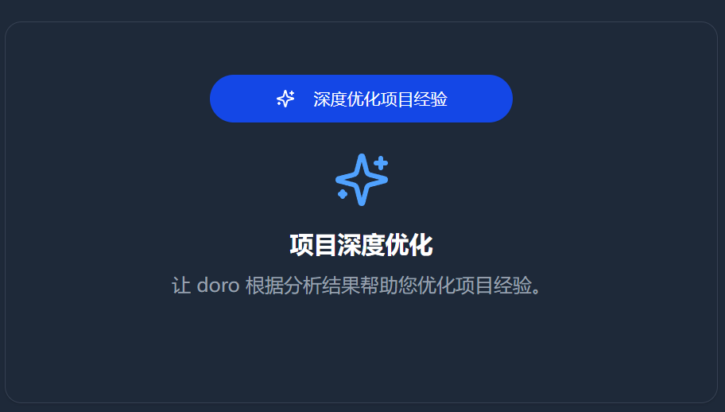
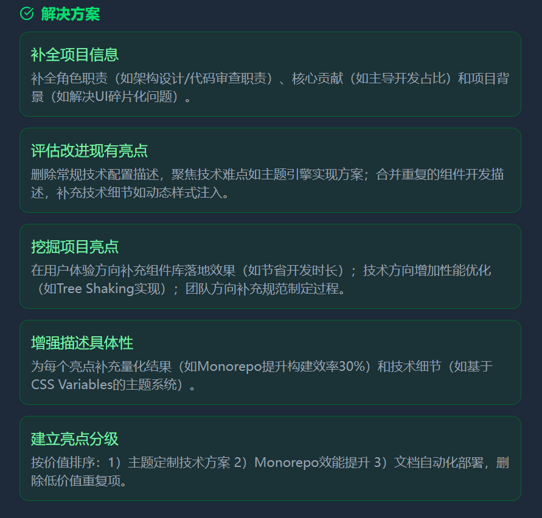
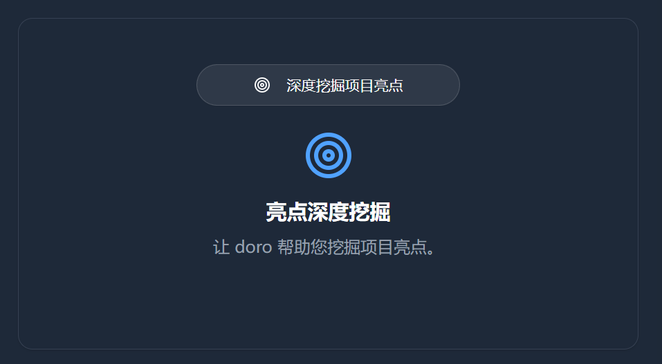
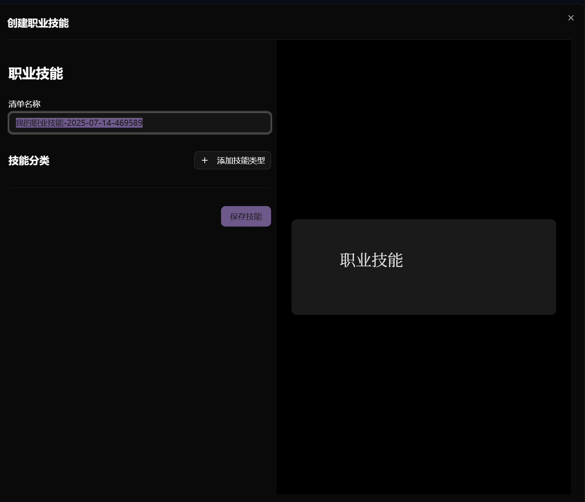
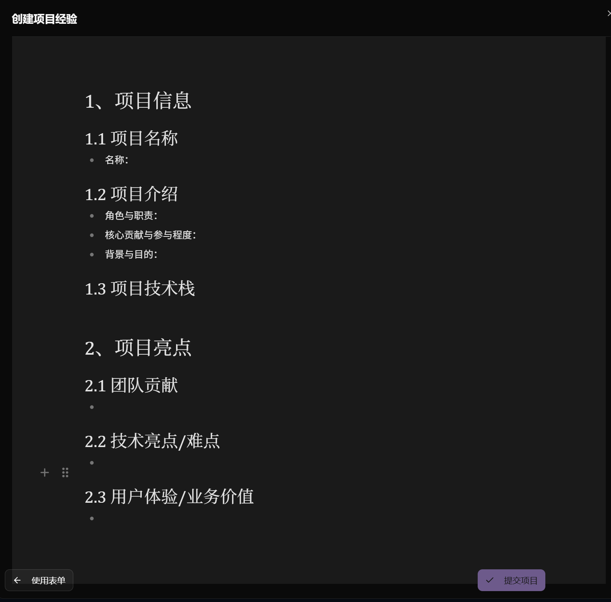
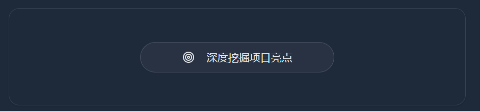

# Project Experience Analysis, Optimization, and Highlight Mining

Use this on the Project Experience page in the client.

## 1. Feature Overview

### 1.1 Analyze Project Experience

Identify issues in your project experience.

### 1.2 Optimize Project Experience

Optimize your project experience based on identified issues, and further refine it from an interviewer’s perspective.

### 1.3 Mine Project Highlights

Discover highlights based on your tech stack and the project's domain.

## 2. Workflow

Upload your project experience, then refer to the AI-generated results to update your local resume.
 
Borrow from AI’s work and make it your own.

### 2.1 Upload

#### Upload Skills

Upload your skills list on the Skills page in the client. The AI will use it.

#### Upload Project Experience

Click New on the Project Experience page in the client.

Do not modify the Markdown format of the project experience.
Split the tech stack using any of these three characters: `、,，`. If you want to express a combination of two technologies, use `+` or `-`.

### 2.2 Process

Click any project entry in the table to enter the processing page.

- **You have two versions of your project experience**
  - Local: your own project experience on your machine—this is what ultimately goes into your resume.
  - Database: the uploaded project experience—the AI optimizes this version.
- **Borrow from AI**
  - Refer to the AI's output and modify your local project experience
    - **Analysis → Optimization**
    - **Highlight Mining**
      - Newly achieved highlights: definitely include them
      - Not yet achieved but you know how to implement: can also be included
- **Flow**

  - Optimize the project experience stored in the database

    - Loop: analyze and optimize until satisfied
    - Loop: mine highlights until satisfied
    - Single round: pick a highlight you want to implement and do it

  - After AI finishes generating, you can use Feedback to have AI redo it. Your feedback helps AI do better next time!

## 3. Procedures

Click the corresponding buttons.

### 3.1 Loop: Analyze and Optimize

Identify issues and fix them.
After optimization, you can analyze again—repeat until satisfied.
Note: lack of highlights can only be solved via subsequent highlight mining.

When no analysis has been done yet, the first button is Analyze:

After analysis, it becomes Optimize.

After optimization, it becomes Analyze again.

Thus you can loop until satisfied.

### 3.2 Loop: Highlight Mining

Mine the highlights of your project experience.
You can keep digging until you’re satisfied.

### 3.3 Feedback and Redo

If you’re not satisfied with the result, provide feedback after generation completes.
AI will reflect and improve.

Click `Not satisfied, redo ...` below to share your critique and suggestions with the AI.

