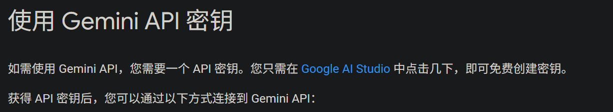
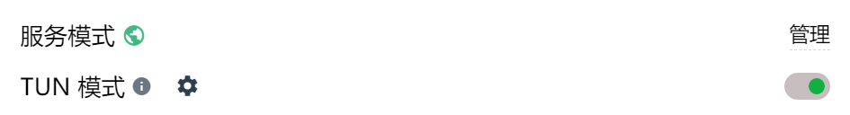

# Get a Gemini API Key

## Official Google

Prerequisites

- Google account
- VPN/proxy

Go to [Google AI Studio](https://aistudio.google.com/) and obtain an API key.

 

If your region isn’t supported, enable TUN mode in your proxy tool and choose a supported region (e.g., US/EU/JP).

 

Your account can call 2.5 Pro 100 times/day and 2.5 Flash 250 times/day for free.
 

As a rough reference for this project’s experience optimization feature, 100 calls to 2.5 Pro is roughly equivalent to 50 CNY.
 

It’s quite a good deal.

Set the API key as GOOGLEAI_API_KEY in [.env](packages\backend.env).

## Domestic proxy (optional)

If 100 calls/day isn’t enough, you can recharge on Google or use a domestic proxy.

Visit [this GitHub repo](https://github.com/chatanywhere/GPT_API_free) to get a paid key, then apply and recharge.
 

Replace OPENAI_API_KEY in your environment variables accordingly.
 

The embedding model used by this project is provided by this proxy—200 free calls per day. If you use it heavily, you’ll also need a paid API key.
