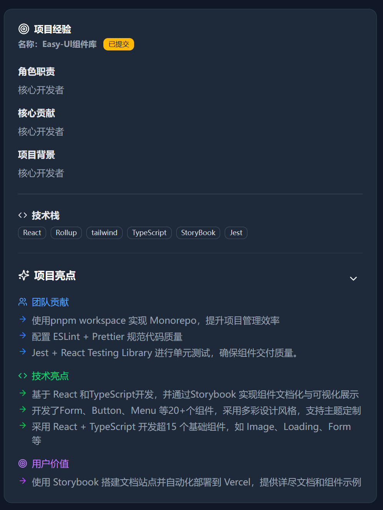
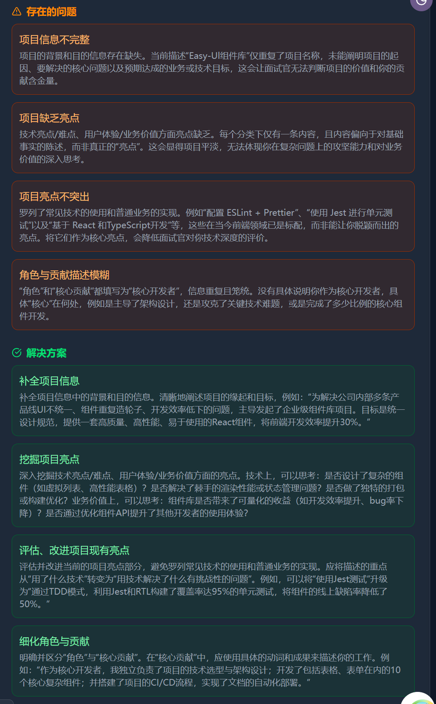
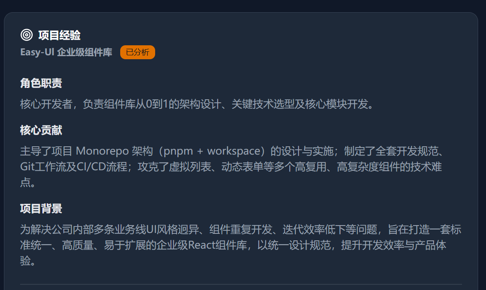
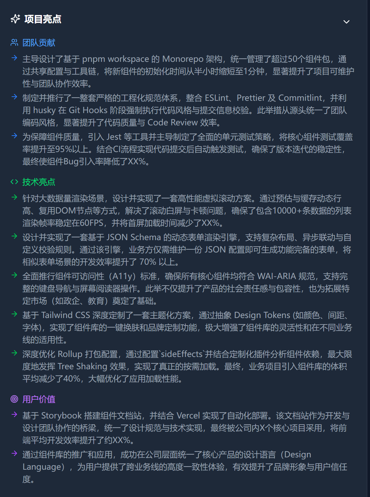
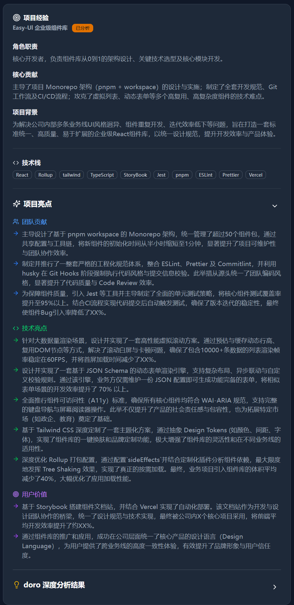

# Real Use Case

Examples of prisma-ai analyzing, optimizing, and mining highlights from a user's project experience.

## New graduate job seeker

Project experience provided by an active user on Niuke (anonymized).

### Initial project experience

### Issues identified by analysis

Problems and proposed solutions:
 

### Optimization results

### Mined highlights

### After one optimization round

Even a single round is transformative—and this is without providing project docs or related context to the knowledge base.
 

If the user supplies project docs and context, the results will be even better.
 

Combined with the designed workflow and iterative feedback to the AI, the ceiling is even higher.

### Highlight implementation status

Description (optional)
