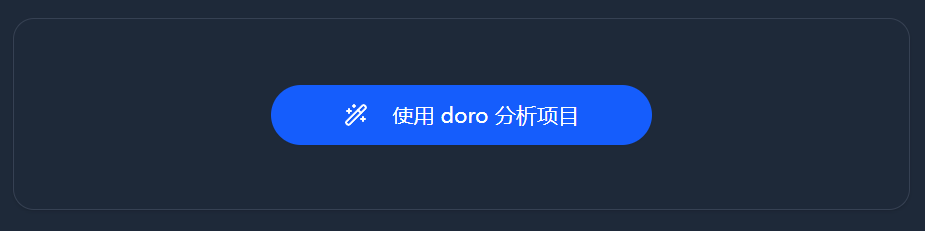

# 项目经验分析、优化、亮点挖掘

在客户端的项目经验页面使用。

## 1、功能介绍

### 1.1 项目经验分析

分析你的项目经验存在的问题。

### 1.2 项目经验优化

根据存在的问题优化你的项目经验，并从面试官角度进行进一步优化。

### 1.3 项目亮点挖掘

根据你的技术栈、项目涉及的领域，挖掘项目亮点。

## 2、工作流

上传自己的项目经验，然后参考 AI 的生成结果，对自己本地的简历进行修改。
 
抄AI作业，然后把它变成自己的。

### 2.1上传

#### 职业技能上传

在客户端的职业技能页面上传你的技能清单，AI 会用到。

#### 项目经验上传

在客户端的项目经验点击新建。

项目经验的md格式不要去修改它。
技术栈使用`、,，`3种字符进行分割,如果你想表达两个技术的组合,使用`+`或者`-`。

### 2.2处理

点击项目经验表格中的任一项目经验进入处理页面。

- **你有两个版本的项目经验**
  - 本地版本：自己的项目经验，在自己电脑上这是最终写入简历的项目经验。
  - 数据库：你上传的项目经验，这是AI进行优化的项目经验。
- **抄AI作业**
  - 参考AI的生成结果、修改本地的项目经验
    - **分析-优化**
    - **亮点挖掘**
      - 成功实现的新亮点：当然可以写
      - 未实现但知道如何实现的新亮点：也可以写
- **流程**

  - 优化数据库中的项目经验

    - 循环：分析、优化直到满意
    - 循环：亮点挖掘直到满意
    - 单轮：选择自己想实现的亮点去实现它

  - AI完成生成后，可以使用反馈让 AI 重做，你的反馈可以帮助 AI 下次做的更好！

## 3、流程

点击对应的按扭即可。

### 3.1 循环：分析、优化

分析出问题，然后解决它们。
你可以在优化完成后，继续分析。直到你满意为止。
注意亮点缺乏的问题只能通过后续的亮点挖掘解决。

当你的项目经验没有分析时，第一个按钮是分析：

当你分析后，变为优化。

优化完后又会变为分析。

因此你可以进行循环操作，直到自己满意。

### 3.2 循环：亮点挖掘

挖掘项目经验的亮点。
你可以不停的挖呀挖呀挖，直到你满意为止。

### 3.3 反馈、重做

如果你对生成结果不满意，在生成结束后进行反馈。
AI会反思然后做得更好。

在下方点击`不满意、重新xxx`，将你的批评和建议提供给AI

