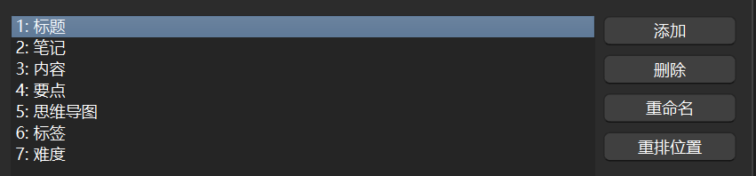

# 集成面试题库和 anki

## 一、安装和配置 anki

### 安装anki

打开 [anki官网](https://apps.ankiweb.net/) 安装anki客户端。

### 安装插件

打开anki客户端，打开工具-插件

点击获取插件，依次输入以下代码并点击确定：
<br>

2055492159：[AnkiConnect](https://ankiweb.net/shared/info/2055492159)
<br>

728482867：[Anki X Markdown X MindMap](https://ankiweb.net/shared/info/728482867)
<br>

2100166052：[Better Markdown Anki](https://ankiweb.net/shared/info/2100166052)
<br>

全部安装完毕后重启anki。

### 配置

- 打开工具-管理笔记模板

- 点击添加、选择默认的问答题并确定，名称为`面试题2.0`一定不要输错了

- 选中`面试题2.0`，点击字段，删除默认的字段，添加如下字段
  - 
  
- 点击卡片，正面内容模板、背面内容模板、样式使用以下内容替换
  - 正面内容模板
  
    - ```html
      <!-- prettier-ignore -->
      <!-- format-ignore -->
      
      <div id="front-card-basic">
      ┃**问题**
      <br>
      {{标题}}
      </div>
      <div id="tags-card">
      {{标签}}
      </div>
      <div id="difficulty-card">
      {{难度}}
      </div>
      <script>
          (function() {
              var jsLocal = '_better_markdown_anki.js';
              var jsCDN = 'https://cdn.jsdelivr.net/gh/alexthillen/better-markdown-anki@v0.0.6/better-markdown-anki/dist/_better_markdown_anki.js';
              var cssLocal = '_better_markdown_anki.css';
              var cssCDN = 'https://cdn.jsdelivr.net/gh/alexthillen/better-markdown-anki@v0.0.6/better-markdown-anki/dist/_better_markdown_anki.css';
      
              // Load CSS
              function loadCSS(href, fallback) {
                  var link = document.createElement('link');
                  link.rel = 'stylesheet';
                  link.href = href;
                  link.onerror = function() {
                      if (fallback) {
                          var fallbackLink = document.createElement('link');
                          fallbackLink.rel = 'stylesheet';
                          fallbackLink.href = fallback;
                          document.head.appendChild(fallbackLink);
                      }
                  };
                  document.head.appendChild(link);
              }
      
              // Load JS as ES Module
              function loadJS(src, fallback) {
                  var scriptSelector = 'script[src="' + src + '"]';
                  if (!document.querySelector(scriptSelector)) {
                      var script = document.createElement('script');
                      script.type = 'module'; // Essential for ES modules
                      script.src = src;
                      script.onerror = function() {
                          if (fallback && !document.querySelector('script[src="' + fallback + '"]')) {
                              var fallbackScript = document.createElement('script');
                              fallbackScript.type = 'module';
                              fallbackScript.src = fallback;
                              document.head.appendChild(fallbackScript);
                          }
                      };
                      document.head.appendChild(script);
                  }
              }
      
              loadCSS(cssLocal, cssCDN);
              loadJS(jsLocal, jsCDN);
          })();
      </script>
      
      
      ```
  
  - 背面内容模板
  
    - ```html
      <!-- prettier-ignore -->
      <!-- format-ignore -->
      
      <div id="front-card-basic">
      ┃**问题**
      <br>
      {{标题}}
      </div>
      <div id="back-card-basic">
      ┃**答案**
      <br>
      {{内容}}
      </div>
      <div id="extra-card-basic">
      ┃**要点**
      <br>
      {{要点}}
      
      ┃**笔记**
      <br>
      {{笔记}}
      
      </div>
      
      <div class="slide">
        <div class="h1 green greenleft">
          <span class="greenimg"
            ></span>
          思维导图
        </div>
        <div class="h2 greenleft">
          <svg id="mindmapgraph"></svg>
          <div id="mindmaptext" hidden>{{思维导图}}</div>
        </div>
      </div>
      
      <div id="tags-card">
      {{标签}}
      </div>
      <div id="difficulty-card">
      {{难度}}
      </div>
      
      <script>
          (function() {
              var jsLocal = '_better_markdown_anki.js';
              var jsCDN = 'https://cdn.jsdelivr.net/gh/alexthillen/better-markdown-anki@v0.0.6/better-markdown-anki/dist/_better_markdown_anki.js';
              var cssLocal = '_better_markdown_anki.css';
              var cssCDN = 'https://cdn.jsdelivr.net/gh/alexthillen/better-markdown-anki@v0.0.6/better-markdown-anki/dist/_better_markdown_anki.css';
      
              // Load CSS
              function loadCSS(href, fallback) {
                  var link = document.createElement('link');
                  link.rel = 'stylesheet';
                  link.href = href;
                  link.onerror = function() {
                      if (fallback) {
                          var fallbackLink = document.createElement('link');
                          fallbackLink.rel = 'stylesheet';
                          fallbackLink.href = fallback;
                          document.head.appendChild(fallbackLink);
                      }
                  };
                  document.head.appendChild(link);
              }
      
              // Load JS as ES Module
              function loadJS(src, fallback) {
                  var scriptSelector = 'script[src="' + src + '"]';
                  if (!document.querySelector(scriptSelector)) {
                      var script = document.createElement('script');
                      script.type = 'module'; // Essential for ES modules
                      script.src = src;
                      script.onerror = function() {
                          if (fallback && !document.querySelector('script[src="' + fallback + '"]')) {
                              var fallbackScript = document.createElement('script');
                              fallbackScript.type = 'module';
                              fallbackScript.src = fallback;
                              document.head.appendChild(fallbackScript);
                          }
                      };
                      document.head.appendChild(script);
                  }
              }
      
              loadCSS(cssLocal, cssCDN);
              loadJS(jsLocal, jsCDN);
          })();
      </script>
      
      <script>
      //md转思维导图
        var ResourceType = {
          js: 1,
          css: 2,
        };
        loadResource("_d3@6.js", "https://cdn.jsdelivr.net/npm/d3@6", ResourceType.js)
          .then(() =>
            loadResource(
              "_markmap-lib.js",
              "https://cdn.jsdelivr.net/npm/markmap-lib",
              ResourceType.js
            )
          )
          .then(() =>
            loadResource(
              "_markmap-view.js",
              "https://cdn.jsdelivr.net/npm/markmap-view",
              ResourceType.js
            )
          )
          .then(render)
          .catch(show);
      
        function loadResource(path, altURL, resourceType) {
          let load = function (isLocal, resolve, reject) {
            let resource =
              resourceType === ResourceType.js
                ? document.createElement("script")
                : document.createElement("link");
            if (resourceType === ResourceType.css) {
              resource.setAttribute("rel", "stylesheet");
              resource.type = "text/css";
            }
            resource.onload = resolve;
            resource.src = isLocal ? path : altURL;
            resource.onerror = isLocal
              ? function () {
                  load(false, resolve, reject);
                }
              : reject;
            document.head.appendChild(resource);
          };
          return new Promise((resolve, reject) => {
            load(true, resolve, reject);
          });
        }
      
        function render() {
          mindmap("mindmaptext");
          show();
        }
      
        function show() {
          document.getElementById("mindmapgraph").style.visibility = "visible";
        }
      
        function mindmap(ID) {
          if (document.getElementById("mindmapgraph").children.length === 2) {
            // Already created graph, directly return
            return;
          }
          let text = escapeHTMLChars(document.getElementById(ID).innerHTML);
          const { Markmap, loadCSS, loadJS, Transformer } = window.markmap;
          var transformer = new Transformer();
          const { root, features } = transformer.transform(text);
          const { styles, scripts } = transformer.getUsedAssets(features);
          if (styles) loadCSS(styles);
          if (scripts) loadJS(scripts, { getMarkmap: () => window.markmap });
          Markmap.create("#mindmapgraph", null, root);
        }
        function escapeHTMLChars(str) {
          return str
            .replace(/<[\/]?pre[^>]*>/gi, "")
            .replace(/<br\s*[\/]?[^>]*>/gi, "\n")
            .replace(/<br\s*[\/]?[^>]*>/gi, "\n")
            .replace(/<[\/]?span[^>]*>/gi, "")
            .replace(/<ol[^>]*>/gi, "")
            .replace(/<\/ol[^>]*>/gi, "\n")
            .replace(/<ul[^>]*>/gi, "")
            .replace(/<\/ul[^>]*>/gi, "\n")
            .replace(/<div[^>]*>/gi, "")
            .replace(/<\/div[^>]*>/gi, "\n")
            .replace(/<li[^>]*>/gi, "- ")
            .replace(/<\/li[^>]*>/gi, "\n")
            .replace(/&nbsp;/gi, " ")
            .replace(/&tab;/gi, "	")
            .replace(/&gt;/gi, ">")
            .replace(/&lt;/gi, "<")
            .replace(/&amp;/gi, "&");
        }
      </script>
      
      
      ```
  
  - 样式
  
    - ```css
      /* 普通段落和列表项 */
      .card p,.card li {
          font-size: 16px !important;
      }
      /* 标题 */
      /* .card h3 {
          font-size: 20px !important;
      } */
      /* 代码块 */
      .card code {
          font-size: 14px !important;
      }
      
      
        @font-face {
          font-family: "Cascadia Code";
          src: url("_CascadiaCode.ttf");
        }
        .card {
          background-color: white;
          text-align: left;
        }
        
        .h1 {
          padding: 0.3em 0em 0.3em 0.5em;
          font-family: "Cascadia Code", "Consolas", Overpass, "GlowSansSC", "Helvetica Neue",
            "pingfang sc", "microsoft yahei", sans-serif;
        }
        .h2 {
          padding: 0.3em 0em 0.3em 0.5em;
          font-family: "Cascadia Code", "Consolas", Overpass, "GlowSansSC", "Helvetica Neue",
            "pingfang sc", "microsoft yahei", sans-serif;
        }
        
        .redleft {
          border-left: 3px solid #ec6c4f;
        }
        .blueleft {
          border-left: 3px solid #338eca;
        }
        .pinkleft {
          border-left: 3px solid #d4237a;
        }
        .greenleft {
          border-left: 3px solid #9acd32;
        }
        .purpleleft {
          border-left: 3px solid #594d9c;
        }
        
        
        .wordwrap {
          display: block;
          word-wrap: break-word;
        }
        
        .red {
          color: #ec6c4f;
        }
        .blue {
          color: #338eca;
        }
        .green {
          color: #9acd32;
        }
        .pink {
          color: #d4237a;
        }
        .purple {
          color: #594d9c;
        }
        
        
        .hint {
          color: black;
        }
        
        a {
          color: #666;
        }
      
        .chrome img {
          max-width: 100%;
          vertical-align: middle;
        }
        ul,
        ol {
          margin-top: 0em;
        }
        ul li {
          margin-left: -0.9em;
        }
        i {
          padding: 0 3px 0 0;
        }
        u {
          text-decoration: none;
          background-color: #ffff75;
          border-bottom: 2px solid #ec6c4f;
        }
        hr {
          height: 1px;
          width: 100%;
          display: block;
          border: 0px solid #fff;
          margin: 5px 0px 10px 0px;
          background-color: #ccc;
        }
        
        #answer, #mindmapgraph {
            visibility: hidden;
        }
      
        #mindmapgraph{
          height: 50vh;
          width: 95vw;
        }
        /* 字体等显示 */
        .markmap-foreign {
          font: 16px/20px "Cascadia Code", "Consolas", Overpass, "GlowSansSC", "Helvetica Neue",
          "pingfang sc", "microsoft yahei", sans-serif;
        }
        /* ``块 */
      .markmap-foreign code {
      /*font-weight:bold !important;*/
      font-size:18px !important;
      color:white !important;
      }
      /* 去掉``块背景色 */
      .markmap-foreign * {
      background-color:transparent  !important;
      }
      
      ```
  

## 二、获取面试题库

## 流程

```
前端题库域名: https://fe.ecool.fun,
前端题库数据列表页: https://fe.ecool.fun/topic-list,
后端题库域名: https://java.mid-life.vip,
后端题库数据列表页: https://java.mid-life.vip/topic-list
```

<br>
打开客户端的面向offer学习/集成面试题库和 anki页面，
填写表单并提交，然后耐心等待数据导入完毕即可。

## 须知

建议在弹出的自动化浏览器窗口中点击免费题目标签，以只导入免费题目。
<br>

否则会因为未登录或者没有vip（一周七八块）而导致数据导入失败。
<br>

**如果你登录了并且是vip，理论上可以导入你能访问的任意题目**，但这会有什么后果呢？
<br>

作者并没有发现上述题库网站有什么用户协议，也没有发现上述题库网站有规范爬虫行为的robots.txt，所以无法给出判断和建议。
<br>

那没有限制岂不是无限制？这也未必，**比如你拿来自己学习可能一点问题都没有**，但你拿人家题库数据去卖钱，我觉得很可能会被法律制裁。

## 4、声明

[项目](https://github.com/weicanie/prisma-ai)提供的爬虫工具和相关功能仅限爬取完全公开且未设访问限制的数据，使用者需自行承担因使用不当而产生的任何法律风险，开发者概不负责。且禁止用于：

- (1) 违反目标网站Robots协议或用户条款；
- (2) 商业竞争、数据转售等牟利行为；
- (3) 高频访问干扰网站正常运行。
- (4) 任何违反中华人民共和国相关法律法规的行为，包括但不限于违反《中华人民共和国刑法》第二百八十五条、《中华人民共和国刑法》第二百八十六条、《中华人民共和国刑法》第二百五十三条、《民法总则》第111条、《反不正当竞争法》、《网络安全法》的任何行为。
  使用者需自行承担法律风险，开发者概不负责。
  

## 三、生成题目思维导图

llm生成思维导图，token消耗会比较大，建议在晚上00:30~8:30的打折时段进行，并准备充足的deepseek余额（白天>=20元,晚上00:30~8:30>=10元）。
<br>

思维导图生成完全是可选的，但思维导图对于面试题的理解和记忆帮助是相当大的，所以建议还是生成！

## 四、题库上传 anki

保持anki软件打开即可。

因为anki要打开才能连里边数据库。
