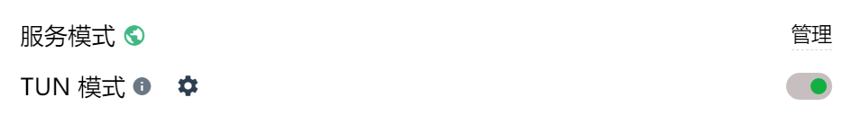

# Gemini模型获取

## Google 官方

前置条件
- google账号
- 梯子

前往[google ai studio](https://aistudio.google.com/),获取 api key即可。

 

提示地区不支持，就开启梯子的tun模式，并选择受支持地区的代理（如日本）。

 

免费账号每天可以调用100次 2.5 pro，250次 2.5 flash。
 

以本项目的项目经验优化功能为大致参考，100次 2.5 pro调用大概相当于50元人民币。
 

还是很香的。

apikey设置为[.env](packages\backend\.env)文件中的GOOGLEAI_API_KEY值即可。

## 国内代理

前往[其github 仓库](https://github.com/chatanywhere/GPT_API_free)点击支持付费key，然后申请、充值一个付费key。
 

替换掉环境变量中的OPENAI_API_KEY即可。
 

项目用的嵌入模型是这个代理提供的，一天200次免费调用，如果你用的太狠，那么也需要弄一个付费 apikey。