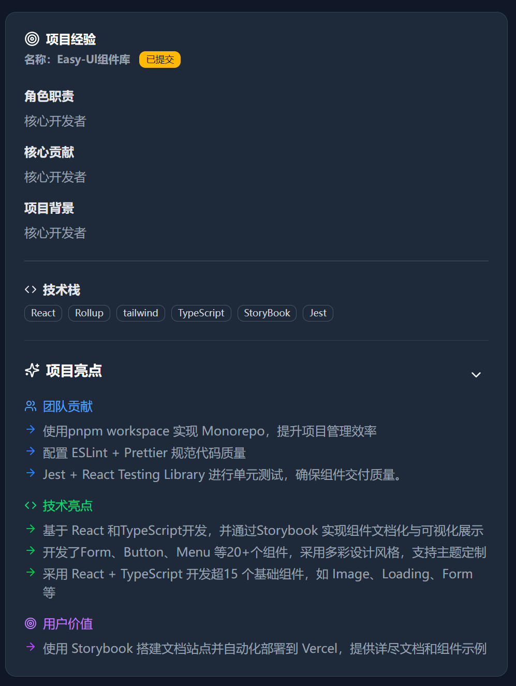
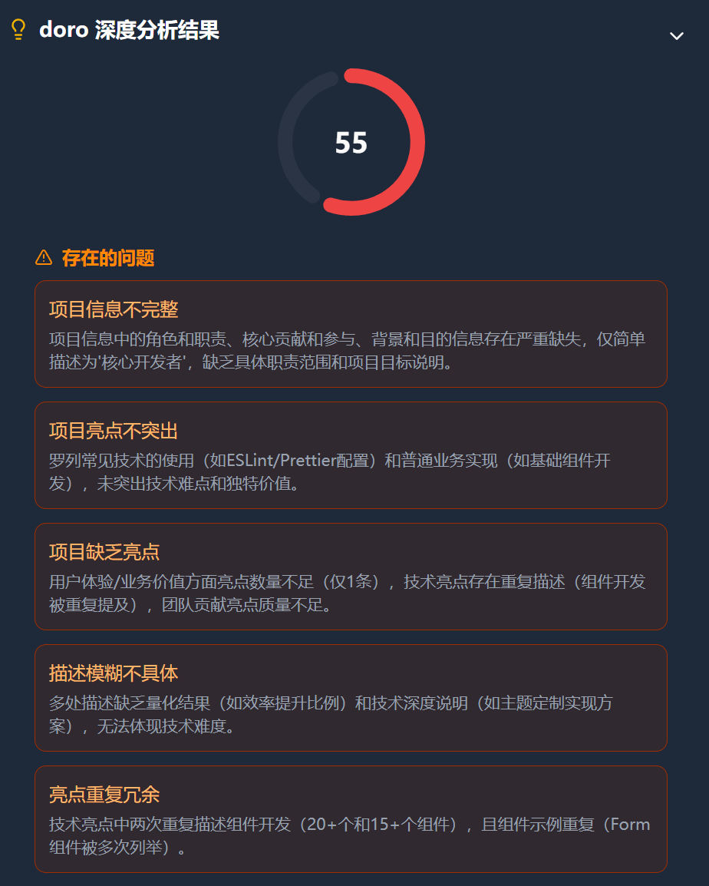
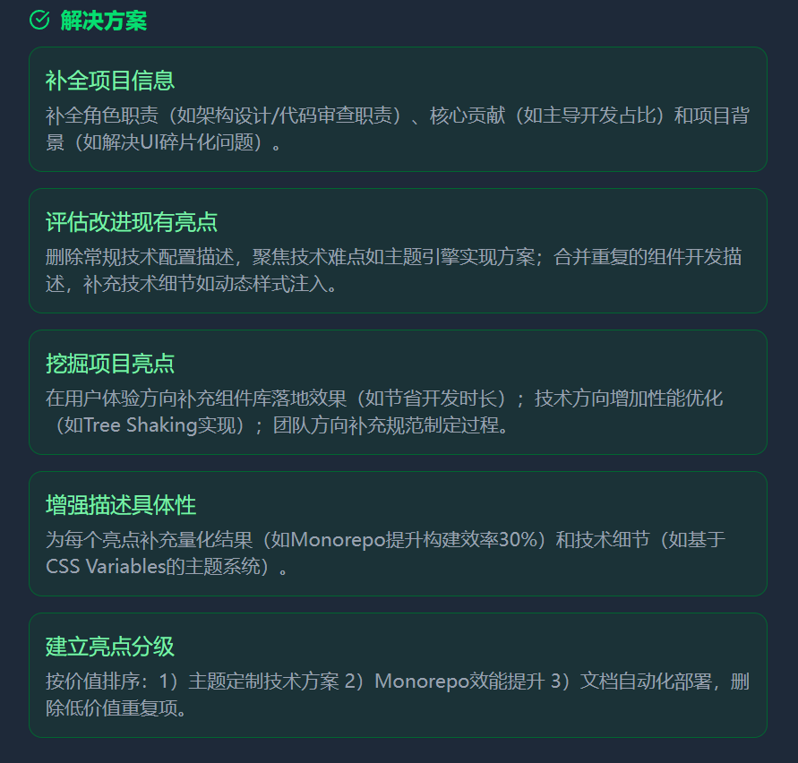
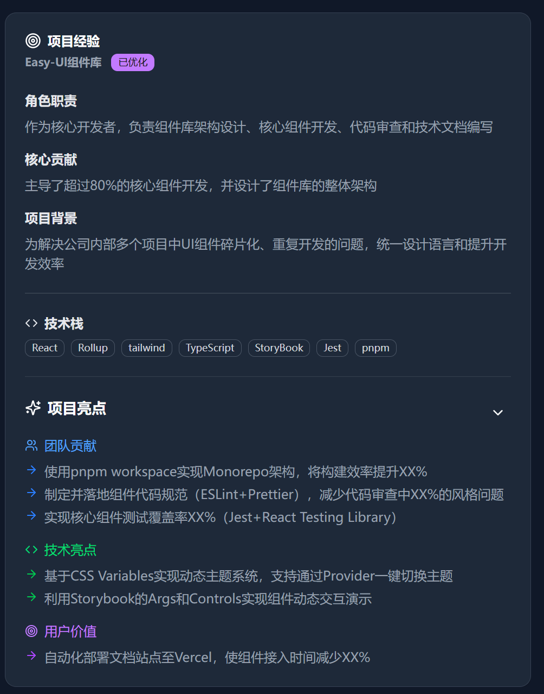
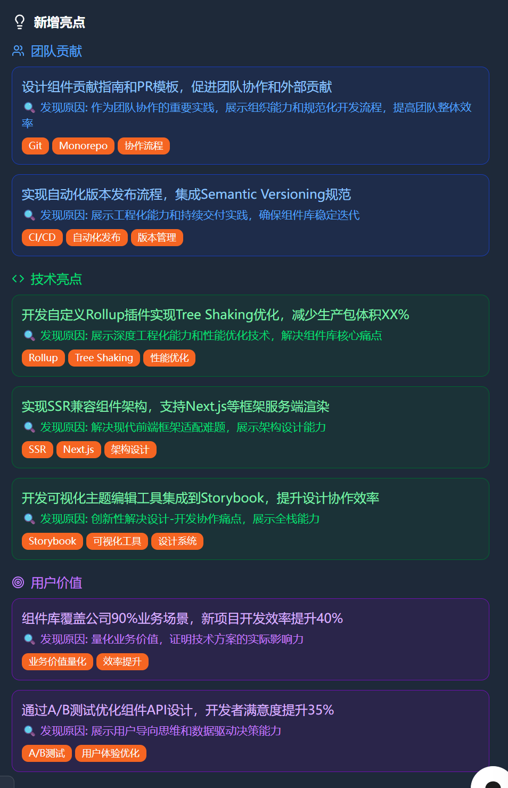
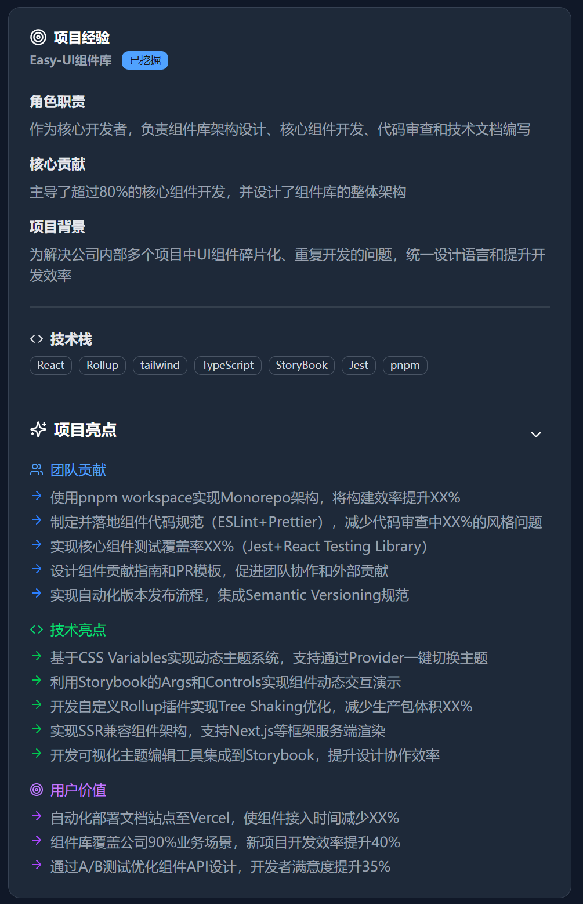

# 真实使用案例

prisma-ai 对用户的项目经验的分析、优化、亮点挖掘部分案例展示。

## 用户

一位活跃在牛客的应届生提供的项目经验，已做脱敏处理。

### 初始项目经验

### 分析得出的问题

存在的问题：

解决方案：

### 优化结果

### 挖掘出的亮点

### 一轮优化后的项目经验

仅一轮优化即脱胎换骨，这还是没有将项目文档或者相关上下文提供到知识库的情况下。
 

如果用户提供了项目文档等上下文，效果还会更好。
 

结合作者设计的工作流和对AI进行反馈，上限还会更高。

### 亮点的落地情况

描述（可选）
