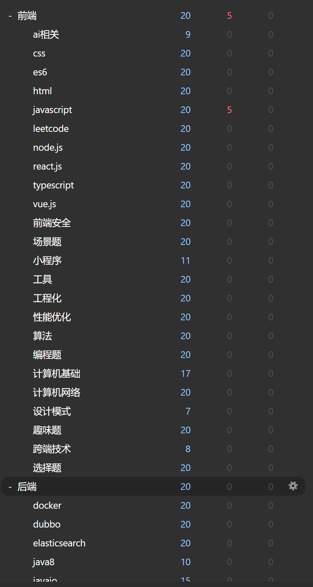
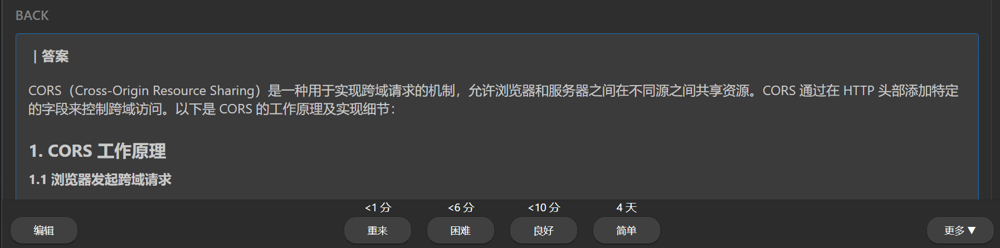

# 真实使用案例

prisma-ai 集成anki + 思维导图 + 前后端专业题库提高用户学习效率的案例。

## 八股苦手

一位活跃在掘金、牛客、CSDN的应届同学。
 

"找工作最痛苦的就是死记硬背各种八股文，你不背还不行。"

### 这是prisma-ai带来的变化

集成思维anki + 思维导图 + 专业前后端题库，在理解中学会，在高效的复习中精进：

基于艾宾浩斯遗忘曲线的间隔重复：

