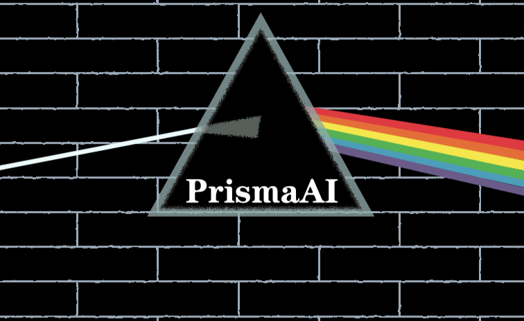

# prisma-ai - From Resume to Offer

[](...)

[简体中文](readme.md) | English

## ⚡ Quick Start

```bash
# Clone repository
git clone https://github.com/yourusername/prisma-ai.git

# Install dependencies
pnpm install
```

Then open packages/backend and configure the corresponding environment variables in .env and .env.development.

```bash
# Start project
pnpm lerna dev --parallel
```

## I. Introduction to prisma-ai

A platform that implements LLM (Large Language Model) application development paradigms such as `agent (agent) + mcp (Model Context Protocol)`, and builds upon this foundation to create an LLM application - **Resume Inspiration Mushroom** - that helps users transform their resumes into offers.

### ⚡ 1. Solving Core Pain Points

#### 🎯 You're Worse at Writing Resumes Than You Think, and Even Worse at Maximizing Their Value!

You're a `project experience novice`, struggling to highlight key points and identify challenges.

You're like Jiang Taigong fishing for interview questions - waiting for questions to bite, unaware that `80% of interview questions` stem from your resume.

You're a 3-day resume speedster, unaware that crafting an excellent resume requires weeks or more of dedicated effort.

You're a mass-applicant who sends thousands of applications for a few interviews, unaware that you must `customize your resume for each position`.

You're a "pragmatist" who learns whatever the company uses, unaware that in the brutal internet job market, there's only one path: `learning for offers`.

**prisma-ai** aims to provide a `ready-to-use one-stop solution platform`,

making you marvel at how valuable a resume can be, and once fully utilized, you'll be like `fish in the offer sea, birds in the high-salary sky` - no longer constrained!

#### 🎯 Lowering LLM Application Development Threshold, Providing Ready-to-Use Agent + MCP Capabilities

The `MCP protocol` has been hot for a while, but under various vendors' marketing, it has clearly been distorted, with factual errors like "no MCP means no tool calling" and "MCP protocol vs RESTful which is better" being quite amusing.
The root cause is the lag in AI Q&A services and the threshold for new technologies.
This project provides ready-to-use, completely hand-written `mcp client` and `mcp server`, allowing you to directly engage with the `agent + mcp` development paradigm.

### 📝 2. Resume Inspiration Mushroom

#### ✨ Resume Analysis, Optimization, and Highlight Mining

Resume Inspiration Mushroom uses the latest `deepseek r1 5/28` model, with deeper thinking capabilities, stronger output capabilities, and a series of `prompt engineering` to implement the powerful resume optimization assistant **Prisma**.

**Prisma** can efficiently and effectively analyze, optimize user resumes, and mine resume highlights.

#### 💼 Resume Position Matching and Alignment (Coming Soon)

#### 🚀 Learning Path Planning and Interview Question Knowledge Base Management (Coming Soon)

### 👨‍💻 3. Developer Platform

#### 🤖 Agent + MCP Paradigm Support

The `prisma-ai` platform extends `langchain` capabilities to implement `agent` support for `mcp`. Through `mcp-sdk`, it developed an `mcp client` that supports both local and remote `mcp server` interactions.

#### 🔄 RAG Paradigm Support

Supports the `rag` paradigm through `langchain`, `pinecone`, and `openai`'s `embedding model`.

#### 📊 QAG Paradigm (Coming Soon)

A development paradigm that builds structured knowledge bases through `sql` and `nosql` databases, where `llm agent` uses provided `tools` for structured queries and enhanced generation.

This project currently supports `llm agent` querying `mongodb` databases.

## II. prisma-ai Feature Usage Examples

### 📝 1. Resume Inspiration Mushroom

#### 🔍 1. Project Experience Analysis


Analysis Results ✨:


#### ⚡ 2. Project Experience Optimization


Optimization Results ✨:


#### 💎 3. Project Experience Highlight Mining


Mining Results ✨:


### 👨‍💻 2. Developer Platform

### 🤖 Agent + MCP Paradigm

For example, using the built-in mcp client to provide mongodb database query tools for llm:

1. Configure mcp server ⚙️:
   

2. deepseek v3 agent successfully calls mcp server tool to query mongodb database 🚀:


## III. Technical Value

| Domain                       | Achievements                                                                                                                                                                                                                                                                             |
| :--------------------------- | :--------------------------------------------------------------------------------------------------------------------------------------------------------------------------------------------------------------------------------------------------------------------------------------- |
| **AI Paradigm**              | ▶️ Implemented **RAG Industrial Process**: Pinecone + OpenAI Embedding + LangChain ▶️ Provided **Agent+MCP Fusion Architecture**: Extended LangChain for MCP protocol, developed mcp-client for cross-environment tool calls                                                             |
| **Engineering Architecture** | ▶️ Frontend-Backend Separation: React (Frontend) + Nest (Backend) ▶️ High Availability Design: Task Queue + Redis Cache + Circuit Breaker Rate Limiting ▶️ **SSE Streaming Response + Exception Recovery**: Decoupled HTTP connections from session state, supporting exception recovery |
| **Development Paradigm**     | ▶️ **Monorepo Management**: pnpm + lerna + tsup building shared libraries ▶️ **Unified Type Ecosystem**: TS + Zod Schema → DTO/VO full-chain type safety ▶️ **Dual Database Solution**: MySQL (Relational) + MongoDB (Document) precisely matching business scenarios                    |
