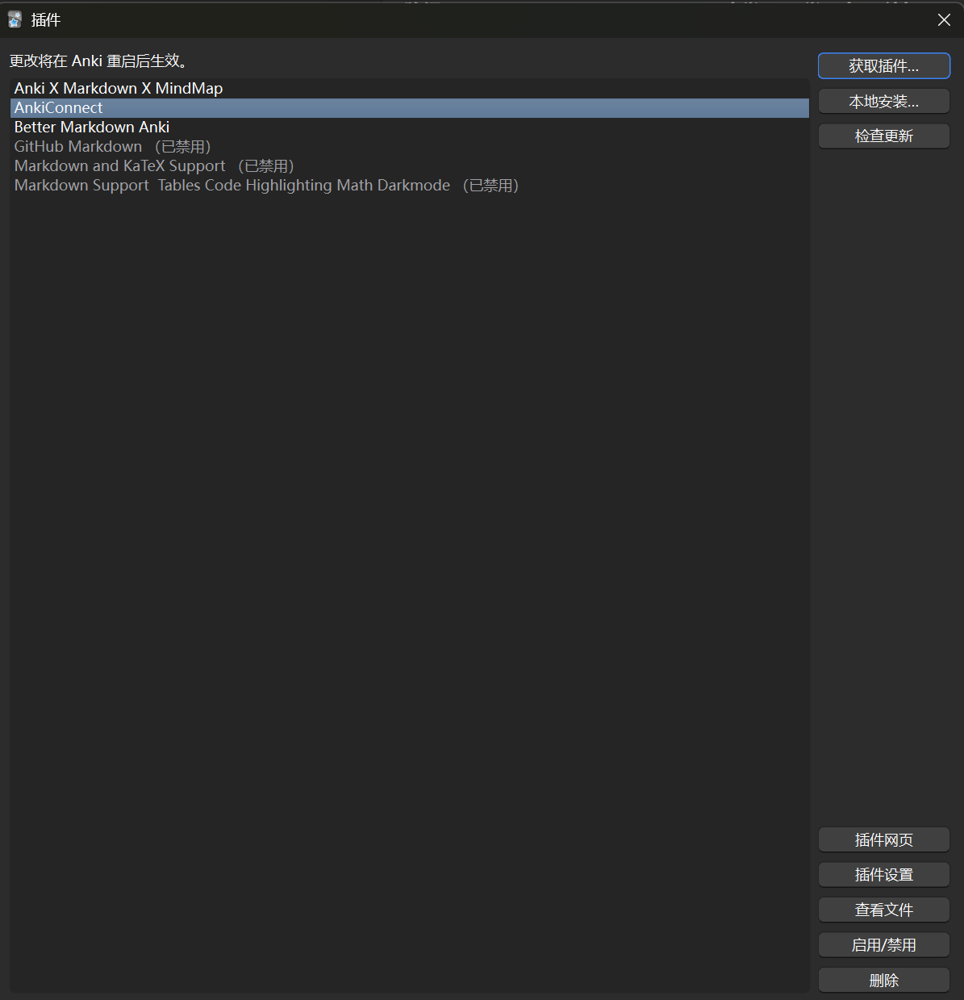

# Anki Setup

## Installation and Add-on Configuration

If you haven't used prisma-ai's Anki integration before, please first follow the [Anki setup guide](../tutorial-7-interview-bank-anki-integration.md) to install and configure it.

## Enable CORS

In Anki, go to Tools > Add-ons. Select AnkiConnect, then click the Config button in the bottom-right.



Replace the existing content with the following:

```json
{
	"apiKey": null,
	"apiLogPath": null,
	"ignoreOriginList": [],
	"webBindAddress": "127.0.0.1",
	"webBindPort": 8765,
	"webCorsOriginList": [
		"http://localhost",
		"http://localhost:5173",
		"https://pinkprisma.com",
		"https://www.pinkprisma.com"
	]
}
```

This allows the prisma-ai hub web page to import your interview questions into your local Anki.
