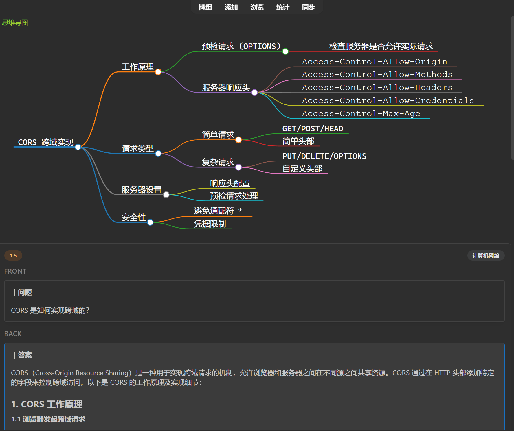
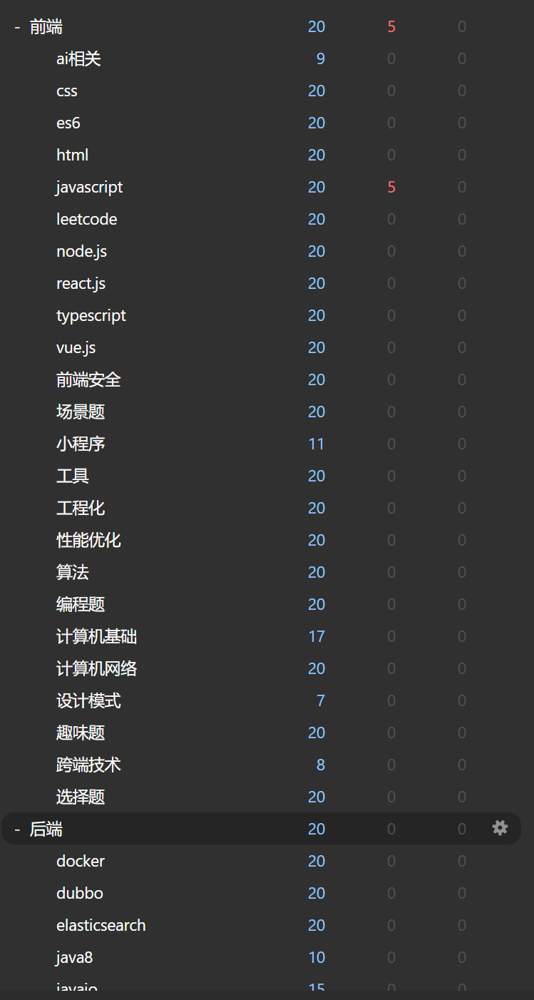
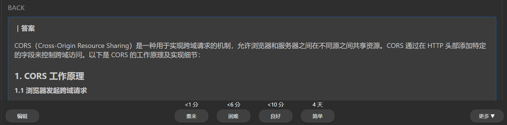

# Real Use Case

How prisma-ai integrates Anki + mind maps + specialized FE/BE question banks to improve learning efficiency.

## Struggling with rote Q&A

A new graduate active on Juejin, Niuke, and CSDN.
 

“The most painful part of job hunting is rote memorization of standard Q&A—but you can’t skip it.”

### How prisma-ai changes the game

By integrating Anki + mind maps + specialized front-end/back-end banks, you learn by understanding and improve through efficient review:

Spaced repetition based on the Ebbinghaus forgetting curve:

