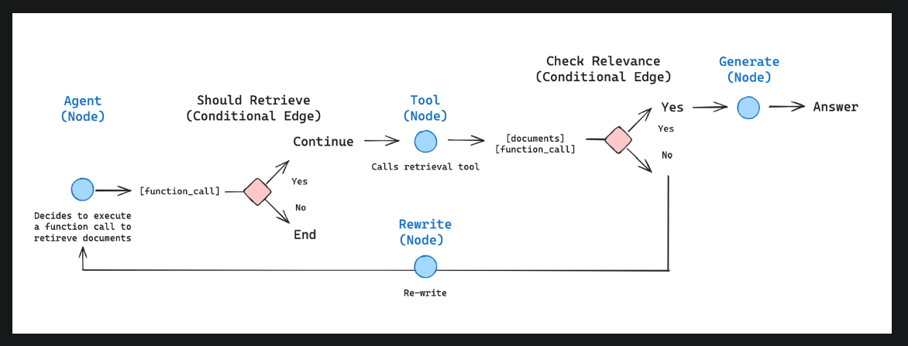

Tool Node 后应该是 gradeDocuments Node。

这个RAG Agent 与最直接的RAG流程相比,加入了相关性评估和不相关重写步骤,来确保提供的文档和用户提问相关。

局限
- 在文档不匹配时,只是简单地重写query,效果欠佳
- query一直检索不到相关文档,且Agent持续推理出工具调用时,会陷入死循环

改进
- 引入更多llm进行优化
  - 扩写query MultiQueryRetriever
  - 提取文档信息 ContextualCompressionRetriever
  - 考虑根据相似度来获取文档 ScoreThresholdRetriever
- 设置明确的super step上限（默认25）
