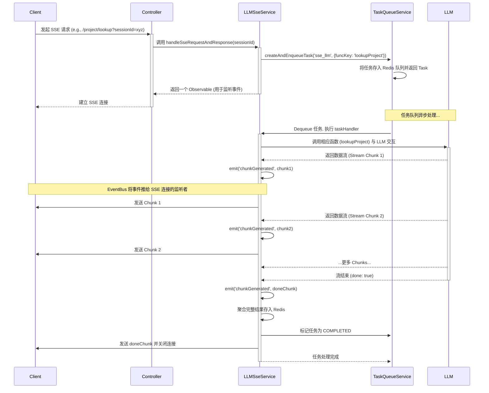
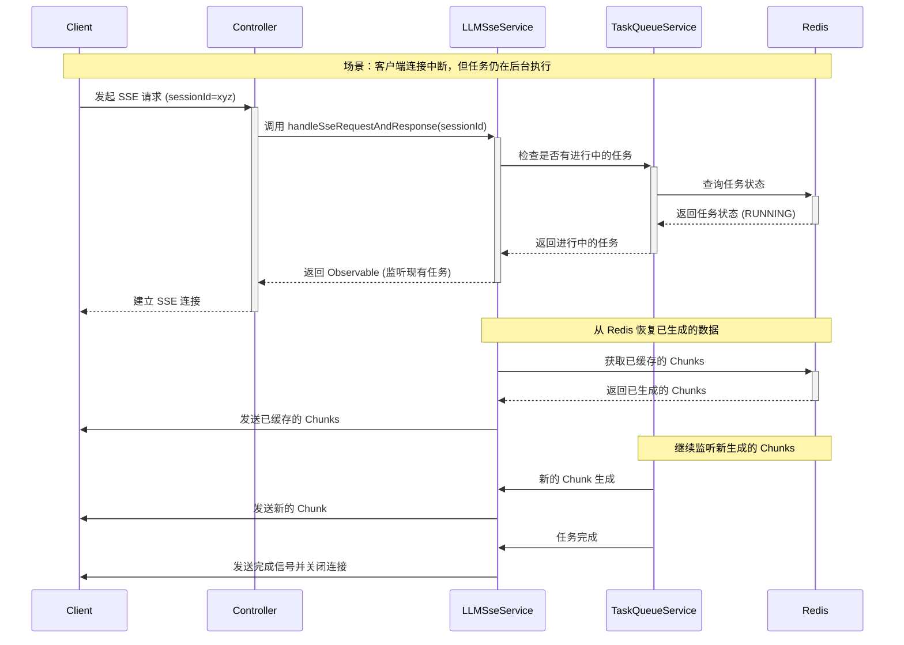

# LLM 流式响应与任务队列系统

本文档面向新加入项目的开发者，旨在解释后端系统中从接收请求、与大语言模型（LLM）交互，到通过 Server-Sent Events (SSE) 将数据流式返回给客户端的完整链路。

核心特性是其 **高可靠性** 和 **独特的异常恢复机制**，我们称之为 **"断点接传"**，它极大简化了客户端的处理逻辑。

## 核心组件交互流程

整个链路涉及以下几个关键模块的协同工作：

1.  **`ProjectController`**: API 入口，负责接收客户端的 HTTP 请求。
2.  **`ProjectService`**: 具体的业务逻辑层，例如处理"项目分析"、"项目优化"等。
3.  **`LLMSseService`**: SSE 的核心服务，负责管理 SSE 连接、任务创建和数据推送。
4.  **`TaskQueueService`**: 基于 Redis 的持久化任务队列，负责异步执行耗时的 LLM 调用任务。
5.  **`EventBusService`**: 一个内存中的事件总线，用于在系统内部解耦不同模块间的通信。
6.  **`RedisService`**: 提供 Redis 连接，用于任务队列的持久化、任务状态追踪和结果缓存。

### 正常流程（首次请求）



### 异常恢复流程（断点接传）



## 核心优势

### 1. 高可靠性

- **持久化任务队列**: 使用 Redis 存储任务状态，服务重启后能自动恢复
- **事件驱动架构**: 通过 EventBus 解耦各模块，提高系统灵活性
- **异常恢复机制**: 客户端连接中断不影响后台任务执行

### 2. 断点接传

- **无缝恢复**: 客户端重新连接、组件重新挂载后能立即获取已生成的内容
- **状态保持**: 任务执行状态在 Redis 中持久化
- **数据缓存**: 已生成的 Chunks 存储在 Redis 中，支持快速恢复

### 3. 性能优化

- **异步处理**: 任务队列异步执行，不阻塞主线程
- **流式响应**: 实时推送数据，提升用户体验
- **资源管理**: 自动清理过期任务和缓存数据

## 技术实现细节

### 任务队列持久化

```typescript
// 任务状态在 Redis 中的存储结构
{
  "task:uuid": {
    "id": "uuid",
    "sessionId": "session_xyz",
    "userId": "user_123",
    "type": "sse_llm",
    "status": "running",
    "createdAt": 1234567890,
    "startedAt": 1234567891,
    "metadata": {
      "funcKey": "lookupProject"
    }
  }
}
```

### 事件总线通信

```typescript
// 事件类型定义
enum EventList {
	taskCompleted = 'taskCompleted',
	taskFailed = 'taskFailed',
	taskAborted = 'taskAborted',
	chunkGenerated = 'chunkGenerated'
}

// 事件监听示例
eventBusService.on(EventList.chunkGenerated, ({ taskId, eventData }) => {
	// 处理新生成的 Chunk
});
```

### SSE 连接管理

```typescript
// SSE 响应流示例
@Sse('project/lookup')
async handleSseRequestAndResponse(
  @Query('sessionId') sessionId: string
): Promise<Observable<MessageEvent>> {
  return this.llmSseService.handleSseRequestAndResponse(sessionId);
}
```


这个系统设计确保了高可用性和用户体验，即使在网络不稳定或服务重启的情况下，用户也能获得连续的服务体验。
