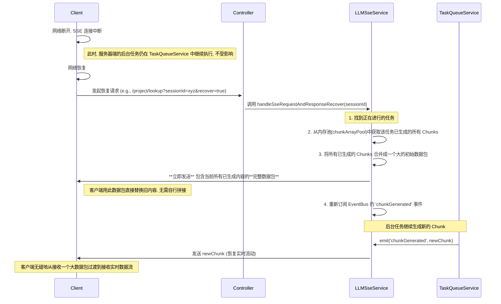

# LLM 流式响应与任务队列系统

本文档面向新加入项目的开发者，旨在解释后端系统中从接收请求、与大语言模型（LLM）交互，到通过 Server-Sent Events (SSE) 将数据流式返回给客户端的完整链路。

核心特性是其 **高可靠性** 和 **独特的异常恢复机制**，我们称之为 **"断点接传"**，它极大简化了客户端的处理逻辑。

## 核心组件交互流程

整个链路涉及以下几个关键模块的协同工作：

1.  **`ProjectController`**: API 入口，负责接收客户端的 HTTP 请求。
2.  **`ProjectService`**: 具体的业务逻辑层，例如处理"项目分析"、"项目润色"等。
3.  **`LLMSseService`**: SSE 的核心服务，负责管理 SSE 连接、任务创建和数据推送。
4.  **`TaskQueueService`**: 基于 Redis 的持久化任务队列，负责异步执行耗时的 LLM 调用任务。
5.  **`EventBusService`**: 一个内存中的事件总线，用于在系统内部解耦不同模块间的通信。
6.  **`RedisService`**: 提供 Redis 连接，用于任务队列的持久化、任务状态追踪和结果缓存。

### 正常流程（首次请求）

```mermaid
sequenceDiagram
    participant Client
    participant Controller
    participant LLMSseService
    participant TaskQueueService
    participant LLM

    Client->>+Controller: 发起 SSE 请求 (e.g., /project/lookup?sessionId=xyz)
    Controller->>+LLMSseService: 调用 handleSseRequestAndResponse(sessionId)
    LLMSseService->>+TaskQueueService: createAndEnqueueTask('sse_llm', {funcKey: 'lookupProject'})
    TaskQueueService->>TaskQueueService: 将任务存入 Redis 队列并返回 Task
    LLMSseService-->>-Controller: 返回一个 Observable (用于监听事件)
    Controller-->>-Client: 建立 SSE 连接

    Note over TaskQueueService, LLM: 任务队列异步处理...

    TaskQueueService->>+LLMSseService: Dequeue 任务, 执行 taskHandler
    LLMSseService->>+LLM: 调用相应函数 (lookupProject) 与 LLM 交互
    LLM-->>-LLMSseService: 返回数据流 (Stream Chunk 1)
    LLMSseService->>LLMSseService: emit('chunkGenerated', chunk1)
    Note over Client, LLMSseService: EventBus 将事件推给 SSE 连接的监听者
    LLMSseService->>Client: 发送 Chunk 1

    LLM-->>-LLMSseService: 返回数据流 (Stream Chunk 2)
    LLMSseService->>LLMSseService: emit('chunkGenerated', chunk2)
    LLMSseService->>Client: 发送 Chunk 2

    LLM-->>-LLMSseService: ...更多 Chunks...

    LLM-->>-LLMSseService: 流结束 (done: true)
    LLMSseService->>LLMSseService: emit('chunkGenerated', doneChunk)
    LLMSseService->>LLMSseService: 聚合完整结果存入 Redis
    LLMSseService->>TaskQueueService: 标记任务为 COMPLETED
    LLMSseService->>Client: 发送 doneChunk 并关闭连接
```

1.  **请求到达**：客户端携带 `sessionId` 请求一个 SSE 端点（如 `/project/lookup`）。
2.  **任务创建**：`LLMSseService` 接收到请求后，不会立即执行 LLM 调用。相反，它会创建一个持久化任务（`PersistentTask`），将要执行的业务逻辑函数名（如 `'lookupProject'`）作为元数据（`metadata.funcKey`）存入，然后将此任务推入 `TaskQueueService`。
3.  **连接保持**：`LLMSseService` 会返回一个 RxJS `Observable` 对象给 Controller。这个 `Observable` 会订阅 `EventBus` 上的 `chunkGenerated` 事件。此时，HTTP 连接保持打开状态，等待事件。
4.  **后台执行**：`TaskQueueService` 作为一个独立的后台工作者，从 Redis 队列中取出任务，并根据任务的 `funcKey` 调用在 `LLMSseService` 中注册的相应处理函数（`taskHandler`）。
5.  **数据生成与广播**：该处理函数开始与 LLM 通信。当从 LLM 收到每一块数据（`chunk`）时，它并不直接将数据写回 HTTP 响应，而是通过 `EventBusService` **广播**一个 `chunkGenerated` 事件，事件内容包含 `taskId` 和 `chunk` 数据。
6.  **数据推送**：先前在步骤 3 中创建的 `Observable` 监听到了这个事件。如果事件的 `taskId` 与当前会话匹配，它就会通过 SSE 连接将 `chunk` 推送给客户端。
7.  **任务完成**：当 LLM 数据流结束时，`taskHandler` 会将所有 `chunk` 聚合起来的完整结果存入 Redis，并将任务在 `TaskQueueService` 中标记为 `COMPLETED`。

这个设计的核心优势在于 **解耦**：HTTP 连接的生命周期与耗时的 LLM 任务的生命周期是完全分离的。即使客户端断开连接，后台的 LLM 任务也**不会中断**。

## 异常恢复机制：断点接传

"断点接传"是我们设计的核心恢复机制。它与传统的"断点续传"（需要客户端告知服务器上一次接收到的事件 ID）不同。在我们的机制中，**服务器完全管理会话状态，客户端只需在重连时使用同一个 `sessionId` 请求"恢复"接口即可**。

### 场景：客户端因网络问题断开后重连



**恢复流程详解**：

1.  **客户端断开**：客户端网络中断，SSE 连接关闭。服务器上的 `taskHandler` **继续正常运行**，继续从 LLM 接收数据，并继续在 `EventBus` 上广播 `chunkGenerated` 事件。只是此时没有监听者来接收并推送这些事件了。同时，`LLMSseService` 会将已生成的 `chunk` 暂存在一个内存池 (`chunkArrayPool`) 中。
2.  **客户端重连**：客户端网络恢复后，使用相同的 `sessionId` 和 `recover=true` 参数再次请求 SSE 接口。
3.  **"接传"核心逻辑**：
    - `LLMSseService` 收到恢复请求后，首先根据 `sessionId` 找到仍在后台运行的任务。
    - **立即响应**：它会立刻访问内存中的 `chunkArrayPool`，取出这个任务**到目前为止已经生成的所有 `chunk`**。然后将这些 `chunk` 的内容拼接成一个**完整的大字符串**。
    - 这个完整字符串会作为**第一条消息**立即发送给客户端。
    - **恢复流动**：发送完这个"快照"后，`LLMSseService` 会像正常流程一样，重新订阅 `chunkGenerated` 事件。
4.  **无缝衔接**：客户端收到这个大的初始数据包后，可以直接用它渲染全部内容。随后，后台任务继续生成新的 `chunk`，这些新的 `chunk` 会像正常流一样被逐个推送到客户端，客户端可以继续增量更新UI。

**对客户端的好处**：

- **逻辑极简**：客户端不需要记录 `Last-Event-ID`，也不需要处理复杂的 `chunk` 拼接逻辑。它只需要处理两种情况：接收到一个大的初始数据块（替换全部内容），或者接收到一个小的增量数据块（追加内容）。
- **体验流畅**：用户在重连后能立刻看到已经生成的所有内容，而不是从头开始，或者等待新的数据生成。

## 容错机制：服务重启

`TaskQueueService` 使用 Redis 作为持久化后端。

- **任务持久化**：所有被创建的任务（包括其ID、状态、元数据）都存储在 Redis 的 `hash` 中。任务队列本身是一个 Redis `list`。
- **重启恢复**：当 NestJS 应用重启时，`TaskQueueService` 在其 `initialize` 方法中，会自动从 Redis 加载所有状态为 `PENDING` 或 `RUNNING` 的任务，并将它们重新放回内存队列中等待执行。
- **结果持久化**：任务成功执行后，其最终的完整结果会从内存中写入 Redis 并设置一个过期时间，以供后续查询。

这种设计确保了即使在服务崩溃重启的情况下，正在运行或等待中的任务也不会丢失，它们会被重新调度和执行。

---

总结来说，该系统通过 **后台任务队列** 解耦了请求生命周期和任务执行，通过 **事件总线** 解耦了数据生成和推送，并通过独特的 **"断点接传"** 机制，在保证系统鲁棒性的同时，极大地简化了前端应用的复杂性。
