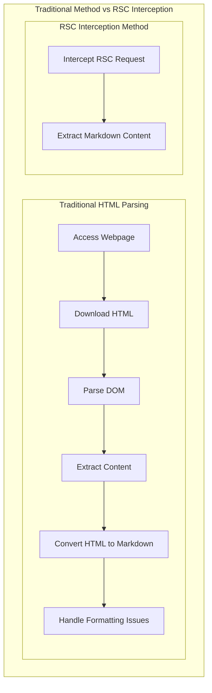

# deepwiki-get

Convert the deepwiki site to md files.

## 📖 RSC Interception Principle

### Technical Background

DeepWiki is built with Next.js and adopts React Server Components (RSC) technology. Traditional web crawlers need to parse complex HTML structures, while the RSC responses already contain the complete Markdown content.
Interception Process



---

## 🚀 Instructions for Use

### Install Dependencies

```bash
# Install Python dependencies uv sync
# Install Playwright Browser python -m playwright install chromium
```

### Basic Usage

```bash
python -m src.interface.cli wiki \
"https://deepwiki.com/username/repository" \
--o "/path/to/output"
```

---

## 🤝 Contribution Guide

1. Fork this repository.
2. Create a feature branch (`git checkout -b feature/amazing-feature`).
3. Commit your changes (`git commit -m 'Add some amazing feature'`).
4. Push to the branch (`git push origin feature/amazing-feature`).
5. Open a Pull Request.
