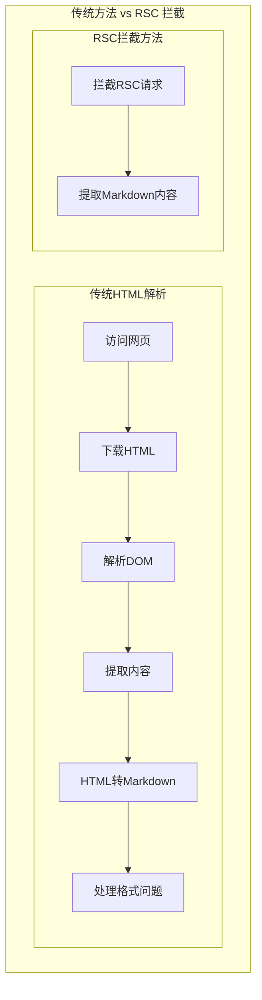

# deepwiki-get

**将deepwiki站点转换为md文件。**

deepwiki-get 是一个高效的 DeepWiki 内容提取工具，通过拦截 Next.js React Server Components (RSC) 请求来直接获取 Markdown 内容，避免了传统 HTML 解析的复杂性和性能开销。

---

## 📖 RSC 拦截原理

### 技术背景

DeepWiki 使用 Next.js 构建，采用 React Server Components (RSC) 技术。传统的网页爬虫需要解析复杂的 HTML 结构，而 RSC 响应中已经包含了完整的 Markdown 内容。

### 拦截流程



---

## 🚀 使用说明

### 安装依赖

```bash
# 安装 Python 依赖
uv sync
# 安装 Playwright 浏览器
python -m playwright install chromium
```

### 基本用法

```bash
python -m src.interface.cli wiki \
	"https://deepwiki.com/username/repository" \
	--o "/path/to/output"
```

### 参数说明

| 参数       | 类型   | 必需 | 说明              |
| ---------- | ------ | ---- | ----------------- |
| `--url`    | string | ✅   | DeepWiki 仓库 URL |
| `--output` | string | ✅   | 输出目录路径      |

---

## 🤝 贡献指南

1. Fork 本仓库
2. 创建功能分支 (`git checkout -b feature/amazing-feature`)
3. 提交更改 (`git commit -m 'Add some amazing feature'`)
4. 推送到分支 (`git push origin feature/amazing-feature`)
5. 开启 Pull Request
