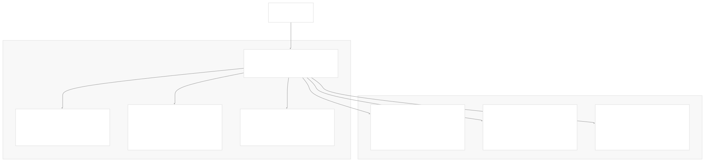
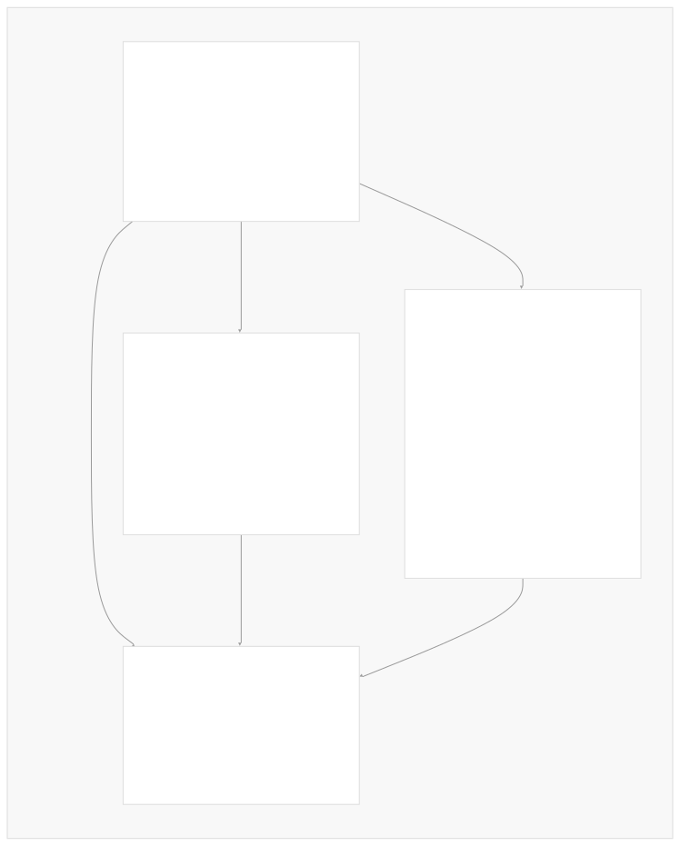
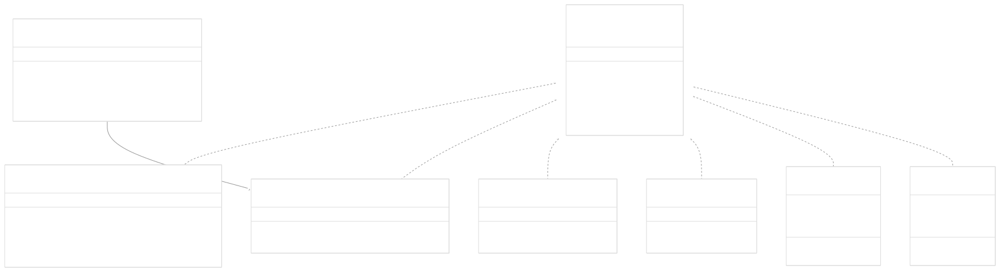
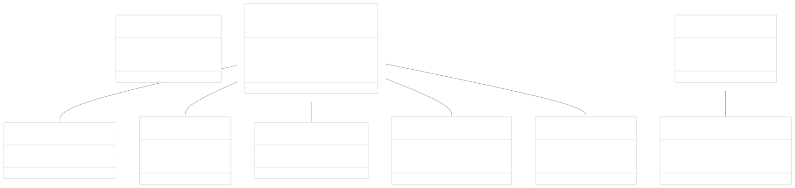
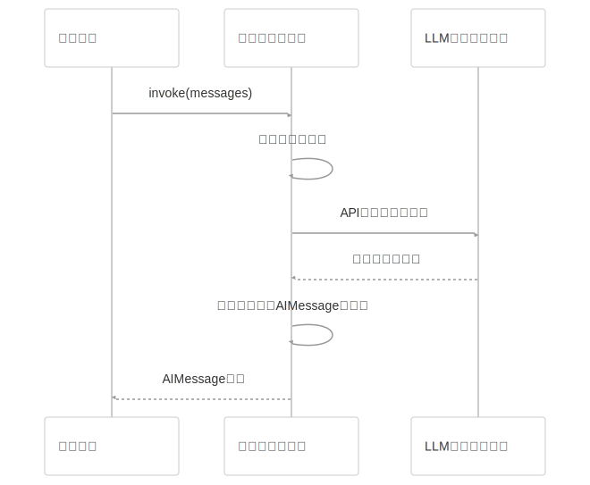
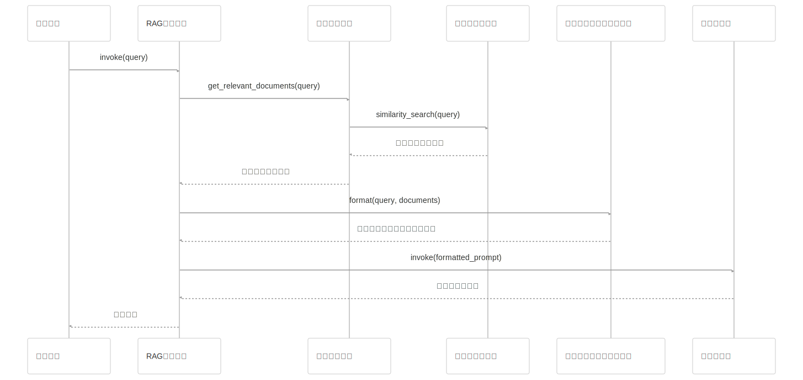
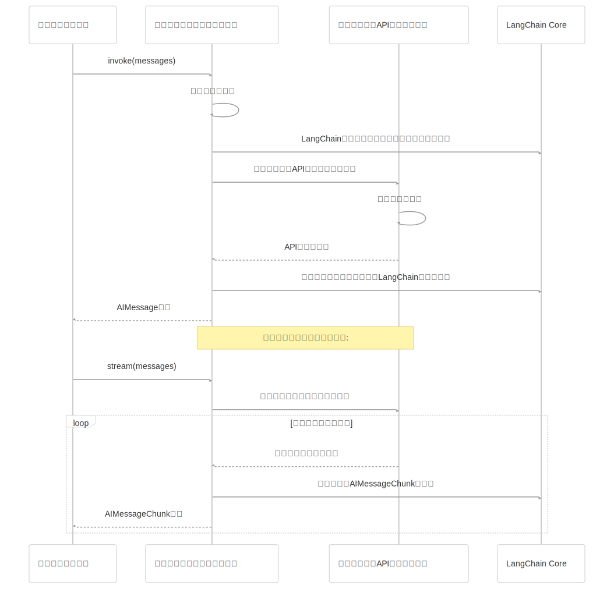
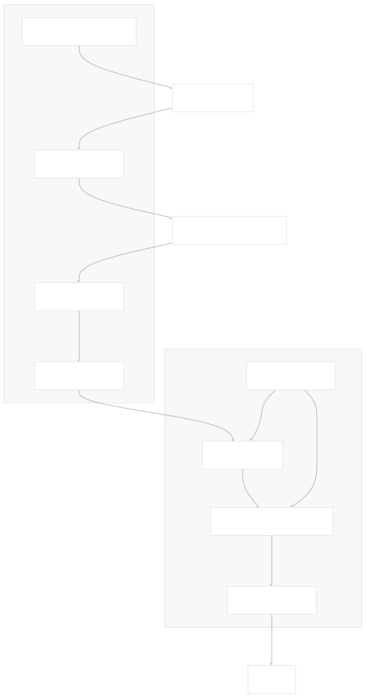

# Query

> c4モデル、データモデル、シーケンス図 を図解して

# Answer

LangChainのアーキテクチャを図解するために、C4モデル、データモデル、シーケンス図を作成します。

## C4モデル図

C4モデルはシステムアーキテクチャを表現するための4つのレベル（コンテキスト、コンテナ、コンポーネント、コード）で構成されています。LangChainのC4モデルを以下に示します。

### コンテキストレベル（システム全体の概要）

### コンテナレベル（主要パッケージ構成）

### コンポーネントレベル（主要コンポーネント）

## データモデル

LangChainの主要なデータモデルを図解します。

## シーケンス図

LangChainの主要なシーケンス図を以下に示します。

### 基本的なLLM呼び出しシーケンス

### RAG（検索拡張生成）シーケンス

### ツール呼び出しを含むエージェントシーケンス

### プロバイダー統合パターン

## LCEL（LangChain Expression Language）パイプライン

## RAG（検索拡張生成）アーキテクチャ

# Notes

この回答では、LangChainフレームワークのアーキテクチャを、C4モデル（コンテキスト、コンテナ、コンポーネント）、データモデル、およびシーケンス図を使って図解しました。C4モデルではLangChainのエコシステム全体から主要パッケージ、コンポーネントまでの階層構造を示しました。データモデルではDocument、Message、Generationなどの主要なデータ構造を示しました。シーケンス図では基本的なLLM呼び出し、RAG、エージェント、プロバイダー統合のフローを示しました。また、LCELパイプラインとRAGアーキテクチャの図も追加しました。

Wiki pages you might want to explore:

* [LangChain Overview (langchain-ai/langchain)](/langchain-ai/langchain/1-langchain-overview)
* [Provider Integrations (langchain-ai/langchain)](/langchain-ai/langchain/3-provider-integrations)
