# LangChain Overview

[Powered by Devin](https://devin.ai)

[DeepWiki](https://deepwiki.com)

[DeepWiki](/)

[langchain-ai/langchain](https://github.com/langchain-ai/langchain)

[powered by

Devin](https://devin.ai)Share

Last indexed: 17 April 2025 ([b36c2b](https://github.com/langchain-ai/langchain/commits/b36c2bf8))

* [LangChain Overview](/langchain-ai/langchain/1-langchain-overview)
* [Core Architecture](/langchain-ai/langchain/2-core-architecture)
* [Package Structure](/langchain-ai/langchain/2.1-package-structure)
* [Runnable Interface & LCEL](/langchain-ai/langchain/2.2-runnable-interface-and-lcel)
* [Message System](/langchain-ai/langchain/2.3-message-system)
* [Provider Integrations](/langchain-ai/langchain/3-provider-integrations)
* [Model Interfaces](/langchain-ai/langchain/3.1-model-interfaces)
* [Provider-Specific Implementations](/langchain-ai/langchain/3.2-provider-specific-implementations)
* [Retrieval and Vector Stores](/langchain-ai/langchain/4-retrieval-and-vector-stores)
* [Chains and Agents](/langchain-ai/langchain/5-chains-and-agents)
* [Chain Types and Implementation](/langchain-ai/langchain/5.1-chain-types-and-implementation)
* [Agent System](/langchain-ai/langchain/5.2-agent-system)
* [Tools and Evaluation](/langchain-ai/langchain/6-tools-and-evaluation)
* [Tool System](/langchain-ai/langchain/6.1-tool-system)
* [Evaluation and Testing](/langchain-ai/langchain/6.2-evaluation-and-testing)
* [Developer Tools](/langchain-ai/langchain/7-developer-tools)
* [CLI and Templates](/langchain-ai/langchain/7.1-cli-and-templates)
* [CI/CD and Release Process](/langchain-ai/langchain/7.2-cicd-and-release-process)
* [Documentation System](/langchain-ai/langchain/8-documentation-system)
* [User Documentation](/langchain-ai/langchain/8.1-user-documentation)
* [API Reference Generation](/langchain-ai/langchain/8.2-api-reference-generation)

Menu

# LangChain Overview

Relevant source files

* [README.md](https://github.com/langchain-ai/langchain/blob/b36c2bf8/README.md)
* [cookbook/openai\_v1\_cookbook.ipynb](https://github.com/langchain-ai/langchain/blob/b36c2bf8/cookbook/openai_v1_cookbook.ipynb)
* [docs/docs/how\_to/installation.mdx](https://github.com/langchain-ai/langchain/blob/b36c2bf8/docs/docs/how_to/installation.mdx)
* [docs/docs/introduction.mdx](https://github.com/langchain-ai/langchain/blob/b36c2bf8/docs/docs/introduction.mdx)
* [docs/static/img/ecosystem\_packages.png](https://github.com/langchain-ai/langchain/blob/b36c2bf8/docs/static/img/ecosystem_packages.png)
* [docs/static/img/langchain\_stack.png](https://github.com/langchain-ai/langchain/blob/b36c2bf8/docs/static/img/langchain_stack.png)
* [docs/static/svg/langchain\_stack.svg](https://github.com/langchain-ai/langchain/blob/b36c2bf8/docs/static/svg/langchain_stack.svg)
* [docs/static/svg/langchain\_stack\_062024.svg](https://github.com/langchain-ai/langchain/blob/b36c2bf8/docs/static/svg/langchain_stack_062024.svg)
* [docs/static/svg/langchain\_stack\_062024\_dark.svg](https://github.com/langchain-ai/langchain/blob/b36c2bf8/docs/static/svg/langchain_stack_062024_dark.svg)
* [docs/static/svg/langchain\_stack\_112024.svg](https://github.com/langchain-ai/langchain/blob/b36c2bf8/docs/static/svg/langchain_stack_112024.svg)
* [docs/static/svg/langchain\_stack\_112024\_dark.svg](https://github.com/langchain-ai/langchain/blob/b36c2bf8/docs/static/svg/langchain_stack_112024_dark.svg)
* [docs/static/svg/langchain\_stack\_dark.svg](https://github.com/langchain-ai/langchain/blob/b36c2bf8/docs/static/svg/langchain_stack_dark.svg)
* [libs/community/README.md](https://github.com/langchain-ai/langchain/blob/b36c2bf8/libs/community/README.md)
* [libs/core/README.md](https://github.com/langchain-ai/langchain/blob/b36c2bf8/libs/core/README.md)

LangChain is a framework for developing applications powered by large language models (LLMs). It provides a standardized interface for interacting with various LLM providers and related technologies, along with composable components for building complex LLM-powered applications.

This overview introduces the LangChain repository's core architecture, key components, and how they work together to enable rapid development of LLM applications. For information about specific integrations, see [Provider Integrations](/langchain-ai/langchain/3-provider-integrations), and for detailed explanations of chains and agents, see [Chains and Agents](/langchain-ai/langchain/5-chains-and-agents).

## Core Purpose and Value Proposition

LangChain helps developers build applications powered by LLMs through several key capabilities:

* **Model Interoperability**: A standard interface for language models and embeddings that allows easy switching between providers
* **Composability**: A system for connecting components together using the LangChain Expression Language (LCEL)
* **Real-time Data Augmentation**: Easily connect LLMs to external data sources and tools
* **Agent Creation**: Build autonomous agents that can use tools and make decisions



Sources: [README.md25-53](https://github.com/langchain-ai/langchain/blob/b36c2bf8/README.md#L25-L53) [docs/docs/introduction.mdx8-14](https://github.com/langchain-ai/langchain/blob/b36c2bf8/docs/docs/introduction.mdx#L8-L14)

## Architecture Overview

LangChain follows a modular architecture with clearly separated responsibilities across its packages. This architecture enables easy extension and integration with various providers while maintaining a consistent interface.

### Package Structure

The LangChain ecosystem consists of multiple packages, each with a specific role:



* **langchain-core**: Contains the base abstractions, interfaces, and the LangChain Expression Language (LCEL) runtime
* **langchain**: Provides high-level chains, agents, and retrieval strategies
* **langchain-community**: Houses third-party integrations maintained by the community
* **Provider packages**: Individual packages for major LLM providers (OpenAI, Anthropic, etc.)
* **Additional tools**: LangGraph (agent orchestration), LangSmith (debugging/evaluation), LangServe (deployment)

Sources: [README.md54-74](https://github.com/langchain-ai/langchain/blob/b36c2bf8/README.md#L54-L74) [docs/docs/introduction.mdx48-57](https://github.com/langchain-ai/langchain/blob/b36c2bf8/docs/docs/introduction.mdx#L48-L57) [libs/core/README.md1-21](https://github.com/langchain-ai/langchain/blob/b36c2bf8/libs/core/README.md#L1-L21) [libs/community/README.md1-16](https://github.com/langchain-ai/langchain/blob/b36c2bf8/libs/community/README.md#L1-L16) [docs/docs/how\_to/installation.mdx28-41](https://github.com/langchain-ai/langchain/blob/b36c2bf8/docs/docs/how_to/installation.mdx#L28-L41)

### Runnable Interface and LCEL

The Runnable interface is the cornerstone of LangChain's design, enabling standardized interaction with all components and enabling composition through the LangChain Expression Language (LCEL).



The Runnable interface defines methods like `invoke()`, `stream()`, and `batch()` that all components implement, enabling:

* **Consistent Usage**: All components can be used with the same methods
* **Automatic Streaming**: Stream tokens from any component in a chain
* **Parallelization**: Run batch operations in parallel
* **Async Support**: Async versions of all methods (`ainvoke()`, etc.)
* **Composition**: Chain components together using pipe syntax (e.g., `prompt | model | output_parser`)

Sources: [libs/core/README.md22-53](https://github.com/langchain-ai/langchain/blob/b36c2bf8/libs/core/README.md#L22-L53) [docs/docs/introduction.mdx29-32](https://github.com/langchain-ai/langchain/blob/b36c2bf8/docs/docs/introduction.mdx#L29-L32)

## Core Components

### Model Interfaces

LangChain provides two primary interfaces for language models:

1. **BaseLLM**: For completion-style language models
2. **BaseChatModel**: For chat-style models that work with messages

These interfaces are implemented by various provider-specific classes, enabling a standardized approach to working with any LLM provider.



All model interfaces implement the Runnable protocol, allowing them to be easily composed with other components.

Sources: [cookbook/openai\_v1\_cookbook.ipynb31-33](https://github.com/langchain-ai/langchain/blob/b36c2bf8/cookbook/openai_v1_cookbook.ipynb#L31-L33) [docs/docs/introduction.mdx39-40](https://github.com/langchain-ai/langchain/blob/b36c2bf8/docs/docs/introduction.mdx#L39-L40)

### Retrieval Systems

LangChain provides a comprehensive retrieval system for implementing Retrieval Augmented Generation (RAG) patterns:



Key components include:

* **Document Loaders**: Load documents from various sources (PDF, web, databases)
* **Text Splitters**: Chunk documents into manageable pieces
* **Embedding Models**: Convert text to vector embeddings
* **Vector Stores**: Store and retrieve documents based on vector similarity
* **Retrievers**: Interface for retrieving relevant documents for a query

Sources: [docs/docs/introduction.mdx92-95](https://github.com/langchain-ai/langchain/blob/b36c2bf8/docs/docs/introduction.mdx#L92-L95)

### Chains and Agents

Chains and agents are higher-level abstractions for creating complex LLM workflows:


* **Chains**: Combine multiple components in a predetermined sequence
* **Agents**: Dynamic systems that use LLMs to determine which actions to take
* **Tools**: Capabilities that agents can use to interact with external systems

Sources: [docs/docs/introduction.mdx68-71](https://github.com/langchain-ai/langchain/blob/b36c2bf8/docs/docs/introduction.mdx#L68-L71) [cookbook/openai\_v1\_cookbook.ipynb87-95](https://github.com/langchain-ai/langchain/blob/b36c2bf8/cookbook/openai_v1_cookbook.ipynb#L87-L95)

## The LangChain Ecosystem

LangChain integrates with a broader ecosystem of tools for development, evaluation, and deployment:



* **LangSmith**: Platform for debugging, monitoring, and evaluating LLM applications
* **LangGraph**: Framework for building stateful agents with memory and human-in-the-loop features
* **LangServe**: Tool for deploying LangChain applications as REST APIs

Sources: [README.md54-74](https://github.com/langchain-ai/langchain/blob/b36c2bf8/README.md#L54-L74) [docs/docs/introduction.mdx103-109](https://github.com/langchain-ai/langchain/blob/b36c2bf8/docs/docs/introduction.mdx#L103-L109)

## Installation and Getting Started

LangChain's modular design allows you to install only the components you need:

```
# Core LangChain package (includes main functionality)
pip install langchain

# Core abstractions only
pip install langchain-core

# For specific provider integrations
pip install langchain-openai

# Community integrations
pip install langchain-community

# Additional tools
pip install langgraph
pip install langserve
```

The LangChain ecosystem is designed to be used incrementally, allowing you to start with just the core components and add additional functionality as needed.

Sources: [docs/docs/how\_to/installation.mdx12-23](https://github.com/langchain-ai/langchain/blob/b36c2bf8/docs/docs/how_to/installation.mdx#L12-L23) [docs/docs/how\_to/installation.mdx42-65](https://github.com/langchain-ai/langchain/blob/b36c2bf8/docs/docs/how_to/installation.mdx#L42-L65)

## LangChain Expression Language (LCEL)

LCEL is a declarative language for composing LangChain components, enabling intuitive construction of complex pipelines:

LCEL provides several advantages:

* **Automatic parallelization** of independent steps
* **Seamless streaming** of outputs through the pipeline
* **First-class tracing** of each step's inputs and outputs
* **Built-in retries and fallbacks** for error handling

Example LCEL pattern for a basic LLM application:

```
prompt | model | output_parser

```

For more complex applications like RAG:

```
(retriever | format_docs) + question | prompt | model | output_parser

```

Sources: [libs/core/README.md48-53](https://github.com/langchain-ai/langchain/blob/b36c2bf8/libs/core/README.md#L48-L53) [docs/docs/introduction.mdx29-32](https://github.com/langchain-ai/langchain/blob/b36c2bf8/docs/docs/introduction.mdx#L29-L32)

## Summary

LangChain provides a flexible, modular framework for building LLM-powered applications. Its core value comes from:

1. **Standardized interfaces** for interacting with LLMs and related technologies
2. **Composable components** that can be easily combined using LCEL
3. **Rich ecosystem** of integrations with external data sources and tools
4. **High-level abstractions** like chains and agents for complex workflows
5. **Complementary tools** like LangGraph, LangSmith, and LangServe for building, debugging, and deploying applications

This modular design makes LangChain adaptable to a wide range of use cases, from simple question-answering systems to complex autonomous agents.

Sources: [README.md25-53](https://github.com/langchain-ai/langchain/blob/b36c2bf8/README.md#L25-L53) [docs/docs/introduction.mdx8-14](https://github.com/langchain-ai/langchain/blob/b36c2bf8/docs/docs/introduction.mdx#L8-L14)

Auto-refresh not enabled yet

Try DeepWiki on your private codebase with [Devin](/private-repo)

### On this page

* [LangChain Overview](#langchain-overview)
* [Core Purpose and Value Proposition](#core-purpose-and-value-proposition)
* [Architecture Overview](#architecture-overview)
* [Package Structure](#package-structure)
* [Runnable Interface and LCEL](#runnable-interface-and-lcel)
* [Core Components](#core-components)
* [Model Interfaces](#model-interfaces)
* [Retrieval Systems](#retrieval-systems)
* [Chains and Agents](#chains-and-agents)
* [The LangChain Ecosystem](#the-langchain-ecosystem)
* [Installation and Getting Started](#installation-and-getting-started)
* [LangChain Expression Language (LCEL)](#langchain-expression-language-lcel)
* [Summary](#summary)

Ask Devin about langchain-ai/langchain

Deep Research

Syntax error in textmermaid version 11.6.0