# Chains and Agents

[Powered by Devin](https://devin.ai)

[DeepWiki](https://deepwiki.com)

[DeepWiki](/)

[langchain-ai/langchain](https://github.com/langchain-ai/langchain)

[powered by

Devin](https://devin.ai)Share

Last indexed: 17 April 2025 ([b36c2b](https://github.com/langchain-ai/langchain/commits/b36c2bf8))

* [LangChain Overview](/langchain-ai/langchain/1-langchain-overview)
* [Core Architecture](/langchain-ai/langchain/2-core-architecture)
* [Package Structure](/langchain-ai/langchain/2.1-package-structure)
* [Runnable Interface & LCEL](/langchain-ai/langchain/2.2-runnable-interface-and-lcel)
* [Message System](/langchain-ai/langchain/2.3-message-system)
* [Provider Integrations](/langchain-ai/langchain/3-provider-integrations)
* [Model Interfaces](/langchain-ai/langchain/3.1-model-interfaces)
* [Provider-Specific Implementations](/langchain-ai/langchain/3.2-provider-specific-implementations)
* [Retrieval and Vector Stores](/langchain-ai/langchain/4-retrieval-and-vector-stores)
* [Chains and Agents](/langchain-ai/langchain/5-chains-and-agents)
* [Chain Types and Implementation](/langchain-ai/langchain/5.1-chain-types-and-implementation)
* [Agent System](/langchain-ai/langchain/5.2-agent-system)
* [Tools and Evaluation](/langchain-ai/langchain/6-tools-and-evaluation)
* [Tool System](/langchain-ai/langchain/6.1-tool-system)
* [Evaluation and Testing](/langchain-ai/langchain/6.2-evaluation-and-testing)
* [Developer Tools](/langchain-ai/langchain/7-developer-tools)
* [CLI and Templates](/langchain-ai/langchain/7.1-cli-and-templates)
* [CI/CD and Release Process](/langchain-ai/langchain/7.2-cicd-and-release-process)
* [Documentation System](/langchain-ai/langchain/8-documentation-system)
* [User Documentation](/langchain-ai/langchain/8.1-user-documentation)
* [API Reference Generation](/langchain-ai/langchain/8.2-api-reference-generation)

Menu

# Chains and Agents

Relevant source files

* [docs/cassettes/llm\_chain\_1b2481f0.msgpack.zlib](https://github.com/langchain-ai/langchain/blob/b36c2bf8/docs/cassettes/llm_chain_1b2481f0.msgpack.zlib)
* [docs/cassettes/llm\_chain\_3e45595a.msgpack.zlib](https://github.com/langchain-ai/langchain/blob/b36c2bf8/docs/cassettes/llm_chain_3e45595a.msgpack.zlib)
* [docs/docs/concepts/streaming.mdx](https://github.com/langchain-ai/langchain/blob/b36c2bf8/docs/docs/concepts/streaming.mdx)
* [docs/docs/example\_data/nke-10k-2023.pdf](https://github.com/langchain-ai/langchain/blob/b36c2bf8/docs/docs/example_data/nke-10k-2023.pdf)
* [docs/docs/how\_to/agent\_executor.ipynb](https://github.com/langchain-ai/langchain/blob/b36c2bf8/docs/docs/how_to/agent_executor.ipynb)
* [docs/docs/how\_to/chat\_models\_universal\_init.ipynb](https://github.com/langchain-ai/langchain/blob/b36c2bf8/docs/docs/how_to/chat_models_universal_init.ipynb)
* [docs/docs/how\_to/chat\_streaming.ipynb](https://github.com/langchain-ai/langchain/blob/b36c2bf8/docs/docs/how_to/chat_streaming.ipynb)
* [docs/docs/how\_to/configure.ipynb](https://github.com/langchain-ai/langchain/blob/b36c2bf8/docs/docs/how_to/configure.ipynb)
* [docs/docs/how\_to/convert\_runnable\_to\_tool.ipynb](https://github.com/langchain-ai/langchain/blob/b36c2bf8/docs/docs/how_to/convert_runnable_to_tool.ipynb)
* [docs/docs/how\_to/custom\_tools.ipynb](https://github.com/langchain-ai/langchain/blob/b36c2bf8/docs/docs/how_to/custom_tools.ipynb)
* [docs/docs/how\_to/example\_selectors\_langsmith.ipynb](https://github.com/langchain-ai/langchain/blob/b36c2bf8/docs/docs/how_to/example_selectors_langsmith.ipynb)
* [docs/docs/how\_to/extraction\_examples.ipynb](https://github.com/langchain-ai/langchain/blob/b36c2bf8/docs/docs/how_to/extraction_examples.ipynb)
* [docs/docs/how\_to/extraction\_long\_text.ipynb](https://github.com/langchain-ai/langchain/blob/b36c2bf8/docs/docs/how_to/extraction_long_text.ipynb)
* [docs/docs/how\_to/few\_shot\_examples.ipynb](https://github.com/langchain-ai/langchain/blob/b36c2bf8/docs/docs/how_to/few_shot_examples.ipynb)
* [docs/docs/how\_to/few\_shot\_examples\_chat.ipynb](https://github.com/langchain-ai/langchain/blob/b36c2bf8/docs/docs/how_to/few_shot_examples_chat.ipynb)
* [docs/docs/how\_to/function\_calling.ipynb](https://github.com/langchain-ai/langchain/blob/b36c2bf8/docs/docs/how_to/function_calling.ipynb)
* [docs/docs/how\_to/index.mdx](https://github.com/langchain-ai/langchain/blob/b36c2bf8/docs/docs/how_to/index.mdx)
* [docs/docs/how\_to/parent\_document\_retriever.ipynb](https://github.com/langchain-ai/langchain/blob/b36c2bf8/docs/docs/how_to/parent_document_retriever.ipynb)
* [docs/docs/how\_to/paul\_graham\_essay.txt](https://github.com/langchain-ai/langchain/blob/b36c2bf8/docs/docs/how_to/paul_graham_essay.txt)
* [docs/docs/how\_to/qa\_chat\_history\_how\_to.ipynb](https://github.com/langchain-ai/langchain/blob/b36c2bf8/docs/docs/how_to/qa_chat_history_how_to.ipynb)
* [docs/docs/how\_to/qa\_sources.ipynb](https://github.com/langchain-ai/langchain/blob/b36c2bf8/docs/docs/how_to/qa_sources.ipynb)
* [docs/docs/how\_to/qa\_streaming.ipynb](https://github.com/langchain-ai/langchain/blob/b36c2bf8/docs/docs/how_to/qa_streaming.ipynb)
* [docs/docs/how\_to/structured\_output.ipynb](https://github.com/langchain-ai/langchain/blob/b36c2bf8/docs/docs/how_to/structured_output.ipynb)
* [docs/docs/how\_to/tool\_artifacts.ipynb](https://github.com/langchain-ai/langchain/blob/b36c2bf8/docs/docs/how_to/tool_artifacts.ipynb)
* [docs/docs/how\_to/tool\_calling.ipynb](https://github.com/langchain-ai/langchain/blob/b36c2bf8/docs/docs/how_to/tool_calling.ipynb)
* [docs/docs/how\_to/tool\_calling\_parallel.ipynb](https://github.com/langchain-ai/langchain/blob/b36c2bf8/docs/docs/how_to/tool_calling_parallel.ipynb)
* [docs/docs/how\_to/tool\_choice.ipynb](https://github.com/langchain-ai/langchain/blob/b36c2bf8/docs/docs/how_to/tool_choice.ipynb)
* [docs/docs/how\_to/tool\_configure.ipynb](https://github.com/langchain-ai/langchain/blob/b36c2bf8/docs/docs/how_to/tool_configure.ipynb)
* [docs/docs/how\_to/tool\_results\_pass\_to\_model.ipynb](https://github.com/langchain-ai/langchain/blob/b36c2bf8/docs/docs/how_to/tool_results_pass_to_model.ipynb)
* [docs/docs/how\_to/tool\_runtime.ipynb](https://github.com/langchain-ai/langchain/blob/b36c2bf8/docs/docs/how_to/tool_runtime.ipynb)
* [docs/docs/how\_to/tool\_stream\_events.ipynb](https://github.com/langchain-ai/langchain/blob/b36c2bf8/docs/docs/how_to/tool_stream_events.ipynb)
* [docs/docs/how\_to/tools\_prompting.ipynb](https://github.com/langchain-ai/langchain/blob/b36c2bf8/docs/docs/how_to/tools_prompting.ipynb)
* [docs/docs/integrations/document\_loaders/image\_captions.ipynb](https://github.com/langchain-ai/langchain/blob/b36c2bf8/docs/docs/integrations/document_loaders/image_captions.ipynb)
* [docs/docs/integrations/document\_transformers/google\_cloud\_vertexai\_rerank.ipynb](https://github.com/langchain-ai/langchain/blob/b36c2bf8/docs/docs/integrations/document_transformers/google_cloud_vertexai_rerank.ipynb)
* [docs/docs/tutorials/agents.ipynb](https://github.com/langchain-ai/langchain/blob/b36c2bf8/docs/docs/tutorials/agents.ipynb)
* [docs/docs/tutorials/chatbot.ipynb](https://github.com/langchain-ai/langchain/blob/b36c2bf8/docs/docs/tutorials/chatbot.ipynb)
* [docs/docs/tutorials/extraction.ipynb](https://github.com/langchain-ai/langchain/blob/b36c2bf8/docs/docs/tutorials/extraction.ipynb)
* [docs/docs/tutorials/index.mdx](https://github.com/langchain-ai/langchain/blob/b36c2bf8/docs/docs/tutorials/index.mdx)
* [docs/docs/tutorials/llm\_chain.ipynb](https://github.com/langchain-ai/langchain/blob/b36c2bf8/docs/docs/tutorials/llm_chain.ipynb)
* [docs/docs/tutorials/qa\_chat\_history.ipynb](https://github.com/langchain-ai/langchain/blob/b36c2bf8/docs/docs/tutorials/qa_chat_history.ipynb)
* [docs/docs/tutorials/rag.ipynb](https://github.com/langchain-ai/langchain/blob/b36c2bf8/docs/docs/tutorials/rag.ipynb)
* [docs/docs/tutorials/retrievers.ipynb](https://github.com/langchain-ai/langchain/blob/b36c2bf8/docs/docs/tutorials/retrievers.ipynb)
* [docs/docs/tutorials/sql\_qa.ipynb](https://github.com/langchain-ai/langchain/blob/b36c2bf8/docs/docs/tutorials/sql_qa.ipynb)
* [docs/docs/tutorials/summarization.ipynb](https://github.com/langchain-ai/langchain/blob/b36c2bf8/docs/docs/tutorials/summarization.ipynb)
* [docs/static/img/langsmith\_evaluate.png](https://github.com/langchain-ai/langchain/blob/b36c2bf8/docs/static/img/langsmith_evaluate.png)
* [libs/langchain/extended\_testing\_deps.txt](https://github.com/langchain-ai/langchain/blob/b36c2bf8/libs/langchain/extended_testing_deps.txt)
* [libs/langchain/langchain/callbacks/tracers/root\_listeners.py](https://github.com/langchain-ai/langchain/blob/b36c2bf8/libs/langchain/langchain/callbacks/tracers/root_listeners.py)
* [libs/langchain/langchain/chains/base.py](https://github.com/langchain-ai/langchain/blob/b36c2bf8/libs/langchain/langchain/chains/base.py)
* [libs/langchain/langchain/chains/combine\_documents/base.py](https://github.com/langchain-ai/langchain/blob/b36c2bf8/libs/langchain/langchain/chains/combine_documents/base.py)
* [libs/langchain/langchain/chains/combine\_documents/map\_reduce.py](https://github.com/langchain-ai/langchain/blob/b36c2bf8/libs/langchain/langchain/chains/combine_documents/map_reduce.py)
* [libs/langchain/langchain/chains/combine\_documents/map\_rerank.py](https://github.com/langchain-ai/langchain/blob/b36c2bf8/libs/langchain/langchain/chains/combine_documents/map_rerank.py)
* [libs/langchain/langchain/chat\_models/base.py](https://github.com/langchain-ai/langchain/blob/b36c2bf8/libs/langchain/langchain/chat_models/base.py)
* [libs/langchain/langchain/llms/base.py](https://github.com/langchain-ai/langchain/blob/b36c2bf8/libs/langchain/langchain/llms/base.py)
* [libs/langchain/langchain/runnables/hub.py](https://github.com/langchain-ai/langchain/blob/b36c2bf8/libs/langchain/langchain/runnables/hub.py)
* [libs/langchain/langchain/schema/prompt\_template.py](https://github.com/langchain-ai/langchain/blob/b36c2bf8/libs/langchain/langchain/schema/prompt_template.py)
* [libs/langchain/langchain/schema/retriever.py](https://github.com/langchain-ai/langchain/blob/b36c2bf8/libs/langchain/langchain/schema/retriever.py)
* [libs/langchain/langchain/schema/runnable/\_\_init\_\_.py](https://github.com/langchain-ai/langchain/blob/b36c2bf8/libs/langchain/langchain/schema/runnable/__init__.py)
* [libs/langchain/langchain/schema/runnable/base.py](https://github.com/langchain-ai/langchain/blob/b36c2bf8/libs/langchain/langchain/schema/runnable/base.py)
* [libs/langchain/langchain/schema/runnable/branch.py](https://github.com/langchain-ai/langchain/blob/b36c2bf8/libs/langchain/langchain/schema/runnable/branch.py)
* [libs/langchain/langchain/schema/runnable/config.py](https://github.com/langchain-ai/langchain/blob/b36c2bf8/libs/langchain/langchain/schema/runnable/config.py)
* [libs/langchain/langchain/schema/runnable/configurable.py](https://github.com/langchain-ai/langchain/blob/b36c2bf8/libs/langchain/langchain/schema/runnable/configurable.py)
* [libs/langchain/langchain/schema/runnable/fallbacks.py](https://github.com/langchain-ai/langchain/blob/b36c2bf8/libs/langchain/langchain/schema/runnable/fallbacks.py)
* [libs/langchain/langchain/schema/runnable/passthrough.py](https://github.com/langchain-ai/langchain/blob/b36c2bf8/libs/langchain/langchain/schema/runnable/passthrough.py)
* [libs/langchain/langchain/schema/runnable/retry.py](https://github.com/langchain-ai/langchain/blob/b36c2bf8/libs/langchain/langchain/schema/runnable/retry.py)
* [libs/langchain/langchain/schema/runnable/router.py](https://github.com/langchain-ai/langchain/blob/b36c2bf8/libs/langchain/langchain/schema/runnable/router.py)
* [libs/langchain/langchain/schema/runnable/utils.py](https://github.com/langchain-ai/langchain/blob/b36c2bf8/libs/langchain/langchain/schema/runnable/utils.py)
* [libs/langchain/langchain/tools/base.py](https://github.com/langchain-ai/langchain/blob/b36c2bf8/libs/langchain/langchain/tools/base.py)
* [libs/langchain/tests/integration\_tests/chat\_models/\_\_init\_\_.py](https://github.com/langchain-ai/langchain/blob/b36c2bf8/libs/langchain/tests/integration_tests/chat_models/__init__.py)
* [libs/langchain/tests/integration\_tests/chat\_models/test\_base.py](https://github.com/langchain-ai/langchain/blob/b36c2bf8/libs/langchain/tests/integration_tests/chat_models/test_base.py)
* [libs/langchain/tests/unit\_tests/chat\_models/test\_base.py](https://github.com/langchain-ai/langchain/blob/b36c2bf8/libs/langchain/tests/unit_tests/chat_models/test_base.py)
* [libs/langchain/tests/unit\_tests/runnables/test\_hub.py](https://github.com/langchain-ai/langchain/blob/b36c2bf8/libs/langchain/tests/unit_tests/runnables/test_hub.py)
* [libs/langchain/tests/unit\_tests/schema/runnable/\_\_init\_\_.py](https://github.com/langchain-ai/langchain/blob/b36c2bf8/libs/langchain/tests/unit_tests/schema/runnable/__init__.py)
* [libs/langchain/tests/unit\_tests/schema/runnable/test\_base.py](https://github.com/langchain-ai/langchain/blob/b36c2bf8/libs/langchain/tests/unit_tests/schema/runnable/test_base.py)
* [libs/langchain/tests/unit\_tests/schema/runnable/test\_config.py](https://github.com/langchain-ai/langchain/blob/b36c2bf8/libs/langchain/tests/unit_tests/schema/runnable/test_config.py)
* [libs/langchain/tests/unit\_tests/schema/runnable/test\_retry.py](https://github.com/langchain-ai/langchain/blob/b36c2bf8/libs/langchain/tests/unit_tests/schema/runnable/test_retry.py)
* [libs/langchain/tests/unit\_tests/schema/runnable/test\_utils.py](https://github.com/langchain-ai/langchain/blob/b36c2bf8/libs/langchain/tests/unit_tests/schema/runnable/test_utils.py)

Chains and Agents are two core abstractions in LangChain for composing language models and other components into powerful applications. While both use language models, they represent different approaches to solving problems:

* **Chains** are structured sequences of calls to components (LLMs, retrievers, tools, etc.) with predefined execution flows
* **Agents** are more flexible systems that use LLMs as reasoning engines to determine which actions to take dynamically

This document covers the architecture and implementation of these two abstractions. For information about specific agent frameworks like LangGraph Agents, see the [Agent System](/langchain-ai/langchain/5.2-agent-system) page.

## Core Concepts

### Chains

Chains in LangChain represent a sequence of calls to components like language models, retrievers, and tools. Chains handle passing outputs from one step as inputs to the next step, and can incorporate memory to maintain state across invocations.



Sources: [libs/langchain/langchain/chains/base.py50-97](https://github.com/langchain-ai/langchain/blob/b36c2bf8/libs/langchain/langchain/chains/base.py#L50-L97) [docs/docs/tutorials/llm\_chain.ipynb18-26](https://github.com/langchain-ai/langchain/blob/b36c2bf8/docs/docs/tutorials/llm_chain.ipynb#L18-L26)

Key features of chains:

* Structured sequence of operations
* Consistent interface via the Runnable protocol
* Support for callbacks and observation
* Optional memory component for maintaining state
* Support for synchronous and asynchronous execution

### Agents

Agents are systems that use language models as reasoning engines to determine which actions to take. They can call tools and use the results to decide their next steps, creating a more dynamic and flexible system than chains.



Sources: [docs/docs/tutorials/agents.ipynb21-32](https://github.com/langchain-ai/langchain/blob/b36c2bf8/docs/docs/tutorials/agents.ipynb#L21-L32) [docs/docs/how\_to/agent\_executor.ipynb18-28](https://github.com/langchain-ai/langchain/blob/b36c2bf8/docs/docs/how_to/agent_executor.ipynb#L18-L28)

Key features of agents:

* Dynamic decision-making using LLMs
* Integration with tools
* Ability to operate in loops (perform multiple actions)
* Support for conversation history
* Can generate structured outputs

## Implementation

### The Chain Base Class

Chains in LangChain inherit from the `Chain` base class which implements the `RunnableSerializable` interface.


Sources: [libs/langchain/langchain/chains/base.py50-183](https://github.com/langchain-ai/langchain/blob/b36c2bf8/libs/langchain/langchain/chains/base.py#L50-L183)

The `Chain` class defines:

* Abstract methods like `_call()` and `_acall()` (to be implemented by subclasses)
* Methods for preparing inputs and outputs
* Integration with memory
* Methods like `invoke()`, `ainvoke()`, `run()`, etc. for executing the chain

Concrete chain implementations include:

* Prompt + LLM chains
* Retrieval chains
* QA chains
* Summarization chains

### Agent Implementation

Agents are typically implemented in two parts:

1. The agent itself (determines actions)
2. The executor (executes actions and manages the agent loop)

LangChain provides both a traditional "legacy" implementation via `AgentExecutor` and a newer approach using LangGraph.



Sources: [docs/docs/how\_to/agent\_executor.ipynb18-45](https://github.com/langchain-ai/langchain/blob/b36c2bf8/docs/docs/how_to/agent_executor.ipynb#L18-L45) [docs/docs/tutorials/agents.ipynb33-80](https://github.com/langchain-ai/langchain/blob/b36c2bf8/docs/docs/tutorials/agents.ipynb#L33-L80)

## Tools

Tools are a critical component of agent systems. They represent functions that the agent can call to interact with external systems or perform computations.



Sources: [libs/langchain/langchain/tools/base.py](https://github.com/langchain-ai/langchain/blob/b36c2bf8/libs/langchain/langchain/tools/base.py) [docs/docs/how\_to/custom\_tools.ipynb8-33](https://github.com/langchain-ai/langchain/blob/b36c2bf8/docs/docs/how_to/custom_tools.ipynb#L8-L33)

LangChain provides several ways to create tools:

1. Using the `@tool` decorator
2. Using `StructuredTool.from_function`
3. Subclassing `BaseTool`

## Integration with LCEL

Both chains and agents in LangChain are built on the LangChain Expression Language (LCEL) and the Runnable interface, making them composable with other LangChain components.



Sources: [libs/langchain/langchain/schema/runnable/base.py1-39](https://github.com/langchain-ai/langchain/blob/b36c2bf8/libs/langchain/langchain/schema/runnable/base.py#L1-L39) [docs/docs/how\_to/llm\_chain.ipynb130-132](https://github.com/langchain-ai/langchain/blob/b36c2bf8/docs/docs/how_to/llm_chain.ipynb#L130-L132)

## Common Use Cases

### Chain Use Cases

1. **Simple LLM Application**: Prompt template + model

   ```
   PromptTemplate -> LLM -> Output

   ```
2. **Retrieval Augmented Generation (RAG)**:

   ```
   Input -> Retriever -> Documents -> Prompt -> LLM -> Output

   ```
3. **Summarization**:

   ```
   Documents -> TextSplitter -> Chunks -> Map(LLM) -> Combine -> Summary

   ```

Sources: [docs/docs/tutorials/llm\_chain.ipynb](https://github.com/langchain-ai/langchain/blob/b36c2bf8/docs/docs/tutorials/llm_chain.ipynb) [docs/docs/tutorials/rag.ipynb](https://github.com/langchain-ai/langchain/blob/b36c2bf8/docs/docs/tutorials/rag.ipynb) [docs/docs/tutorials/summarization.ipynb](https://github.com/langchain-ai/langchain/blob/b36c2bf8/docs/docs/tutorials/summarization.ipynb)

### Agent Use Cases

1. **QA with External Knowledge**: Using search or databases

   ```
   Query -> Agent -> [Search Tool -> Process Results]* -> Final Answer

   ```
2. **Structured Data Extraction**: Extracting specific information from text

   ```
   Text -> Agent -> [Parse Tool -> Structure]* -> Structured Data

   ```
3. **SQL Query Generation**: Generating and running SQL queries

   ```
   Question -> Agent -> [SQL Generation Tool -> Execute SQL]* -> Answer

   ```

Sources: [docs/docs/tutorials/agents.ipynb](https://github.com/langchain-ai/langchain/blob/b36c2bf8/docs/docs/tutorials/agents.ipynb) [docs/docs/tutorials/sql\_qa.ipynb](https://github.com/langchain-ai/langchain/blob/b36c2bf8/docs/docs/tutorials/sql_qa.ipynb)

## Key Implementation Details

### Chain Implementation

All chains inherit from the base `Chain` class and implement two key methods:

* `_call`: For synchronous execution
* `_acall`: For asynchronous execution

The base `Chain` class handles input validation, memory management, callbacks, and output preparation.

```
# Common Chain pattern
class MyChain(Chain):
    prompt: BasePromptTemplate
    llm: BaseChatModel
    
    @property
    def input_keys(self) -> List[str]:
        # Return expected input keys
        
    @property
    def output_keys(self) -> List[str]:
        # Return expected output keys
        
    def _call(self, inputs: Dict[str, Any], run_manager: Optional[CallbackManagerForChainRun] = None) -> Dict[str, Any]:
        # Implement chain logic
```

Sources: [libs/langchain/langchain/chains/base.py298-320](https://github.com/langchain-ai/langchain/blob/b36c2bf8/libs/langchain/langchain/chains/base.py#L298-L320)

### Agent Implementation

Agents combine:

1. A language model (reasoning engine)
2. A set of tools
3. An execution component

```
# Common Agent pattern
model = ChatOpenAI()
search = TavilySearchResults()
tools = [search]
model_with_tools = model.bind_tools(tools)
agent_executor = create_react_agent(model, tools, memory=memory)
```

Sources: [docs/docs/tutorials/agents.ipynb45-57](https://github.com/langchain-ai/langchain/blob/b36c2bf8/docs/docs/tutorials/agents.ipynb#L45-L57)

## Differences Between Chains and Agents

| Aspect | Chains | Agents |
| --- | --- | --- |
| Decision Making | Pre-defined flow | Dynamic (LLM decides) |
| Tool Use | Optional, pre-defined | Dynamic, as needed |
| Loops | Typically don't loop | Can execute multiple actions |
| Implementation | Subclass `Chain` | Typically combine LLM with tools + executor |
| Use Cases | Structured tasks with clear steps | Complex reasoning, exploration |
| Composability | Very composable | Generally works as a standalone unit |

Sources: [docs/docs/tutorials/rag.ipynb220-240](https://github.com/langchain-ai/langchain/blob/b36c2bf8/docs/docs/tutorials/rag.ipynb#L220-L240) [docs/docs/tutorials/agents.ipynb21-32](https://github.com/langchain-ai/langchain/blob/b36c2bf8/docs/docs/tutorials/agents.ipynb#L21-L32)

## Migration and Future Directions

LangChain has two generations of agent implementations:

1. Legacy `AgentExecutor` approach
2. Newer LangGraph-based agents

For new applications, LangGraph agents are generally recommended for their flexibility and control.

Sources: [docs/docs/how\_to/agent\_executor.ipynb18-22](https://github.com/langchain-ai/langchain/blob/b36c2bf8/docs/docs/how_to/agent_executor.ipynb#L18-L22) [docs/docs/how\_to/migrate\_agent.ipynb](https://github.com/langchain-ai/langchain/blob/b36c2bf8/docs/docs/how_to/migrate_agent.ipynb)

Auto-refresh not enabled yet

Try DeepWiki on your private codebase with [Devin](/private-repo)

### On this page

* [Chains and Agents](#chains-and-agents)
* [Core Concepts](#core-concepts)
* [Chains](#chains)
* [Agents](#agents)
* [Implementation](#implementation)
* [The Chain Base Class](#the-chain-base-class)
* [Agent Implementation](#agent-implementation)
* [Tools](#tools)
* [Integration with LCEL](#integration-with-lcel)
* [Common Use Cases](#common-use-cases)
* [Chain Use Cases](#chain-use-cases)
* [Agent Use Cases](#agent-use-cases)
* [Key Implementation Details](#key-implementation-details)
* [Chain Implementation](#chain-implementation)
* [Agent Implementation](#agent-implementation-1)
* [Differences Between Chains and Agents](#differences-between-chains-and-agents)
* [Migration and Future Directions](#migration-and-future-directions)

Ask Devin about langchain-ai/langchain

Deep Research