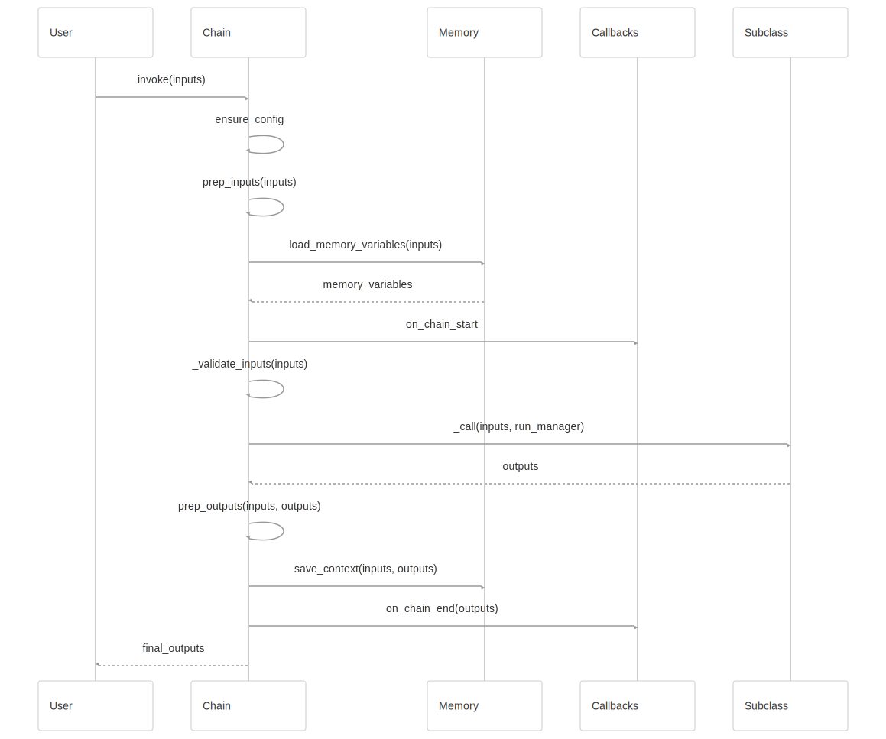

# Chain Types and Implementation

[Powered by Devin](https://devin.ai)

[DeepWiki](https://deepwiki.com)

[DeepWiki](/)

[langchain-ai/langchain](https://github.com/langchain-ai/langchain)

[powered by

Devin](https://devin.ai)Share

Last indexed: 17 April 2025 ([b36c2b](https://github.com/langchain-ai/langchain/commits/b36c2bf8))

* [LangChain Overview](/langchain-ai/langchain/1-langchain-overview)
* [Core Architecture](/langchain-ai/langchain/2-core-architecture)
* [Package Structure](/langchain-ai/langchain/2.1-package-structure)
* [Runnable Interface & LCEL](/langchain-ai/langchain/2.2-runnable-interface-and-lcel)
* [Message System](/langchain-ai/langchain/2.3-message-system)
* [Provider Integrations](/langchain-ai/langchain/3-provider-integrations)
* [Model Interfaces](/langchain-ai/langchain/3.1-model-interfaces)
* [Provider-Specific Implementations](/langchain-ai/langchain/3.2-provider-specific-implementations)
* [Retrieval and Vector Stores](/langchain-ai/langchain/4-retrieval-and-vector-stores)
* [Chains and Agents](/langchain-ai/langchain/5-chains-and-agents)
* [Chain Types and Implementation](/langchain-ai/langchain/5.1-chain-types-and-implementation)
* [Agent System](/langchain-ai/langchain/5.2-agent-system)
* [Tools and Evaluation](/langchain-ai/langchain/6-tools-and-evaluation)
* [Tool System](/langchain-ai/langchain/6.1-tool-system)
* [Evaluation and Testing](/langchain-ai/langchain/6.2-evaluation-and-testing)
* [Developer Tools](/langchain-ai/langchain/7-developer-tools)
* [CLI and Templates](/langchain-ai/langchain/7.1-cli-and-templates)
* [CI/CD and Release Process](/langchain-ai/langchain/7.2-cicd-and-release-process)
* [Documentation System](/langchain-ai/langchain/8-documentation-system)
* [User Documentation](/langchain-ai/langchain/8.1-user-documentation)
* [API Reference Generation](/langchain-ai/langchain/8.2-api-reference-generation)

Menu

# Chain Types and Implementation

Relevant source files

* [docs/cassettes/llm\_chain\_1b2481f0.msgpack.zlib](https://github.com/langchain-ai/langchain/blob/b36c2bf8/docs/cassettes/llm_chain_1b2481f0.msgpack.zlib)
* [docs/cassettes/llm\_chain\_3e45595a.msgpack.zlib](https://github.com/langchain-ai/langchain/blob/b36c2bf8/docs/cassettes/llm_chain_3e45595a.msgpack.zlib)
* [docs/docs/concepts/streaming.mdx](https://github.com/langchain-ai/langchain/blob/b36c2bf8/docs/docs/concepts/streaming.mdx)
* [docs/docs/example\_data/nke-10k-2023.pdf](https://github.com/langchain-ai/langchain/blob/b36c2bf8/docs/docs/example_data/nke-10k-2023.pdf)
* [docs/docs/how\_to/agent\_executor.ipynb](https://github.com/langchain-ai/langchain/blob/b36c2bf8/docs/docs/how_to/agent_executor.ipynb)
* [docs/docs/how\_to/chat\_models\_universal\_init.ipynb](https://github.com/langchain-ai/langchain/blob/b36c2bf8/docs/docs/how_to/chat_models_universal_init.ipynb)
* [docs/docs/how\_to/chat\_streaming.ipynb](https://github.com/langchain-ai/langchain/blob/b36c2bf8/docs/docs/how_to/chat_streaming.ipynb)
* [docs/docs/how\_to/configure.ipynb](https://github.com/langchain-ai/langchain/blob/b36c2bf8/docs/docs/how_to/configure.ipynb)
* [docs/docs/how\_to/convert\_runnable\_to\_tool.ipynb](https://github.com/langchain-ai/langchain/blob/b36c2bf8/docs/docs/how_to/convert_runnable_to_tool.ipynb)
* [docs/docs/how\_to/custom\_tools.ipynb](https://github.com/langchain-ai/langchain/blob/b36c2bf8/docs/docs/how_to/custom_tools.ipynb)
* [docs/docs/how\_to/example\_selectors\_langsmith.ipynb](https://github.com/langchain-ai/langchain/blob/b36c2bf8/docs/docs/how_to/example_selectors_langsmith.ipynb)
* [docs/docs/how\_to/extraction\_examples.ipynb](https://github.com/langchain-ai/langchain/blob/b36c2bf8/docs/docs/how_to/extraction_examples.ipynb)
* [docs/docs/how\_to/extraction\_long\_text.ipynb](https://github.com/langchain-ai/langchain/blob/b36c2bf8/docs/docs/how_to/extraction_long_text.ipynb)
* [docs/docs/how\_to/few\_shot\_examples.ipynb](https://github.com/langchain-ai/langchain/blob/b36c2bf8/docs/docs/how_to/few_shot_examples.ipynb)
* [docs/docs/how\_to/few\_shot\_examples\_chat.ipynb](https://github.com/langchain-ai/langchain/blob/b36c2bf8/docs/docs/how_to/few_shot_examples_chat.ipynb)
* [docs/docs/how\_to/function\_calling.ipynb](https://github.com/langchain-ai/langchain/blob/b36c2bf8/docs/docs/how_to/function_calling.ipynb)
* [docs/docs/how\_to/index.mdx](https://github.com/langchain-ai/langchain/blob/b36c2bf8/docs/docs/how_to/index.mdx)
* [docs/docs/how\_to/parent\_document\_retriever.ipynb](https://github.com/langchain-ai/langchain/blob/b36c2bf8/docs/docs/how_to/parent_document_retriever.ipynb)
* [docs/docs/how\_to/paul\_graham\_essay.txt](https://github.com/langchain-ai/langchain/blob/b36c2bf8/docs/docs/how_to/paul_graham_essay.txt)
* [docs/docs/how\_to/qa\_chat\_history\_how\_to.ipynb](https://github.com/langchain-ai/langchain/blob/b36c2bf8/docs/docs/how_to/qa_chat_history_how_to.ipynb)
* [docs/docs/how\_to/qa\_sources.ipynb](https://github.com/langchain-ai/langchain/blob/b36c2bf8/docs/docs/how_to/qa_sources.ipynb)
* [docs/docs/how\_to/qa\_streaming.ipynb](https://github.com/langchain-ai/langchain/blob/b36c2bf8/docs/docs/how_to/qa_streaming.ipynb)
* [docs/docs/how\_to/structured\_output.ipynb](https://github.com/langchain-ai/langchain/blob/b36c2bf8/docs/docs/how_to/structured_output.ipynb)
* [docs/docs/how\_to/tool\_artifacts.ipynb](https://github.com/langchain-ai/langchain/blob/b36c2bf8/docs/docs/how_to/tool_artifacts.ipynb)
* [docs/docs/how\_to/tool\_calling.ipynb](https://github.com/langchain-ai/langchain/blob/b36c2bf8/docs/docs/how_to/tool_calling.ipynb)
* [docs/docs/how\_to/tool\_calling\_parallel.ipynb](https://github.com/langchain-ai/langchain/blob/b36c2bf8/docs/docs/how_to/tool_calling_parallel.ipynb)
* [docs/docs/how\_to/tool\_choice.ipynb](https://github.com/langchain-ai/langchain/blob/b36c2bf8/docs/docs/how_to/tool_choice.ipynb)
* [docs/docs/how\_to/tool\_configure.ipynb](https://github.com/langchain-ai/langchain/blob/b36c2bf8/docs/docs/how_to/tool_configure.ipynb)
* [docs/docs/how\_to/tool\_results\_pass\_to\_model.ipynb](https://github.com/langchain-ai/langchain/blob/b36c2bf8/docs/docs/how_to/tool_results_pass_to_model.ipynb)
* [docs/docs/how\_to/tool\_runtime.ipynb](https://github.com/langchain-ai/langchain/blob/b36c2bf8/docs/docs/how_to/tool_runtime.ipynb)
* [docs/docs/how\_to/tool\_stream\_events.ipynb](https://github.com/langchain-ai/langchain/blob/b36c2bf8/docs/docs/how_to/tool_stream_events.ipynb)
* [docs/docs/how\_to/tools\_prompting.ipynb](https://github.com/langchain-ai/langchain/blob/b36c2bf8/docs/docs/how_to/tools_prompting.ipynb)
* [docs/docs/integrations/document\_loaders/image\_captions.ipynb](https://github.com/langchain-ai/langchain/blob/b36c2bf8/docs/docs/integrations/document_loaders/image_captions.ipynb)
* [docs/docs/integrations/document\_transformers/google\_cloud\_vertexai\_rerank.ipynb](https://github.com/langchain-ai/langchain/blob/b36c2bf8/docs/docs/integrations/document_transformers/google_cloud_vertexai_rerank.ipynb)
* [docs/docs/tutorials/agents.ipynb](https://github.com/langchain-ai/langchain/blob/b36c2bf8/docs/docs/tutorials/agents.ipynb)
* [docs/docs/tutorials/chatbot.ipynb](https://github.com/langchain-ai/langchain/blob/b36c2bf8/docs/docs/tutorials/chatbot.ipynb)
* [docs/docs/tutorials/extraction.ipynb](https://github.com/langchain-ai/langchain/blob/b36c2bf8/docs/docs/tutorials/extraction.ipynb)
* [docs/docs/tutorials/index.mdx](https://github.com/langchain-ai/langchain/blob/b36c2bf8/docs/docs/tutorials/index.mdx)
* [docs/docs/tutorials/llm\_chain.ipynb](https://github.com/langchain-ai/langchain/blob/b36c2bf8/docs/docs/tutorials/llm_chain.ipynb)
* [docs/docs/tutorials/qa\_chat\_history.ipynb](https://github.com/langchain-ai/langchain/blob/b36c2bf8/docs/docs/tutorials/qa_chat_history.ipynb)
* [docs/docs/tutorials/rag.ipynb](https://github.com/langchain-ai/langchain/blob/b36c2bf8/docs/docs/tutorials/rag.ipynb)
* [docs/docs/tutorials/retrievers.ipynb](https://github.com/langchain-ai/langchain/blob/b36c2bf8/docs/docs/tutorials/retrievers.ipynb)
* [docs/docs/tutorials/sql\_qa.ipynb](https://github.com/langchain-ai/langchain/blob/b36c2bf8/docs/docs/tutorials/sql_qa.ipynb)
* [docs/docs/tutorials/summarization.ipynb](https://github.com/langchain-ai/langchain/blob/b36c2bf8/docs/docs/tutorials/summarization.ipynb)
* [docs/static/img/langsmith\_evaluate.png](https://github.com/langchain-ai/langchain/blob/b36c2bf8/docs/static/img/langsmith_evaluate.png)
* [libs/langchain/extended\_testing\_deps.txt](https://github.com/langchain-ai/langchain/blob/b36c2bf8/libs/langchain/extended_testing_deps.txt)
* [libs/langchain/langchain/callbacks/tracers/root\_listeners.py](https://github.com/langchain-ai/langchain/blob/b36c2bf8/libs/langchain/langchain/callbacks/tracers/root_listeners.py)
* [libs/langchain/langchain/chains/base.py](https://github.com/langchain-ai/langchain/blob/b36c2bf8/libs/langchain/langchain/chains/base.py)
* [libs/langchain/langchain/chains/combine\_documents/base.py](https://github.com/langchain-ai/langchain/blob/b36c2bf8/libs/langchain/langchain/chains/combine_documents/base.py)
* [libs/langchain/langchain/chains/combine\_documents/map\_reduce.py](https://github.com/langchain-ai/langchain/blob/b36c2bf8/libs/langchain/langchain/chains/combine_documents/map_reduce.py)
* [libs/langchain/langchain/chains/combine\_documents/map\_rerank.py](https://github.com/langchain-ai/langchain/blob/b36c2bf8/libs/langchain/langchain/chains/combine_documents/map_rerank.py)
* [libs/langchain/langchain/chat\_models/base.py](https://github.com/langchain-ai/langchain/blob/b36c2bf8/libs/langchain/langchain/chat_models/base.py)
* [libs/langchain/langchain/llms/base.py](https://github.com/langchain-ai/langchain/blob/b36c2bf8/libs/langchain/langchain/llms/base.py)
* [libs/langchain/langchain/runnables/hub.py](https://github.com/langchain-ai/langchain/blob/b36c2bf8/libs/langchain/langchain/runnables/hub.py)
* [libs/langchain/langchain/schema/prompt\_template.py](https://github.com/langchain-ai/langchain/blob/b36c2bf8/libs/langchain/langchain/schema/prompt_template.py)
* [libs/langchain/langchain/schema/retriever.py](https://github.com/langchain-ai/langchain/blob/b36c2bf8/libs/langchain/langchain/schema/retriever.py)
* [libs/langchain/langchain/schema/runnable/\_\_init\_\_.py](https://github.com/langchain-ai/langchain/blob/b36c2bf8/libs/langchain/langchain/schema/runnable/__init__.py)
* [libs/langchain/langchain/schema/runnable/base.py](https://github.com/langchain-ai/langchain/blob/b36c2bf8/libs/langchain/langchain/schema/runnable/base.py)
* [libs/langchain/langchain/schema/runnable/branch.py](https://github.com/langchain-ai/langchain/blob/b36c2bf8/libs/langchain/langchain/schema/runnable/branch.py)
* [libs/langchain/langchain/schema/runnable/config.py](https://github.com/langchain-ai/langchain/blob/b36c2bf8/libs/langchain/langchain/schema/runnable/config.py)
* [libs/langchain/langchain/schema/runnable/configurable.py](https://github.com/langchain-ai/langchain/blob/b36c2bf8/libs/langchain/langchain/schema/runnable/configurable.py)
* [libs/langchain/langchain/schema/runnable/fallbacks.py](https://github.com/langchain-ai/langchain/blob/b36c2bf8/libs/langchain/langchain/schema/runnable/fallbacks.py)
* [libs/langchain/langchain/schema/runnable/passthrough.py](https://github.com/langchain-ai/langchain/blob/b36c2bf8/libs/langchain/langchain/schema/runnable/passthrough.py)
* [libs/langchain/langchain/schema/runnable/retry.py](https://github.com/langchain-ai/langchain/blob/b36c2bf8/libs/langchain/langchain/schema/runnable/retry.py)
* [libs/langchain/langchain/schema/runnable/router.py](https://github.com/langchain-ai/langchain/blob/b36c2bf8/libs/langchain/langchain/schema/runnable/router.py)
* [libs/langchain/langchain/schema/runnable/utils.py](https://github.com/langchain-ai/langchain/blob/b36c2bf8/libs/langchain/langchain/schema/runnable/utils.py)
* [libs/langchain/langchain/tools/base.py](https://github.com/langchain-ai/langchain/blob/b36c2bf8/libs/langchain/langchain/tools/base.py)
* [libs/langchain/tests/integration\_tests/chat\_models/\_\_init\_\_.py](https://github.com/langchain-ai/langchain/blob/b36c2bf8/libs/langchain/tests/integration_tests/chat_models/__init__.py)
* [libs/langchain/tests/integration\_tests/chat\_models/test\_base.py](https://github.com/langchain-ai/langchain/blob/b36c2bf8/libs/langchain/tests/integration_tests/chat_models/test_base.py)
* [libs/langchain/tests/unit\_tests/chat\_models/test\_base.py](https://github.com/langchain-ai/langchain/blob/b36c2bf8/libs/langchain/tests/unit_tests/chat_models/test_base.py)
* [libs/langchain/tests/unit\_tests/runnables/test\_hub.py](https://github.com/langchain-ai/langchain/blob/b36c2bf8/libs/langchain/tests/unit_tests/runnables/test_hub.py)
* [libs/langchain/tests/unit\_tests/schema/runnable/\_\_init\_\_.py](https://github.com/langchain-ai/langchain/blob/b36c2bf8/libs/langchain/tests/unit_tests/schema/runnable/__init__.py)
* [libs/langchain/tests/unit\_tests/schema/runnable/test\_base.py](https://github.com/langchain-ai/langchain/blob/b36c2bf8/libs/langchain/tests/unit_tests/schema/runnable/test_base.py)
* [libs/langchain/tests/unit\_tests/schema/runnable/test\_config.py](https://github.com/langchain-ai/langchain/blob/b36c2bf8/libs/langchain/tests/unit_tests/schema/runnable/test_config.py)
* [libs/langchain/tests/unit\_tests/schema/runnable/test\_retry.py](https://github.com/langchain-ai/langchain/blob/b36c2bf8/libs/langchain/tests/unit_tests/schema/runnable/test_retry.py)
* [libs/langchain/tests/unit\_tests/schema/runnable/test\_utils.py](https://github.com/langchain-ai/langchain/blob/b36c2bf8/libs/langchain/tests/unit_tests/schema/runnable/test_utils.py)

This page provides an overview of the chain concept in LangChain, the types of chains available, and how they are implemented. Chains are a key abstraction that enable composition of LLM calls with other components to create powerful applications. For information about agents, which are a more advanced abstraction that can use chains, see [Agent System](/langchain-ai/langchain/5.2-agent-system).

## Introduction to Chains

Chains in LangChain allow developers to combine multiple components (like LLMs, document retrievers, and other chains) into a single, coherent application. They provide a structured way to process inputs, execute a series of steps, and return outputs.

The core Chain abstraction is defined in `Chain` class, which acts as the foundation for all chain implementations.


**Chain Interface**: The abstract `Chain` class inherits from `RunnableSerializable` to implement the common runnable interface, making chains compatible with other LangChain components.

Sources: [libs/langchain/langchain/chains/base.py44-697](https://github.com/langchain-ai/langchain/blob/b36c2bf8/libs/langchain/langchain/chains/base.py#L44-L697)

### Key characteristics of chains:

1. **Input/Output Specification**: Chains declare their expected inputs and outputs through the `input_keys` and `output_keys` properties
2. **Stateful Operation**: Chains can maintain state across runs using the `memory` attribute
3. **Observability**: Chains support callbacks for monitoring, logging, and tracing with the `callbacks` attribute
4. **Composability**: Chains can be used as components within other chains, allowing for modular application design

## Chain Base Implementation

The `Chain` abstract base class serves as the foundation for all chain implementations in LangChain. It inherits from `RunnableSerializable`, making chains compatible with the LangChain Expression Language (LCEL).

### Core methods

| Method | Purpose |
| --- | --- |
| `invoke` | Main entry point for synchronous execution |
| `ainvoke` | Asynchronous version of `invoke` |
| `_call` | Internal implementation method (must be overridden by subclasses) |
| `_acall` | Async internal implementation (defaults to running `_call` in executor) |
| `prep_inputs` | Prepares inputs, including loading from memory |
| `prep_outputs` | Processes outputs, including saving to memory |



Sources: [libs/langchain/langchain/chains/base.py125-176](https://github.com/langchain-ai/langchain/blob/b36c2bf8/libs/langchain/langchain/chains/base.py#L125-L176) [libs/langchain/langchain/chains/base.py178-227](https://github.com/langchain-ai/langchain/blob/b36c2bf8/libs/langchain/langchain/chains/base.py#L178-L227)

## Common Chain Types

LangChain offers several types of chains to address different use cases. These can be categorized by their primary function:

### LLM and Chat Model Chains

The simplest form of chains are those that pass prompts to language models and return the responses:

1. **LLMChain**: Combines a prompt template and an LLM to generate responses based on input variables
2. **ChatChain**: Similar to LLMChain but specifically for chat models, handling message history

### Retrieval Chains

Chains that interact with external knowledge sources:

1. **RetrievalChain**: Retrieves documents from a source and uses them to inform responses
2. **ConversationalRetrievalChain**: Extends RetrievalChain to maintain conversation history

### Document Processing Chains

Chains designed for processing multiple documents:

1. **StuffDocumentsChain**: Combines all documents into a single prompt
2. **MapReduceDocumentsChain**: Processes each document individually then combines results
3. **RefineDocumentsChain**: Iteratively refines an answer based on each document
4. **MapRerankDocumentsChain**: Scores and ranks document responses



Sources: [docs/docs/tutorials/llm\_chain.ipynb](https://github.com/langchain-ai/langchain/blob/b36c2bf8/docs/docs/tutorials/llm_chain.ipynb) [docs/docs/tutorials/rag.ipynb](https://github.com/langchain-ai/langchain/blob/b36c2bf8/docs/docs/tutorials/rag.ipynb) [docs/docs/tutorials/summarization.ipynb](https://github.com/langchain-ai/langchain/blob/b36c2bf8/docs/docs/tutorials/summarization.ipynb) [docs/docs/tutorials/qa\_chat\_history.ipynb](https://github.com/langchain-ai/langchain/blob/b36c2bf8/docs/docs/tutorials/qa_chat_history.ipynb)

## Chain Functionality

### Memory Management

Chains can maintain state between invocations using memory objects:

```
memory: Optional[BaseMemory] = None
```

The memory object is responsible for:

1. Loading relevant variables before chain execution with `load_memory_variables()`
2. Saving context after execution with `save_context()`

This enables chains to remember previous interactions in conversational applications.

### Callback System

Chains support callbacks for monitoring and observability:

```
callbacks: Callbacks = Field(default=None, exclude=True)
```

Callbacks are invoked at key lifecycle points:

* Before chain execution (`on_chain_start`)
* After successful execution (`on_chain_end`)
* After failed execution (`on_chain_error`)

This enables tracing, logging, and debugging of chain execution.

Sources: [libs/langchain/langchain/chains/base.py73-101](https://github.com/langchain-ai/langchain/blob/b36c2bf8/libs/langchain/langchain/chains/base.py#L73-L101)

## Modern Chain Implementation with LCEL

LangChain Expression Language (LCEL) provides a more flexible way to compose chains using the `Runnable` interface. The `Chain` class implements `RunnableSerializable` to ensure compatibility with LCEL.

### Runnable Compatibility

All chains expose the standard Runnable methods:

* `invoke()`: Process a single input
* `stream()`: Process a single input, streaming back chunks of output
* `batch()`: Process multiple inputs in parallel
* Async versions: `ainvoke()`, `astream()`, `abatch()`

This allows chains to be composed with other Runnables using LCEL operators:

```
# Chain composition with LCEL
prompt | llm | output_parser
```



Sources: [libs/langchain/langchain/schema/runnable/base.py1-39](https://github.com/langchain-ai/langchain/blob/b36c2bf8/libs/langchain/langchain/schema/runnable/base.py#L1-L39) [libs/langchain/langchain/schema/runnable/\_\_init\_\_.py1-59](https://github.com/langchain-ai/langchain/blob/b36c2bf8/libs/langchain/langchain/schema/runnable/__init__.py#L1-L59)

## Building Custom Chains

To create a custom chain, you need to extend the `Chain` abstract base class and implement the required methods.

### Required Implementations

1. Define `input_keys` and `output_keys` properties
2. Implement the `_call` method (and optionally `_acall` for async)

```
@property
def input_keys(self) -> list[str]:
    """Keys expected to be in the chain input."""
    return ["input_1", "input_2"]

@property
def output_keys(self) -> list[str]:
    """Keys expected to be in the chain output."""
    return ["output_1"]

def _call(
    self,
    inputs: dict[str, Any],
    run_manager: Optional[CallbackManagerForChainRun] = None,
) -> dict[str, Any]:
    """Execute the chain."""
    # Implement chain logic here
    return {"output_1": result}
```

### Chain Validation

The base `Chain` class provides built-in validation:

1. `_validate_inputs`: Ensures all required input keys are present
2. `_validate_outputs`: Ensures all required output keys are present

These methods are called automatically during execution.

Sources: [libs/langchain/langchain/chains/base.py264-296](https://github.com/langchain-ai/langchain/blob/b36c2bf8/libs/langchain/langchain/chains/base.py#L264-L296)

## Migration to LCEL

As LangChain evolves, there is a shift toward using LCEL directly instead of the traditional chain abstractions. The legacy chain classes are being maintained for backward compatibility, but new implementations are encouraged to use LCEL.

### Legacy Chain vs. LCEL Comparison

| Legacy Chain | LCEL Equivalent |
| --- | --- |
| `LLMChain` | `prompt | llm` |
| `StuffDocumentsChain` | Custom implementation with `RunnablePassthrough` |
| `SequentialChain` | `chain1 | chain2` |
| `TransformChain` | `RunnableLambda` |

### LCEL Benefits

1. **More Flexible**: Easier to compose and customize
2. **More Transparent**: Clearer visibility into the execution flow
3. **More Efficient**: Better support for parallelism and streaming
4. **Consistent Interface**: Unified interface for all components

Sources: [libs/langchain/langchain/schema/runnable/base.py1-39](https://github.com/langchain-ai/langchain/blob/b36c2bf8/libs/langchain/langchain/schema/runnable/base.py#L1-L39) [docs/docs/how\_to/index.mdx310-339](https://github.com/langchain-ai/langchain/blob/b36c2bf8/docs/docs/how_to/index.mdx#L310-L339)

## Conclusion

Chains are a fundamental abstraction in LangChain that enable the composition of language models with other components. They provide a structured way to build complex applications by connecting inputs, processing logic, and outputs.

While legacy chain implementations still have their place, the modern approach using LCEL and the Runnable interface offers greater flexibility and composability. For new applications, it is recommended to use LCEL directly when possible, while still understanding the chain concepts that underpin much of LangChain's functionality.

Auto-refresh not enabled yet

Try DeepWiki on your private codebase with [Devin](/private-repo)

### On this page

* [Chain Types and Implementation](#chain-types-and-implementation)
* [Introduction to Chains](#introduction-to-chains)
* [Key characteristics of chains:](#key-characteristics-of-chains)
* [Chain Base Implementation](#chain-base-implementation)
* [Core methods](#core-methods)
* [Common Chain Types](#common-chain-types)
* [LLM and Chat Model Chains](#llm-and-chat-model-chains)
* [Retrieval Chains](#retrieval-chains)
* [Document Processing Chains](#document-processing-chains)
* [Chain Functionality](#chain-functionality)
* [Memory Management](#memory-management)
* [Callback System](#callback-system)
* [Modern Chain Implementation with LCEL](#modern-chain-implementation-with-lcel)
* [Runnable Compatibility](#runnable-compatibility)
* [Building Custom Chains](#building-custom-chains)
* [Required Implementations](#required-implementations)
* [Chain Validation](#chain-validation)
* [Migration to LCEL](#migration-to-lcel)
* [Legacy Chain vs. LCEL Comparison](#legacy-chain-vs-lcel-comparison)
* [LCEL Benefits](#lcel-benefits)
* [Conclusion](#conclusion)

Ask Devin about langchain-ai/langchain

Deep Research