# Agent System

[Powered by Devin](https://devin.ai)

[DeepWiki](https://deepwiki.com)

[DeepWiki](/)

[langchain-ai/langchain](https://github.com/langchain-ai/langchain)

[powered by

Devin](https://devin.ai)Share

Last indexed: 17 April 2025 ([b36c2b](https://github.com/langchain-ai/langchain/commits/b36c2bf8))

* [LangChain Overview](/langchain-ai/langchain/1-langchain-overview)
* [Core Architecture](/langchain-ai/langchain/2-core-architecture)
* [Package Structure](/langchain-ai/langchain/2.1-package-structure)
* [Runnable Interface & LCEL](/langchain-ai/langchain/2.2-runnable-interface-and-lcel)
* [Message System](/langchain-ai/langchain/2.3-message-system)
* [Provider Integrations](/langchain-ai/langchain/3-provider-integrations)
* [Model Interfaces](/langchain-ai/langchain/3.1-model-interfaces)
* [Provider-Specific Implementations](/langchain-ai/langchain/3.2-provider-specific-implementations)
* [Retrieval and Vector Stores](/langchain-ai/langchain/4-retrieval-and-vector-stores)
* [Chains and Agents](/langchain-ai/langchain/5-chains-and-agents)
* [Chain Types and Implementation](/langchain-ai/langchain/5.1-chain-types-and-implementation)
* [Agent System](/langchain-ai/langchain/5.2-agent-system)
* [Tools and Evaluation](/langchain-ai/langchain/6-tools-and-evaluation)
* [Tool System](/langchain-ai/langchain/6.1-tool-system)
* [Evaluation and Testing](/langchain-ai/langchain/6.2-evaluation-and-testing)
* [Developer Tools](/langchain-ai/langchain/7-developer-tools)
* [CLI and Templates](/langchain-ai/langchain/7.1-cli-and-templates)
* [CI/CD and Release Process](/langchain-ai/langchain/7.2-cicd-and-release-process)
* [Documentation System](/langchain-ai/langchain/8-documentation-system)
* [User Documentation](/langchain-ai/langchain/8.1-user-documentation)
* [API Reference Generation](/langchain-ai/langchain/8.2-api-reference-generation)

Menu

# Agent System

Relevant source files

* [docs/cassettes/llm\_chain\_1b2481f0.msgpack.zlib](https://github.com/langchain-ai/langchain/blob/b36c2bf8/docs/cassettes/llm_chain_1b2481f0.msgpack.zlib)
* [docs/cassettes/llm\_chain\_3e45595a.msgpack.zlib](https://github.com/langchain-ai/langchain/blob/b36c2bf8/docs/cassettes/llm_chain_3e45595a.msgpack.zlib)
* [docs/docs/concepts/streaming.mdx](https://github.com/langchain-ai/langchain/blob/b36c2bf8/docs/docs/concepts/streaming.mdx)
* [docs/docs/example\_data/nke-10k-2023.pdf](https://github.com/langchain-ai/langchain/blob/b36c2bf8/docs/docs/example_data/nke-10k-2023.pdf)
* [docs/docs/how\_to/agent\_executor.ipynb](https://github.com/langchain-ai/langchain/blob/b36c2bf8/docs/docs/how_to/agent_executor.ipynb)
* [docs/docs/how\_to/chat\_streaming.ipynb](https://github.com/langchain-ai/langchain/blob/b36c2bf8/docs/docs/how_to/chat_streaming.ipynb)
* [docs/docs/how\_to/configure.ipynb](https://github.com/langchain-ai/langchain/blob/b36c2bf8/docs/docs/how_to/configure.ipynb)
* [docs/docs/how\_to/convert\_runnable\_to\_tool.ipynb](https://github.com/langchain-ai/langchain/blob/b36c2bf8/docs/docs/how_to/convert_runnable_to_tool.ipynb)
* [docs/docs/how\_to/custom\_tools.ipynb](https://github.com/langchain-ai/langchain/blob/b36c2bf8/docs/docs/how_to/custom_tools.ipynb)
* [docs/docs/how\_to/example\_selectors\_langsmith.ipynb](https://github.com/langchain-ai/langchain/blob/b36c2bf8/docs/docs/how_to/example_selectors_langsmith.ipynb)
* [docs/docs/how\_to/extraction\_examples.ipynb](https://github.com/langchain-ai/langchain/blob/b36c2bf8/docs/docs/how_to/extraction_examples.ipynb)
* [docs/docs/how\_to/extraction\_long\_text.ipynb](https://github.com/langchain-ai/langchain/blob/b36c2bf8/docs/docs/how_to/extraction_long_text.ipynb)
* [docs/docs/how\_to/few\_shot\_examples.ipynb](https://github.com/langchain-ai/langchain/blob/b36c2bf8/docs/docs/how_to/few_shot_examples.ipynb)
* [docs/docs/how\_to/few\_shot\_examples\_chat.ipynb](https://github.com/langchain-ai/langchain/blob/b36c2bf8/docs/docs/how_to/few_shot_examples_chat.ipynb)
* [docs/docs/how\_to/function\_calling.ipynb](https://github.com/langchain-ai/langchain/blob/b36c2bf8/docs/docs/how_to/function_calling.ipynb)
* [docs/docs/how\_to/index.mdx](https://github.com/langchain-ai/langchain/blob/b36c2bf8/docs/docs/how_to/index.mdx)
* [docs/docs/how\_to/parent\_document\_retriever.ipynb](https://github.com/langchain-ai/langchain/blob/b36c2bf8/docs/docs/how_to/parent_document_retriever.ipynb)
* [docs/docs/how\_to/paul\_graham\_essay.txt](https://github.com/langchain-ai/langchain/blob/b36c2bf8/docs/docs/how_to/paul_graham_essay.txt)
* [docs/docs/how\_to/qa\_chat\_history\_how\_to.ipynb](https://github.com/langchain-ai/langchain/blob/b36c2bf8/docs/docs/how_to/qa_chat_history_how_to.ipynb)
* [docs/docs/how\_to/qa\_sources.ipynb](https://github.com/langchain-ai/langchain/blob/b36c2bf8/docs/docs/how_to/qa_sources.ipynb)
* [docs/docs/how\_to/qa\_streaming.ipynb](https://github.com/langchain-ai/langchain/blob/b36c2bf8/docs/docs/how_to/qa_streaming.ipynb)
* [docs/docs/how\_to/structured\_output.ipynb](https://github.com/langchain-ai/langchain/blob/b36c2bf8/docs/docs/how_to/structured_output.ipynb)
* [docs/docs/how\_to/tool\_artifacts.ipynb](https://github.com/langchain-ai/langchain/blob/b36c2bf8/docs/docs/how_to/tool_artifacts.ipynb)
* [docs/docs/how\_to/tool\_calling.ipynb](https://github.com/langchain-ai/langchain/blob/b36c2bf8/docs/docs/how_to/tool_calling.ipynb)
* [docs/docs/how\_to/tool\_calling\_parallel.ipynb](https://github.com/langchain-ai/langchain/blob/b36c2bf8/docs/docs/how_to/tool_calling_parallel.ipynb)
* [docs/docs/how\_to/tool\_choice.ipynb](https://github.com/langchain-ai/langchain/blob/b36c2bf8/docs/docs/how_to/tool_choice.ipynb)
* [docs/docs/how\_to/tool\_configure.ipynb](https://github.com/langchain-ai/langchain/blob/b36c2bf8/docs/docs/how_to/tool_configure.ipynb)
* [docs/docs/how\_to/tool\_results\_pass\_to\_model.ipynb](https://github.com/langchain-ai/langchain/blob/b36c2bf8/docs/docs/how_to/tool_results_pass_to_model.ipynb)
* [docs/docs/how\_to/tool\_runtime.ipynb](https://github.com/langchain-ai/langchain/blob/b36c2bf8/docs/docs/how_to/tool_runtime.ipynb)
* [docs/docs/how\_to/tool\_stream\_events.ipynb](https://github.com/langchain-ai/langchain/blob/b36c2bf8/docs/docs/how_to/tool_stream_events.ipynb)
* [docs/docs/how\_to/tools\_prompting.ipynb](https://github.com/langchain-ai/langchain/blob/b36c2bf8/docs/docs/how_to/tools_prompting.ipynb)
* [docs/docs/integrations/document\_loaders/image\_captions.ipynb](https://github.com/langchain-ai/langchain/blob/b36c2bf8/docs/docs/integrations/document_loaders/image_captions.ipynb)
* [docs/docs/integrations/document\_transformers/google\_cloud\_vertexai\_rerank.ipynb](https://github.com/langchain-ai/langchain/blob/b36c2bf8/docs/docs/integrations/document_transformers/google_cloud_vertexai_rerank.ipynb)
* [docs/docs/tutorials/agents.ipynb](https://github.com/langchain-ai/langchain/blob/b36c2bf8/docs/docs/tutorials/agents.ipynb)
* [docs/docs/tutorials/chatbot.ipynb](https://github.com/langchain-ai/langchain/blob/b36c2bf8/docs/docs/tutorials/chatbot.ipynb)
* [docs/docs/tutorials/extraction.ipynb](https://github.com/langchain-ai/langchain/blob/b36c2bf8/docs/docs/tutorials/extraction.ipynb)
* [docs/docs/tutorials/index.mdx](https://github.com/langchain-ai/langchain/blob/b36c2bf8/docs/docs/tutorials/index.mdx)
* [docs/docs/tutorials/llm\_chain.ipynb](https://github.com/langchain-ai/langchain/blob/b36c2bf8/docs/docs/tutorials/llm_chain.ipynb)
* [docs/docs/tutorials/qa\_chat\_history.ipynb](https://github.com/langchain-ai/langchain/blob/b36c2bf8/docs/docs/tutorials/qa_chat_history.ipynb)
* [docs/docs/tutorials/rag.ipynb](https://github.com/langchain-ai/langchain/blob/b36c2bf8/docs/docs/tutorials/rag.ipynb)
* [docs/docs/tutorials/retrievers.ipynb](https://github.com/langchain-ai/langchain/blob/b36c2bf8/docs/docs/tutorials/retrievers.ipynb)
* [docs/docs/tutorials/sql\_qa.ipynb](https://github.com/langchain-ai/langchain/blob/b36c2bf8/docs/docs/tutorials/sql_qa.ipynb)
* [docs/docs/tutorials/summarization.ipynb](https://github.com/langchain-ai/langchain/blob/b36c2bf8/docs/docs/tutorials/summarization.ipynb)
* [docs/static/img/langsmith\_evaluate.png](https://github.com/langchain-ai/langchain/blob/b36c2bf8/docs/static/img/langsmith_evaluate.png)

This page documents the Agent System in LangChain, which provides a framework for creating agents that use Large Language Models (LLMs) as reasoning engines to determine which actions to take. The agents can call tools, observe results, and make decisions in a sequential manner. For information about specific agent implementation patterns, see [Chain Types and Implementation](/langchain-ai/langchain/5.1-chain-types-and-implementation). For details on tools, see [Tool System](/langchain-ai/langchain/6.1-tool-system).

## What are Agents?

Agents are systems that use LLMs as reasoning engines to determine which actions to take and the inputs necessary to perform those actions. After executing actions, the results are fed back into the LLM to determine if more actions are needed, or if the task is complete. Agents are particularly useful for tasks that require multiple steps of reasoning and interaction with external tools.


Sources: docs/docs/tutorials/agents.ipynb, docs/docs/how\_to/agent\_executor.ipynb, docs/docs/tutorials/sql\_qa.ipynb

## Agent Architecture

The LangChain agent architecture consists of several key components:

1. **LLM/Chat Model**: The brain of the agent that does reasoning and decision-making
2. **Tools**: External functions that the agent can call to interact with the world
3. **Orchestration Framework**: Manages the agent's state and execution flow
4. **Memory/Persistence**: Stores conversation history and state between turns


Sources: docs/docs/tutorials/agents.ipynb, docs/docs/how\_to/agent\_executor.ipynb, docs/docs/tutorials/qa\_chat\_history.ipynb

## Implementation Approaches

LangChain offers two main approaches for implementing agents:

### 1. LangGraph Agents (Recommended)

[LangGraph](https://langchain-ai.github.io/langgraph/) is the recommended framework for building agents in LangChain. It provides a more flexible and modular approach to agent construction through a graph-based design.


Sources: docs/docs/tutorials/qa\_chat\_history.ipynb, docs/docs/tutorials/agents.ipynb

### 2. AgentExecutor (Legacy)

For simpler use cases or legacy support, the `AgentExecutor` provides a more straightforward implementation.

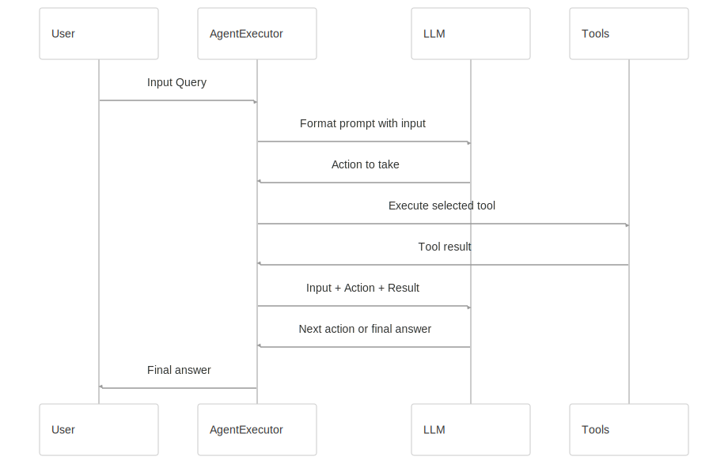

Sources: docs/docs/how\_to/agent\_executor.ipynb

## ReAct Pattern

The most common agent pattern in LangChain is the ReAct (Reasoning + Acting) pattern, which encourages the model to think through a problem step-by-step and take actions as needed.


Sources: docs/docs/tutorials/agents.ipynb

## Tool Integration

Agents rely on tools to interact with external systems. In LangChain, tools can be created in several ways:

1. From Python functions using `@tool` decorator
2. From Pydantic models or TypedDict classes
3. From Runnables using `.as_tool()`
4. By subclassing `BaseTool`


Sources: docs/docs/how\_to/custom\_tools.ipynb, docs/docs/how\_to/tool\_calling.ipynb, docs/docs/how\_to/convert\_runnable\_to\_tool.ipynb

## Binding Tools to LLMs

To enable an LLM to use tools, you must bind the tools to the model:

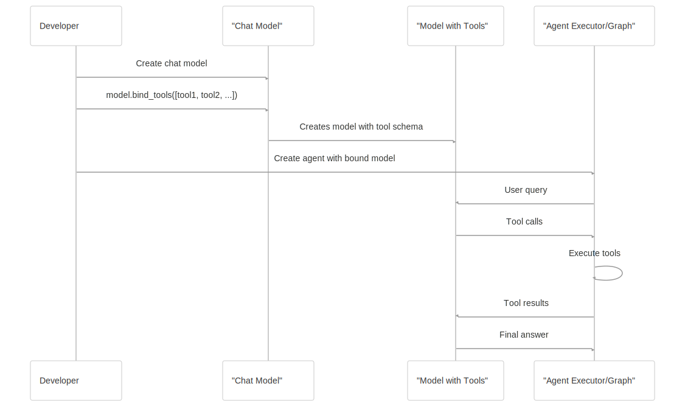

Sources: docs/docs/how\_to/tool\_calling.ipynb, docs/docs/tutorials/agents.ipynb

## Memory and Persistence

Agents often need to maintain state across multiple interactions, particularly for conversation-based applications.

Sources: docs/docs/tutorials/chatbot.ipynb, docs/docs/tutorials/qa\_chat\_history.ipynb

## Creating a Simple Agent

The simplest way to create an agent is using LangGraph's prebuilt components:


Sources: docs/docs/tutorials/agents.ipynb

## Example Agent Applications

Agents can be applied to various scenarios:

1. **Conversational Agents**: Chatbots that can use tools when needed
2. **RAG Agents**: Search through documents and interact with knowledge bases
3. **SQL Agents**: Query databases to answer questions about data
4. **Multi-Tool Agents**: Coordinate between multiple different tools


Sources: docs/docs/tutorials/qa\_chat\_history.ipynb, docs/docs/tutorials/sql\_qa.ipynb, docs/docs/tutorials/agents.ipynb

## Agent Output Handling

Agents can generate various types of outputs that need to be handled appropriately:

1. **Tool Calls**: When the agent decides to call a tool
2. **Final Answers**: When the agent has completed its task
3. **Streaming Outputs**: Progressive outputs during agent execution
4. **Artifacts**: Additional data or files produced during execution


Sources: docs/docs/how\_to/tool\_calling.ipynb, docs/docs/how\_to/tool\_artifacts.ipynb, docs/docs/how\_to/tool\_stream\_events.ipynb

## Migrating from Legacy Agents

LangChain provides a migration path from legacy `AgentExecutor` to modern LangGraph agents:


Sources: docs/docs/how\_to/agent\_executor.ipynb, docs/docs/how\_to/migrate\_agent.ipynb

## Debugging and Monitoring

Tracing and debugging agents is crucial for development and production use:


Sources: docs/docs/tutorials/agents.ipynb, docs/docs/tutorials/qa\_chat\_history.ipynb

## Code Structure Overview

The agent system is implemented across multiple files and packages:

Sources: docs/docs/tutorials/agents.ipynb, docs/docs/how\_to/agent\_executor.ipynb

## Advanced Techniques

### Few-Shot Examples

Providing examples can improve agent performance:


Sources: docs/docs/how\_to/example\_selectors\_langsmith.ipynb, docs/docs/how\_to/extraction\_examples.ipynb

### Runtime Configuration

Agents can be configured at runtime with special values:


Sources: docs/docs/how\_to/tool\_runtime.ipynb, docs/docs/how\_to/configure.ipynb

## Common Challenges and Solutions

| Challenge | Solution |
| --- | --- |
| Agent calling incorrect tools | Improve tool descriptions and use few-shot examples |
| Agent not using tools when needed | Use tool\_choice parameter to force tool usage |
| Long-running tools | Implement streaming for tools with progress updates |
| Memory management for long conversations | Use appropriate trimming strategies |
| Handling tool failures | Implement error handling and fallback mechanisms |

Sources: docs/docs/how\_to/tool\_calling.ipynb, docs/docs/how\_to/streaming.mdx

## Conclusion

The Agent System in LangChain provides a flexible framework for building AI applications that can reason through problems and interact with external tools. By leveraging the power of LLMs for reasoning and decision-making, and combining it with the ability to access specialized tools, agents can solve complex tasks that would be difficult for either component alone.

Whether you're using the modern LangGraph-based approach or the legacy AgentExecutor, understanding the core patterns and components of the agent system will help you build more effective AI applications.

Auto-refresh not enabled yet

Try DeepWiki on your private codebase with [Devin](/private-repo)

### On this page

* [Agent System](#agent-system)
* [What are Agents?](#what-are-agents)
* [Agent Architecture](#agent-architecture)
* [Implementation Approaches](#implementation-approaches)
* [1. LangGraph Agents (Recommended)](#1-langgraph-agents-recommended)
* [2. AgentExecutor (Legacy)](#2-agentexecutor-legacy)
* [ReAct Pattern](#react-pattern)
* [Tool Integration](#tool-integration)
* [Binding Tools to LLMs](#binding-tools-to-llms)
* [Memory and Persistence](#memory-and-persistence)
* [Creating a Simple Agent](#creating-a-simple-agent)
* [Example Agent Applications](#example-agent-applications)
* [Agent Output Handling](#agent-output-handling)
* [Migrating from Legacy Agents](#migrating-from-legacy-agents)
* [Debugging and Monitoring](#debugging-and-monitoring)
* [Code Structure Overview](#code-structure-overview)
* [Advanced Techniques](#advanced-techniques)
* [Few-Shot Examples](#few-shot-examples)
* [Runtime Configuration](#runtime-configuration)
* [Common Challenges and Solutions](#common-challenges-and-solutions)
* [Conclusion](#conclusion)

Ask Devin about langchain-ai/langchain

Deep Research