# Tools and Evaluation

[Powered by Devin](https://devin.ai)

[DeepWiki](https://deepwiki.com)

[DeepWiki](/)

[langchain-ai/langchain](https://github.com/langchain-ai/langchain)

[powered by

Devin](https://devin.ai)Share

Last indexed: 17 April 2025 ([b36c2b](https://github.com/langchain-ai/langchain/commits/b36c2bf8))

* [LangChain Overview](/langchain-ai/langchain/1-langchain-overview)
* [Core Architecture](/langchain-ai/langchain/2-core-architecture)
* [Package Structure](/langchain-ai/langchain/2.1-package-structure)
* [Runnable Interface & LCEL](/langchain-ai/langchain/2.2-runnable-interface-and-lcel)
* [Message System](/langchain-ai/langchain/2.3-message-system)
* [Provider Integrations](/langchain-ai/langchain/3-provider-integrations)
* [Model Interfaces](/langchain-ai/langchain/3.1-model-interfaces)
* [Provider-Specific Implementations](/langchain-ai/langchain/3.2-provider-specific-implementations)
* [Retrieval and Vector Stores](/langchain-ai/langchain/4-retrieval-and-vector-stores)
* [Chains and Agents](/langchain-ai/langchain/5-chains-and-agents)
* [Chain Types and Implementation](/langchain-ai/langchain/5.1-chain-types-and-implementation)
* [Agent System](/langchain-ai/langchain/5.2-agent-system)
* [Tools and Evaluation](/langchain-ai/langchain/6-tools-and-evaluation)
* [Tool System](/langchain-ai/langchain/6.1-tool-system)
* [Evaluation and Testing](/langchain-ai/langchain/6.2-evaluation-and-testing)
* [Developer Tools](/langchain-ai/langchain/7-developer-tools)
* [CLI and Templates](/langchain-ai/langchain/7.1-cli-and-templates)
* [CI/CD and Release Process](/langchain-ai/langchain/7.2-cicd-and-release-process)
* [Documentation System](/langchain-ai/langchain/8-documentation-system)
* [User Documentation](/langchain-ai/langchain/8.1-user-documentation)
* [API Reference Generation](/langchain-ai/langchain/8.2-api-reference-generation)

Menu

# Tools and Evaluation

Relevant source files

* [libs/community/langchain\_community/callbacks/tracers/wandb.py](https://github.com/langchain-ai/langchain/blob/b36c2bf8/libs/community/langchain_community/callbacks/tracers/wandb.py)
* [libs/core/langchain\_core/prompts/base.py](https://github.com/langchain-ai/langchain/blob/b36c2bf8/libs/core/langchain_core/prompts/base.py)
* [libs/core/langchain\_core/prompts/chat.py](https://github.com/langchain-ai/langchain/blob/b36c2bf8/libs/core/langchain_core/prompts/chat.py)
* [libs/core/langchain\_core/prompts/few\_shot.py](https://github.com/langchain-ai/langchain/blob/b36c2bf8/libs/core/langchain_core/prompts/few_shot.py)
* [libs/core/langchain\_core/prompts/few\_shot\_with\_templates.py](https://github.com/langchain-ai/langchain/blob/b36c2bf8/libs/core/langchain_core/prompts/few_shot_with_templates.py)
* [libs/core/langchain\_core/prompts/image.py](https://github.com/langchain-ai/langchain/blob/b36c2bf8/libs/core/langchain_core/prompts/image.py)
* [libs/core/langchain\_core/prompts/prompt.py](https://github.com/langchain-ai/langchain/blob/b36c2bf8/libs/core/langchain_core/prompts/prompt.py)
* [libs/core/langchain\_core/prompts/string.py](https://github.com/langchain-ai/langchain/blob/b36c2bf8/libs/core/langchain_core/prompts/string.py)
* [libs/core/langchain\_core/retrievers.py](https://github.com/langchain-ai/langchain/blob/b36c2bf8/libs/core/langchain_core/retrievers.py)
* [libs/core/langchain\_core/runnables/base.py](https://github.com/langchain-ai/langchain/blob/b36c2bf8/libs/core/langchain_core/runnables/base.py)
* [libs/core/langchain\_core/runnables/branch.py](https://github.com/langchain-ai/langchain/blob/b36c2bf8/libs/core/langchain_core/runnables/branch.py)
* [libs/core/langchain\_core/runnables/config.py](https://github.com/langchain-ai/langchain/blob/b36c2bf8/libs/core/langchain_core/runnables/config.py)
* [libs/core/langchain\_core/runnables/configurable.py](https://github.com/langchain-ai/langchain/blob/b36c2bf8/libs/core/langchain_core/runnables/configurable.py)
* [libs/core/langchain\_core/runnables/fallbacks.py](https://github.com/langchain-ai/langchain/blob/b36c2bf8/libs/core/langchain_core/runnables/fallbacks.py)
* [libs/core/langchain\_core/runnables/graph.py](https://github.com/langchain-ai/langchain/blob/b36c2bf8/libs/core/langchain_core/runnables/graph.py)
* [libs/core/langchain\_core/runnables/graph\_ascii.py](https://github.com/langchain-ai/langchain/blob/b36c2bf8/libs/core/langchain_core/runnables/graph_ascii.py)
* [libs/core/langchain\_core/runnables/graph\_mermaid.py](https://github.com/langchain-ai/langchain/blob/b36c2bf8/libs/core/langchain_core/runnables/graph_mermaid.py)
* [libs/core/langchain\_core/runnables/graph\_png.py](https://github.com/langchain-ai/langchain/blob/b36c2bf8/libs/core/langchain_core/runnables/graph_png.py)
* [libs/core/langchain\_core/runnables/history.py](https://github.com/langchain-ai/langchain/blob/b36c2bf8/libs/core/langchain_core/runnables/history.py)
* [libs/core/langchain\_core/runnables/passthrough.py](https://github.com/langchain-ai/langchain/blob/b36c2bf8/libs/core/langchain_core/runnables/passthrough.py)
* [libs/core/langchain\_core/runnables/utils.py](https://github.com/langchain-ai/langchain/blob/b36c2bf8/libs/core/langchain_core/runnables/utils.py)
* [libs/core/langchain\_core/tools/base.py](https://github.com/langchain-ai/langchain/blob/b36c2bf8/libs/core/langchain_core/tools/base.py)
* [libs/core/langchain\_core/tracers/context.py](https://github.com/langchain-ai/langchain/blob/b36c2bf8/libs/core/langchain_core/tracers/context.py)
* [libs/core/langchain\_core/tracers/event\_stream.py](https://github.com/langchain-ai/langchain/blob/b36c2bf8/libs/core/langchain_core/tracers/event_stream.py)
* [libs/core/langchain\_core/tracers/log\_stream.py](https://github.com/langchain-ai/langchain/blob/b36c2bf8/libs/core/langchain_core/tracers/log_stream.py)
* [libs/core/langchain\_core/utils/function\_calling.py](https://github.com/langchain-ai/langchain/blob/b36c2bf8/libs/core/langchain_core/utils/function_calling.py)
* [libs/core/langchain\_core/utils/pydantic.py](https://github.com/langchain-ai/langchain/blob/b36c2bf8/libs/core/langchain_core/utils/pydantic.py)
* [libs/core/tests/unit\_tests/output\_parsers/test\_openai\_tools.py](https://github.com/langchain-ai/langchain/blob/b36c2bf8/libs/core/tests/unit_tests/output_parsers/test_openai_tools.py)
* [libs/core/tests/unit\_tests/prompts/\_\_snapshots\_\_/test\_chat.ambr](https://github.com/langchain-ai/langchain/blob/b36c2bf8/libs/core/tests/unit_tests/prompts/__snapshots__/test_chat.ambr)
* [libs/core/tests/unit\_tests/prompts/test\_chat.py](https://github.com/langchain-ai/langchain/blob/b36c2bf8/libs/core/tests/unit_tests/prompts/test_chat.py)
* [libs/core/tests/unit\_tests/prompts/test\_few\_shot.py](https://github.com/langchain-ai/langchain/blob/b36c2bf8/libs/core/tests/unit_tests/prompts/test_few_shot.py)
* [libs/core/tests/unit\_tests/prompts/test\_prompt.py](https://github.com/langchain-ai/langchain/blob/b36c2bf8/libs/core/tests/unit_tests/prompts/test_prompt.py)
* [libs/core/tests/unit\_tests/runnables/\_\_snapshots\_\_/test\_graph.ambr](https://github.com/langchain-ai/langchain/blob/b36c2bf8/libs/core/tests/unit_tests/runnables/__snapshots__/test_graph.ambr)
* [libs/core/tests/unit\_tests/runnables/\_\_snapshots\_\_/test\_runnable.ambr](https://github.com/langchain-ai/langchain/blob/b36c2bf8/libs/core/tests/unit_tests/runnables/__snapshots__/test_runnable.ambr)
* [libs/core/tests/unit\_tests/runnables/test\_config.py](https://github.com/langchain-ai/langchain/blob/b36c2bf8/libs/core/tests/unit_tests/runnables/test_config.py)
* [libs/core/tests/unit\_tests/runnables/test\_fallbacks.py](https://github.com/langchain-ai/langchain/blob/b36c2bf8/libs/core/tests/unit_tests/runnables/test_fallbacks.py)
* [libs/core/tests/unit\_tests/runnables/test\_graph.py](https://github.com/langchain-ai/langchain/blob/b36c2bf8/libs/core/tests/unit_tests/runnables/test_graph.py)
* [libs/core/tests/unit\_tests/runnables/test\_history.py](https://github.com/langchain-ai/langchain/blob/b36c2bf8/libs/core/tests/unit_tests/runnables/test_history.py)
* [libs/core/tests/unit\_tests/runnables/test\_runnable.py](https://github.com/langchain-ai/langchain/blob/b36c2bf8/libs/core/tests/unit_tests/runnables/test_runnable.py)
* [libs/core/tests/unit\_tests/runnables/test\_runnable\_events\_v1.py](https://github.com/langchain-ai/langchain/blob/b36c2bf8/libs/core/tests/unit_tests/runnables/test_runnable_events_v1.py)
* [libs/core/tests/unit\_tests/runnables/test\_runnable\_events\_v2.py](https://github.com/langchain-ai/langchain/blob/b36c2bf8/libs/core/tests/unit_tests/runnables/test_runnable_events_v2.py)
* [libs/core/tests/unit\_tests/test\_tools.py](https://github.com/langchain-ai/langchain/blob/b36c2bf8/libs/core/tests/unit_tests/test_tools.py)
* [libs/core/tests/unit\_tests/utils/test\_function\_calling.py](https://github.com/langchain-ai/langchain/blob/b36c2bf8/libs/core/tests/unit_tests/utils/test_function_calling.py)
* [libs/core/tests/unit\_tests/utils/test\_pydantic.py](https://github.com/langchain-ai/langchain/blob/b36c2bf8/libs/core/tests/unit_tests/utils/test_pydantic.py)
* [libs/langchain/langchain/callbacks/base.py](https://github.com/langchain-ai/langchain/blob/b36c2bf8/libs/langchain/langchain/callbacks/base.py)
* [libs/langchain/langchain/callbacks/manager.py](https://github.com/langchain-ai/langchain/blob/b36c2bf8/libs/langchain/langchain/callbacks/manager.py)
* [libs/langchain/langchain/callbacks/tracers/base.py](https://github.com/langchain-ai/langchain/blob/b36c2bf8/libs/langchain/langchain/callbacks/tracers/base.py)
* [libs/langchain/langchain/callbacks/tracers/evaluation.py](https://github.com/langchain-ai/langchain/blob/b36c2bf8/libs/langchain/langchain/callbacks/tracers/evaluation.py)
* [libs/langchain/langchain/callbacks/tracers/langchain.py](https://github.com/langchain-ai/langchain/blob/b36c2bf8/libs/langchain/langchain/callbacks/tracers/langchain.py)
* [libs/langchain/langchain/callbacks/tracers/log\_stream.py](https://github.com/langchain-ai/langchain/blob/b36c2bf8/libs/langchain/langchain/callbacks/tracers/log_stream.py)
* [libs/langchain/langchain/callbacks/tracers/schemas.py](https://github.com/langchain-ai/langchain/blob/b36c2bf8/libs/langchain/langchain/callbacks/tracers/schemas.py)
* [libs/langchain/langchain/callbacks/tracers/wandb.py](https://github.com/langchain-ai/langchain/blob/b36c2bf8/libs/langchain/langchain/callbacks/tracers/wandb.py)
* [libs/langchain/langchain/smith/evaluation/name\_generation.py](https://github.com/langchain-ai/langchain/blob/b36c2bf8/libs/langchain/langchain/smith/evaluation/name_generation.py)
* [libs/langchain/langchain/smith/evaluation/progress.py](https://github.com/langchain-ai/langchain/blob/b36c2bf8/libs/langchain/langchain/smith/evaluation/progress.py)
* [libs/langchain/langchain/smith/evaluation/runner\_utils.py](https://github.com/langchain-ai/langchain/blob/b36c2bf8/libs/langchain/langchain/smith/evaluation/runner_utils.py)
* [libs/langchain/tests/unit\_tests/smith/evaluation/test\_runner\_utils.py](https://github.com/langchain-ai/langchain/blob/b36c2bf8/libs/langchain/tests/unit_tests/smith/evaluation/test_runner_utils.py)

This document provides an overview of LangChain's tool system and evaluation framework. It explains how to create, use, and customize tools for agents, as well as how to evaluate language models, chains, and agents for performance and accuracy.

For detailed information about the Agent system that uses these tools, see [Agent System](/langchain-ai/langchain/5.2-agent-system).

## Tools in LangChain

Tools are interfaces that LangChain agents can use to interact with the world. They represent functions that can be dynamically dispatched by language models during execution.



Sources:

* [libs/core/langchain\_core/tools/base.py327-1180](https://github.com/langchain-ai/langchain/blob/b36c2bf8/libs/core/langchain_core/tools/base.py#L327-L1180)
* [libs/core/tests/unit\_tests/test\_tools.py73-131](https://github.com/langchain-ai/langchain/blob/b36c2bf8/libs/core/tests/unit_tests/test_tools.py#L73-L131)
* [libs/core/langchain\_core/utils/function\_calling.py46-130](https://github.com/langchain-ai/langchain/blob/b36c2bf8/libs/core/langchain_core/utils/function_calling.py#L46-L130)

### Core Tool Interface

The main class that defines the tool interface is `BaseTool`. It implements the `Runnable` protocol, which means tools can be composed with other components in the LangChain Expression Language (LCEL).



Sources:

* [libs/core/langchain\_core/tools/base.py327-365](https://github.com/langchain-ai/langchain/blob/b36c2bf8/libs/core/langchain_core/tools/base.py#L327-L365)
* [libs/core/langchain\_core/runnables/base.py111-541](https://github.com/langchain-ai/langchain/blob/b36c2bf8/libs/core/langchain_core/runnables/base.py#L111-L541)
* [libs/core/tests/unit\_tests/test\_tools.py87-145](https://github.com/langchain-ai/langchain/blob/b36c2bf8/libs/core/tests/unit_tests/test_tools.py#L87-L145)

### Creating Tools

There are several ways to create tools in LangChain:

1. Using the `@tool` decorator:

```
@tool
def search_api(query: str) -> str:
    """Search the API for the query."""
    return "API result"
```

2. Creating a `Tool` directly:

```
from langchain_core.tools import Tool

tool = Tool(
    name="search_api",
    func=lambda query: f"API result for {query}",
    description="Search the API for the query."
)
```

3. Creating a `StructuredTool` for complex inputs:

```
from langchain_core.tools import StructuredTool
from pydantic import BaseModel, Field

class SearchAPIInput(BaseModel):
    """Input for the search API."""
    query: str = Field(..., description="The query to search for")
    max_results: int = Field(5, description="Maximum number of results to return")

tool = StructuredTool.from_function(
    func=lambda input: f"API results for {input.query}, limited to {input.max_results}",
    name="search_api",
    description="Search the API for the query.",
    args_schema=SearchAPIInput
)
```

Sources:

* [libs/core/tests/unit\_tests/test\_tools.py87-135](https://github.com/langchain-ai/langchain/blob/b36c2bf8/libs/core/tests/unit_tests/test_tools.py#L87-L135)
* [libs/core/tests/unit\_tests/test\_tools.py183-224](https://github.com/langchain-ai/langchain/blob/b36c2bf8/libs/core/tests/unit_tests/test_tools.py#L183-L224)
* [libs/core/tests/unit\_tests/test\_tools.py315-345](https://github.com/langchain-ai/langchain/blob/b36c2bf8/libs/core/tests/unit_tests/test_tools.py#L315-L345)
* [libs/core/langchain\_core/tools/base.py606-650](https://github.com/langchain-ai/langchain/blob/b36c2bf8/libs/core/langchain_core/tools/base.py#L606-L650)

### Tool Function Calling and Schema Conversion

LangChain provides utilities to convert tools to and from different formats, particularly for use with OpenAI function calling and other LLM API formats.



Sources:

* [libs/core/langchain\_core/utils/function\_calling.py391-570](https://github.com/langchain-ai/langchain/blob/b36c2bf8/libs/core/langchain_core/utils/function_calling.py#L391-L570)
* [libs/core/tests/unit\_tests/utils/test\_function\_calling.py38-198](https://github.com/langchain-ai/langchain/blob/b36c2bf8/libs/core/tests/unit_tests/utils/test_function_calling.py#L38-L198)

## Evaluation Framework

LangChain provides a comprehensive framework for evaluating language models, chains, and agents. This allows for measuring performance, accuracy, and other metrics.

### Key Components of Evaluation



Sources:

* [libs/langchain/langchain/smith/evaluation/runner\_utils.py81-153](https://github.com/langchain-ai/langchain/blob/b36c2bf8/libs/langchain/langchain/smith/evaluation/runner_utils.py#L81-L153)
* [libs/langchain/langchain/smith/evaluation/runner\_utils.py419-513](https://github.com/langchain-ai/langchain/blob/b36c2bf8/libs/langchain/langchain/smith/evaluation/runner_utils.py#L419-L513)

### Evaluator Types

LangChain provides several built-in evaluator types:

| Evaluator Type | Description | Example Metrics |
| --- | --- | --- |
| Correctness | Evaluates factual accuracy | Accuracy, F1 Score |
| Helpfulness | Evaluates how helpful a response is | Helpfulness Score |
| Relevance | Evaluates relevance to the query | Relevance Score |
| Toxicity | Evaluates harmful content | Toxicity Score |
| Hallucination | Evaluates factual correctness | Hallucination Score |
| Faithfulness | Evaluates consistency with source | Faithfulness Score |
| Custom | User-defined evaluation | Custom Metrics |

Sources:

* [libs/langchain/langchain/smith/evaluation/runner\_utils.py419-513](https://github.com/langchain-ai/langchain/blob/b36c2bf8/libs/langchain/langchain/smith/evaluation/runner_utils.py#L419-L513)
* [libs/langchain/langchain/smith/evaluation/runner\_utils.py526-578](https://github.com/langchain-ai/langchain/blob/b36c2bf8/libs/langchain/langchain/smith/evaluation/runner_utils.py#L526-L578)

### Running Evaluations

The evaluation framework allows running a language model, chain, or agent on a dataset and collecting metrics.

```
from langchain.smith import RunEvalConfig
from langchain.smith.evaluation import run_on_dataset

# Define evaluation
eval_config = RunEvalConfig(
    evaluators=[
        "qa",  # Question-answering evaluator
        "criteria", # Custom criteria evaluator
    ],
)

# Run evaluation
results = run_on_dataset(
    dataset_name="my_dataset",
    llm_or_chain_factory=my_chain,
    evaluation=eval_config,
)

# Access results
df = results.to_dataframe()
print(df.describe())
```

Sources:

* [libs/langchain/langchain/smith/evaluation/runner\_utils.py419-513](https://github.com/langchain-ai/langchain/blob/b36c2bf8/libs/langchain/langchain/smith/evaluation/runner_utils.py#L419-L513)
* [libs/langchain/langchain/smith/evaluation/runner\_utils.py168-170](https://github.com/langchain-ai/langchain/blob/b36c2bf8/libs/langchain/langchain/smith/evaluation/runner_utils.py#L168-L170)

### Integration with LangSmith

The evaluation framework integrates with LangSmith, LangChain's platform for debugging, testing, and monitoring LLM applications.



Sources:

* [libs/langchain/langchain/smith/evaluation/runner\_utils.py34-45](https://github.com/langchain-ai/langchain/blob/b36c2bf8/libs/langchain/langchain/smith/evaluation/runner_utils.py#L34-L45)
* [libs/core/langchain\_core/tracers/evaluation.py](https://github.com/langchain-ai/langchain/blob/b36c2bf8/libs/core/langchain_core/tracers/evaluation.py)

## Tool Integration with Evaluation

Tools and evaluation can be used together to assess tool-using agents. This is particularly important for ensuring that agents select and use tools appropriately.

### Evaluating Tool Selection

When evaluating agents, you can measure:

1. Whether the agent selects the appropriate tool
2. Whether the agent correctly formats tool inputs
3. Whether the agent correctly interprets tool outputs



Sources:

* [libs/langchain/langchain/smith/evaluation/runner\_utils.py526-578](https://github.com/langchain-ai/langchain/blob/b36c2bf8/libs/langchain/langchain/smith/evaluation/runner_utils.py#L526-L578)
* [libs/core/langchain\_core/tools/base.py327-365](https://github.com/langchain-ai/langchain/blob/b36c2bf8/libs/core/langchain_core/tools/base.py#L327-L365)

### Tool Example to Message Conversion

LangChain provides utilities to convert tool examples to message histories, which can be used for evaluating agents or creating demonstrations.

```
from langchain_core.utils.function_calling import tool_example_to_messages

# Create a tool example
tool_example = {
    "input": {"query": "What's the weather in New York?"},
    "output": {"temperature": 72, "conditions": "sunny"}
}

# Convert to a message history
messages = tool_example_to_messages(
    tool_example,
    tool_name="weather",
    tool_description="Get current weather conditions",
)

# Result is a list of messages representing the tool call and response
```

Sources:

* [libs/core/langchain\_core/utils/function\_calling.py765-844](https://github.com/langchain-ai/langchain/blob/b36c2bf8/libs/core/langchain_core/utils/function_calling.py#L765-L844)
* [libs/core/tests/unit\_tests/utils/test\_function\_calling.py598-634](https://github.com/langchain-ai/langchain/blob/b36c2bf8/libs/core/tests/unit_tests/utils/test_function_calling.py#L598-L634)

## Conclusion

LangChain's tool system enables language models to interact with external systems through a standardized interface. Combined with the evaluation framework, developers can build and assess agents that effectively use tools to complete tasks. The evaluation framework provides comprehensive metrics and feedback mechanisms to improve model and agent performance.

Auto-refresh not enabled yet

Try DeepWiki on your private codebase with [Devin](/private-repo)

### On this page

* [Tools and Evaluation](#tools-and-evaluation)
* [Tools in LangChain](#tools-in-langchain)
* [Core Tool Interface](#core-tool-interface)
* [Creating Tools](#creating-tools)
* [Tool Function Calling and Schema Conversion](#tool-function-calling-and-schema-conversion)
* [Evaluation Framework](#evaluation-framework)
* [Key Components of Evaluation](#key-components-of-evaluation)
* [Evaluator Types](#evaluator-types)
* [Running Evaluations](#running-evaluations)
* [Integration with LangSmith](#integration-with-langsmith)
* [Tool Integration with Evaluation](#tool-integration-with-evaluation)
* [Evaluating Tool Selection](#evaluating-tool-selection)
* [Tool Example to Message Conversion](#tool-example-to-message-conversion)
* [Conclusion](#conclusion)

Ask Devin about langchain-ai/langchain

Deep Research