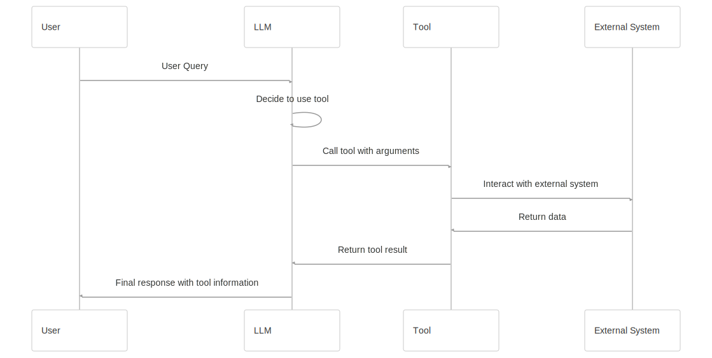

# Tool System

[Powered by Devin](https://devin.ai)

[DeepWiki](https://deepwiki.com)

[DeepWiki](/)

[langchain-ai/langchain](https://github.com/langchain-ai/langchain)

[powered by

Devin](https://devin.ai)Share

Last indexed: 17 April 2025 ([b36c2b](https://github.com/langchain-ai/langchain/commits/b36c2bf8))

* [LangChain Overview](/langchain-ai/langchain/1-langchain-overview)
* [Core Architecture](/langchain-ai/langchain/2-core-architecture)
* [Package Structure](/langchain-ai/langchain/2.1-package-structure)
* [Runnable Interface & LCEL](/langchain-ai/langchain/2.2-runnable-interface-and-lcel)
* [Message System](/langchain-ai/langchain/2.3-message-system)
* [Provider Integrations](/langchain-ai/langchain/3-provider-integrations)
* [Model Interfaces](/langchain-ai/langchain/3.1-model-interfaces)
* [Provider-Specific Implementations](/langchain-ai/langchain/3.2-provider-specific-implementations)
* [Retrieval and Vector Stores](/langchain-ai/langchain/4-retrieval-and-vector-stores)
* [Chains and Agents](/langchain-ai/langchain/5-chains-and-agents)
* [Chain Types and Implementation](/langchain-ai/langchain/5.1-chain-types-and-implementation)
* [Agent System](/langchain-ai/langchain/5.2-agent-system)
* [Tools and Evaluation](/langchain-ai/langchain/6-tools-and-evaluation)
* [Tool System](/langchain-ai/langchain/6.1-tool-system)
* [Evaluation and Testing](/langchain-ai/langchain/6.2-evaluation-and-testing)
* [Developer Tools](/langchain-ai/langchain/7-developer-tools)
* [CLI and Templates](/langchain-ai/langchain/7.1-cli-and-templates)
* [CI/CD and Release Process](/langchain-ai/langchain/7.2-cicd-and-release-process)
* [Documentation System](/langchain-ai/langchain/8-documentation-system)
* [User Documentation](/langchain-ai/langchain/8.1-user-documentation)
* [API Reference Generation](/langchain-ai/langchain/8.2-api-reference-generation)

Menu

# Tool System

Relevant source files

* [docs/cassettes/llm\_chain\_1b2481f0.msgpack.zlib](https://github.com/langchain-ai/langchain/blob/b36c2bf8/docs/cassettes/llm_chain_1b2481f0.msgpack.zlib)
* [docs/cassettes/llm\_chain\_3e45595a.msgpack.zlib](https://github.com/langchain-ai/langchain/blob/b36c2bf8/docs/cassettes/llm_chain_3e45595a.msgpack.zlib)
* [docs/docs/concepts/streaming.mdx](https://github.com/langchain-ai/langchain/blob/b36c2bf8/docs/docs/concepts/streaming.mdx)
* [docs/docs/example\_data/nke-10k-2023.pdf](https://github.com/langchain-ai/langchain/blob/b36c2bf8/docs/docs/example_data/nke-10k-2023.pdf)
* [docs/docs/how\_to/agent\_executor.ipynb](https://github.com/langchain-ai/langchain/blob/b36c2bf8/docs/docs/how_to/agent_executor.ipynb)
* [docs/docs/how\_to/chat\_streaming.ipynb](https://github.com/langchain-ai/langchain/blob/b36c2bf8/docs/docs/how_to/chat_streaming.ipynb)
* [docs/docs/how\_to/configure.ipynb](https://github.com/langchain-ai/langchain/blob/b36c2bf8/docs/docs/how_to/configure.ipynb)
* [docs/docs/how\_to/convert\_runnable\_to\_tool.ipynb](https://github.com/langchain-ai/langchain/blob/b36c2bf8/docs/docs/how_to/convert_runnable_to_tool.ipynb)
* [docs/docs/how\_to/custom\_tools.ipynb](https://github.com/langchain-ai/langchain/blob/b36c2bf8/docs/docs/how_to/custom_tools.ipynb)
* [docs/docs/how\_to/example\_selectors\_langsmith.ipynb](https://github.com/langchain-ai/langchain/blob/b36c2bf8/docs/docs/how_to/example_selectors_langsmith.ipynb)
* [docs/docs/how\_to/extraction\_examples.ipynb](https://github.com/langchain-ai/langchain/blob/b36c2bf8/docs/docs/how_to/extraction_examples.ipynb)
* [docs/docs/how\_to/extraction\_long\_text.ipynb](https://github.com/langchain-ai/langchain/blob/b36c2bf8/docs/docs/how_to/extraction_long_text.ipynb)
* [docs/docs/how\_to/few\_shot\_examples.ipynb](https://github.com/langchain-ai/langchain/blob/b36c2bf8/docs/docs/how_to/few_shot_examples.ipynb)
* [docs/docs/how\_to/few\_shot\_examples\_chat.ipynb](https://github.com/langchain-ai/langchain/blob/b36c2bf8/docs/docs/how_to/few_shot_examples_chat.ipynb)
* [docs/docs/how\_to/function\_calling.ipynb](https://github.com/langchain-ai/langchain/blob/b36c2bf8/docs/docs/how_to/function_calling.ipynb)
* [docs/docs/how\_to/index.mdx](https://github.com/langchain-ai/langchain/blob/b36c2bf8/docs/docs/how_to/index.mdx)
* [docs/docs/how\_to/parent\_document\_retriever.ipynb](https://github.com/langchain-ai/langchain/blob/b36c2bf8/docs/docs/how_to/parent_document_retriever.ipynb)
* [docs/docs/how\_to/paul\_graham\_essay.txt](https://github.com/langchain-ai/langchain/blob/b36c2bf8/docs/docs/how_to/paul_graham_essay.txt)
* [docs/docs/how\_to/qa\_chat\_history\_how\_to.ipynb](https://github.com/langchain-ai/langchain/blob/b36c2bf8/docs/docs/how_to/qa_chat_history_how_to.ipynb)
* [docs/docs/how\_to/qa\_sources.ipynb](https://github.com/langchain-ai/langchain/blob/b36c2bf8/docs/docs/how_to/qa_sources.ipynb)
* [docs/docs/how\_to/qa\_streaming.ipynb](https://github.com/langchain-ai/langchain/blob/b36c2bf8/docs/docs/how_to/qa_streaming.ipynb)
* [docs/docs/how\_to/structured\_output.ipynb](https://github.com/langchain-ai/langchain/blob/b36c2bf8/docs/docs/how_to/structured_output.ipynb)
* [docs/docs/how\_to/tool\_artifacts.ipynb](https://github.com/langchain-ai/langchain/blob/b36c2bf8/docs/docs/how_to/tool_artifacts.ipynb)
* [docs/docs/how\_to/tool\_calling.ipynb](https://github.com/langchain-ai/langchain/blob/b36c2bf8/docs/docs/how_to/tool_calling.ipynb)
* [docs/docs/how\_to/tool\_calling\_parallel.ipynb](https://github.com/langchain-ai/langchain/blob/b36c2bf8/docs/docs/how_to/tool_calling_parallel.ipynb)
* [docs/docs/how\_to/tool\_choice.ipynb](https://github.com/langchain-ai/langchain/blob/b36c2bf8/docs/docs/how_to/tool_choice.ipynb)
* [docs/docs/how\_to/tool\_configure.ipynb](https://github.com/langchain-ai/langchain/blob/b36c2bf8/docs/docs/how_to/tool_configure.ipynb)
* [docs/docs/how\_to/tool\_results\_pass\_to\_model.ipynb](https://github.com/langchain-ai/langchain/blob/b36c2bf8/docs/docs/how_to/tool_results_pass_to_model.ipynb)
* [docs/docs/how\_to/tool\_runtime.ipynb](https://github.com/langchain-ai/langchain/blob/b36c2bf8/docs/docs/how_to/tool_runtime.ipynb)
* [docs/docs/how\_to/tool\_stream\_events.ipynb](https://github.com/langchain-ai/langchain/blob/b36c2bf8/docs/docs/how_to/tool_stream_events.ipynb)
* [docs/docs/how\_to/tools\_prompting.ipynb](https://github.com/langchain-ai/langchain/blob/b36c2bf8/docs/docs/how_to/tools_prompting.ipynb)
* [docs/docs/integrations/document\_loaders/image\_captions.ipynb](https://github.com/langchain-ai/langchain/blob/b36c2bf8/docs/docs/integrations/document_loaders/image_captions.ipynb)
* [docs/docs/integrations/document\_transformers/google\_cloud\_vertexai\_rerank.ipynb](https://github.com/langchain-ai/langchain/blob/b36c2bf8/docs/docs/integrations/document_transformers/google_cloud_vertexai_rerank.ipynb)
* [docs/docs/tutorials/agents.ipynb](https://github.com/langchain-ai/langchain/blob/b36c2bf8/docs/docs/tutorials/agents.ipynb)
* [docs/docs/tutorials/chatbot.ipynb](https://github.com/langchain-ai/langchain/blob/b36c2bf8/docs/docs/tutorials/chatbot.ipynb)
* [docs/docs/tutorials/extraction.ipynb](https://github.com/langchain-ai/langchain/blob/b36c2bf8/docs/docs/tutorials/extraction.ipynb)
* [docs/docs/tutorials/index.mdx](https://github.com/langchain-ai/langchain/blob/b36c2bf8/docs/docs/tutorials/index.mdx)
* [docs/docs/tutorials/llm\_chain.ipynb](https://github.com/langchain-ai/langchain/blob/b36c2bf8/docs/docs/tutorials/llm_chain.ipynb)
* [docs/docs/tutorials/qa\_chat\_history.ipynb](https://github.com/langchain-ai/langchain/blob/b36c2bf8/docs/docs/tutorials/qa_chat_history.ipynb)
* [docs/docs/tutorials/rag.ipynb](https://github.com/langchain-ai/langchain/blob/b36c2bf8/docs/docs/tutorials/rag.ipynb)
* [docs/docs/tutorials/retrievers.ipynb](https://github.com/langchain-ai/langchain/blob/b36c2bf8/docs/docs/tutorials/retrievers.ipynb)
* [docs/docs/tutorials/sql\_qa.ipynb](https://github.com/langchain-ai/langchain/blob/b36c2bf8/docs/docs/tutorials/sql_qa.ipynb)
* [docs/docs/tutorials/summarization.ipynb](https://github.com/langchain-ai/langchain/blob/b36c2bf8/docs/docs/tutorials/summarization.ipynb)
* [docs/static/img/langsmith\_evaluate.png](https://github.com/langchain-ai/langchain/blob/b36c2bf8/docs/static/img/langsmith_evaluate.png)
* [libs/core/langchain\_core/prompts/base.py](https://github.com/langchain-ai/langchain/blob/b36c2bf8/libs/core/langchain_core/prompts/base.py)
* [libs/core/langchain\_core/prompts/chat.py](https://github.com/langchain-ai/langchain/blob/b36c2bf8/libs/core/langchain_core/prompts/chat.py)
* [libs/core/langchain\_core/prompts/few\_shot.py](https://github.com/langchain-ai/langchain/blob/b36c2bf8/libs/core/langchain_core/prompts/few_shot.py)
* [libs/core/langchain\_core/prompts/few\_shot\_with\_templates.py](https://github.com/langchain-ai/langchain/blob/b36c2bf8/libs/core/langchain_core/prompts/few_shot_with_templates.py)
* [libs/core/langchain\_core/prompts/image.py](https://github.com/langchain-ai/langchain/blob/b36c2bf8/libs/core/langchain_core/prompts/image.py)
* [libs/core/langchain\_core/prompts/prompt.py](https://github.com/langchain-ai/langchain/blob/b36c2bf8/libs/core/langchain_core/prompts/prompt.py)
* [libs/core/langchain\_core/prompts/string.py](https://github.com/langchain-ai/langchain/blob/b36c2bf8/libs/core/langchain_core/prompts/string.py)
* [libs/core/langchain\_core/retrievers.py](https://github.com/langchain-ai/langchain/blob/b36c2bf8/libs/core/langchain_core/retrievers.py)
* [libs/core/langchain\_core/runnables/base.py](https://github.com/langchain-ai/langchain/blob/b36c2bf8/libs/core/langchain_core/runnables/base.py)
* [libs/core/langchain\_core/runnables/branch.py](https://github.com/langchain-ai/langchain/blob/b36c2bf8/libs/core/langchain_core/runnables/branch.py)
* [libs/core/langchain\_core/runnables/config.py](https://github.com/langchain-ai/langchain/blob/b36c2bf8/libs/core/langchain_core/runnables/config.py)
* [libs/core/langchain\_core/runnables/configurable.py](https://github.com/langchain-ai/langchain/blob/b36c2bf8/libs/core/langchain_core/runnables/configurable.py)
* [libs/core/langchain\_core/runnables/fallbacks.py](https://github.com/langchain-ai/langchain/blob/b36c2bf8/libs/core/langchain_core/runnables/fallbacks.py)
* [libs/core/langchain\_core/runnables/graph.py](https://github.com/langchain-ai/langchain/blob/b36c2bf8/libs/core/langchain_core/runnables/graph.py)
* [libs/core/langchain\_core/runnables/graph\_ascii.py](https://github.com/langchain-ai/langchain/blob/b36c2bf8/libs/core/langchain_core/runnables/graph_ascii.py)
* [libs/core/langchain\_core/runnables/graph\_mermaid.py](https://github.com/langchain-ai/langchain/blob/b36c2bf8/libs/core/langchain_core/runnables/graph_mermaid.py)
* [libs/core/langchain\_core/runnables/graph\_png.py](https://github.com/langchain-ai/langchain/blob/b36c2bf8/libs/core/langchain_core/runnables/graph_png.py)
* [libs/core/langchain\_core/runnables/history.py](https://github.com/langchain-ai/langchain/blob/b36c2bf8/libs/core/langchain_core/runnables/history.py)
* [libs/core/langchain\_core/runnables/passthrough.py](https://github.com/langchain-ai/langchain/blob/b36c2bf8/libs/core/langchain_core/runnables/passthrough.py)
* [libs/core/langchain\_core/runnables/utils.py](https://github.com/langchain-ai/langchain/blob/b36c2bf8/libs/core/langchain_core/runnables/utils.py)
* [libs/core/langchain\_core/tools/base.py](https://github.com/langchain-ai/langchain/blob/b36c2bf8/libs/core/langchain_core/tools/base.py)
* [libs/core/langchain\_core/tracers/context.py](https://github.com/langchain-ai/langchain/blob/b36c2bf8/libs/core/langchain_core/tracers/context.py)
* [libs/core/langchain\_core/tracers/event\_stream.py](https://github.com/langchain-ai/langchain/blob/b36c2bf8/libs/core/langchain_core/tracers/event_stream.py)
* [libs/core/langchain\_core/tracers/log\_stream.py](https://github.com/langchain-ai/langchain/blob/b36c2bf8/libs/core/langchain_core/tracers/log_stream.py)
* [libs/core/langchain\_core/utils/function\_calling.py](https://github.com/langchain-ai/langchain/blob/b36c2bf8/libs/core/langchain_core/utils/function_calling.py)
* [libs/core/langchain\_core/utils/pydantic.py](https://github.com/langchain-ai/langchain/blob/b36c2bf8/libs/core/langchain_core/utils/pydantic.py)
* [libs/core/tests/unit\_tests/output\_parsers/test\_openai\_tools.py](https://github.com/langchain-ai/langchain/blob/b36c2bf8/libs/core/tests/unit_tests/output_parsers/test_openai_tools.py)
* [libs/core/tests/unit\_tests/prompts/\_\_snapshots\_\_/test\_chat.ambr](https://github.com/langchain-ai/langchain/blob/b36c2bf8/libs/core/tests/unit_tests/prompts/__snapshots__/test_chat.ambr)
* [libs/core/tests/unit\_tests/prompts/test\_chat.py](https://github.com/langchain-ai/langchain/blob/b36c2bf8/libs/core/tests/unit_tests/prompts/test_chat.py)
* [libs/core/tests/unit\_tests/prompts/test\_few\_shot.py](https://github.com/langchain-ai/langchain/blob/b36c2bf8/libs/core/tests/unit_tests/prompts/test_few_shot.py)
* [libs/core/tests/unit\_tests/prompts/test\_prompt.py](https://github.com/langchain-ai/langchain/blob/b36c2bf8/libs/core/tests/unit_tests/prompts/test_prompt.py)
* [libs/core/tests/unit\_tests/runnables/\_\_snapshots\_\_/test\_graph.ambr](https://github.com/langchain-ai/langchain/blob/b36c2bf8/libs/core/tests/unit_tests/runnables/__snapshots__/test_graph.ambr)
* [libs/core/tests/unit\_tests/runnables/\_\_snapshots\_\_/test\_runnable.ambr](https://github.com/langchain-ai/langchain/blob/b36c2bf8/libs/core/tests/unit_tests/runnables/__snapshots__/test_runnable.ambr)
* [libs/core/tests/unit\_tests/runnables/test\_config.py](https://github.com/langchain-ai/langchain/blob/b36c2bf8/libs/core/tests/unit_tests/runnables/test_config.py)
* [libs/core/tests/unit\_tests/runnables/test\_fallbacks.py](https://github.com/langchain-ai/langchain/blob/b36c2bf8/libs/core/tests/unit_tests/runnables/test_fallbacks.py)
* [libs/core/tests/unit\_tests/runnables/test\_graph.py](https://github.com/langchain-ai/langchain/blob/b36c2bf8/libs/core/tests/unit_tests/runnables/test_graph.py)
* [libs/core/tests/unit\_tests/runnables/test\_history.py](https://github.com/langchain-ai/langchain/blob/b36c2bf8/libs/core/tests/unit_tests/runnables/test_history.py)
* [libs/core/tests/unit\_tests/runnables/test\_runnable.py](https://github.com/langchain-ai/langchain/blob/b36c2bf8/libs/core/tests/unit_tests/runnables/test_runnable.py)
* [libs/core/tests/unit\_tests/runnables/test\_runnable\_events\_v1.py](https://github.com/langchain-ai/langchain/blob/b36c2bf8/libs/core/tests/unit_tests/runnables/test_runnable_events_v1.py)
* [libs/core/tests/unit\_tests/runnables/test\_runnable\_events\_v2.py](https://github.com/langchain-ai/langchain/blob/b36c2bf8/libs/core/tests/unit_tests/runnables/test_runnable_events_v2.py)
* [libs/core/tests/unit\_tests/test\_tools.py](https://github.com/langchain-ai/langchain/blob/b36c2bf8/libs/core/tests/unit_tests/test_tools.py)
* [libs/core/tests/unit\_tests/utils/test\_function\_calling.py](https://github.com/langchain-ai/langchain/blob/b36c2bf8/libs/core/tests/unit_tests/utils/test_function_calling.py)
* [libs/core/tests/unit\_tests/utils/test\_pydantic.py](https://github.com/langchain-ai/langchain/blob/b36c2bf8/libs/core/tests/unit_tests/utils/test_pydantic.py)

The LangChain Tool System provides a standardized interface for defining, creating, and using functions that can be called by Language Models (LLMs). Tools enable models to interact with external systems, retrieve information, and perform actions outside their training data. This page explains the Tool architecture, how to create tools, and how to use them with language models.

For information about binding tools to models, see [Model Interfaces](/langchain-ai/langchain/3.1-model-interfaces). For how to execute tools in agent workflows, see [Agent System](/langchain-ai/langchain/5.2-agent-system).

## Architecture

Tools in LangChain implement the `Runnable` protocol, allowing them to be composed with other components in LangChain Expression Language (LCEL) pipelines. The core class hierarchy consists of `BaseTool` and its derivatives.



Sources: [libs/core/langchain\_core/tools/base.py327-1101](https://github.com/langchain-ai/langchain/blob/b36c2bf8/libs/core/langchain_core/tools/base.py#L327-L1101) [libs/core/langchain\_core/runnables/base.py111-243](https://github.com/langchain-ai/langchain/blob/b36c2bf8/libs/core/langchain_core/runnables/base.py#L111-L243)

### Key Components

1. **BaseTool**: Abstract base class that defines the interface all tools must implement.
2. **Tool**: Simple tool implementation for functions that accept a single string input.
3. **StructuredTool**: For functions that accept structured inputs (multiple arguments).
4. **@tool decorator**: Utility for creating tools from Python functions.

Tools are defined with:

* A **name** that clearly identifies the tool's purpose
* A **description** that explains how/when/why to use the tool
* An **args\_schema** that defines the expected input format
* Implementation functions (`_run` and `_arun` for synchronous and asynchronous execution)

Sources: [libs/core/langchain\_core/tools/base.py327-380](https://github.com/langchain-ai/langchain/blob/b36c2bf8/libs/core/langchain_core/tools/base.py#L327-L380)`

### Tool Schema System

Tools use Pydantic models to define and validate their input schemas. This schema system:

1. Ensures inputs are validated before execution
2. Generates structured JSON schema for LLM tool calling
3. Allows automatic conversion between different tool formats



The schema can be defined explicitly or inferred from function type hints and docstrings:

Sources: [libs/core/langchain\_core/tools/base.py214-312](https://github.com/langchain-ai/langchain/blob/b36c2bf8/libs/core/langchain_core/tools/base.py#L214-L312)`

## Creating Tools

There are multiple ways to create tools in LangChain:

### 1. Using the @tool decorator

The simplest way to create a tool is to decorate a function:

```
from langchain_core.tools import tool

@tool
def search_api(query: str) -> str:
    """Search the API for the query."""
    return "API result"
```

The decorator automatically:

* Sets the tool name from the function name
* Uses the docstring as the description
* Infers the args\_schema from type hints

Sources: [libs/core/tests/unit\_tests/test\_tools.py87-99](https://github.com/langchain-ai/langchain/blob/b36c2bf8/libs/core/tests/unit_tests/test_tools.py#L87-L99) [libs/core/tests/unit\_tests/test\_tools.py620-632](https://github.com/langchain-ai/langchain/blob/b36c2bf8/libs/core/tests/unit_tests/test_tools.py#L620-L632)

### 2. Creating StructuredTools from functions

For functions with multiple arguments:

```
from langchain_core.tools import StructuredTool

def foo(bar: int, baz: str) -> str:
    """Tool with multiple inputs."""
    return f"{bar} {baz}"

tool = StructuredTool.from_function(foo)
```

Sources: [libs/core/tests/unit\_tests/test\_tools.py425-450](https://github.com/langchain-ai/langchain/blob/b36c2bf8/libs/core/tests/unit_tests/test_tools.py#L425-L450) [libs/core/tests/unit\_tests/test\_tools.py816-836](https://github.com/langchain-ai/langchain/blob/b36c2bf8/libs/core/tests/unit_tests/test_tools.py#L816-L836)

### 3. With explicit schema definition

For more control, you can define a Pydantic model as the args\_schema:

```
from pydantic import BaseModel, Field
from langchain_core.tools import BaseTool

class SearchInput(BaseModel):
    """Schema for search input."""
    query: str = Field(..., description="The search query")
    max_results: int = Field(10, description="Maximum number of results")

class SearchTool(BaseTool):
    """Search tool with explicit schema."""
    name = "search"
    description = "Search for information"
    args_schema = SearchInput
    
    def _run(self, query: str, max_results: int = 10) -> str:
        """Execute search."""
        # Implementation
        return f"Results for {query}, limited to {max_results}"
        
    async def _arun(self, query: str, max_results: int = 10) -> str:
        """Execute search asynchronously."""
        # Async implementation
        return f"Results for {query}, limited to {max_results}"
```

Sources: [libs/core/tests/unit\_tests/test\_tools.py101-126](https://github.com/langchain-ai/langchain/blob/b36c2bf8/libs/core/tests/unit_tests/test_tools.py#L101-L126) [libs/core/langchain\_core/tools/base.py364-385](https://github.com/langchain-ai/langchain/blob/b36c2bf8/libs/core/langchain_core/tools/base.py#L364-L385)

## Tool Input Handling

Tools accept inputs in multiple formats:

1. **String inputs**: For simple tools expecting a single string
2. **Dict inputs**: For structured tools with multiple parameters
3. **ToolCall objects**: For handling tool calls from LLMs

The following diagram shows how tool inputs are processed:



Tools can handle errors gracefully using the `handle_tool_error` parameter, which can be:

* A boolean to enable/disable default error handling
* A string to use as error message
* A callable to process the exception

Sources: [libs/core/langchain\_core/tools/base.py1015-1053](https://github.com/langchain-ai/langchain/blob/b36c2bf8/libs/core/langchain_core/tools/base.py#L1015-L1053) [libs/core/tests/unit\_tests/test\_tools.py742-813](https://github.com/langchain-ai/langchain/blob/b36c2bf8/libs/core/tests/unit_tests/test_tools.py#L742-L813)

## Tool Conversion

One of the key features of LangChain's tool system is the ability to convert tools between different formats, especially for model-specific tool calling formats.

Example conversion:

```
from langchain_core.utils.function_calling import convert_to_openai_function

openai_function = convert_to_openai_function(my_tool)
```

These conversions handle:

* Converting the tool schema to the appropriate format
* Mapping descriptions and parameters correctly
* Ensuring compatibility with the target model's requirements

Sources: [libs/core/langchain\_core/utils/function\_calling.py391-537](https://github.com/langchain-ai/langchain/blob/b36c2bf8/libs/core/langchain_core/utils/function_calling.py#L391-L537) [libs/core/tests/unit\_tests/utils/test\_function\_calling.py317-336](https://github.com/langchain-ai/langchain/blob/b36c2bf8/libs/core/tests/unit_tests/utils/test_function_calling.py#L317-L336)

## Tool Integration with LLMs

Tools can be integrated with language models in several ways:

1. **Direct binding**: Attaching tools to a model
2. **Agent frameworks**: Using tools as part of an agent system
3. **Function/tool calling**: Leveraging model's native tool calling capabilities

Example of using tools with a chat model:

```
from langchain_core.prompts import ChatPromptTemplate
from langchain_openai import ChatOpenAI

# Create a tool
@tool
def calculator(expression: str) -> str:
    """Calculate the result of a mathematical expression."""
    return str(eval(expression))

# Bind to model
model = ChatOpenAI().bind_tools([calculator])

# Create a chain
prompt = ChatPromptTemplate.from_messages([
    ("system", "You are a helpful assistant."),
    ("human", "{input}")
])
chain = prompt | model

# Run the chain
result = chain.invoke({"input": "What is 12*34?"})
```

The model will recognize when to call the calculator tool and use it to answer the question.

Sources: [docs/docs/how\_to/tool\_calling.ipynb](https://github.com/langchain-ai/langchain/blob/b36c2bf8/docs/docs/how_to/tool_calling.ipynb) [libs/core/langchain\_core/runnables/base.py1100-1150](https://github.com/langchain-ai/langchain/blob/b36c2bf8/libs/core/langchain_core/runnables/base.py#L1100-L1150)

## Using Tools as Runnables

Since tools implement the `Runnable` interface, they can be directly integrated into LCEL chains:



Example:

```
from langchain_core.prompts import ChatPromptTemplate
from langchain_core.output_parsers import StrOutputParser
from langchain_openai import ChatOpenAI

# Create tools
@tool
def search(query: str) -> str:
    """Search for information."""
    return f"Results for: {query}"

@tool
def calculator(expression: str) -> str:
    """Calculate a math expression."""
    return str(eval(expression))

# Create chain with tools
prompt = ChatPromptTemplate.from_template("Answer this: {question}")
model = ChatOpenAI().bind_tools([search, calculator])
chain = prompt | model | StrOutputParser()

# Run the chain
result = chain.invoke({"question": "What is 123 * 456?"})
```

Sources: [libs/core/langchain\_core/runnables/base.py725-765](https://github.com/langchain-ai/langchain/blob/b36c2bf8/libs/core/langchain_core/runnables/base.py#L725-L765) [docs/docs/how\_to/custom\_tools.ipynb](https://github.com/langchain-ai/langchain/blob/b36c2bf8/docs/docs/how_to/custom_tools.ipynb)

## Converting Runnables to Tools

You can also convert any `Runnable` into a tool, enabling seamless integration:

```
from langchain_core.runnables import RunnableLambda

# Create a runnable
def add_one(x: int) -> int:
    return x + 1

runnable = RunnableLambda(add_one)

# Convert to tool
from langchain_core.tools import tool_from_runnable

add_one_tool = tool_from_runnable(
    runnable,
    name="add_one",
    description="Add one to an integer"
)
```

This allows you to leverage the entire LCEL ecosystem as tools for language models.

Sources: [libs/core/langchain\_core/tools/base.py1602-1648](https://github.com/langchain-ai/langchain/blob/b36c2bf8/libs/core/langchain_core/tools/base.py#L1602-L1648) [docs/docs/how\_to/convert\_runnable\_to\_tool](https://github.com/langchain-ai/langchain/blob/b36c2bf8/docs/docs/how_to/convert_runnable_to_tool)

## Tool Calling Process

When a language model uses a tool, the process follows this pattern:



LangChain provides utilities to make this process seamless, handling the:

1. Decision of which tool to call
2. Extraction of arguments
3. Execution of the tool
4. Incorporation of results into the final response

Sources: [docs/docs/how\_to/tool\_calling.ipynb](https://github.com/langchain-ai/langchain/blob/b36c2bf8/docs/docs/how_to/tool_calling.ipynb) [libs/core/langchain\_core/runnables/base.py1100-1150](https://github.com/langchain-ai/langchain/blob/b36c2bf8/libs/core/langchain_core/runnables/base.py#L1100-L1150)

## Best Practices

When creating and using tools:

1. **Clear descriptions**: Write detailed tool descriptions that explain when and how to use the tool
2. **Type hints**: Use type hints for all function parameters to enable proper schema inference
3. **Error handling**: Implement proper error handling to provide useful feedback
4. **Validation**: Use Pydantic models to validate inputs before execution
5. **Keep tools focused**: Each tool should do one thing well

Sources: [libs/core/langchain\_core/tools/base.py327-380](https://github.com/langchain-ai/langchain/blob/b36c2bf8/libs/core/langchain_core/tools/base.py#L327-L380) [docs/docs/how\_to/custom\_tools.ipynb](https://github.com/langchain-ai/langchain/blob/b36c2bf8/docs/docs/how_to/custom_tools.ipynb)

## Conclusion

The LangChain Tool System provides a flexible framework for creating, using, and integrating tools with language models. By implementing the `Runnable` interface, tools can be seamlessly composed with other components in LangChain pipelines, enabling complex workflows that combine the reasoning capabilities of LLMs with the ability to perform actions in the real world.

Tools bridge the gap between language models and external functionality, enabling more powerful and useful AI applications.

Auto-refresh not enabled yet

Try DeepWiki on your private codebase with [Devin](/private-repo)

### On this page

* [Tool System](#tool-system)
* [Architecture](#architecture)
* [Key Components](#key-components)
* [Tool Schema System](#tool-schema-system)
* [Creating Tools](#creating-tools)
* [1. Using the @tool decorator](#1-using-the-tool-decorator)
* [2. Creating StructuredTools from functions](#2-creating-structuredtools-from-functions)
* [3. With explicit schema definition](#3-with-explicit-schema-definition)
* [Tool Input Handling](#tool-input-handling)
* [Tool Conversion](#tool-conversion)
* [Tool Integration with LLMs](#tool-integration-with-llms)
* [Using Tools as Runnables](#using-tools-as-runnables)
* [Converting Runnables to Tools](#converting-runnables-to-tools)
* [Tool Calling Process](#tool-calling-process)
* [Best Practices](#best-practices)
* [Conclusion](#conclusion)

Ask Devin about langchain-ai/langchain

Deep Research

Syntax error in textmermaid version 11.6.0