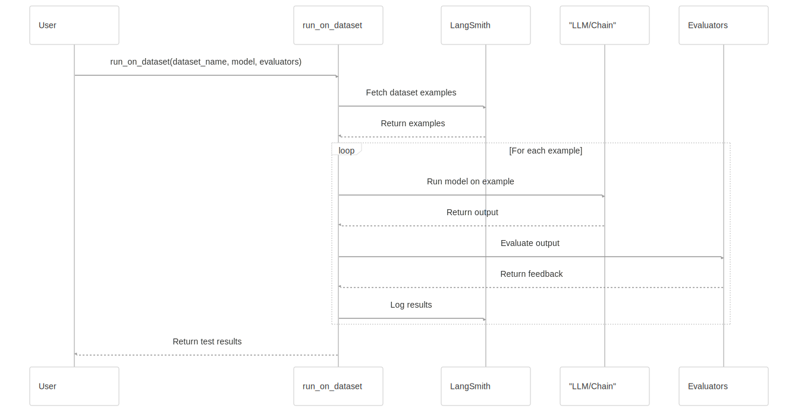

# Evaluation and Testing

[Powered by Devin](https://devin.ai)

[DeepWiki](https://deepwiki.com)

[DeepWiki](/)

[langchain-ai/langchain](https://github.com/langchain-ai/langchain)

[powered by

Devin](https://devin.ai)Share

Last indexed: 17 April 2025 ([b36c2b](https://github.com/langchain-ai/langchain/commits/b36c2bf8))

* [LangChain Overview](/langchain-ai/langchain/1-langchain-overview)
* [Core Architecture](/langchain-ai/langchain/2-core-architecture)
* [Package Structure](/langchain-ai/langchain/2.1-package-structure)
* [Runnable Interface & LCEL](/langchain-ai/langchain/2.2-runnable-interface-and-lcel)
* [Message System](/langchain-ai/langchain/2.3-message-system)
* [Provider Integrations](/langchain-ai/langchain/3-provider-integrations)
* [Model Interfaces](/langchain-ai/langchain/3.1-model-interfaces)
* [Provider-Specific Implementations](/langchain-ai/langchain/3.2-provider-specific-implementations)
* [Retrieval and Vector Stores](/langchain-ai/langchain/4-retrieval-and-vector-stores)
* [Chains and Agents](/langchain-ai/langchain/5-chains-and-agents)
* [Chain Types and Implementation](/langchain-ai/langchain/5.1-chain-types-and-implementation)
* [Agent System](/langchain-ai/langchain/5.2-agent-system)
* [Tools and Evaluation](/langchain-ai/langchain/6-tools-and-evaluation)
* [Tool System](/langchain-ai/langchain/6.1-tool-system)
* [Evaluation and Testing](/langchain-ai/langchain/6.2-evaluation-and-testing)
* [Developer Tools](/langchain-ai/langchain/7-developer-tools)
* [CLI and Templates](/langchain-ai/langchain/7.1-cli-and-templates)
* [CI/CD and Release Process](/langchain-ai/langchain/7.2-cicd-and-release-process)
* [Documentation System](/langchain-ai/langchain/8-documentation-system)
* [User Documentation](/langchain-ai/langchain/8.1-user-documentation)
* [API Reference Generation](/langchain-ai/langchain/8.2-api-reference-generation)

Menu

# Evaluation and Testing

Relevant source files

* [libs/community/langchain\_community/callbacks/tracers/wandb.py](https://github.com/langchain-ai/langchain/blob/b36c2bf8/libs/community/langchain_community/callbacks/tracers/wandb.py)
* [libs/langchain/langchain/callbacks/base.py](https://github.com/langchain-ai/langchain/blob/b36c2bf8/libs/langchain/langchain/callbacks/base.py)
* [libs/langchain/langchain/callbacks/manager.py](https://github.com/langchain-ai/langchain/blob/b36c2bf8/libs/langchain/langchain/callbacks/manager.py)
* [libs/langchain/langchain/callbacks/tracers/base.py](https://github.com/langchain-ai/langchain/blob/b36c2bf8/libs/langchain/langchain/callbacks/tracers/base.py)
* [libs/langchain/langchain/callbacks/tracers/evaluation.py](https://github.com/langchain-ai/langchain/blob/b36c2bf8/libs/langchain/langchain/callbacks/tracers/evaluation.py)
* [libs/langchain/langchain/callbacks/tracers/langchain.py](https://github.com/langchain-ai/langchain/blob/b36c2bf8/libs/langchain/langchain/callbacks/tracers/langchain.py)
* [libs/langchain/langchain/callbacks/tracers/log\_stream.py](https://github.com/langchain-ai/langchain/blob/b36c2bf8/libs/langchain/langchain/callbacks/tracers/log_stream.py)
* [libs/langchain/langchain/callbacks/tracers/schemas.py](https://github.com/langchain-ai/langchain/blob/b36c2bf8/libs/langchain/langchain/callbacks/tracers/schemas.py)
* [libs/langchain/langchain/callbacks/tracers/wandb.py](https://github.com/langchain-ai/langchain/blob/b36c2bf8/libs/langchain/langchain/callbacks/tracers/wandb.py)
* [libs/langchain/langchain/smith/evaluation/name\_generation.py](https://github.com/langchain-ai/langchain/blob/b36c2bf8/libs/langchain/langchain/smith/evaluation/name_generation.py)
* [libs/langchain/langchain/smith/evaluation/progress.py](https://github.com/langchain-ai/langchain/blob/b36c2bf8/libs/langchain/langchain/smith/evaluation/progress.py)
* [libs/langchain/langchain/smith/evaluation/runner\_utils.py](https://github.com/langchain-ai/langchain/blob/b36c2bf8/libs/langchain/langchain/smith/evaluation/runner_utils.py)
* [libs/langchain/tests/unit\_tests/smith/evaluation/test\_runner\_utils.py](https://github.com/langchain-ai/langchain/blob/b36c2bf8/libs/langchain/tests/unit_tests/smith/evaluation/test_runner_utils.py)

This page documents the evaluation and testing systems in LangChain, which enable you to assess the performance and correctness of your LLM applications. These systems help you measure the quality of outputs, track metrics, and systematically improve your LangChain applications.

For information about the overall tool system, see [Tool System](/langchain-ai/langchain/6.1-tool-system).

## Architecture Overview

The evaluation framework in LangChain is built upon the callback and tracing systems, which provide hooks into the execution of your applications. This allows for detailed monitoring and assessment of each step in your application's execution.



Sources:

* [libs/langchain/langchain/smith/evaluation/runner\_utils.py416-447](https://github.com/langchain-ai/langchain/blob/b36c2bf8/libs/langchain/langchain/smith/evaluation/runner_utils.py#L416-L447)
* [libs/langchain/langchain/callbacks/tracers/evaluation.py1-9](https://github.com/langchain-ai/langchain/blob/b36c2bf8/libs/langchain/langchain/callbacks/tracers/evaluation.py#L1-L9)

## Callback System for Evaluation

At the foundation of LangChain's evaluation capabilities is the callback system. Callbacks allow you to hook into various events during the execution of chains, LLMs, agents, and other components.

The key callback types relevant for evaluation include:

* `BaseCallbackHandler`: Base class for all callback handlers
* `LangChainTracer`: Records executions to the LangSmith platform
* `EvaluatorCallbackHandler`: Runs evaluators over completed runs



Sources:

* [libs/langchain/langchain/callbacks/base.py1-30](https://github.com/langchain-ai/langchain/blob/b36c2bf8/libs/langchain/langchain/callbacks/base.py#L1-L30)
* [libs/langchain/langchain/callbacks/manager.py1-90](https://github.com/langchain-ai/langchain/blob/b36c2bf8/libs/langchain/langchain/callbacks/manager.py#L1-L90)
* [libs/langchain/langchain/callbacks/tracers/langchain.py1-9](https://github.com/langchain-ai/langchain/blob/b36c2bf8/libs/langchain/langchain/callbacks/tracers/langchain.py#L1-L9)
* [libs/langchain/langchain/callbacks/tracers/evaluation.py1-9](https://github.com/langchain-ai/langchain/blob/b36c2bf8/libs/langchain/langchain/callbacks/tracers/evaluation.py#L1-L9)

## Evaluation Types

LangChain supports different types of evaluations to assess various aspects of your application's performance.

### String Evaluators

String evaluators assess text outputs from your LLMs and chains. They are particularly useful for tasks like question answering, summarization, and other text generation tasks.

### Run Evaluators

Run evaluators can evaluate the entire execution trace of a LangChain application, including intermediate steps and reasoning processes. This is useful for evaluating complex chains and agents.



Sources:

* [libs/langchain/langchain/smith/evaluation/runner\_utils.py529-578](https://github.com/langchain-ai/langchain/blob/b36c2bf8/libs/langchain/langchain/smith/evaluation/runner_utils.py#L529-L578)
* [libs/langchain/langchain/smith/evaluation/runner\_utils.py594-653](https://github.com/langchain-ai/langchain/blob/b36c2bf8/libs/langchain/langchain/smith/evaluation/runner_utils.py#L594-L653)

## Running Evaluations on Datasets

A key feature of LangChain's evaluation system is the ability to run your models and chains over datasets to evaluate their performance systematically.

### Setting Up Evaluation Runs

The `run_on_dataset` and `arun_on_dataset` functions in the `langchain.smith.evaluation.runner_utils` module provide a way to run your LangChain components over datasets and collect evaluation metrics.



The main steps involved in running an evaluation are:

1. Prepare your model or chain
2. Select or create a dataset
3. Configure evaluators
4. Run the evaluation
5. Analyze the results

Sources:

* [libs/langchain/langchain/smith/evaluation/runner\_utils.py961-1022](https://github.com/langchain-ai/langchain/blob/b36c2bf8/libs/langchain/langchain/smith/evaluation/runner_utils.py#L961-L1022)
* [libs/langchain/tests/unit\_tests/smith/evaluation/test\_runner\_utils.py245-357](https://github.com/langchain-ai/langchain/blob/b36c2bf8/libs/langchain/tests/unit_tests/smith/evaluation/test_runner_utils.py#L245-L357)

### Example Dataset Structure

When evaluating LLMs or chains, your dataset should contain examples with inputs and expected outputs:

```
Example {
  id: UUID,
  inputs: Dict[str, Any],  # Inputs to your model/chain
  outputs: Dict[str, Any]  # Expected/reference outputs
}

```

Sources:

* [libs/langchain/tests/unit\_tests/smith/evaluation/test\_runner\_utils.py165-193](https://github.com/langchain-ai/langchain/blob/b36c2bf8/libs/langchain/tests/unit_tests/smith/evaluation/test_runner_utils.py#L165-L193)
* [libs/langchain/langchain/smith/evaluation/runner\_utils.py329-360](https://github.com/langchain-ai/langchain/blob/b36c2bf8/libs/langchain/langchain/smith/evaluation/runner_utils.py#L329-L360)

## LangSmith Integration

LangChain integrates with LangSmith, a platform for tracking, monitoring, and evaluating LLM applications.

### Tracing and Logging

The `LangChainTracer` sends execution traces to LangSmith, which provides a visual interface for exploring and analyzing your application's execution.

### Running Evaluations with LangSmith

When using LangSmith, the evaluation process includes these key components:

1. **Dataset Management**: Create and manage evaluation datasets
2. **Project Creation**: Organize evaluations into projects
3. **Run Tracking**: Track individual runs and evaluations
4. **Result Analysis**: Analyze feedback and metrics



Sources:

* [libs/langchain/langchain/smith/evaluation/runner\_utils.py961-1022](https://github.com/langchain-ai/langchain/blob/b36c2bf8/libs/langchain/langchain/smith/evaluation/runner_utils.py#L961-L1022)
* [libs/langchain/langchain/callbacks/tracers/langchain.py1-9](https://github.com/langchain-ai/langchain/blob/b36c2bf8/libs/langchain/langchain/callbacks/tracers/langchain.py#L1-L9)

## Working with Evaluation Results

After running an evaluation, you can analyze the results to understand your application's performance.

### TestResult

The `TestResult` class provides methods for working with evaluation results, including:

* Converting results to a DataFrame
* Calculating aggregate statistics
* Filtering and analyzing feedback

```
results = {
    "example_id": {
        "input": {...},       # Example inputs
        "output": {...},      # Model outputs
        "reference": {...},   # Reference outputs
        "feedback": [...],    # Evaluation feedback
        "execution_time": 0.5 # Time taken
    }
}
```

Sources:

* [libs/langchain/langchain/smith/evaluation/runner\_utils.py82-152](https://github.com/langchain-ai/langchain/blob/b36c2bf8/libs/langchain/langchain/smith/evaluation/runner_utils.py#L82-L152)

### Visualization and Progress Tracking

LangChain provides utilities for tracking evaluation progress:

* `ProgressBarCallback`: Displays a progress bar in the console
* `TestResult.to_dataframe()`: Converts results to a pandas DataFrame for analysis

Sources:

* [libs/langchain/langchain/smith/evaluation/progress.py13-128](https://github.com/langchain-ai/langchain/blob/b36c2bf8/libs/langchain/langchain/smith/evaluation/progress.py#L13-L128)

## Custom Evaluators

You can create custom evaluators to assess specific aspects of your application's performance.

### Creating a Custom Run Evaluator

To create a custom evaluator, you can either:

1. Decorate a function with `@run_evaluator`
2. Implement the `RunEvaluator` interface
3. Use a `StringEvaluator` with `StringRunEvaluatorChain`



Sources:

* [libs/langchain/langchain/smith/evaluation/runner\_utils.py529-578](https://github.com/langchain-ai/langchain/blob/b36c2bf8/libs/langchain/langchain/smith/evaluation/runner_utils.py#L529-L578)
* [libs/langchain/langchain/smith/evaluation/runner\_utils.py632-653](https://github.com/langchain-ai/langchain/blob/b36c2bf8/libs/langchain/langchain/smith/evaluation/runner_utils.py#L632-L653)

## Best Practices for Evaluation

When evaluating LangChain applications, consider these best practices:

### 1. Use Structured Datasets

Create well-structured datasets with clear inputs and reference outputs. This helps in measuring performance consistently over time.

### 2. Combine Multiple Evaluators

Use multiple evaluators to assess different aspects of your application's performance:

* Correctness evaluators for factual accuracy
* Style evaluators for tone and clarity
* Task-specific evaluators for domain-specific requirements

### 3. Track Performance Over Time

Regularly run evaluations as you develop your application to track improvements or regressions.

### 4. Handle Errors Gracefully

The evaluation system includes error handling to ensure your evaluation runs don't fail completely if individual examples encounter errors.

Sources:

* [libs/langchain/langchain/smith/evaluation/runner\_utils.py798-807](https://github.com/langchain-ai/langchain/blob/b36c2bf8/libs/langchain/langchain/smith/evaluation/runner_utils.py#L798-L807)
* [libs/langchain/langchain/smith/evaluation/runner\_utils.py952-960](https://github.com/langchain-ai/langchain/blob/b36c2bf8/libs/langchain/langchain/smith/evaluation/runner_utils.py#L952-L960)

## Code Examples

Here's a basic example of how to set up an evaluation run:

```
from langchain.smith import run_on_dataset
from langchain.chat_models import ChatOpenAI
from langchain.chains import LLMChain
from langchain.prompts import PromptTemplate

# Set up a model or chain
llm = ChatOpenAI()
prompt = PromptTemplate.from_template("Answer this question: {question}")
chain = LLMChain(llm=llm, prompt=prompt)

# Run the evaluation
results = run_on_dataset(
    dataset_name="my_qa_dataset",
    llm_or_chain_factory=lambda: chain,
    evaluation={
        "evaluators": ["qa"]  # Use QA evaluator
    }
)

# Analyze results
print(results.get_aggregate_feedback())
```

## Integrations with Other Tracing Systems

In addition to LangSmith, LangChain supports other tracing systems:

### Wandb Integration

The `WandbTracer` enables integration with Weights & Biases for experiment tracking and visualization.



Sources:

* [libs/langchain/langchain/callbacks/tracers/wandb.py1-28](https://github.com/langchain-ai/langchain/blob/b36c2bf8/libs/langchain/langchain/callbacks/tracers/wandb.py#L1-L28)
* [libs/community/langchain\_community/callbacks/tracers/wandb.py250-508](https://github.com/langchain-ai/langchain/blob/b36c2bf8/libs/community/langchain_community/callbacks/tracers/wandb.py#L250-L508)

## Summary

LangChain's evaluation and testing system provides a comprehensive framework for assessing and improving your LLM applications. The key components are:

1. **Callback System**: The foundation for tracking execution
2. **Tracers**: Record execution details for analysis
3. **Evaluators**: Assess outputs and provide feedback
4. **LangSmith Integration**: Platform for organizing and visualizing evaluations
5. **Dataset Runners**: Utilities for running evaluations over datasets

By leveraging these tools, you can systematically improve your LangChain applications and ensure they meet your quality standards.

Sources:

* [libs/langchain/langchain/smith/evaluation/runner\_utils.py1-1074](https://github.com/langchain-ai/langchain/blob/b36c2bf8/libs/langchain/langchain/smith/evaluation/runner_utils.py#L1-L1074)
* [libs/langchain/langchain/callbacks/tracers/evaluation.py1-9](https://github.com/langchain-ai/langchain/blob/b36c2bf8/libs/langchain/langchain/callbacks/tracers/evaluation.py#L1-L9)

Auto-refresh not enabled yet

Try DeepWiki on your private codebase with [Devin](/private-repo)

### On this page

* [Evaluation and Testing](#evaluation-and-testing)
* [Architecture Overview](#architecture-overview)
* [Callback System for Evaluation](#callback-system-for-evaluation)
* [Evaluation Types](#evaluation-types)
* [String Evaluators](#string-evaluators)
* [Run Evaluators](#run-evaluators)
* [Running Evaluations on Datasets](#running-evaluations-on-datasets)
* [Setting Up Evaluation Runs](#setting-up-evaluation-runs)
* [Example Dataset Structure](#example-dataset-structure)
* [LangSmith Integration](#langsmith-integration)
* [Tracing and Logging](#tracing-and-logging)
* [Running Evaluations with LangSmith](#running-evaluations-with-langsmith)
* [Working with Evaluation Results](#working-with-evaluation-results)
* [TestResult](#testresult)
* [Visualization and Progress Tracking](#visualization-and-progress-tracking)
* [Custom Evaluators](#custom-evaluators)
* [Creating a Custom Run Evaluator](#creating-a-custom-run-evaluator)
* [Best Practices for Evaluation](#best-practices-for-evaluation)
* [1. Use Structured Datasets](#1-use-structured-datasets)
* [2. Combine Multiple Evaluators](#2-combine-multiple-evaluators)
* [3. Track Performance Over Time](#3-track-performance-over-time)
* [4. Handle Errors Gracefully](#4-handle-errors-gracefully)
* [Code Examples](#code-examples)
* [Integrations with Other Tracing Systems](#integrations-with-other-tracing-systems)
* [Wandb Integration](#wandb-integration)
* [Summary](#summary)

Ask Devin about langchain-ai/langchain

Deep Research