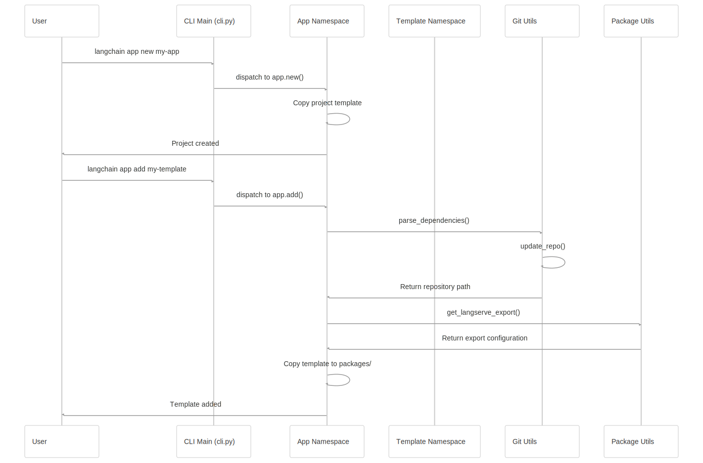

# Developer Tools

[Powered by Devin](https://devin.ai)

[DeepWiki](https://deepwiki.com)

[DeepWiki](/)

[langchain-ai/langchain](https://github.com/langchain-ai/langchain)

[powered by

Devin](https://devin.ai)Share

Last indexed: 17 April 2025 ([b36c2b](https://github.com/langchain-ai/langchain/commits/b36c2bf8))

* [LangChain Overview](/langchain-ai/langchain/1-langchain-overview)
* [Core Architecture](/langchain-ai/langchain/2-core-architecture)
* [Package Structure](/langchain-ai/langchain/2.1-package-structure)
* [Runnable Interface & LCEL](/langchain-ai/langchain/2.2-runnable-interface-and-lcel)
* [Message System](/langchain-ai/langchain/2.3-message-system)
* [Provider Integrations](/langchain-ai/langchain/3-provider-integrations)
* [Model Interfaces](/langchain-ai/langchain/3.1-model-interfaces)
* [Provider-Specific Implementations](/langchain-ai/langchain/3.2-provider-specific-implementations)
* [Retrieval and Vector Stores](/langchain-ai/langchain/4-retrieval-and-vector-stores)
* [Chains and Agents](/langchain-ai/langchain/5-chains-and-agents)
* [Chain Types and Implementation](/langchain-ai/langchain/5.1-chain-types-and-implementation)
* [Agent System](/langchain-ai/langchain/5.2-agent-system)
* [Tools and Evaluation](/langchain-ai/langchain/6-tools-and-evaluation)
* [Tool System](/langchain-ai/langchain/6.1-tool-system)
* [Evaluation and Testing](/langchain-ai/langchain/6.2-evaluation-and-testing)
* [Developer Tools](/langchain-ai/langchain/7-developer-tools)
* [CLI and Templates](/langchain-ai/langchain/7.1-cli-and-templates)
* [CI/CD and Release Process](/langchain-ai/langchain/7.2-cicd-and-release-process)
* [Documentation System](/langchain-ai/langchain/8-documentation-system)
* [User Documentation](/langchain-ai/langchain/8.1-user-documentation)
* [API Reference Generation](/langchain-ai/langchain/8.2-api-reference-generation)

Menu

# Developer Tools

Relevant source files

* [.github/scripts/check\_diff.py](https://github.com/langchain-ai/langchain/blob/b36c2bf8/.github/scripts/check_diff.py)
* [.github/scripts/get\_min\_versions.py](https://github.com/langchain-ai/langchain/blob/b36c2bf8/.github/scripts/get_min_versions.py)
* [.github/workflows/\_compile\_integration\_test.yml](https://github.com/langchain-ai/langchain/blob/b36c2bf8/.github/workflows/_compile_integration_test.yml)
* [.github/workflows/\_integration\_test.yml](https://github.com/langchain-ai/langchain/blob/b36c2bf8/.github/workflows/_integration_test.yml)
* [.github/workflows/\_lint.yml](https://github.com/langchain-ai/langchain/blob/b36c2bf8/.github/workflows/_lint.yml)
* [.github/workflows/\_release.yml](https://github.com/langchain-ai/langchain/blob/b36c2bf8/.github/workflows/_release.yml)
* [.github/workflows/\_test.yml](https://github.com/langchain-ai/langchain/blob/b36c2bf8/.github/workflows/_test.yml)
* [.github/workflows/\_test\_doc\_imports.yml](https://github.com/langchain-ai/langchain/blob/b36c2bf8/.github/workflows/_test_doc_imports.yml)
* [.github/workflows/\_test\_pydantic.yml](https://github.com/langchain-ai/langchain/blob/b36c2bf8/.github/workflows/_test_pydantic.yml)
* [.github/workflows/\_test\_release.yml](https://github.com/langchain-ai/langchain/blob/b36c2bf8/.github/workflows/_test_release.yml)
* [.github/workflows/check\_diffs.yml](https://github.com/langchain-ai/langchain/blob/b36c2bf8/.github/workflows/check_diffs.yml)
* [.github/workflows/scheduled\_test.yml](https://github.com/langchain-ai/langchain/blob/b36c2bf8/.github/workflows/scheduled_test.yml)
* [libs/cli/CONTRIBUTING.md](https://github.com/langchain-ai/langchain/blob/b36c2bf8/libs/cli/CONTRIBUTING.md)
* [libs/cli/DOCS.md](https://github.com/langchain-ai/langchain/blob/b36c2bf8/libs/cli/DOCS.md)
* [libs/cli/README.md](https://github.com/langchain-ai/langchain/blob/b36c2bf8/libs/cli/README.md)
* [libs/cli/langchain\_cli/cli.py](https://github.com/langchain-ai/langchain/blob/b36c2bf8/libs/cli/langchain_cli/cli.py)
* [libs/cli/langchain\_cli/constants.py](https://github.com/langchain-ai/langchain/blob/b36c2bf8/libs/cli/langchain_cli/constants.py)
* [libs/cli/langchain\_cli/dev\_scripts.py](https://github.com/langchain-ai/langchain/blob/b36c2bf8/libs/cli/langchain_cli/dev_scripts.py)
* [libs/cli/langchain\_cli/namespaces/app.py](https://github.com/langchain-ai/langchain/blob/b36c2bf8/libs/cli/langchain_cli/namespaces/app.py)
* [libs/cli/langchain\_cli/namespaces/template.py](https://github.com/langchain-ai/langchain/blob/b36c2bf8/libs/cli/langchain_cli/namespaces/template.py)
* [libs/cli/langchain\_cli/package\_template/README.md](https://github.com/langchain-ai/langchain/blob/b36c2bf8/libs/cli/langchain_cli/package_template/README.md)
* [libs/cli/langchain\_cli/package\_template/package\_template/\_\_init\_\_.py](https://github.com/langchain-ai/langchain/blob/b36c2bf8/libs/cli/langchain_cli/package_template/package_template/__init__.py)
* [libs/cli/langchain\_cli/project\_template/Dockerfile](https://github.com/langchain-ai/langchain/blob/b36c2bf8/libs/cli/langchain_cli/project_template/Dockerfile)
* [libs/cli/langchain\_cli/project\_template/README.md](https://github.com/langchain-ai/langchain/blob/b36c2bf8/libs/cli/langchain_cli/project_template/README.md)
* [libs/cli/langchain\_cli/project\_template/app/server.py](https://github.com/langchain-ai/langchain/blob/b36c2bf8/libs/cli/langchain_cli/project_template/app/server.py)
* [libs/cli/langchain\_cli/project\_template/pyproject.toml](https://github.com/langchain-ai/langchain/blob/b36c2bf8/libs/cli/langchain_cli/project_template/pyproject.toml)
* [libs/cli/langchain\_cli/utils/events.py](https://github.com/langchain-ai/langchain/blob/b36c2bf8/libs/cli/langchain_cli/utils/events.py)
* [libs/cli/langchain\_cli/utils/git.py](https://github.com/langchain-ai/langchain/blob/b36c2bf8/libs/cli/langchain_cli/utils/git.py)
* [libs/cli/langchain\_cli/utils/github.py](https://github.com/langchain-ai/langchain/blob/b36c2bf8/libs/cli/langchain_cli/utils/github.py)
* [libs/cli/langchain\_cli/utils/packages.py](https://github.com/langchain-ai/langchain/blob/b36c2bf8/libs/cli/langchain_cli/utils/packages.py)
* [libs/cli/pyproject.toml](https://github.com/langchain-ai/langchain/blob/b36c2bf8/libs/cli/pyproject.toml)

This page documents the developer tools available in the LangChain ecosystem, with a focus on the tools that help developers create, test, and deploy LangChain applications. These tools include the LangChain CLI, which simplifies application creation and template management, as well as the CI/CD infrastructure that ensures code quality and reliability.

## LangChain CLI

The LangChain CLI is a command-line tool that streamlines the development of LangChain applications and templates. It provides commands for creating new projects, managing packages, and serving applications.

### Installation and Version

The CLI can be installed via pip:

```
pip install -U langchain-cli
```

Check the installed version:

```
langchain --version
```

### CLI Architecture

**CLI Command Structure**



The CLI is built on Typer and organized into namespaces for different functionality areas. The main entry point registers all subcommands and provides version information.

Sources: [libs/cli/langchain\_cli/cli.py1-85](https://github.com/langchain-ai/langchain/blob/b36c2bf8/libs/cli/langchain_cli/cli.py#L1-L85) [libs/cli/DOCS.md1-190](https://github.com/langchain-ai/langchain/blob/b36c2bf8/libs/cli/DOCS.md#L1-L190)

### Creating Applications

The `langchain app new` command creates a new LangServe application with a predefined structure.

```
langchain app new my-app-name
```

This creates a project with the following structure:

```
my-app-name/
├── app/
│   └── server.py
├── packages/
├── pyproject.toml
├── README.md
└── Dockerfile

```

The command also allows adding templates during creation and setting up the project with dependencies.

Sources: [libs/cli/langchain\_cli/namespaces/app.py36-132](https://github.com/langchain-ai/langchain/blob/b36c2bf8/libs/cli/langchain_cli/namespaces/app.py#L36-L132) [libs/cli/langchain\_cli/project\_template/README.md1-79](https://github.com/langchain-ai/langchain/blob/b36c2bf8/libs/cli/langchain_cli/project_template/README.md#L1-L79)

### Managing Templates

The LangChain ecosystem provides many reusable templates for common LLM patterns. These can be added to applications:

```
langchain app add extraction-openai-functions
```

Templates can be sourced from:

* Official LangChain templates repository
* Custom GitHub repositories
* Other Git providers

**Template Integration Flow**



Sources: [libs/cli/langchain\_cli/namespaces/app.py133-295](https://github.com/langchain-ai/langchain/blob/b36c2bf8/libs/cli/langchain_cli/namespaces/app.py#L133-L295) [libs/cli/langchain\_cli/utils/git.py1-198](https://github.com/langchain-ai/langchain/blob/b36c2bf8/libs/cli/langchain_cli/utils/git.py#L1-L198)

### Developing Templates

For developers who want to create reusable components, the CLI provides commands for template development:

```
langchain template new my-template
```

This creates a package structure ready for development:

```
my-template/
├── my_template/
│   ├── __init__.py
│   └── chain.py
├── pyproject.toml
└── README.md

```

Templates can be tested locally with:

```
langchain template serve
```

This launches a demo server with a playground UI for interacting with the template.

Sources: [libs/cli/langchain\_cli/namespaces/template.py1-155](https://github.com/langchain-ai/langchain/blob/b36c2bf8/libs/cli/langchain_cli/namespaces/template.py#L1-L155) [libs/cli/langchain\_cli/dev\_scripts.py1-51](https://github.com/langchain-ai/langchain/blob/b36c2bf8/libs/cli/langchain_cli/dev_scripts.py#L1-L51)

## CI/CD Infrastructure

LangChain uses an extensive CI/CD infrastructure to ensure code quality and manage releases. The system handles testing, linting, and publishing packages.

### Test Selection System

The repository uses a sophisticated test selection system to run only necessary tests for changed files. This system is implemented in `check_diff.py` which analyzes changed files and determines which tests to run.

**Test Selection Flow**



The system builds test matrices that include different Python versions and package directories, ensuring efficient test runs.

Sources: [.github/scripts/check\_diff.py1-337](https://github.com/langchain-ai/langchain/blob/b36c2bf8/.github/scripts/check_diff.py#L1-L337) [.github/workflows/check\_diffs.yml1-172](https://github.com/langchain-ai/langchain/blob/b36c2bf8/.github/workflows/check_diffs.yml#L1-L172)

### Release Process

LangChain packages are released through an automated process that builds, tests, and publishes packages to PyPI.

**Release Pipeline**



The release workflow is designed with security in mind, separating the build and publish steps to limit access to credentials.

Sources: [.github/workflows/\_release.yml1-494](https://github.com/langchain-ai/langchain/blob/b36c2bf8/.github/workflows/_release.yml#L1-L494) [.github/workflows/\_test\_release.yml1-107](https://github.com/langchain-ai/langchain/blob/b36c2bf8/.github/workflows/_test_release.yml#L1-L107)

### Test Types

The CI system supports multiple types of tests:

| Test Type | Description | Workflow |
| --- | --- | --- |
| Lint | Code style and static analysis | `_lint.yml` |
| Unit Tests | Basic functionality testing | `_test.yml` |
| Integration Tests | Tests with external services | `_integration_test.yml` |
| Extended Tests | Cross-package compatibility | `check_diffs.yml` |
| Pydantic Tests | Compatibility with different Pydantic versions | `_test_pydantic.yml` |
| Documentation Tests | Tests doc imports and examples | `_test_doc_imports.yml` |
| Scheduled Tests | Regular testing of partner integrations | `scheduled_test.yml` |

Sources: [.github/workflows/\_lint.yml1-77](https://github.com/langchain-ai/langchain/blob/b36c2bf8/.github/workflows/_lint.yml#L1-L77) [.github/workflows/\_test.yml1-76](https://github.com/langchain-ai/langchain/blob/b36c2bf8/.github/workflows/_test.yml#L1-L76) [.github/workflows/\_integration\_test.yml1-94](https://github.com/langchain-ai/langchain/blob/b36c2bf8/.github/workflows/_integration_test.yml#L1-L94) [.github/workflows/scheduled\_test.yml1-171](https://github.com/langchain-ai/langchain/blob/b36c2bf8/.github/workflows/scheduled_test.yml#L1-L171)

## Templates and Project Structure

The LangChain CLI provides templates for both applications and packages, ensuring consistent structure and best practices.

### Application Template

The application template includes:

* FastAPI server setup with LangServe
* Package management structure
* Docker configuration
* README with setup instructions

**Application Structure**



Sources: [libs/cli/langchain\_cli/project\_template/app/server.py1-20](https://github.com/langchain-ai/langchain/blob/b36c2bf8/libs/cli/langchain_cli/project_template/app/server.py#L1-L20) [libs/cli/langchain\_cli/project\_template/pyproject.toml1-24](https://github.com/langchain-ai/langchain/blob/b36c2bf8/libs/cli/langchain_cli/project_template/pyproject.toml#L1-L24) [libs/cli/langchain\_cli/project\_template/Dockerfile1-22](https://github.com/langchain-ai/langchain/blob/b36c2bf8/libs/cli/langchain_cli/project_template/Dockerfile#L1-L22)

### Package Template

The package template provides a structure for creating reusable LangChain components:

* Module with chain implementation
* LangServe export configuration
* README with installation and usage instructions

**Package Structure**



The template includes configurations for LangServe, making it easy to serve the template as an API endpoint.

Sources: [libs/cli/langchain\_cli/package\_template/package\_template/\_\_init\_\_.py1-4](https://github.com/langchain-ai/langchain/blob/b36c2bf8/libs/cli/langchain_cli/package_template/package_template/__init__.py#L1-L4) [libs/cli/langchain\_cli/package\_template/README.md1-57](https://github.com/langchain-ai/langchain/blob/b36c2bf8/libs/cli/langchain_cli/package_template/README.md#L1-L57)

## Minimum Version Testing

LangChain employs a system to test packages with minimum dependency versions, ensuring compatibility with the full range of supported dependencies.

The `get_min_versions.py` script extracts minimum versions from pyproject.toml files and runs tests against those versions:



This system helps prevent dependency drift and ensures that LangChain remains compatible with the stated minimum versions of its dependencies.

Sources: [.github/scripts/get\_min\_versions.py1-202](https://github.com/langchain-ai/langchain/blob/b36c2bf8/.github/scripts/get_min_versions.py#L1-L202) [.github/workflows/\_test.yml44-62](https://github.com/langchain-ai/langchain/blob/b36c2bf8/.github/workflows/_test.yml#L44-L62)

## CLI Implementation Details

The LangChain CLI is implemented using a modular architecture with separate namespaces for different functionality areas.

### Core Components

| Component | Description | File |
| --- | --- | --- |
| `cli.py` | Main entry point with command registration | `langchain_cli/cli.py` |
| `namespaces/app.py` | App management commands | `langchain_cli/namespaces/app.py` |
| `namespaces/template.py` | Template development commands | `langchain_cli/namespaces/template.py` |
| `utils/git.py` | Git operations for template management | `langchain_cli/utils/git.py` |
| `utils/packages.py` | Package discovery and metadata | `langchain_cli/utils/packages.py` |
| `dev_scripts.py` | Demo server implementations | `langchain_cli/dev_scripts.py` |

Sources: [libs/cli/langchain\_cli/cli.py1-85](https://github.com/langchain-ai/langchain/blob/b36c2bf8/libs/cli/langchain_cli/cli.py#L1-L85) [libs/cli/langchain\_cli/namespaces/app.py1-366](https://github.com/langchain-ai/langchain/blob/b36c2bf8/libs/cli/langchain_cli/namespaces/app.py#L1-L366) [libs/cli/langchain\_cli/namespaces/template.py1-155](https://github.com/langchain-ai/langchain/blob/b36c2bf8/libs/cli/langchain_cli/namespaces/template.py#L1-L155)

### Command Processing Flow



This flow shows how commands are processed from CLI input through to execution, highlighting the interactions between different components.

Sources: [libs/cli/langchain\_cli/cli.py1-85](https://github.com/langchain-ai/langchain/blob/b36c2bf8/libs/cli/langchain_cli/cli.py#L1-L85) [libs/cli/langchain\_cli/namespaces/app.py133-295](https://github.com/langchain-ai/langchain/blob/b36c2bf8/libs/cli/langchain_cli/namespaces/app.py#L133-L295)

## Summary

The LangChain Developer Tools provide a comprehensive set of utilities for building, testing, and deploying LangChain applications. The CLI simplifies common tasks like creating new projects and managing templates, while the CI/CD infrastructure ensures code quality and reliability. Together, these tools create a productive development environment for LangChain developers.

Auto-refresh not enabled yet

Try DeepWiki on your private codebase with [Devin](/private-repo)

### On this page

* [Developer Tools](#developer-tools)
* [LangChain CLI](#langchain-cli)
* [Installation and Version](#installation-and-version)
* [CLI Architecture](#cli-architecture)
* [Creating Applications](#creating-applications)
* [Managing Templates](#managing-templates)
* [Developing Templates](#developing-templates)
* [CI/CD Infrastructure](#cicd-infrastructure)
* [Test Selection System](#test-selection-system)
* [Release Process](#release-process)
* [Test Types](#test-types)
* [Templates and Project Structure](#templates-and-project-structure)
* [Application Template](#application-template)
* [Package Template](#package-template)
* [Minimum Version Testing](#minimum-version-testing)
* [CLI Implementation Details](#cli-implementation-details)
* [Core Components](#core-components)
* [Command Processing Flow](#command-processing-flow)
* [Summary](#summary)

Ask Devin about langchain-ai/langchain

Deep Research