# CLI and Templates

[Powered by Devin](https://devin.ai)

[DeepWiki](https://deepwiki.com)

[DeepWiki](/)

[langchain-ai/langchain](https://github.com/langchain-ai/langchain)

[powered by

Devin](https://devin.ai)Share

Last indexed: 17 April 2025 ([b36c2b](https://github.com/langchain-ai/langchain/commits/b36c2bf8))

* [LangChain Overview](/langchain-ai/langchain/1-langchain-overview)
* [Core Architecture](/langchain-ai/langchain/2-core-architecture)
* [Package Structure](/langchain-ai/langchain/2.1-package-structure)
* [Runnable Interface & LCEL](/langchain-ai/langchain/2.2-runnable-interface-and-lcel)
* [Message System](/langchain-ai/langchain/2.3-message-system)
* [Provider Integrations](/langchain-ai/langchain/3-provider-integrations)
* [Model Interfaces](/langchain-ai/langchain/3.1-model-interfaces)
* [Provider-Specific Implementations](/langchain-ai/langchain/3.2-provider-specific-implementations)
* [Retrieval and Vector Stores](/langchain-ai/langchain/4-retrieval-and-vector-stores)
* [Chains and Agents](/langchain-ai/langchain/5-chains-and-agents)
* [Chain Types and Implementation](/langchain-ai/langchain/5.1-chain-types-and-implementation)
* [Agent System](/langchain-ai/langchain/5.2-agent-system)
* [Tools and Evaluation](/langchain-ai/langchain/6-tools-and-evaluation)
* [Tool System](/langchain-ai/langchain/6.1-tool-system)
* [Evaluation and Testing](/langchain-ai/langchain/6.2-evaluation-and-testing)
* [Developer Tools](/langchain-ai/langchain/7-developer-tools)
* [CLI and Templates](/langchain-ai/langchain/7.1-cli-and-templates)
* [CI/CD and Release Process](/langchain-ai/langchain/7.2-cicd-and-release-process)
* [Documentation System](/langchain-ai/langchain/8-documentation-system)
* [User Documentation](/langchain-ai/langchain/8.1-user-documentation)
* [API Reference Generation](/langchain-ai/langchain/8.2-api-reference-generation)

Menu

# CLI and Templates

Relevant source files

* [libs/cli/CONTRIBUTING.md](https://github.com/langchain-ai/langchain/blob/b36c2bf8/libs/cli/CONTRIBUTING.md)
* [libs/cli/DOCS.md](https://github.com/langchain-ai/langchain/blob/b36c2bf8/libs/cli/DOCS.md)
* [libs/cli/README.md](https://github.com/langchain-ai/langchain/blob/b36c2bf8/libs/cli/README.md)
* [libs/cli/langchain\_cli/cli.py](https://github.com/langchain-ai/langchain/blob/b36c2bf8/libs/cli/langchain_cli/cli.py)
* [libs/cli/langchain\_cli/constants.py](https://github.com/langchain-ai/langchain/blob/b36c2bf8/libs/cli/langchain_cli/constants.py)
* [libs/cli/langchain\_cli/dev\_scripts.py](https://github.com/langchain-ai/langchain/blob/b36c2bf8/libs/cli/langchain_cli/dev_scripts.py)
* [libs/cli/langchain\_cli/namespaces/app.py](https://github.com/langchain-ai/langchain/blob/b36c2bf8/libs/cli/langchain_cli/namespaces/app.py)
* [libs/cli/langchain\_cli/namespaces/template.py](https://github.com/langchain-ai/langchain/blob/b36c2bf8/libs/cli/langchain_cli/namespaces/template.py)
* [libs/cli/langchain\_cli/package\_template/README.md](https://github.com/langchain-ai/langchain/blob/b36c2bf8/libs/cli/langchain_cli/package_template/README.md)
* [libs/cli/langchain\_cli/package\_template/package\_template/\_\_init\_\_.py](https://github.com/langchain-ai/langchain/blob/b36c2bf8/libs/cli/langchain_cli/package_template/package_template/__init__.py)
* [libs/cli/langchain\_cli/project\_template/Dockerfile](https://github.com/langchain-ai/langchain/blob/b36c2bf8/libs/cli/langchain_cli/project_template/Dockerfile)
* [libs/cli/langchain\_cli/project\_template/README.md](https://github.com/langchain-ai/langchain/blob/b36c2bf8/libs/cli/langchain_cli/project_template/README.md)
* [libs/cli/langchain\_cli/project\_template/app/server.py](https://github.com/langchain-ai/langchain/blob/b36c2bf8/libs/cli/langchain_cli/project_template/app/server.py)
* [libs/cli/langchain\_cli/project\_template/pyproject.toml](https://github.com/langchain-ai/langchain/blob/b36c2bf8/libs/cli/langchain_cli/project_template/pyproject.toml)
* [libs/cli/langchain\_cli/utils/events.py](https://github.com/langchain-ai/langchain/blob/b36c2bf8/libs/cli/langchain_cli/utils/events.py)
* [libs/cli/langchain\_cli/utils/git.py](https://github.com/langchain-ai/langchain/blob/b36c2bf8/libs/cli/langchain_cli/utils/git.py)
* [libs/cli/langchain\_cli/utils/github.py](https://github.com/langchain-ai/langchain/blob/b36c2bf8/libs/cli/langchain_cli/utils/github.py)
* [libs/cli/langchain\_cli/utils/packages.py](https://github.com/langchain-ai/langchain/blob/b36c2bf8/libs/cli/langchain_cli/utils/packages.py)
* [libs/cli/pyproject.toml](https://github.com/langchain-ai/langchain/blob/b36c2bf8/libs/cli/pyproject.toml)

This document provides a comprehensive overview of the LangChain Command Line Interface (CLI) and template system, which facilitates creating, managing, and developing LangChain applications and templates. The CLI offers tools to scaffold new projects, add existing templates, and serve applications locally for development and testing.

## Overview

The LangChain CLI enables developers to:

1. Create new LangChain applications with a standard structure
2. Add pre-built templates from the official repository or custom sources
3. Develop and test reusable templates
4. Deploy and serve LangChain applications



Sources:

* [libs/cli/langchain\_cli/cli.py1-84](https://github.com/langchain-ai/langchain/blob/b36c2bf8/libs/cli/langchain_cli/cli.py#L1-L84)
* [libs/cli/pyproject.toml1-54](https://github.com/langchain-ai/langchain/blob/b36c2bf8/libs/cli/pyproject.toml#L1-L54)
* [libs/cli/README.md1-7](https://github.com/langchain-ai/langchain/blob/b36c2bf8/libs/cli/README.md#L1-L7)

## Installation

The LangChain CLI is distributed as the `langchain-cli` package. It can be installed using pip:

```
pip install -U langchain-cli
```

Once installed, the CLI is accessible through both `langchain` and `langchain-cli` commands.

Sources:

* [libs/cli/pyproject.toml17-29](https://github.com/langchain-ai/langchain/blob/b36c2bf8/libs/cli/pyproject.toml#L17-L29)
* [libs/cli/README.md1-7](https://github.com/langchain-ai/langchain/blob/b36c2bf8/libs/cli/README.md#L1-L7)

## CLI Architecture

The LangChain CLI is structured around namespaces that organize related functionality. The main command structure is powered by the Typer library.



Sources:

* [libs/cli/langchain\_cli/cli.py1-84](https://github.com/langchain-ai/langchain/blob/b36c2bf8/libs/cli/langchain_cli/cli.py#L1-L84)
* [libs/cli/langchain\_cli/namespaces/app.py1-366](https://github.com/langchain-ai/langchain/blob/b36c2bf8/libs/cli/langchain_cli/namespaces/app.py#L1-L366)
* [libs/cli/langchain\_cli/namespaces/template.py1-155](https://github.com/langchain-ai/langchain/blob/b36c2bf8/libs/cli/langchain_cli/namespaces/template.py#L1-L155)

## Application Commands

The `app` namespace provides commands for managing LangChain applications.

### Creating a New Application

The `app new` command creates a new LangChain application with a standard structure:

```
langchain app new my-app [--package TEMPLATE]
```

This command:

1. Creates a new directory with the specified name
2. Copies the project template structure
3. Initializes a proper LangServe application
4. Optionally adds specified templates

Sources:

* [libs/cli/langchain\_cli/namespaces/app.py37-130](https://github.com/langchain-ai/langchain/blob/b36c2bf8/libs/cli/langchain_cli/namespaces/app.py#L37-L130)
* [libs/cli/langchain\_cli/project\_template/pyproject.toml1-24](https://github.com/langchain-ai/langchain/blob/b36c2bf8/libs/cli/langchain_cli/project_template/pyproject.toml#L1-L24)
* [libs/cli/langchain\_cli/project\_template/README.md1-79](https://github.com/langchain-ai/langchain/blob/b36c2bf8/libs/cli/langchain_cli/project_template/README.md#L1-L79)

### Adding Templates

The `app add` command adds templates to an existing application:

```
langchain app add TEMPLATE [--api-path PATH] [--repo REPO] [--branch BRANCH] [--pip/--no-pip]
```

Templates can be specified in several ways:

* Template name from the official repository (e.g., `extraction-openai-functions`)
* Git URL (e.g., `git+ssh://git@github.com/username/repo.git`)
* GitHub repository (e.g., `--repo username/repo`)

The command:

1. Downloads the template from the source
2. Adds it to the `packages` directory
3. Updates the application's dependencies
4. Optionally installs the template with pip

Sources:

* [libs/cli/langchain\_cli/namespaces/app.py132-294](https://github.com/langchain-ai/langchain/blob/b36c2bf8/libs/cli/langchain_cli/namespaces/app.py#L132-L294)
* [libs/cli/langchain\_cli/utils/git.py1-198](https://github.com/langchain-ai/langchain/blob/b36c2bf8/libs/cli/langchain_cli/utils/git.py#L1-L198)
* [libs/cli/langchain\_cli/constants.py1-4](https://github.com/langchain-ai/langchain/blob/b36c2bf8/libs/cli/langchain_cli/constants.py#L1-L4)

### Removing Templates

The `app remove` command removes templates from an application:

```
langchain app remove API_PATH
```

This removes the template from the `packages` directory and updates the dependencies.

Sources:

* [libs/cli/langchain\_cli/namespaces/app.py296-336](https://github.com/langchain-ai/langchain/blob/b36c2bf8/libs/cli/langchain_cli/namespaces/app.py#L296-L336)

### Serving an Application

The `app serve` command starts the LangServe application:

```
langchain app serve [--port PORT] [--host HOST] [--app APP]
```

This command:

1. Adds the current directory to the Python path
2. Starts a uvicorn server with the specified application
3. Enables hot-reloading for development

Sources:

* [libs/cli/langchain\_cli/namespaces/app.py338-365](https://github.com/langchain-ai/langchain/blob/b36c2bf8/libs/cli/langchain_cli/namespaces/app.py#L338-L365)
* [libs/cli/langchain\_cli/project\_template/app/server.py1-20](https://github.com/langchain-ai/langchain/blob/b36c2bf8/libs/cli/langchain_cli/project_template/app/server.py#L1-L20)

## Template Commands

The `template` namespace provides commands for developing and testing reusable templates.

### Creating a New Template

The `template new` command creates a new template package:

```
langchain template new TEMPLATE_NAME [--with-poetry/--no-poetry]
```

This command:

1. Creates a new directory with the specified name
2. Copies the package template structure
3. Updates package names and module references
4. Optionally initializes the package with Poetry

Sources:

* [libs/cli/langchain\_cli/namespaces/template.py19-86](https://github.com/langchain-ai/langchain/blob/b36c2bf8/libs/cli/langchain_cli/namespaces/template.py#L19-L86)
* [libs/cli/langchain\_cli/package\_template/package\_template/\_\_init\_\_.py1-4](https://github.com/langchain-ai/langchain/blob/b36c2bf8/libs/cli/langchain_cli/package_template/package_template/__init__.py#L1-L4)
* [libs/cli/langchain\_cli/package\_template/README.md1-64](https://github.com/langchain-ai/langchain/blob/b36c2bf8/libs/cli/langchain_cli/package_template/README.md#L1-L64)

### Testing a Template

The `template serve` command starts a demo server for the template:

```
langchain template serve [--port PORT] [--host HOST] [--configurable/--no-configurable] [--chat-playground/--no-chat-playground]
```

This command:

1. Loads the template's `pyproject.toml` configuration
2. Creates a FastAPI server with routes for the template
3. Starts a uvicorn server with hot-reloading

Sources:

* [libs/cli/langchain\_cli/namespaces/template.py88-142](https://github.com/langchain-ai/langchain/blob/b36c2bf8/libs/cli/langchain_cli/namespaces/template.py#L88-L142)
* [libs/cli/langchain\_cli/dev\_scripts.py1-51](https://github.com/langchain-ai/langchain/blob/b36c2bf8/libs/cli/langchain_cli/dev_scripts.py#L1-L51)
* [libs/cli/langchain\_cli/utils/packages.py1-46](https://github.com/langchain-ai/langchain/blob/b36c2bf8/libs/cli/langchain_cli/utils/packages.py#L1-L46)

### Listing Available Templates

The `template list` command lists templates available in the official repository:

```
langchain template list [SEARCH_TERM]
```

This command queries the GitHub API for templates in the LangChain repository.

Sources:

* [libs/cli/langchain\_cli/namespaces/template.py145-154](https://github.com/langchain-ai/langchain/blob/b36c2bf8/libs/cli/langchain_cli/namespaces/template.py#L145-L154)
* [libs/cli/langchain\_cli/utils/github.py1-30](https://github.com/langchain-ai/langchain/blob/b36c2bf8/libs/cli/langchain_cli/utils/github.py#L1-L30)

## Application Structure

A standard LangChain application created by the CLI follows this structure:

```
my-app/
├── app/
│   └── server.py       # FastAPI server with LangServe routes
├── packages/           # Template packages added to the app
│   └── template-name/  # Added templates
├── pyproject.toml      # Project configuration
├── README.md           # Project documentation
└── Dockerfile          # Docker configuration

```

Each template in the `packages` directory follows the template package structure, which allows easy integration with the main application.

Sources:

* [libs/cli/langchain\_cli/project\_template/app/server.py1-20](https://github.com/langchain-ai/langchain/blob/b36c2bf8/libs/cli/langchain_cli/project_template/app/server.py#L1-L20)
* [libs/cli/langchain\_cli/project\_template/pyproject.toml1-24](https://github.com/langchain-ai/langchain/blob/b36c2bf8/libs/cli/langchain_cli/project_template/pyproject.toml#L1-L24)
* [libs/cli/langchain\_cli/project\_template/README.md1-79](https://github.com/langchain-ai/langchain/blob/b36c2bf8/libs/cli/langchain_cli/project_template/README.md#L1-L79)
* [libs/cli/langchain\_cli/project\_template/Dockerfile1-22](https://github.com/langchain-ai/langchain/blob/b36c2bf8/libs/cli/langchain_cli/project_template/Dockerfile#L1-L22)

## Template Structure

A LangChain template created by the CLI follows this structure:

```
template-name/
├── template_name/      # Python module (name normalized)
│   ├── __init__.py     # Exports the chain
│   └── chain.py        # Template implementation
├── pyproject.toml      # Template configuration
└── README.md           # Template documentation

```

The key part of a template is the LangServe export configuration in `pyproject.toml`, which defines the module and attribute to be exported as a LangServe route.

```
[tool.langserve]
export_module = "template_name"
export_attr = "chain"

[tool.poetry]
name = "template-name"
```

Sources:

* [libs/cli/langchain\_cli/package\_template/package\_template/\_\_init\_\_.py1-4](https://github.com/langchain-ai/langchain/blob/b36c2bf8/libs/cli/langchain_cli/package_template/package_template/__init__.py#L1-L4)
* [libs/cli/langchain\_cli/package\_template/README.md1-64](https://github.com/langchain-ai/langchain/blob/b36c2bf8/libs/cli/langchain_cli/package_template/README.md#L1-L64)
* [libs/cli/langchain\_cli/utils/packages.py21-46](https://github.com/langchain-ai/langchain/blob/b36c2bf8/libs/cli/langchain_cli/utils/packages.py#L21-L46)

## Integration with LangServe

The LangChain CLI is tightly integrated with LangServe, a framework for deploying LangChain applications as web services.



The CLI uses the LangServe configuration to:

1. Find and load exported chains from templates
2. Add appropriate routes to the FastAPI application
3. Configure playground interfaces for testing

Sources:

* [libs/cli/langchain\_cli/dev\_scripts.py14-51](https://github.com/langchain-ai/langchain/blob/b36c2bf8/libs/cli/langchain_cli/dev_scripts.py#L14-L51)
* [libs/cli/langchain\_cli/namespaces/app.py257-294](https://github.com/langchain-ai/langchain/blob/b36c2bf8/libs/cli/langchain_cli/namespaces/app.py#L257-L294)
* [libs/cli/pyproject.toml9-16](https://github.com/langchain-ai/langchain/blob/b36c2bf8/libs/cli/pyproject.toml#L9-L16)

## Usage Examples

### Creating and Running a New Application

```
# Create a new application
langchain app new my-rag-app

# Add a template
cd my-rag-app
langchain app add rag-chroma-openai --branch v0.2

# Start the application
langchain serve
```

### Creating and Testing a New Template

```
# Create a new template
langchain template new my-custom-chain

# Implement the template
cd my-custom-chain
# Edit my_custom_chain/chain.py

# Test the template
langchain template serve --chat-playground
```

Sources:

* [libs/cli/DOCS.md1-190](https://github.com/langchain-ai/langchain/blob/b36c2bf8/libs/cli/DOCS.md#L1-L190)
* [libs/cli/langchain\_cli/project\_template/README.md1-79](https://github.com/langchain-ai/langchain/blob/b36c2bf8/libs/cli/langchain_cli/project_template/README.md#L1-L79)
* [libs/cli/langchain\_cli/package\_template/README.md1-64](https://github.com/langchain-ai/langchain/blob/b36c2bf8/libs/cli/langchain_cli/package_template/README.md#L1-L64)

## CLI Command Reference

The LangChain CLI provides the following main commands:

| Command | Description |
| --- | --- |
| `langchain app new NAME` | Create a new LangServe application |
| `langchain app add TEMPLATE` | Add a template to an application |
| `langchain app remove PATH` | Remove a template from an application |
| `langchain app serve` | Start the application server |
| `langchain template new NAME` | Create a new template package |
| `langchain template serve` | Start a demo server for the template |
| `langchain template list [TERM]` | List available templates |
| `langchain serve` | Auto-detect and serve either an app or template |
| `langchain migrate` | Run migration tools |

For detailed usage of each command, including available options, refer to the CLI documentation.

Sources:

* [libs/cli/DOCS.md1-190](https://github.com/langchain-ai/langchain/blob/b36c2bf8/libs/cli/DOCS.md#L1-L190)
* [libs/cli/langchain\_cli/cli.py1-84](https://github.com/langchain-ai/langchain/blob/b36c2bf8/libs/cli/langchain_cli/cli.py#L1-L84)

## Conclusion

The LangChain CLI and template system provide a robust framework for creating, developing, and deploying LangChain applications. By offering standardized structures and workflows, it simplifies the development process and promotes reusability through templates.

For more information on:

* Developing custom tools and integrating them into LangChain applications, see [Tool System](/langchain-ai/langchain/6.1-tool-system)
* Continuous integration and deployment processes, see [CI/CD and Release Process](/langchain-ai/langchain/7.2-cicd-and-release-process)

Auto-refresh not enabled yet

Try DeepWiki on your private codebase with [Devin](/private-repo)

### On this page

* [CLI and Templates](#cli-and-templates)
* [Overview](#overview)
* [Installation](#installation)
* [CLI Architecture](#cli-architecture)
* [Application Commands](#application-commands)
* [Creating a New Application](#creating-a-new-application)
* [Adding Templates](#adding-templates)
* [Removing Templates](#removing-templates)
* [Serving an Application](#serving-an-application)
* [Template Commands](#template-commands)
* [Creating a New Template](#creating-a-new-template)
* [Testing a Template](#testing-a-template)
* [Listing Available Templates](#listing-available-templates)
* [Application Structure](#application-structure)
* [Template Structure](#template-structure)
* [Integration with LangServe](#integration-with-langserve)
* [Usage Examples](#usage-examples)
* [Creating and Running a New Application](#creating-and-running-a-new-application)
* [Creating and Testing a New Template](#creating-and-testing-a-new-template)
* [CLI Command Reference](#cli-command-reference)
* [Conclusion](#conclusion)

Ask Devin about langchain-ai/langchain

Deep Research