# CI/CD and Release Process

[Powered by Devin](https://devin.ai)

[DeepWiki](https://deepwiki.com)

[DeepWiki](/)

[langchain-ai/langchain](https://github.com/langchain-ai/langchain)

[powered by

Devin](https://devin.ai)Share

Last indexed: 17 April 2025 ([b36c2b](https://github.com/langchain-ai/langchain/commits/b36c2bf8))

* [LangChain Overview](/langchain-ai/langchain/1-langchain-overview)
* [Core Architecture](/langchain-ai/langchain/2-core-architecture)
* [Package Structure](/langchain-ai/langchain/2.1-package-structure)
* [Runnable Interface & LCEL](/langchain-ai/langchain/2.2-runnable-interface-and-lcel)
* [Message System](/langchain-ai/langchain/2.3-message-system)
* [Provider Integrations](/langchain-ai/langchain/3-provider-integrations)
* [Model Interfaces](/langchain-ai/langchain/3.1-model-interfaces)
* [Provider-Specific Implementations](/langchain-ai/langchain/3.2-provider-specific-implementations)
* [Retrieval and Vector Stores](/langchain-ai/langchain/4-retrieval-and-vector-stores)
* [Chains and Agents](/langchain-ai/langchain/5-chains-and-agents)
* [Chain Types and Implementation](/langchain-ai/langchain/5.1-chain-types-and-implementation)
* [Agent System](/langchain-ai/langchain/5.2-agent-system)
* [Tools and Evaluation](/langchain-ai/langchain/6-tools-and-evaluation)
* [Tool System](/langchain-ai/langchain/6.1-tool-system)
* [Evaluation and Testing](/langchain-ai/langchain/6.2-evaluation-and-testing)
* [Developer Tools](/langchain-ai/langchain/7-developer-tools)
* [CLI and Templates](/langchain-ai/langchain/7.1-cli-and-templates)
* [CI/CD and Release Process](/langchain-ai/langchain/7.2-cicd-and-release-process)
* [Documentation System](/langchain-ai/langchain/8-documentation-system)
* [User Documentation](/langchain-ai/langchain/8.1-user-documentation)
* [API Reference Generation](/langchain-ai/langchain/8.2-api-reference-generation)

Menu

# CI/CD and Release Process

Relevant source files

* [.github/scripts/check\_diff.py](https://github.com/langchain-ai/langchain/blob/b36c2bf8/.github/scripts/check_diff.py)
* [.github/scripts/get\_min\_versions.py](https://github.com/langchain-ai/langchain/blob/b36c2bf8/.github/scripts/get_min_versions.py)
* [.github/workflows/\_compile\_integration\_test.yml](https://github.com/langchain-ai/langchain/blob/b36c2bf8/.github/workflows/_compile_integration_test.yml)
* [.github/workflows/\_integration\_test.yml](https://github.com/langchain-ai/langchain/blob/b36c2bf8/.github/workflows/_integration_test.yml)
* [.github/workflows/\_lint.yml](https://github.com/langchain-ai/langchain/blob/b36c2bf8/.github/workflows/_lint.yml)
* [.github/workflows/\_release.yml](https://github.com/langchain-ai/langchain/blob/b36c2bf8/.github/workflows/_release.yml)
* [.github/workflows/\_test.yml](https://github.com/langchain-ai/langchain/blob/b36c2bf8/.github/workflows/_test.yml)
* [.github/workflows/\_test\_doc\_imports.yml](https://github.com/langchain-ai/langchain/blob/b36c2bf8/.github/workflows/_test_doc_imports.yml)
* [.github/workflows/\_test\_pydantic.yml](https://github.com/langchain-ai/langchain/blob/b36c2bf8/.github/workflows/_test_pydantic.yml)
* [.github/workflows/\_test\_release.yml](https://github.com/langchain-ai/langchain/blob/b36c2bf8/.github/workflows/_test_release.yml)
* [.github/workflows/check\_diffs.yml](https://github.com/langchain-ai/langchain/blob/b36c2bf8/.github/workflows/check_diffs.yml)
* [.github/workflows/scheduled\_test.yml](https://github.com/langchain-ai/langchain/blob/b36c2bf8/.github/workflows/scheduled_test.yml)

This document outlines the continuous integration, testing, and release processes used in the LangChain repository. It covers how changes are verified through automated testing, how releases are created and published to PyPI, and how the monorepo structure is supported by these systems.

## Overview

LangChain uses GitHub Actions for its CI/CD pipeline, which serves several key purposes:

1. Running tests and linting on pull requests
2. Selectively testing only affected packages based on changed files
3. Building and publishing packages to PyPI
4. Creating GitHub releases with automatically generated release notes
5. Testing compatibility with multiple Python versions
6. Verifying compatibility with minimum dependency versions

*Diagram: LangChain CI/CD Workflow Overview*

Sources: [.github/workflows/check\_diffs.yml](https://github.com/langchain-ai/langchain/blob/b36c2bf8/.github/workflows/check_diffs.yml) [.github/workflows/\_release.yml](https://github.com/langchain-ai/langchain/blob/b36c2bf8/.github/workflows/_release.yml) [.github/workflows/scheduled\_test.yml](https://github.com/langchain-ai/langchain/blob/b36c2bf8/.github/workflows/scheduled_test.yml)

## Selective Test Execution

The CI system uses an intelligent approach to determine which tests to run based on the files changed in a pull request, optimizing CI resources and reducing wait times.

### File Change Analysis

A Python script, `check_diff.py`, analyzes changed files and builds a dependency graph to determine which packages need testing:

*Diagram: Test Selection Based on Changed Files*

Sources: [.github/scripts/check\_diff.py](https://github.com/langchain-ai/langchain/blob/b36c2bf8/.github/scripts/check_diff.py)

Key aspects of the selective test execution:

1. When core packages change (e.g., `langchain-core`), tests run for both the core package and all its dependents
2. Special handling for changes to infrastructure files (e.g., GitHub workflow files)
3. Mapping of specific directories to test jobs
4. Python version selection based on package compatibility

### Test Categories

The system runs different types of tests depending on what changed:

| Test Type | Purpose | Trigger |
| --- | --- | --- |
| Lint | Code style and quality checks | Any code change |
| Unit Tests | Package functionality | Any code change |
| Integration Tests | External service integration | Partner package changes |
| Extended Tests | Cross-package integration | Core package changes |
| Pydantic Tests | Compatibility across Pydantic versions | Package changes |
| Doc Import Tests | Verify documentation examples | Doc file changes |

Sources: [.github/workflows/check\_diffs.yml](https://github.com/langchain-ai/langchain/blob/b36c2bf8/.github/workflows/check_diffs.yml) [.github/scripts/check\_diff.py](https://github.com/langchain-ai/langchain/blob/b36c2bf8/.github/scripts/check_diff.py)

## Release Workflow

The release process is automated via GitHub Actions, triggered by pushes to the master branch or manual dispatch. The process follows a careful sequence of steps to ensure package quality and security.

### Release Jobs and Dependencies

*Diagram: Release Workflow Job Dependencies*

Sources: [.github/workflows/\_release.yml](https://github.com/langchain-ai/langchain/blob/b36c2bf8/.github/workflows/_release.yml)

### Release Process Steps

1. **Build**: Builds the package distribution files

   * Intentionally separate from publish step for security
   * Creates wheel and sdist packages
   * Extracts package name and version information
2. **Release Notes Generation**:

   * Automatically generates release notes from git commit history
   * Determines previous release version for comparison
   * Formats changes since the last release
3. **Test PyPI Publish**:

   * Publishes to Test PyPI to verify package can be properly installed
   * Uses trusted publishing for secure credentials
4. **Pre-release Checks**:

   * Installs the package from Test PyPI
   * Runs full test suite against the installed package
   * Tests with minimum dependency versions
   * Runs integration tests for partner packages
5. **Test Prior Published Packages**:

   * For core packages, tests compatibility with previously released dependent packages
   * Ensures backwards compatibility
6. **Publish**:

   * Publishes to PyPI using GitHub's trusted publishing mechanism
   * Ensures secure credential handling
   * Separate job with minimal permissions for security
7. **GitHub Release Creation**:

   * Creates a GitHub release with version tag
   * Includes auto-generated release notes
   * Attaches built distribution files

Sources: [.github/workflows/\_release.yml28-494](https://github.com/langchain-ai/langchain/blob/b36c2bf8/.github/workflows/_release.yml#L28-L494)

### Security Considerations

The workflow employs several security practices:

* Separation of build and publish steps to limit credential access
* Use of GitHub's trusted publishing for PyPI
* Limited permissions for each job
* Explicit permission scopes for repository access

Sources: [.github/workflows/\_release.yml46-56](https://github.com/langchain-ai/langchain/blob/b36c2bf8/.github/workflows/_release.yml#L46-L56) [.github/workflows/\_release.yml421-427](https://github.com/langchain-ai/langchain/blob/b36c2bf8/.github/workflows/_release.yml#L421-L427)

## Testing with Multiple Python Versions

LangChain packages are tested against multiple Python versions to ensure broad compatibility. The specific Python versions used vary by package:

*Diagram: Python Version Testing Matrix*

Sources: [.github/scripts/check\_diff.py120-149](https://github.com/langchain-ai/langchain/blob/b36c2bf8/.github/scripts/check_diff.py#L120-L149)

The script determines appropriate Python versions for each package based on:

* Core packages are tested with the widest range of Python versions
* Some packages have limited version support due to dependency constraints
* Extended tests run on specific Python version combinations

## Dependency Version Testing

To ensure compatibility across dependency versions, the CI system tests packages with both regular and minimum dependency versions.

### Minimum Version Testing

The system determines the minimum versions of key dependencies that should be compatible with each package and runs tests against those versions:

*Diagram: Minimum Dependency Version Testing Process*

Sources: [.github/scripts/get\_min\_versions.py](https://github.com/langchain-ai/langchain/blob/b36c2bf8/.github/scripts/get_min_versions.py) [.github/workflows/\_test.yml44-62](https://github.com/langchain-ai/langchain/blob/b36c2bf8/.github/workflows/_test.yml#L44-L62)

Key dependencies tested with minimum versions include:

* langchain-core
* langchain-community
* langchain
* langchain-text-splitters
* numpy
* SQLAlchemy

### Pydantic Version Testing

Special tests verify compatibility with different Pydantic versions:

*Diagram: Pydantic Version Testing Process*

Sources: [.github/scripts/check\_diff.py152-210](https://github.com/langchain-ai/langchain/blob/b36c2bf8/.github/scripts/check_diff.py#L152-L210) [.github/workflows/\_test\_pydantic.yml](https://github.com/langchain-ai/langchain/blob/b36c2bf8/.github/workflows/_test_pydantic.yml)

## Scheduled Tests

In addition to PR-triggered tests, the repository runs scheduled tests daily to ensure continued compatibility with external services:

* Runs integration tests for key partner packages daily
* Tests against multiple Python versions (3.9, 3.11 by default)
* Can be manually triggered with specific packages or Python versions
* Uses both uv and poetry for dependency management depending on the package

Sources: [.github/workflows/scheduled\_test.yml](https://github.com/langchain-ai/langchain/blob/b36c2bf8/.github/workflows/scheduled_test.yml)

## Release Versioning and Tagging

The repository uses semantic versioning and creates tags in the format `{package-name}=={version}` for each release. The release workflow:

1. Extracts version from `pyproject.toml`
2. Compares with previous versions to generate release notes
3. Creates a GitHub tag in the format `package-name==x.y.z`
4. Generates release notes from commits since the previous version

For example, a tag might look like `langchain-core==0.1.15`.

Sources: [.github/workflows/\_release.yml67-80](https://github.com/langchain-ai/langchain/blob/b36c2bf8/.github/workflows/_release.yml#L67-L80) [.github/workflows/\_release.yml96-151](https://github.com/langchain-ai/langchain/blob/b36c2bf8/.github/workflows/_release.yml#L96-L151)

## Workflow Optimization Techniques

The LangChain CI/CD system uses several techniques to optimize workflow execution:

1. **Concurrency control**: Cancels redundant workflow runs when new commits are pushed
2. **Job dependencies**: Ensures jobs run in the correct sequence
3. **Matrix strategy**: Tests multiple configurations in parallel
4. **Selective testing**: Only tests affected packages
5. **Artifact sharing**: Shares build artifacts between jobs

Sources: [.github/workflows/check\_diffs.yml9-17](https://github.com/langchain-ai/langchain/blob/b36c2bf8/.github/workflows/check_diffs.yml#L9-L17) [.github/workflows/\_release.yml](https://github.com/langchain-ai/langchain/blob/b36c2bf8/.github/workflows/_release.yml)

## Build Tools

The LangChain CI system uses the following build tools:

| Tool | Purpose | Usage |
| --- | --- | --- |
| uv | Fast Python package installer | Default for most packages |
| Poetry | Dependency management | Used for some partner packages |
| make | Task runner | Standard commands like `make test`, `make lint` |
| pytest | Test runner | Running test suites |
| GitHub Actions | CI/CD orchestration | Workflow definition and execution |

Sources: [.github/workflows/\_release.yml24-26](https://github.com/langchain-ai/langchain/blob/b36c2bf8/.github/workflows/_release.yml#L24-L26) [.github/workflows/scheduled\_test.yml16-19](https://github.com/langchain-ai/langchain/blob/b36c2bf8/.github/workflows/scheduled_test.yml#L16-L19)

Auto-refresh not enabled yet

Try DeepWiki on your private codebase with [Devin](/private-repo)

### On this page

* [CI/CD and Release Process](#cicd-and-release-process)
* [Overview](#overview)
* [Selective Test Execution](#selective-test-execution)
* [File Change Analysis](#file-change-analysis)
* [Test Categories](#test-categories)
* [Release Workflow](#release-workflow)
* [Release Jobs and Dependencies](#release-jobs-and-dependencies)
* [Release Process Steps](#release-process-steps)
* [Security Considerations](#security-considerations)
* [Testing with Multiple Python Versions](#testing-with-multiple-python-versions)
* [Dependency Version Testing](#dependency-version-testing)
* [Minimum Version Testing](#minimum-version-testing)
* [Pydantic Version Testing](#pydantic-version-testing)
* [Scheduled Tests](#scheduled-tests)
* [Release Versioning and Tagging](#release-versioning-and-tagging)
* [Workflow Optimization Techniques](#workflow-optimization-techniques)
* [Build Tools](#build-tools)

Ask Devin about langchain-ai/langchain

Deep Research