# Documentation System

[Powered by Devin](https://devin.ai)

[DeepWiki](https://deepwiki.com)

[DeepWiki](/)

[langchain-ai/langchain](https://github.com/langchain-ai/langchain)

[powered by

Devin](https://devin.ai)Share

Last indexed: 17 April 2025 ([b36c2b](https://github.com/langchain-ai/langchain/commits/b36c2bf8))

* [LangChain Overview](/langchain-ai/langchain/1-langchain-overview)
* [Core Architecture](/langchain-ai/langchain/2-core-architecture)
* [Package Structure](/langchain-ai/langchain/2.1-package-structure)
* [Runnable Interface & LCEL](/langchain-ai/langchain/2.2-runnable-interface-and-lcel)
* [Message System](/langchain-ai/langchain/2.3-message-system)
* [Provider Integrations](/langchain-ai/langchain/3-provider-integrations)
* [Model Interfaces](/langchain-ai/langchain/3.1-model-interfaces)
* [Provider-Specific Implementations](/langchain-ai/langchain/3.2-provider-specific-implementations)
* [Retrieval and Vector Stores](/langchain-ai/langchain/4-retrieval-and-vector-stores)
* [Chains and Agents](/langchain-ai/langchain/5-chains-and-agents)
* [Chain Types and Implementation](/langchain-ai/langchain/5.1-chain-types-and-implementation)
* [Agent System](/langchain-ai/langchain/5.2-agent-system)
* [Tools and Evaluation](/langchain-ai/langchain/6-tools-and-evaluation)
* [Tool System](/langchain-ai/langchain/6.1-tool-system)
* [Evaluation and Testing](/langchain-ai/langchain/6.2-evaluation-and-testing)
* [Developer Tools](/langchain-ai/langchain/7-developer-tools)
* [CLI and Templates](/langchain-ai/langchain/7.1-cli-and-templates)
* [CI/CD and Release Process](/langchain-ai/langchain/7.2-cicd-and-release-process)
* [Documentation System](/langchain-ai/langchain/8-documentation-system)
* [User Documentation](/langchain-ai/langchain/8.1-user-documentation)
* [API Reference Generation](/langchain-ai/langchain/8.2-api-reference-generation)

Menu

# Documentation System

Relevant source files

* [.github/scripts/prep\_api\_docs\_build.py](https://github.com/langchain-ai/langchain/blob/b36c2bf8/.github/scripts/prep_api_docs_build.py)
* [.github/workflows/api\_doc\_build.yml](https://github.com/langchain-ai/langchain/blob/b36c2bf8/.github/workflows/api_doc_build.yml)
* [.github/workflows/check-broken-links.yml](https://github.com/langchain-ai/langchain/blob/b36c2bf8/.github/workflows/check-broken-links.yml)
* [.github/workflows/run\_notebooks.yml](https://github.com/langchain-ai/langchain/blob/b36c2bf8/.github/workflows/run_notebooks.yml)
* [.readthedocs.yaml](https://github.com/langchain-ai/langchain/blob/b36c2bf8/.readthedocs.yaml)
* [docs/.yarnrc.yml](https://github.com/langchain-ai/langchain/blob/b36c2bf8/docs/.yarnrc.yml)
* [docs/Makefile](https://github.com/langchain-ai/langchain/blob/b36c2bf8/docs/Makefile)
* [docs/api\_reference/Makefile](https://github.com/langchain-ai/langchain/blob/b36c2bf8/docs/api_reference/Makefile)
* [docs/api\_reference/\_static/css/custom.css](https://github.com/langchain-ai/langchain/blob/b36c2bf8/docs/api_reference/_static/css/custom.css)
* [docs/api\_reference/conf.py](https://github.com/langchain-ai/langchain/blob/b36c2bf8/docs/api_reference/conf.py)
* [docs/api\_reference/create\_api\_rst.py](https://github.com/langchain-ai/langchain/blob/b36c2bf8/docs/api_reference/create_api_rst.py)
* [docs/api\_reference/requirements.txt](https://github.com/langchain-ai/langchain/blob/b36c2bf8/docs/api_reference/requirements.txt)
* [docs/api\_reference/templates/class.rst](https://github.com/langchain-ai/langchain/blob/b36c2bf8/docs/api_reference/templates/class.rst)
* [docs/api\_reference/templates/enum.rst](https://github.com/langchain-ai/langchain/blob/b36c2bf8/docs/api_reference/templates/enum.rst)
* [docs/api\_reference/templates/pydantic.rst](https://github.com/langchain-ai/langchain/blob/b36c2bf8/docs/api_reference/templates/pydantic.rst)
* [docs/api\_reference/templates/runnable\_non\_pydantic.rst](https://github.com/langchain-ai/langchain/blob/b36c2bf8/docs/api_reference/templates/runnable_non_pydantic.rst)
* [docs/api\_reference/templates/runnable\_pydantic.rst](https://github.com/langchain-ai/langchain/blob/b36c2bf8/docs/api_reference/templates/runnable_pydantic.rst)
* [docs/api\_reference/templates/typeddict.rst](https://github.com/langchain-ai/langchain/blob/b36c2bf8/docs/api_reference/templates/typeddict.rst)
* [docs/docs/integrations/providers/robocorp.mdx](https://github.com/langchain-ai/langchain/blob/b36c2bf8/docs/docs/integrations/providers/robocorp.mdx)
* [docs/docs/integrations/providers/sap.mdx](https://github.com/langchain-ai/langchain/blob/b36c2bf8/docs/docs/integrations/providers/sap.mdx)
* [docs/docs/versions/v0\_2/deprecations.mdx](https://github.com/langchain-ai/langchain/blob/b36c2bf8/docs/docs/versions/v0_2/deprecations.mdx)
* [docs/docs/versions/v0\_2/index.mdx](https://github.com/langchain-ai/langchain/blob/b36c2bf8/docs/docs/versions/v0_2/index.mdx)
* [docs/docs/versions/v0\_2/migrating\_astream\_events.mdx](https://github.com/langchain-ai/langchain/blob/b36c2bf8/docs/docs/versions/v0_2/migrating_astream_events.mdx)
* [docs/docusaurus.config.js](https://github.com/langchain-ai/langchain/blob/b36c2bf8/docs/docusaurus.config.js)
* [docs/ignore-step.sh](https://github.com/langchain-ai/langchain/blob/b36c2bf8/docs/ignore-step.sh)
* [docs/package.json](https://github.com/langchain-ai/langchain/blob/b36c2bf8/docs/package.json)
* [docs/scripts/append\_related\_links.py](https://github.com/langchain-ai/langchain/blob/b36c2bf8/docs/scripts/append_related_links.py)
* [docs/scripts/check-broken-links.js](https://github.com/langchain-ai/langchain/blob/b36c2bf8/docs/scripts/check-broken-links.js)
* [docs/scripts/execute\_notebooks.sh](https://github.com/langchain-ai/langchain/blob/b36c2bf8/docs/scripts/execute_notebooks.sh)
* [docs/scripts/generate\_api\_reference\_links.py](https://github.com/langchain-ai/langchain/blob/b36c2bf8/docs/scripts/generate_api_reference_links.py)
* [docs/scripts/partner\_deps\_list.py](https://github.com/langchain-ai/langchain/blob/b36c2bf8/docs/scripts/partner_deps_list.py)
* [docs/scripts/resolve\_local\_links.py](https://github.com/langchain-ai/langchain/blob/b36c2bf8/docs/scripts/resolve_local_links.py)
* [docs/sidebars.js](https://github.com/langchain-ai/langchain/blob/b36c2bf8/docs/sidebars.js)
* [docs/src/theme/DocItem/Paginator/index.js](https://github.com/langchain-ai/langchain/blob/b36c2bf8/docs/src/theme/DocItem/Paginator/index.js)
* [docs/src/theme/Feedback.js](https://github.com/langchain-ai/langchain/blob/b36c2bf8/docs/src/theme/Feedback.js)
* [docs/static/js/google\_analytics.js](https://github.com/langchain-ai/langchain/blob/b36c2bf8/docs/static/js/google_analytics.js)
* [docs/vercel.json](https://github.com/langchain-ai/langchain/blob/b36c2bf8/docs/vercel.json)
* [docs/vercel\_overrides.txt](https://github.com/langchain-ai/langchain/blob/b36c2bf8/docs/vercel_overrides.txt)
* [docs/vercel\_requirements.txt](https://github.com/langchain-ai/langchain/blob/b36c2bf8/docs/vercel_requirements.txt)
* [docs/yarn.lock](https://github.com/langchain-ai/langchain/blob/b36c2bf8/docs/yarn.lock)
* [libs/community/langchain\_community/chat\_message\_histories/cassandra.py](https://github.com/langchain-ai/langchain/blob/b36c2bf8/libs/community/langchain_community/chat_message_histories/cassandra.py)
* [libs/community/tests/integration\_tests/memory/test\_memory\_cassandra.py](https://github.com/langchain-ai/langchain/blob/b36c2bf8/libs/community/tests/integration_tests/memory/test_memory_cassandra.py)
* [libs/core/langchain\_core/\_api/beta\_decorator.py](https://github.com/langchain-ai/langchain/blob/b36c2bf8/libs/core/langchain_core/_api/beta_decorator.py)
* [libs/core/langchain\_core/\_api/deprecation.py](https://github.com/langchain-ai/langchain/blob/b36c2bf8/libs/core/langchain_core/_api/deprecation.py)
* [libs/core/tests/unit\_tests/\_api/test\_beta\_decorator.py](https://github.com/langchain-ai/langchain/blob/b36c2bf8/libs/core/tests/unit_tests/_api/test_beta_decorator.py)
* [libs/core/tests/unit\_tests/\_api/test\_deprecation.py](https://github.com/langchain-ai/langchain/blob/b36c2bf8/libs/core/tests/unit_tests/_api/test_deprecation.py)

This document describes the architecture and processes used to generate, build, and deploy the LangChain documentation. It covers the main components of the documentation system, how they work together, and the workflow for creating and maintaining documentation across the LangChain ecosystem.

## Documentation Architecture Overview

The LangChain documentation system consists of several interconnected components that work together to create a comprehensive documentation experience. The system uses Docusaurus as the primary documentation framework, with custom components and scripts to generate API references and process various content sources.

**Diagram: Documentation System Architecture**

Sources: [docs/docusaurus.config.js1-327](https://github.com/langchain-ai/langchain/blob/b36c2bf8/docs/docusaurus.config.js#L1-L327) [docs/Makefile1-94](https://github.com/langchain-ai/langchain/blob/b36c2bf8/docs/Makefile#L1-L94) [docs/api\_reference/create\_api\_rst.py1-70](https://github.com/langchain-ai/langchain/blob/b36c2bf8/docs/api_reference/create_api_rst.py#L1-L70) [.github/workflows/api\_doc\_build.yml1-97](https://github.com/langchain-ai/langchain/blob/b36c2bf8/.github/workflows/api_doc_build.yml#L1-L97)

## Documentation Sources

The LangChain documentation is built from three primary sources:

1. **Markdown/MDX Files**: Located in the `docs/docs/` directory, these provide narrative documentation including tutorials, how-to guides, and conceptual guides.
2. **Jupyter Notebooks**: These are processed and converted to MDX for inclusion in the documentation.
3. **Python Docstrings**: API reference documentation is generated from docstrings in the Python codebase.

**Table: Documentation Source Types**

| Source Type | Location | Processing Tool | Primary Purpose |
| --- | --- | --- | --- |
| Markdown/MDX | `docs/docs/` | Docusaurus | Tutorials, guides, concepts |
| Jupyter Notebooks | Various locations | `notebook_convert.py` | Interactive examples |
| Python Docstrings | Python code files | `create_api_rst.py` | API reference |

Sources: [docs/scripts/notebook\_convert.py](https://github.com/langchain-ai/langchain/blob/b36c2bf8/docs/scripts/notebook_convert.py) [docs/api\_reference/create\_api\_rst.py1-691](https://github.com/langchain-ai/langchain/blob/b36c2bf8/docs/api_reference/create_api_rst.py#L1-L691)

## API Reference Generation

The API reference documentation is a critical component of the LangChain documentation. It is generated using a custom Python script that extracts information from the Python code and generates structured documentation files.

**Diagram: API Reference Generation Process**

The API reference generation process distinguishes between different types of classes:

* Regular classes
* Pydantic models
* TypedDict classes
* Enums
* Runnable classes (both Pydantic and non-Pydantic variants)

Each type has a specific template used for rendering its documentation.

Sources: [docs/api\_reference/create\_api\_rst.py1-691](https://github.com/langchain-ai/langchain/blob/b36c2bf8/docs/api_reference/create_api_rst.py#L1-L691) [docs/api\_reference/templates/class.rst](https://github.com/langchain-ai/langchain/blob/b36c2bf8/docs/api_reference/templates/class.rst) [docs/api\_reference/templates/pydantic.rst](https://github.com/langchain-ai/langchain/blob/b36c2bf8/docs/api_reference/templates/pydantic.rst) [docs/api\_reference/templates/runnable\_pydantic.rst](https://github.com/langchain-ai/langchain/blob/b36c2bf8/docs/api_reference/templates/runnable_pydantic.rst)

## Documentation Structure and Organization

The LangChain documentation is organized into several key sections defined in the `sidebars.js` file. This organization follows the Diátaxis framework, separating content into tutorials, how-to guides, conceptual documentation, and reference material.

**Diagram: Documentation Content Organization**

Sources: [docs/sidebars.js1-470](https://github.com/langchain-ai/langchain/blob/b36c2bf8/docs/sidebars.js#L1-L470)

## Documentation Build Process

The documentation build process is orchestrated by a Makefile that handles the various steps required to generate the final documentation site. This includes processing notebooks, generating API reference documentation, and building the Docusaurus site.

**Diagram: Documentation Build Process**

Sources: [docs/Makefile1-94](https://github.com/langchain-ai/langchain/blob/b36c2bf8/docs/Makefile#L1-L94) [.github/workflows/api\_doc\_build.yml1-97](https://github.com/langchain-ai/langchain/blob/b36c2bf8/.github/workflows/api_doc_build.yml#L1-L97)

## Documentation Deployment

The documentation is deployed to Vercel using a combination of GitHub Actions and Vercel's build system. The API reference documentation is built separately and then integrated into the main documentation site.

**Table: Deployment Processes**

| Component | Build Tool | Deployment Target | Trigger |
| --- | --- | --- | --- |
| Main Documentation | Docusaurus | Vercel | Git push to master |
| API Reference | Sphinx | GitHub Pages | GitHub Action (scheduled/manual) |

The Vercel configuration includes various redirects and rewrites to handle legacy URLs and versioned documentation.

Sources: [docs/vercel.json1-146](https://github.com/langchain-ai/langchain/blob/b36c2bf8/docs/vercel.json#L1-L146) [.github/workflows/api\_doc\_build.yml1-97](https://github.com/langchain-ai/langchain/blob/b36c2bf8/.github/workflows/api_doc_build.yml#L1-L97)

## Documentation Versioning

The LangChain documentation supports multiple versions through a combination of Docusaurus versioning and custom URL routing in Vercel. This allows users to access documentation for different versions of the library.

**Current Version Structure:**

* Latest (v0.3)
* v0.2
* v0.1

Each version has its own set of documentation, with redirects set up to ensure users are directed to the appropriate version.

Sources: [docs/vercel.json1-146](https://github.com/langchain-ai/langchain/blob/b36c2bf8/docs/vercel.json#L1-L146) [docs/docusaurus.config.js217-235](https://github.com/langchain-ai/langchain/blob/b36c2bf8/docs/docusaurus.config.js#L217-L235)

## Code Annotations for Documentation

LangChain uses special decorators to annotate code with beta and deprecation notices, which then appear in the generated documentation.

**Beta Annotations** (`@beta`):
Used to mark features that are in beta state and might change in the future.

**Deprecation Annotations** (`@deprecated`):
Used to mark features that are deprecated and will be removed in future versions.

These annotations are processed during documentation generation to provide clear warnings to users about the status of different API components.

Sources: [libs/core/langchain\_core/\_api/deprecation.py1-576](https://github.com/langchain-ai/langchain/blob/b36c2bf8/libs/core/langchain_core/_api/deprecation.py#L1-L576) [libs/core/langchain\_core/\_api/beta\_decorator.py1-287](https://github.com/langchain-ai/langchain/blob/b36c2bf8/libs/core/langchain_core/_api/beta_decorator.py#L1-L287)

## User Feedback and Discussion System

The documentation includes features for gathering user feedback and enabling discussions on documentation pages.

**Feedback Component:**
A React component that allows users to provide feedback on documentation pages, with data stored in Supabase.

**Discussion System:**
Integration with Giscus (GitHub Discussions-based commenting system) to allow users to ask questions and engage in discussions directly on documentation pages.

Sources: [docs/src/theme/Feedback.js1-297](https://github.com/langchain-ai/langchain/blob/b36c2bf8/docs/src/theme/Feedback.js#L1-L297) [docs/src/theme/DocItem/Paginator/index.js1-27](https://github.com/langchain-ai/langchain/blob/b36c2bf8/docs/src/theme/DocItem/Paginator/index.js#L1-L27)

## Search System

The documentation uses Algolia DocSearch for the search functionality, allowing users to quickly find relevant documentation across the site.

Configuration for the search includes:

* Application ID
* API key
* Index name
* Contextual search settings

The search is integrated directly into the Docusaurus theme and appears in the top navigation bar.

Sources: [docs/docusaurus.config.js299-309](https://github.com/langchain-ai/langchain/blob/b36c2bf8/docs/docusaurus.config.js#L299-L309)

## Continuous Integration and Testing

Documentation quality is maintained through continuous integration processes that check for broken links and run integration tests on example notebooks.

**Link Checking:**
A scheduled GitHub Action runs to check for broken links in the documentation.

**Notebook Execution:**
Example notebooks are periodically executed to ensure they remain functional with the latest versions of the libraries.

Sources: [.github/workflows/check-broken-links.yml1-26](https://github.com/langchain-ai/langchain/blob/b36c2bf8/.github/workflows/check-broken-links.yml#L1-L26) [.github/workflows/run\_notebooks.yml1-54](https://github.com/langchain-ai/langchain/blob/b36c2bf8/.github/workflows/run_notebooks.yml#L1-L54)

## Summary

The LangChain documentation system is a comprehensive solution that combines multiple tools and processes to deliver high-quality documentation to users. It covers API references, guides, tutorials, and conceptual explanations, with features for user feedback, discussions, and search. The system is built with scalability in mind, supporting multiple versions and integrations with various LangChain ecosystem components.

Auto-refresh not enabled yet

Try DeepWiki on your private codebase with [Devin](/private-repo)

### On this page

* [Documentation System](#documentation-system)
* [Documentation Architecture Overview](#documentation-architecture-overview)
* [Documentation Sources](#documentation-sources)
* [API Reference Generation](#api-reference-generation)
* [Documentation Structure and Organization](#documentation-structure-and-organization)
* [Documentation Build Process](#documentation-build-process)
* [Documentation Deployment](#documentation-deployment)
* [Documentation Versioning](#documentation-versioning)
* [Code Annotations for Documentation](#code-annotations-for-documentation)
* [User Feedback and Discussion System](#user-feedback-and-discussion-system)
* [Search System](#search-system)
* [Continuous Integration and Testing](#continuous-integration-and-testing)
* [Summary](#summary)

Ask Devin about langchain-ai/langchain

Deep Research