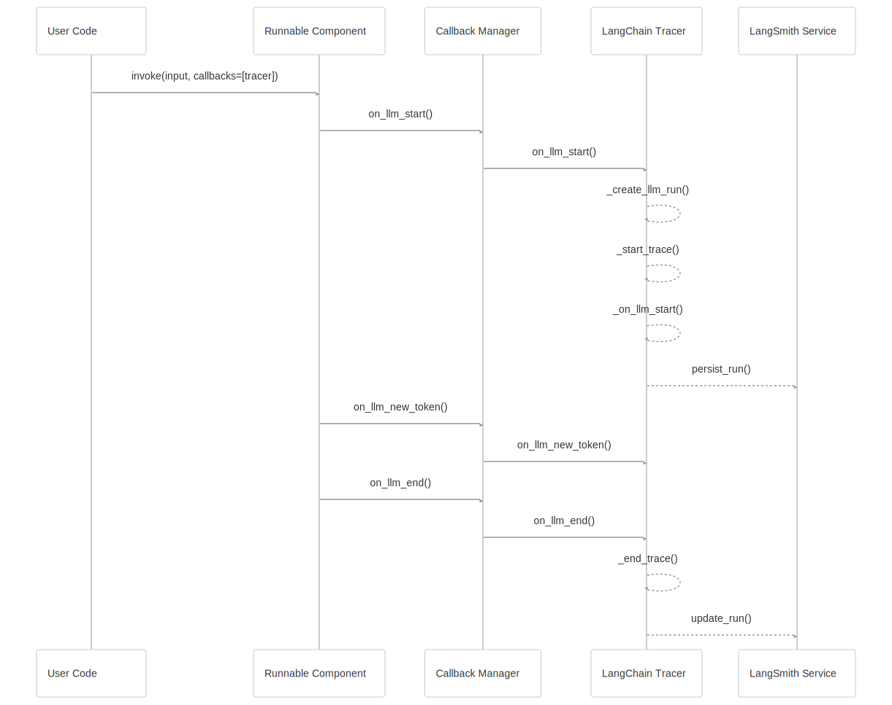
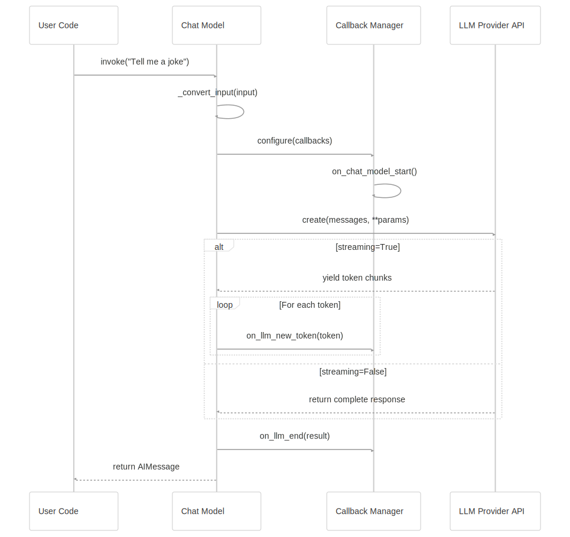

# Core Architecture

[Powered by Devin](https://devin.ai)

[DeepWiki](https://deepwiki.com)

[DeepWiki](/)

[langchain-ai/langchain](https://github.com/langchain-ai/langchain)

[powered by

Devin](https://devin.ai)Share

Last indexed: 17 April 2025 ([b36c2b](https://github.com/langchain-ai/langchain/commits/b36c2bf8))

* [LangChain Overview](/langchain-ai/langchain/1-langchain-overview)
* [Core Architecture](/langchain-ai/langchain/2-core-architecture)
* [Package Structure](/langchain-ai/langchain/2.1-package-structure)
* [Runnable Interface & LCEL](/langchain-ai/langchain/2.2-runnable-interface-and-lcel)
* [Message System](/langchain-ai/langchain/2.3-message-system)
* [Provider Integrations](/langchain-ai/langchain/3-provider-integrations)
* [Model Interfaces](/langchain-ai/langchain/3.1-model-interfaces)
* [Provider-Specific Implementations](/langchain-ai/langchain/3.2-provider-specific-implementations)
* [Retrieval and Vector Stores](/langchain-ai/langchain/4-retrieval-and-vector-stores)
* [Chains and Agents](/langchain-ai/langchain/5-chains-and-agents)
* [Chain Types and Implementation](/langchain-ai/langchain/5.1-chain-types-and-implementation)
* [Agent System](/langchain-ai/langchain/5.2-agent-system)
* [Tools and Evaluation](/langchain-ai/langchain/6-tools-and-evaluation)
* [Tool System](/langchain-ai/langchain/6.1-tool-system)
* [Evaluation and Testing](/langchain-ai/langchain/6.2-evaluation-and-testing)
* [Developer Tools](/langchain-ai/langchain/7-developer-tools)
* [CLI and Templates](/langchain-ai/langchain/7.1-cli-and-templates)
* [CI/CD and Release Process](/langchain-ai/langchain/7.2-cicd-and-release-process)
* [Documentation System](/langchain-ai/langchain/8-documentation-system)
* [User Documentation](/langchain-ai/langchain/8.1-user-documentation)
* [API Reference Generation](/langchain-ai/langchain/8.2-api-reference-generation)

Menu

# Core Architecture

Relevant source files

* [.github/workflows/check\_core\_versions.yml](https://github.com/langchain-ai/langchain/blob/b36c2bf8/.github/workflows/check_core_versions.yml)
* [.github/workflows/codspeed.yml](https://github.com/langchain-ai/langchain/blob/b36c2bf8/.github/workflows/codspeed.yml)
* [.gitignore](https://github.com/langchain-ai/langchain/blob/b36c2bf8/.gitignore)
* [docs/docs/integrations/chat/llamacpp.ipynb](https://github.com/langchain-ai/langchain/blob/b36c2bf8/docs/docs/integrations/chat/llamacpp.ipynb)
* [docs/docs/integrations/chat/octoai.ipynb](https://github.com/langchain-ai/langchain/blob/b36c2bf8/docs/docs/integrations/chat/octoai.ipynb)
* [docs/docs/integrations/chat/perplexity.ipynb](https://github.com/langchain-ai/langchain/blob/b36c2bf8/docs/docs/integrations/chat/perplexity.ipynb)
* [docs/docs/integrations/document\_loaders/bilibili.ipynb](https://github.com/langchain-ai/langchain/blob/b36c2bf8/docs/docs/integrations/document_loaders/bilibili.ipynb)
* [docs/docs/integrations/providers/llamacpp.mdx](https://github.com/langchain-ai/langchain/blob/b36c2bf8/docs/docs/integrations/providers/llamacpp.mdx)
* [docs/docs/integrations/providers/maritalk.mdx](https://github.com/langchain-ai/langchain/blob/b36c2bf8/docs/docs/integrations/providers/maritalk.mdx)
* [docs/docs/integrations/providers/mlx.mdx](https://github.com/langchain-ai/langchain/blob/b36c2bf8/docs/docs/integrations/providers/mlx.mdx)
* [docs/docs/integrations/providers/octoai.mdx](https://github.com/langchain-ai/langchain/blob/b36c2bf8/docs/docs/integrations/providers/octoai.mdx)
* [docs/docs/integrations/providers/perplexity.mdx](https://github.com/langchain-ai/langchain/blob/b36c2bf8/docs/docs/integrations/providers/perplexity.mdx)
* [docs/docs/integrations/text\_embedding/llamacpp.ipynb](https://github.com/langchain-ai/langchain/blob/b36c2bf8/docs/docs/integrations/text_embedding/llamacpp.ipynb)
* [libs/community/Makefile](https://github.com/langchain-ai/langchain/blob/b36c2bf8/libs/community/Makefile)
* [libs/community/langchain\_community/chat\_models/octoai.py](https://github.com/langchain-ai/langchain/blob/b36c2bf8/libs/community/langchain_community/chat_models/octoai.py)
* [libs/community/langchain\_community/chat\_models/perplexity.py](https://github.com/langchain-ai/langchain/blob/b36c2bf8/libs/community/langchain_community/chat_models/perplexity.py)
* [libs/community/langchain\_community/document\_loaders/bilibili.py](https://github.com/langchain-ai/langchain/blob/b36c2bf8/libs/community/langchain_community/document_loaders/bilibili.py)
* [libs/community/pyproject.toml](https://github.com/langchain-ai/langchain/blob/b36c2bf8/libs/community/pyproject.toml)
* [libs/community/tests/integration\_tests/callbacks/test\_langchain\_tracer.py](https://github.com/langchain-ai/langchain/blob/b36c2bf8/libs/community/tests/integration_tests/callbacks/test_langchain_tracer.py)
* [libs/community/tests/integration\_tests/chat\_models/test\_octoai.py](https://github.com/langchain-ai/langchain/blob/b36c2bf8/libs/community/tests/integration_tests/chat_models/test_octoai.py)
* [libs/community/tests/integration\_tests/chat\_models/test\_perplexity.py](https://github.com/langchain-ai/langchain/blob/b36c2bf8/libs/community/tests/integration_tests/chat_models/test_perplexity.py)
* [libs/community/tests/integration\_tests/document\_loaders/test\_bilibili.py](https://github.com/langchain-ai/langchain/blob/b36c2bf8/libs/community/tests/integration_tests/document_loaders/test_bilibili.py)
* [libs/community/tests/unit\_tests/chat\_models/test\_octoai.py](https://github.com/langchain-ai/langchain/blob/b36c2bf8/libs/community/tests/unit_tests/chat_models/test_octoai.py)
* [libs/community/tests/unit\_tests/chat\_models/test\_perplexity.py](https://github.com/langchain-ai/langchain/blob/b36c2bf8/libs/community/tests/unit_tests/chat_models/test_perplexity.py)
* [libs/community/tests/unit\_tests/test\_dependencies.py](https://github.com/langchain-ai/langchain/blob/b36c2bf8/libs/community/tests/unit_tests/test_dependencies.py)
* [libs/community/uv.lock](https://github.com/langchain-ai/langchain/blob/b36c2bf8/libs/community/uv.lock)
* [libs/core/Makefile](https://github.com/langchain-ai/langchain/blob/b36c2bf8/libs/core/Makefile)
* [libs/core/langchain\_core/\_\_init\_\_.py](https://github.com/langchain-ai/langchain/blob/b36c2bf8/libs/core/langchain_core/__init__.py)
* [libs/core/langchain\_core/callbacks/base.py](https://github.com/langchain-ai/langchain/blob/b36c2bf8/libs/core/langchain_core/callbacks/base.py)
* [libs/core/langchain\_core/callbacks/file.py](https://github.com/langchain-ai/langchain/blob/b36c2bf8/libs/core/langchain_core/callbacks/file.py)
* [libs/core/langchain\_core/callbacks/manager.py](https://github.com/langchain-ai/langchain/blob/b36c2bf8/libs/core/langchain_core/callbacks/manager.py)
* [libs/core/langchain\_core/callbacks/stdout.py](https://github.com/langchain-ai/langchain/blob/b36c2bf8/libs/core/langchain_core/callbacks/stdout.py)
* [libs/core/langchain\_core/callbacks/streaming\_stdout.py](https://github.com/langchain-ai/langchain/blob/b36c2bf8/libs/core/langchain_core/callbacks/streaming_stdout.py)
* [libs/core/langchain\_core/language\_models/base.py](https://github.com/langchain-ai/langchain/blob/b36c2bf8/libs/core/langchain_core/language_models/base.py)
* [libs/core/langchain\_core/language\_models/chat\_models.py](https://github.com/langchain-ai/langchain/blob/b36c2bf8/libs/core/langchain_core/language_models/chat_models.py)
* [libs/core/langchain\_core/language\_models/fake\_chat\_models.py](https://github.com/langchain-ai/langchain/blob/b36c2bf8/libs/core/langchain_core/language_models/fake_chat_models.py)
* [libs/core/langchain\_core/language\_models/llms.py](https://github.com/langchain-ai/langchain/blob/b36c2bf8/libs/core/langchain_core/language_models/llms.py)
* [libs/core/langchain\_core/output\_parsers/base.py](https://github.com/langchain-ai/langchain/blob/b36c2bf8/libs/core/langchain_core/output_parsers/base.py)
* [libs/core/langchain\_core/output\_parsers/transform.py](https://github.com/langchain-ai/langchain/blob/b36c2bf8/libs/core/langchain_core/output_parsers/transform.py)
* [libs/core/langchain\_core/tracers/base.py](https://github.com/langchain-ai/langchain/blob/b36c2bf8/libs/core/langchain_core/tracers/base.py)
* [libs/core/langchain\_core/tracers/core.py](https://github.com/langchain-ai/langchain/blob/b36c2bf8/libs/core/langchain_core/tracers/core.py)
* [libs/core/langchain\_core/tracers/evaluation.py](https://github.com/langchain-ai/langchain/blob/b36c2bf8/libs/core/langchain_core/tracers/evaluation.py)
* [libs/core/langchain\_core/tracers/langchain.py](https://github.com/langchain-ai/langchain/blob/b36c2bf8/libs/core/langchain_core/tracers/langchain.py)
* [libs/core/langchain\_core/tracers/langchain\_v1.py](https://github.com/langchain-ai/langchain/blob/b36c2bf8/libs/core/langchain_core/tracers/langchain_v1.py)
* [libs/core/langchain\_core/tracers/root\_listeners.py](https://github.com/langchain-ai/langchain/blob/b36c2bf8/libs/core/langchain_core/tracers/root_listeners.py)
* [libs/core/langchain\_core/tracers/schemas.py](https://github.com/langchain-ai/langchain/blob/b36c2bf8/libs/core/langchain_core/tracers/schemas.py)
* [libs/core/langchain\_core/tracers/stdout.py](https://github.com/langchain-ai/langchain/blob/b36c2bf8/libs/core/langchain_core/tracers/stdout.py)
* [libs/core/langchain\_core/utils/html.py](https://github.com/langchain-ai/langchain/blob/b36c2bf8/libs/core/langchain_core/utils/html.py)
* [libs/core/langchain\_core/utils/loading.py](https://github.com/langchain-ai/langchain/blob/b36c2bf8/libs/core/langchain_core/utils/loading.py)
* [libs/core/langchain\_core/utils/mustache.py](https://github.com/langchain-ai/langchain/blob/b36c2bf8/libs/core/langchain_core/utils/mustache.py)
* [libs/core/langchain\_core/version.py](https://github.com/langchain-ai/langchain/blob/b36c2bf8/libs/core/langchain_core/version.py)
* [libs/core/pyproject.toml](https://github.com/langchain-ai/langchain/blob/b36c2bf8/libs/core/pyproject.toml)
* [libs/core/tests/benchmarks/\_\_init\_\_.py](https://github.com/langchain-ai/langchain/blob/b36c2bf8/libs/core/tests/benchmarks/__init__.py)
* [libs/core/tests/benchmarks/test\_async\_callbacks.py](https://github.com/langchain-ai/langchain/blob/b36c2bf8/libs/core/tests/benchmarks/test_async_callbacks.py)
* [libs/core/tests/benchmarks/test\_imports.py](https://github.com/langchain-ai/langchain/blob/b36c2bf8/libs/core/tests/benchmarks/test_imports.py)
* [libs/core/tests/unit\_tests/fake/test\_fake\_chat\_model.py](https://github.com/langchain-ai/langchain/blob/b36c2bf8/libs/core/tests/unit_tests/fake/test_fake_chat_model.py)
* [libs/core/tests/unit\_tests/language\_models/chat\_models/test\_base.py](https://github.com/langchain-ai/langchain/blob/b36c2bf8/libs/core/tests/unit_tests/language_models/chat_models/test_base.py)
* [libs/core/tests/unit\_tests/language\_models/chat\_models/test\_cache.py](https://github.com/langchain-ai/langchain/blob/b36c2bf8/libs/core/tests/unit_tests/language_models/chat_models/test_cache.py)
* [libs/core/tests/unit\_tests/language\_models/llms/test\_base.py](https://github.com/langchain-ai/langchain/blob/b36c2bf8/libs/core/tests/unit_tests/language_models/llms/test_base.py)
* [libs/core/tests/unit\_tests/runnables/test\_tracing\_interops.py](https://github.com/langchain-ai/langchain/blob/b36c2bf8/libs/core/tests/unit_tests/runnables/test_tracing_interops.py)
* [libs/core/tests/unit\_tests/tracers/test\_async\_base\_tracer.py](https://github.com/langchain-ai/langchain/blob/b36c2bf8/libs/core/tests/unit_tests/tracers/test_async_base_tracer.py)
* [libs/core/tests/unit\_tests/tracers/test\_base\_tracer.py](https://github.com/langchain-ai/langchain/blob/b36c2bf8/libs/core/tests/unit_tests/tracers/test_base_tracer.py)
* [libs/core/tests/unit\_tests/tracers/test\_langchain.py](https://github.com/langchain-ai/langchain/blob/b36c2bf8/libs/core/tests/unit_tests/tracers/test_langchain.py)
* [libs/core/uv.lock](https://github.com/langchain-ai/langchain/blob/b36c2bf8/libs/core/uv.lock)
* [libs/langchain/Makefile](https://github.com/langchain-ai/langchain/blob/b36c2bf8/libs/langchain/Makefile)
* [libs/langchain/pyproject.toml](https://github.com/langchain-ai/langchain/blob/b36c2bf8/libs/langchain/pyproject.toml)
* [libs/langchain/tests/unit\_tests/test\_dependencies.py](https://github.com/langchain-ai/langchain/blob/b36c2bf8/libs/langchain/tests/unit_tests/test_dependencies.py)
* [libs/langchain/uv.lock](https://github.com/langchain-ai/langchain/blob/b36c2bf8/libs/langchain/uv.lock)

This document describes the high-level architecture of LangChain, detailing how the different components fit together to create a flexible framework for building language model applications. It covers the foundational design principles, core components, and interaction patterns that form the backbone of the LangChain ecosystem.

## Core Design Philosophy

LangChain's architecture is built around a few key principles:

1. **Composability**: Components can be easily combined through a unified interface (LCEL)
2. **Provider Agnosticism**: Abstractions allow switching between different model providers
3. **Extensibility**: Clear interfaces enable custom implementations and integrations
4. **Traceability**: Built-in systems for monitoring, logging, and debugging

## Package Structure

The LangChain ecosystem is organized into a set of interrelated packages, each with a distinct responsibility:

This structure ensures a clear separation of concerns:

* **langchain-core**: Contains the interface definitions and base classes that all other components implement
* **langchain**: Provides high-level abstractions and implementations of core concepts
* **langchain-community**: Houses integrations with third-party tools and services
* **Provider packages**: Implement core interfaces for specific LLM providers

Sources:

* [libs/langchain/pyproject.toml1-161](https://github.com/langchain-ai/langchain/blob/b36c2bf8/libs/langchain/pyproject.toml#L1-L161) Shows the package dependencies and structure for main langchain package.
* [libs/core/pyproject.toml1-137](https://github.com/langchain-ai/langchain/blob/b36c2bf8/libs/core/pyproject.toml#L1-L137) Shows the package dependencies and structure for core package.
* [libs/community/pyproject.toml1-124](https://github.com/langchain-ai/langchain/blob/b36c2bf8/libs/community/pyproject.toml#L1-L124) Shows the package dependencies and structure for community package.

## The Runnable Interface: Foundation of LCEL

The cornerstone of LangChain's architecture is the `Runnable` interface, which serves as the foundation for the LangChain Expression Language (LCEL). This interface enables components to be chained together in a composable manner.

The `Runnable` interface provides essential methods:

* **invoke**: Synchronously executes the component with the provided input
* **stream**: Returns a generator yielding results as they become available
* **batch**: Processes multiple inputs in parallel
* **transform**: Creates a new runnable that transforms the output

All key LangChain components (LLMs, chat models, retrievers, tools, etc.) implement the `Runnable` interface, making them composable building blocks in the LCEL framework.

Sources:

* [libs/core/langchain\_core/language\_models/base.py97-407](https://github.com/langchain-ai/langchain/blob/b36c2bf8/libs/core/langchain_core/language_models/base.py#L97-L407) Definition of the BaseLanguageModel.
* [libs/core/langchain\_core/language\_models/llms.py290-733](https://github.com/langchain-ai/langchain/blob/b36c2bf8/libs/core/langchain_core/language_models/llms.py#L290-L733) Definition of BaseLLM.
* [libs/core/langchain\_core/language\_models/chat\_models.py202-775](https://github.com/langchain-ai/langchain/blob/b36c2bf8/libs/core/langchain_core/language_models/chat_models.py#L202-L775) Definition of BaseChatModel.

## Language Models

LangChain provides a unified interface for both traditional language models (LLMs) and chat models. These are the fundamental components that wrap provider APIs.

### Base Language Model

The `BaseLanguageModel` class is the abstract interface that all language model implementations derive from:

LangChain provides two main types of language models:

1. **BaseLLM**: Traditional completion-style language models that take a string prompt and return a string completion
2. **BaseChatModel**: Chat-style language models that accept a list of messages and return a message

Each model type implements the core methods required for the `Runnable` interface, plus specialized methods for their specific use cases.

Sources:

* [libs/core/langchain\_core/language\_models/base.py97-407](https://github.com/langchain-ai/langchain/blob/b36c2bf8/libs/core/langchain_core/language_models/base.py#L97-L407) Base abstract class for all language models.
* [libs/core/langchain\_core/language\_models/llms.py290-733](https://github.com/langchain-ai/langchain/blob/b36c2bf8/libs/core/langchain_core/language_models/llms.py#L290-L733) Implementation of BaseLLM.
* [libs/core/langchain\_core/language\_models/chat\_models.py202-775](https://github.com/langchain-ai/langchain/blob/b36c2bf8/libs/core/langchain_core/language_models/chat_models.py#L202-L775) Implementation of BaseChatModel.

## Callback System

The callback system is a powerful feature that provides hooks into the execution lifecycle of LangChain components, enabling logging, monitoring, and debugging.

Key components of the callback system:

* **CallbackManager**: Orchestrates and routes events to registered handlers
* **BaseCallbackHandler**: Interface that custom handlers implement
* **RunManager**: Tracks a specific execution run with its own ID and context
* **Tracer**: Special handlers that persist execution traces for debugging and analysis

The callback system enables powerful features like:

* Streaming tokens as they're generated
* Detailed tracing of execution paths
* Logging and observability
* Custom integrations with monitoring tools

Sources:

* [libs/core/langchain\_core/callbacks/manager.py1-613](https://github.com/langchain-ai/langchain/blob/b36c2bf8/libs/core/langchain_core/callbacks/manager.py#L1-L613) Implementation of callback managers.
* [libs/core/langchain\_core/callbacks/base.py1-63](https://github.com/langchain-ai/langchain/blob/b36c2bf8/libs/core/langchain_core/callbacks/base.py#L1-L63) Base callback handler interfaces.
* [libs/core/langchain\_core/tracers/langchain.py1-315](https://github.com/langchain-ai/langchain/blob/b36c2bf8/libs/core/langchain_core/tracers/langchain.py#L1-L315) LangChain tracer implementation.

## Tracing System

The tracing system builds on top of the callback system to provide detailed execution traces that can be used for debugging, monitoring, and analysis.

The tracing system provides:

* Hierarchical run traces with parent-child relationships
* Detailed input/output recording
* Performance metrics
* Integration with LangSmith for visual debugging and analytics

Sources:

* [libs/core/langchain\_core/tracers/base.py1-34](https://github.com/langchain-ai/langchain/blob/b36c2bf8/libs/core/langchain_core/tracers/base.py#L1-L34) Base tracer implementation.
* [libs/core/langchain\_core/tracers/langchain.py1-315](https://github.com/langchain-ai/langchain/blob/b36c2bf8/libs/core/langchain_core/tracers/langchain.py#L1-L315) LangChain tracer implementation.
* [libs/core/langchain\_core/tracers/core.py1-24](https://github.com/langchain-ai/langchain/blob/b36c2bf8/libs/core/langchain_core/tracers/core.py#L1-L24) Core tracing utilities.
* [libs/core/tests/unit\_tests/runnables/test\_tracing\_interops.py1-152](https://github.com/langchain-ai/langchain/blob/b36c2bf8/libs/core/tests/unit_tests/runnables/test_tracing_interops.py#L1-L152) Tests demonstrating tracing functionality.

## Provider Integration Pattern

LangChain's architecture is designed for easy integration with different LLM providers. This is achieved through a consistent pattern:

The provider integration pattern follows these principles:

1. **Core interfaces**: Base classes in langchain-core define the contract
2. **Provider-specific packages**: Implement these interfaces for specific providers
3. **Consistent methods**: All providers implement the same core methods
4. **Thin wrappers**: Provider implementations focus on API translation

This pattern enables users to easily switch between providers while maintaining the same code structure.

Sources:

* [libs/community/langchain\_community/chat\_models/perplexity.py80-744](https://github.com/langchain-ai/langchain/blob/b36c2bf8/libs/community/langchain_community/chat_models/perplexity.py#L80-L744) Example of a provider implementation in the community package.
* [libs/core/langchain\_core/language\_models/chat\_models.py202-775](https://github.com/langchain-ai/langchain/blob/b36c2bf8/libs/core/langchain_core/language_models/chat_models.py#L202-L775) Base chat model definition that providers implement.

## Execution Flow

To tie all these components together, here's a typical execution flow for a chat model invocation:

This flow illustrates how the different components interact during execution:

1. The user calls `invoke()` on a chat model
2. The chat model processes the input
3. Callbacks are notified at each stage
4. The provider API is called with the appropriate parameters
5. Results are processed and returned to the user

Sources:

* [libs/core/langchain\_core/language\_models/chat\_models.py356-400](https://github.com/langchain-ai/langchain/blob/b36c2bf8/libs/core/langchain_core/language_models/chat_models.py#L356-L400) Implementation of invoke method for chat models.
* [libs/core/langchain\_core/language\_models/chat\_models.py437-518](https://github.com/langchain-ai/langchain/blob/b36c2bf8/libs/core/langchain_core/language_models/chat_models.py#L437-L518) Implementation of stream method for chat models.

## Memory and State Management

LangChain's approach to memory and state management is intentionally flexible, with state typically managed through:

1. **Input/Output passing**: State is passed explicitly through function calls
2. **External storage**: State can be persisted in databases or vector stores
3. **Context management**: Some components maintain internal state for their lifetime

This design allows for greater flexibility in building stateful applications while avoiding complex global state management.

## Extensibility Points

LangChain provides several key extension points for customization:

1. **Custom Language Models**: Implement `BaseLLM` or `BaseChatModel` for new providers
2. **Custom Callback Handlers**: Implement `BaseCallbackHandler` for custom monitoring or logging
3. **Custom Tools**: Create new tools by implementing the tool interface
4. **Custom Output Parsers**: Implement output parsers for structured outputs

These extension points allow developers to extend LangChain's functionality while maintaining compatibility with the broader ecosystem.

## Conclusion

The LangChain architecture is designed around composable components with clear interfaces. This design enables:

1. Easy switching between different LLM providers
2. Composition of components through LCEL
3. Comprehensive tracing and debugging
4. Extensibility through well-defined interfaces

Understanding these core architectural principles is essential for effectively using and extending LangChain.

For more details on specific package structures, see [Package Structure](/langchain-ai/langchain/2.1-package-structure). For an in-depth explanation of the Runnable interface and LCEL, see [Runnable Interface & LCEL](/langchain-ai/langchain/2.2-runnable-interface-and-lcel).

Auto-refresh not enabled yet

Try DeepWiki on your private codebase with [Devin](/private-repo)

### On this page

* [Core Architecture](#core-architecture)
* [Core Design Philosophy](#core-design-philosophy)
* [Package Structure](#package-structure)
* [The Runnable Interface: Foundation of LCEL](#the-runnable-interface-foundation-of-lcel)
* [Language Models](#language-models)
* [Base Language Model](#base-language-model)
* [Callback System](#callback-system)
* [Tracing System](#tracing-system)
* [Provider Integration Pattern](#provider-integration-pattern)
* [Execution Flow](#execution-flow)
* [Memory and State Management](#memory-and-state-management)
* [Extensibility Points](#extensibility-points)
* [Conclusion](#conclusion)

Ask Devin about langchain-ai/langchain

Deep Research