# User Documentation

[Powered by Devin](https://devin.ai)

[DeepWiki](https://deepwiki.com)

[DeepWiki](/)

[langchain-ai/langchain](https://github.com/langchain-ai/langchain)

[powered by

Devin](https://devin.ai)Share

Last indexed: 17 April 2025 ([b36c2b](https://github.com/langchain-ai/langchain/commits/b36c2bf8))

* [LangChain Overview](/langchain-ai/langchain/1-langchain-overview)
* [Core Architecture](/langchain-ai/langchain/2-core-architecture)
* [Package Structure](/langchain-ai/langchain/2.1-package-structure)
* [Runnable Interface & LCEL](/langchain-ai/langchain/2.2-runnable-interface-and-lcel)
* [Message System](/langchain-ai/langchain/2.3-message-system)
* [Provider Integrations](/langchain-ai/langchain/3-provider-integrations)
* [Model Interfaces](/langchain-ai/langchain/3.1-model-interfaces)
* [Provider-Specific Implementations](/langchain-ai/langchain/3.2-provider-specific-implementations)
* [Retrieval and Vector Stores](/langchain-ai/langchain/4-retrieval-and-vector-stores)
* [Chains and Agents](/langchain-ai/langchain/5-chains-and-agents)
* [Chain Types and Implementation](/langchain-ai/langchain/5.1-chain-types-and-implementation)
* [Agent System](/langchain-ai/langchain/5.2-agent-system)
* [Tools and Evaluation](/langchain-ai/langchain/6-tools-and-evaluation)
* [Tool System](/langchain-ai/langchain/6.1-tool-system)
* [Evaluation and Testing](/langchain-ai/langchain/6.2-evaluation-and-testing)
* [Developer Tools](/langchain-ai/langchain/7-developer-tools)
* [CLI and Templates](/langchain-ai/langchain/7.1-cli-and-templates)
* [CI/CD and Release Process](/langchain-ai/langchain/7.2-cicd-and-release-process)
* [Documentation System](/langchain-ai/langchain/8-documentation-system)
* [User Documentation](/langchain-ai/langchain/8.1-user-documentation)
* [API Reference Generation](/langchain-ai/langchain/8.2-api-reference-generation)

Menu

# User Documentation

Relevant source files

* [.github/workflows/check-broken-links.yml](https://github.com/langchain-ai/langchain/blob/b36c2bf8/.github/workflows/check-broken-links.yml)
* [docs/.yarnrc.yml](https://github.com/langchain-ai/langchain/blob/b36c2bf8/docs/.yarnrc.yml)
* [docs/Makefile](https://github.com/langchain-ai/langchain/blob/b36c2bf8/docs/Makefile)
* [docs/cassettes/llm\_chain\_1b2481f0.msgpack.zlib](https://github.com/langchain-ai/langchain/blob/b36c2bf8/docs/cassettes/llm_chain_1b2481f0.msgpack.zlib)
* [docs/cassettes/llm\_chain\_3e45595a.msgpack.zlib](https://github.com/langchain-ai/langchain/blob/b36c2bf8/docs/cassettes/llm_chain_3e45595a.msgpack.zlib)
* [docs/docs/concepts/streaming.mdx](https://github.com/langchain-ai/langchain/blob/b36c2bf8/docs/docs/concepts/streaming.mdx)
* [docs/docs/example\_data/nke-10k-2023.pdf](https://github.com/langchain-ai/langchain/blob/b36c2bf8/docs/docs/example_data/nke-10k-2023.pdf)
* [docs/docs/how\_to/agent\_executor.ipynb](https://github.com/langchain-ai/langchain/blob/b36c2bf8/docs/docs/how_to/agent_executor.ipynb)
* [docs/docs/how\_to/chat\_streaming.ipynb](https://github.com/langchain-ai/langchain/blob/b36c2bf8/docs/docs/how_to/chat_streaming.ipynb)
* [docs/docs/how\_to/configure.ipynb](https://github.com/langchain-ai/langchain/blob/b36c2bf8/docs/docs/how_to/configure.ipynb)
* [docs/docs/how\_to/convert\_runnable\_to\_tool.ipynb](https://github.com/langchain-ai/langchain/blob/b36c2bf8/docs/docs/how_to/convert_runnable_to_tool.ipynb)
* [docs/docs/how\_to/custom\_tools.ipynb](https://github.com/langchain-ai/langchain/blob/b36c2bf8/docs/docs/how_to/custom_tools.ipynb)
* [docs/docs/how\_to/example\_selectors\_langsmith.ipynb](https://github.com/langchain-ai/langchain/blob/b36c2bf8/docs/docs/how_to/example_selectors_langsmith.ipynb)
* [docs/docs/how\_to/extraction\_examples.ipynb](https://github.com/langchain-ai/langchain/blob/b36c2bf8/docs/docs/how_to/extraction_examples.ipynb)
* [docs/docs/how\_to/extraction\_long\_text.ipynb](https://github.com/langchain-ai/langchain/blob/b36c2bf8/docs/docs/how_to/extraction_long_text.ipynb)
* [docs/docs/how\_to/few\_shot\_examples.ipynb](https://github.com/langchain-ai/langchain/blob/b36c2bf8/docs/docs/how_to/few_shot_examples.ipynb)
* [docs/docs/how\_to/few\_shot\_examples\_chat.ipynb](https://github.com/langchain-ai/langchain/blob/b36c2bf8/docs/docs/how_to/few_shot_examples_chat.ipynb)
* [docs/docs/how\_to/function\_calling.ipynb](https://github.com/langchain-ai/langchain/blob/b36c2bf8/docs/docs/how_to/function_calling.ipynb)
* [docs/docs/how\_to/index.mdx](https://github.com/langchain-ai/langchain/blob/b36c2bf8/docs/docs/how_to/index.mdx)
* [docs/docs/how\_to/parent\_document\_retriever.ipynb](https://github.com/langchain-ai/langchain/blob/b36c2bf8/docs/docs/how_to/parent_document_retriever.ipynb)
* [docs/docs/how\_to/paul\_graham\_essay.txt](https://github.com/langchain-ai/langchain/blob/b36c2bf8/docs/docs/how_to/paul_graham_essay.txt)
* [docs/docs/how\_to/qa\_chat\_history\_how\_to.ipynb](https://github.com/langchain-ai/langchain/blob/b36c2bf8/docs/docs/how_to/qa_chat_history_how_to.ipynb)
* [docs/docs/how\_to/qa\_sources.ipynb](https://github.com/langchain-ai/langchain/blob/b36c2bf8/docs/docs/how_to/qa_sources.ipynb)
* [docs/docs/how\_to/qa\_streaming.ipynb](https://github.com/langchain-ai/langchain/blob/b36c2bf8/docs/docs/how_to/qa_streaming.ipynb)
* [docs/docs/how\_to/structured\_output.ipynb](https://github.com/langchain-ai/langchain/blob/b36c2bf8/docs/docs/how_to/structured_output.ipynb)
* [docs/docs/how\_to/tool\_artifacts.ipynb](https://github.com/langchain-ai/langchain/blob/b36c2bf8/docs/docs/how_to/tool_artifacts.ipynb)
* [docs/docs/how\_to/tool\_calling.ipynb](https://github.com/langchain-ai/langchain/blob/b36c2bf8/docs/docs/how_to/tool_calling.ipynb)
* [docs/docs/how\_to/tool\_calling\_parallel.ipynb](https://github.com/langchain-ai/langchain/blob/b36c2bf8/docs/docs/how_to/tool_calling_parallel.ipynb)
* [docs/docs/how\_to/tool\_choice.ipynb](https://github.com/langchain-ai/langchain/blob/b36c2bf8/docs/docs/how_to/tool_choice.ipynb)
* [docs/docs/how\_to/tool\_configure.ipynb](https://github.com/langchain-ai/langchain/blob/b36c2bf8/docs/docs/how_to/tool_configure.ipynb)
* [docs/docs/how\_to/tool\_results\_pass\_to\_model.ipynb](https://github.com/langchain-ai/langchain/blob/b36c2bf8/docs/docs/how_to/tool_results_pass_to_model.ipynb)
* [docs/docs/how\_to/tool\_runtime.ipynb](https://github.com/langchain-ai/langchain/blob/b36c2bf8/docs/docs/how_to/tool_runtime.ipynb)
* [docs/docs/how\_to/tool\_stream\_events.ipynb](https://github.com/langchain-ai/langchain/blob/b36c2bf8/docs/docs/how_to/tool_stream_events.ipynb)
* [docs/docs/how\_to/tools\_prompting.ipynb](https://github.com/langchain-ai/langchain/blob/b36c2bf8/docs/docs/how_to/tools_prompting.ipynb)
* [docs/docs/integrations/document\_loaders/image\_captions.ipynb](https://github.com/langchain-ai/langchain/blob/b36c2bf8/docs/docs/integrations/document_loaders/image_captions.ipynb)
* [docs/docs/integrations/document\_transformers/google\_cloud\_vertexai\_rerank.ipynb](https://github.com/langchain-ai/langchain/blob/b36c2bf8/docs/docs/integrations/document_transformers/google_cloud_vertexai_rerank.ipynb)
* [docs/docs/integrations/providers/robocorp.mdx](https://github.com/langchain-ai/langchain/blob/b36c2bf8/docs/docs/integrations/providers/robocorp.mdx)
* [docs/docs/integrations/providers/sap.mdx](https://github.com/langchain-ai/langchain/blob/b36c2bf8/docs/docs/integrations/providers/sap.mdx)
* [docs/docs/tutorials/agents.ipynb](https://github.com/langchain-ai/langchain/blob/b36c2bf8/docs/docs/tutorials/agents.ipynb)
* [docs/docs/tutorials/chatbot.ipynb](https://github.com/langchain-ai/langchain/blob/b36c2bf8/docs/docs/tutorials/chatbot.ipynb)
* [docs/docs/tutorials/extraction.ipynb](https://github.com/langchain-ai/langchain/blob/b36c2bf8/docs/docs/tutorials/extraction.ipynb)
* [docs/docs/tutorials/index.mdx](https://github.com/langchain-ai/langchain/blob/b36c2bf8/docs/docs/tutorials/index.mdx)
* [docs/docs/tutorials/llm\_chain.ipynb](https://github.com/langchain-ai/langchain/blob/b36c2bf8/docs/docs/tutorials/llm_chain.ipynb)
* [docs/docs/tutorials/qa\_chat\_history.ipynb](https://github.com/langchain-ai/langchain/blob/b36c2bf8/docs/docs/tutorials/qa_chat_history.ipynb)
* [docs/docs/tutorials/rag.ipynb](https://github.com/langchain-ai/langchain/blob/b36c2bf8/docs/docs/tutorials/rag.ipynb)
* [docs/docs/tutorials/retrievers.ipynb](https://github.com/langchain-ai/langchain/blob/b36c2bf8/docs/docs/tutorials/retrievers.ipynb)
* [docs/docs/tutorials/sql\_qa.ipynb](https://github.com/langchain-ai/langchain/blob/b36c2bf8/docs/docs/tutorials/sql_qa.ipynb)
* [docs/docs/tutorials/summarization.ipynb](https://github.com/langchain-ai/langchain/blob/b36c2bf8/docs/docs/tutorials/summarization.ipynb)
* [docs/docs/versions/v0\_2/deprecations.mdx](https://github.com/langchain-ai/langchain/blob/b36c2bf8/docs/docs/versions/v0_2/deprecations.mdx)
* [docs/docs/versions/v0\_2/index.mdx](https://github.com/langchain-ai/langchain/blob/b36c2bf8/docs/docs/versions/v0_2/index.mdx)
* [docs/docs/versions/v0\_2/migrating\_astream\_events.mdx](https://github.com/langchain-ai/langchain/blob/b36c2bf8/docs/docs/versions/v0_2/migrating_astream_events.mdx)
* [docs/docusaurus.config.js](https://github.com/langchain-ai/langchain/blob/b36c2bf8/docs/docusaurus.config.js)
* [docs/ignore-step.sh](https://github.com/langchain-ai/langchain/blob/b36c2bf8/docs/ignore-step.sh)
* [docs/package.json](https://github.com/langchain-ai/langchain/blob/b36c2bf8/docs/package.json)
* [docs/scripts/append\_related\_links.py](https://github.com/langchain-ai/langchain/blob/b36c2bf8/docs/scripts/append_related_links.py)
* [docs/scripts/check-broken-links.js](https://github.com/langchain-ai/langchain/blob/b36c2bf8/docs/scripts/check-broken-links.js)
* [docs/scripts/generate\_api\_reference\_links.py](https://github.com/langchain-ai/langchain/blob/b36c2bf8/docs/scripts/generate_api_reference_links.py)
* [docs/scripts/partner\_deps\_list.py](https://github.com/langchain-ai/langchain/blob/b36c2bf8/docs/scripts/partner_deps_list.py)
* [docs/scripts/resolve\_local\_links.py](https://github.com/langchain-ai/langchain/blob/b36c2bf8/docs/scripts/resolve_local_links.py)
* [docs/sidebars.js](https://github.com/langchain-ai/langchain/blob/b36c2bf8/docs/sidebars.js)
* [docs/src/theme/DocItem/Paginator/index.js](https://github.com/langchain-ai/langchain/blob/b36c2bf8/docs/src/theme/DocItem/Paginator/index.js)
* [docs/src/theme/Feedback.js](https://github.com/langchain-ai/langchain/blob/b36c2bf8/docs/src/theme/Feedback.js)
* [docs/static/img/langsmith\_evaluate.png](https://github.com/langchain-ai/langchain/blob/b36c2bf8/docs/static/img/langsmith_evaluate.png)
* [docs/static/js/google\_analytics.js](https://github.com/langchain-ai/langchain/blob/b36c2bf8/docs/static/js/google_analytics.js)
* [docs/vercel.json](https://github.com/langchain-ai/langchain/blob/b36c2bf8/docs/vercel.json)
* [docs/vercel\_requirements.txt](https://github.com/langchain-ai/langchain/blob/b36c2bf8/docs/vercel_requirements.txt)
* [docs/yarn.lock](https://github.com/langchain-ai/langchain/blob/b36c2bf8/docs/yarn.lock)

## Purpose and Scope

This document provides a comprehensive overview of LangChain's user documentation system, including its structure, generation process, and the tools used to create and maintain it. It covers how documentation content is organized, built, and presented to users. For information about API reference generation specifically, see [API Reference Generation](/langchain-ai/langchain/8.2-api-reference-generation).

## Documentation Overview

LangChain's documentation follows a structured approach designed to address different user needs, from beginners to advanced users. The documentation is organized using the Diátaxis framework, which separates content into distinct types based on user goals.

Sources:

* [docs/docs/how\_to/index.mdx1-373](https://github.com/langchain-ai/langchain/blob/b36c2bf8/docs/docs/how_to/index.mdx#L1-L373)
* [docs/sidebars.js20-131](https://github.com/langchain-ai/langchain/blob/b36c2bf8/docs/sidebars.js#L20-L131)
* [docs/docs/tutorials/index.mdx1-48](https://github.com/langchain-ai/langchain/blob/b36c2bf8/docs/docs/tutorials/index.mdx#L1-L48)

## Documentation Architecture

The LangChain documentation system is built using Docusaurus, a modern static website generator, and is deployed using Vercel. The system integrates various tools for code examples, interactive components, and search functionality.

Sources:

* [docs/docusaurus.config.js15-325](https://github.com/langchain-ai/langchain/blob/b36c2bf8/docs/docusaurus.config.js#L15-L325)
* [docs/Makefile1-87](https://github.com/langchain-ai/langchain/blob/b36c2bf8/docs/Makefile#L1-L87)
* [docs/vercel.json1-146](https://github.com/langchain-ai/langchain/blob/b36c2bf8/docs/vercel.json#L1-L146)

## Documentation Structure

The documentation follows a clear organization pattern with specific sections serving different purposes:

| Section | Purpose | Content Types |
| --- | --- | --- |
| Introduction | Overview and getting started | Markdown |
| Tutorials | Learn through examples | Jupyter notebooks, interactive examples |
| How-to guides | Goal-oriented, concrete steps | Markdown, code examples |
| Conceptual guides | Understanding the system | Markdown, diagrams |
| Ecosystem | Related tools (LangSmith, LangGraph) | Markdown, external links |
| Integrations | Provider-specific implementations | Markdown, code examples |
| Versions | Version-specific documentation | Markdown |

Sources:

* [docs/sidebars.js20-131](https://github.com/langchain-ai/langchain/blob/b36c2bf8/docs/sidebars.js#L20-L131)
* [docs/docs/how\_to/index.mdx1-373](https://github.com/langchain-ai/langchain/blob/b36c2bf8/docs/docs/how_to/index.mdx#L1-L373)
* [docs/docs/tutorials/index.mdx1-48](https://github.com/langchain-ai/langchain/blob/b36c2bf8/docs/docs/tutorials/index.mdx#L1-L48)

## Documentation Generation Process

The documentation generation is managed through a Makefile with several key steps:

Sources:

* [docs/Makefile1-87](https://github.com/langchain-ai/langchain/blob/b36c2bf8/docs/Makefile#L1-L87)
* [docs/scripts/generate\_api\_reference\_links.py1-455](https://github.com/langchain-ai/langchain/blob/b36c2bf8/docs/scripts/generate_api_reference_links.py#L1-L455)

## Docusaurus Configuration

The documentation site is configured using Docusaurus with several key features:

1. **Theme Configuration**: Customizing the look and feel of the documentation
2. **Navigation**: Configuring the navigation bar and sidebar
3. **Search**: Integration with Algolia for searching the documentation
4. **Plugins**: Additional functionality like Mermaid diagrams
5. **Versioning**: Support for different documentation versions

Sources:

* [docs/docusaurus.config.js15-325](https://github.com/langchain-ai/langchain/blob/b36c2bf8/docs/docusaurus.config.js#L15-L325)
* [docs/sidebars.js20-131](https://github.com/langchain-ai/langchain/blob/b36c2bf8/docs/sidebars.js#L20-L131)

## Content Types and Formats

LangChain documentation uses several content formats to effectively convey information:

### Markdown (MDX)

The primary format for documentation content, allowing for React components to be embedded in markdown.

### Jupyter Notebooks

Interactive code examples that can be viewed directly or run by users. These are converted to MDX during the build process.

### Interactive Components

Custom React components that provide interactive experiences, such as:

* Provider selection tabs
* Chat model selection
* Code examples with multiple language options

Sources:

* [docs/docs/tutorials/llm\_chain.ipynb1-433](https://github.com/langchain-ai/langchain/blob/b36c2bf8/docs/docs/tutorials/llm_chain.ipynb#L1-L433)
* [docs/docs/tutorials/rag.ipynb1-607](https://github.com/langchain-ai/langchain/blob/b36c2bf8/docs/docs/tutorials/rag.ipynb#L1-L607)
* [docs/docs/tutorials/agents.ipynb1-488](https://github.com/langchain-ai/langchain/blob/b36c2bf8/docs/docs/tutorials/agents.ipynb#L1-L488)

## URL Structure and Redirects

The documentation has a carefully managed URL structure with redirects to ensure consistent navigation:

Sources:

* [docs/vercel.json1-146](https://github.com/langchain-ai/langchain/blob/b36c2bf8/docs/vercel.json#L1-L146)

## Versioning

The documentation supports multiple versions of LangChain:

| Version | Path | Description |
| --- | --- | --- |
| v0.3 (Current) | /docs/ | Latest version |
| v0.2 | /v0.2/docs/ | Previous version |
| v0.1 | /v0.1/docs/ | Legacy version |

Sources:

* [docs/docusaurus.config.js217-234](https://github.com/langchain-ai/langchain/blob/b36c2bf8/docs/docusaurus.config.js#L217-L234)
* [docs/vercel.json6-26](https://github.com/langchain-ai/langchain/blob/b36c2bf8/docs/vercel.json#L6-L26)
* [docs/sidebars.js79-130](https://github.com/langchain-ai/langchain/blob/b36c2bf8/docs/sidebars.js#L79-L130)

## User Feedback System

The documentation includes a feedback system allowing users to provide direct feedback on pages:

Sources:

* [docs/src/theme/Feedback.js1-335](https://github.com/langchain-ai/langchain/blob/b36c2bf8/docs/src/theme/Feedback.js#L1-L335)
* [docs/package.json24-43](https://github.com/langchain-ai/langchain/blob/b36c2bf8/docs/package.json#L24-L43)

## Build and Deployment Workflow

The documentation is built and deployed using a combination of tools:

Sources:

* [docs/Makefile73-84](https://github.com/langchain-ai/langchain/blob/b36c2bf8/docs/Makefile#L73-L84)
* [docs/package.json3-22](https://github.com/langchain-ai/langchain/blob/b36c2bf8/docs/package.json#L3-L22)
* [docs/vercel.json1-146](https://github.com/langchain-ai/langchain/blob/b36c2bf8/docs/vercel.json#L1-L146)

## Cross-References and Navigation

The documentation uses a sophisticated system of cross-references and navigation:

1. **Sidebar Navigation**: Organized hierarchically with collapsible sections
2. **Internal Links**: Cross-references between pages
3. **API Reference Links**: Automated links to API documentation
4. **Related Content**: Automatically appended related links

Sources:

* [docs/sidebars.js20-131](https://github.com/langchain-ai/langchain/blob/b36c2bf8/docs/sidebars.js#L20-L131)
* [docs/scripts/generate\_api\_reference\_links.py1-455](https://github.com/langchain-ai/langchain/blob/b36c2bf8/docs/scripts/generate_api_reference_links.py#L1-L455)
* [docs/Makefile65-66](https://github.com/langchain-ai/langchain/blob/b36c2bf8/docs/Makefile#L65-L66)

## Integration with External Tools

The documentation system integrates with several external tools:

1. **LangSmith**: Dedicated section with links to LangSmith documentation
2. **LangGraph**: Integration with LangGraph documentation
3. **Hub**: References to LangChain Hub for prompt templates and other assets
4. **GitHub**: Direct links to GitHub repository for editing pages

Sources:

* [docs/docusaurus.config.js198-214](https://github.com/langchain-ai/langchain/blob/b36c2bf8/docs/docusaurus.config.js#L198-L214)
* [docs/sidebars.js61-77](https://github.com/langchain-ai/langchain/blob/b36c2bf8/docs/sidebars.js#L61-L77)

## Mobile and Accessibility Support

The documentation is designed to be responsive and accessible:

1. **Responsive Design**: Works well on mobile devices
2. **Color Scheme**: Supports both light and dark modes
3. **Navigation**: Collapsible sidebar for mobile viewing
4. **Search**: Accessible search functionality

Sources:

* [docs/docusaurus.config.js136-139](https://github.com/langchain-ai/langchain/blob/b36c2bf8/docs/docusaurus.config.js#L136-L139)

## Documentation Maintenance

The documentation is maintained through several processes:

1. **GitHub Contributions**: Edit links on each page
2. **Automated Checks**: Checking for broken links
3. **Feedback System**: User feedback used to improve content
4. **Version Management**: Keeping documentation in sync with code versions

Sources:

* [docs/docusaurus.config.js89-90](https://github.com/langchain-ai/langchain/blob/b36c2bf8/docs/docusaurus.config.js#L89-L90)
* [.github/workflows/check-broken-links.yml1-27](https://github.com/langchain-ai/langchain/blob/b36c2bf8/.github/workflows/check-broken-links.yml#L1-L27)
* [docs/src/theme/Feedback.js1-335](https://github.com/langchain-ai/langchain/blob/b36c2bf8/docs/src/theme/Feedback.js#L1-L335)

Auto-refresh not enabled yet

Try DeepWiki on your private codebase with [Devin](/private-repo)

### On this page

* [User Documentation](#user-documentation)
* [Purpose and Scope](#purpose-and-scope)
* [Documentation Overview](#documentation-overview)
* [Documentation Architecture](#documentation-architecture)
* [Documentation Structure](#documentation-structure)
* [Documentation Generation Process](#documentation-generation-process)
* [Docusaurus Configuration](#docusaurus-configuration)
* [Content Types and Formats](#content-types-and-formats)
* [Markdown (MDX)](#markdown-mdx)
* [Jupyter Notebooks](#jupyter-notebooks)
* [Interactive Components](#interactive-components)
* [URL Structure and Redirects](#url-structure-and-redirects)
* [Versioning](#versioning)
* [User Feedback System](#user-feedback-system)
* [Build and Deployment Workflow](#build-and-deployment-workflow)
* [Cross-References and Navigation](#cross-references-and-navigation)
* [Integration with External Tools](#integration-with-external-tools)
* [Mobile and Accessibility Support](#mobile-and-accessibility-support)
* [Documentation Maintenance](#documentation-maintenance)

Ask Devin about langchain-ai/langchain

Deep Research

Syntax error in textmermaid version 11.6.0

Syntax error in textmermaid version 11.6.0

Syntax error in textmermaid version 11.6.0