# API Reference Generation

[Powered by Devin](https://devin.ai)

[DeepWiki](https://deepwiki.com)

[DeepWiki](/)

[langchain-ai/langchain](https://github.com/langchain-ai/langchain)

[powered by

Devin](https://devin.ai)Share

Last indexed: 17 April 2025 ([b36c2b](https://github.com/langchain-ai/langchain/commits/b36c2bf8))

* [LangChain Overview](/langchain-ai/langchain/1-langchain-overview)
* [Core Architecture](/langchain-ai/langchain/2-core-architecture)
* [Package Structure](/langchain-ai/langchain/2.1-package-structure)
* [Runnable Interface & LCEL](/langchain-ai/langchain/2.2-runnable-interface-and-lcel)
* [Message System](/langchain-ai/langchain/2.3-message-system)
* [Provider Integrations](/langchain-ai/langchain/3-provider-integrations)
* [Model Interfaces](/langchain-ai/langchain/3.1-model-interfaces)
* [Provider-Specific Implementations](/langchain-ai/langchain/3.2-provider-specific-implementations)
* [Retrieval and Vector Stores](/langchain-ai/langchain/4-retrieval-and-vector-stores)
* [Chains and Agents](/langchain-ai/langchain/5-chains-and-agents)
* [Chain Types and Implementation](/langchain-ai/langchain/5.1-chain-types-and-implementation)
* [Agent System](/langchain-ai/langchain/5.2-agent-system)
* [Tools and Evaluation](/langchain-ai/langchain/6-tools-and-evaluation)
* [Tool System](/langchain-ai/langchain/6.1-tool-system)
* [Evaluation and Testing](/langchain-ai/langchain/6.2-evaluation-and-testing)
* [Developer Tools](/langchain-ai/langchain/7-developer-tools)
* [CLI and Templates](/langchain-ai/langchain/7.1-cli-and-templates)
* [CI/CD and Release Process](/langchain-ai/langchain/7.2-cicd-and-release-process)
* [Documentation System](/langchain-ai/langchain/8-documentation-system)
* [User Documentation](/langchain-ai/langchain/8.1-user-documentation)
* [API Reference Generation](/langchain-ai/langchain/8.2-api-reference-generation)

Menu

# API Reference Generation

Relevant source files

* [.github/scripts/prep\_api\_docs\_build.py](https://github.com/langchain-ai/langchain/blob/b36c2bf8/.github/scripts/prep_api_docs_build.py)
* [.github/workflows/api\_doc\_build.yml](https://github.com/langchain-ai/langchain/blob/b36c2bf8/.github/workflows/api_doc_build.yml)
* [.github/workflows/run\_notebooks.yml](https://github.com/langchain-ai/langchain/blob/b36c2bf8/.github/workflows/run_notebooks.yml)
* [.readthedocs.yaml](https://github.com/langchain-ai/langchain/blob/b36c2bf8/.readthedocs.yaml)
* [docs/api\_reference/Makefile](https://github.com/langchain-ai/langchain/blob/b36c2bf8/docs/api_reference/Makefile)
* [docs/api\_reference/\_static/css/custom.css](https://github.com/langchain-ai/langchain/blob/b36c2bf8/docs/api_reference/_static/css/custom.css)
* [docs/api\_reference/conf.py](https://github.com/langchain-ai/langchain/blob/b36c2bf8/docs/api_reference/conf.py)
* [docs/api\_reference/create\_api\_rst.py](https://github.com/langchain-ai/langchain/blob/b36c2bf8/docs/api_reference/create_api_rst.py)
* [docs/api\_reference/requirements.txt](https://github.com/langchain-ai/langchain/blob/b36c2bf8/docs/api_reference/requirements.txt)
* [docs/api\_reference/templates/class.rst](https://github.com/langchain-ai/langchain/blob/b36c2bf8/docs/api_reference/templates/class.rst)
* [docs/api\_reference/templates/enum.rst](https://github.com/langchain-ai/langchain/blob/b36c2bf8/docs/api_reference/templates/enum.rst)
* [docs/api\_reference/templates/pydantic.rst](https://github.com/langchain-ai/langchain/blob/b36c2bf8/docs/api_reference/templates/pydantic.rst)
* [docs/api\_reference/templates/runnable\_non\_pydantic.rst](https://github.com/langchain-ai/langchain/blob/b36c2bf8/docs/api_reference/templates/runnable_non_pydantic.rst)
* [docs/api\_reference/templates/runnable\_pydantic.rst](https://github.com/langchain-ai/langchain/blob/b36c2bf8/docs/api_reference/templates/runnable_pydantic.rst)
* [docs/api\_reference/templates/typeddict.rst](https://github.com/langchain-ai/langchain/blob/b36c2bf8/docs/api_reference/templates/typeddict.rst)
* [docs/scripts/execute\_notebooks.sh](https://github.com/langchain-ai/langchain/blob/b36c2bf8/docs/scripts/execute_notebooks.sh)
* [docs/vercel\_overrides.txt](https://github.com/langchain-ai/langchain/blob/b36c2bf8/docs/vercel_overrides.txt)
* [libs/community/langchain\_community/chat\_message\_histories/cassandra.py](https://github.com/langchain-ai/langchain/blob/b36c2bf8/libs/community/langchain_community/chat_message_histories/cassandra.py)
* [libs/community/tests/integration\_tests/memory/test\_memory\_cassandra.py](https://github.com/langchain-ai/langchain/blob/b36c2bf8/libs/community/tests/integration_tests/memory/test_memory_cassandra.py)
* [libs/core/langchain\_core/\_api/beta\_decorator.py](https://github.com/langchain-ai/langchain/blob/b36c2bf8/libs/core/langchain_core/_api/beta_decorator.py)
* [libs/core/langchain\_core/\_api/deprecation.py](https://github.com/langchain-ai/langchain/blob/b36c2bf8/libs/core/langchain_core/_api/deprecation.py)
* [libs/core/tests/unit\_tests/\_api/test\_beta\_decorator.py](https://github.com/langchain-ai/langchain/blob/b36c2bf8/libs/core/tests/unit_tests/_api/test_beta_decorator.py)
* [libs/core/tests/unit\_tests/\_api/test\_deprecation.py](https://github.com/langchain-ai/langchain/blob/b36c2bf8/libs/core/tests/unit_tests/_api/test_deprecation.py)

The API Reference Generation system is responsible for automatically extracting and documenting all public classes, functions, and modules in the LangChain ecosystem. This system analyzes Python code across multiple packages, detects different types of objects (including Pydantic models, runnables, and TypedDicts), and generates structured documentation that is built with Sphinx and deployed to the LangChain API website.

For information about the overall documentation system, see the [Documentation System](/langchain-ai/langchain/8-documentation-system) page. This page focuses specifically on the automated API reference generation process.

## Overview of the API Reference Generation Process

The LangChain API reference documentation is generated through an automated process that:

1. Extracts metadata from all LangChain packages
2. Categorizes classes and functions based on their types
3. Generates RST (reStructuredText) files with autodoc directives
4. Builds the documentation using Sphinx
5. Deploys the built documentation to a website

This process runs daily via a GitHub Actions workflow and ensures that the API documentation remains up-to-date with the latest code changes.



Sources:

* [docs/api\_reference/create\_api\_rst.py1-691](https://github.com/langchain-ai/langchain/blob/b36c2bf8/docs/api_reference/create_api_rst.py#L1-L691)
* [.github/workflows/api\_doc\_build.yml1-97](https://github.com/langchain-ai/langchain/blob/b36c2bf8/.github/workflows/api_doc_build.yml#L1-L97)
* [docs/api\_reference/conf.py1-282](https://github.com/langchain-ai/langchain/blob/b36c2bf8/docs/api_reference/conf.py#L1-L282)

## Core Components and Architecture

The API Reference Generation system consists of several key components that work together to produce comprehensive documentation.

### Main Script: create\_api\_rst.py

The `create_api_rst.py` script is the heart of the system, responsible for:

* Scanning package directories for Python modules
* Extracting class and function information
* Classifying different types of objects
* Generating RST files with appropriate templates



Sources:

* [docs/api\_reference/create\_api\_rst.py20-153](https://github.com/langchain-ai/langchain/blob/b36c2bf8/docs/api_reference/create_api_rst.py#L20-L153)
* [docs/api\_reference/create\_api\_rst.py155-245](https://github.com/langchain-ai/langchain/blob/b36c2bf8/docs/api_reference/create_api_rst.py#L155-L245)
* [docs/api\_reference/create\_api\_rst.py461-475](https://github.com/langchain-ai/langchain/blob/b36c2bf8/docs/api_reference/create_api_rst.py#L461-L475)

### Class Classification System

One of the most important features of the API reference generator is its ability to detect different types of classes and apply the appropriate template. This allows for customized documentation based on the class type.



Sources:

* [docs/api\_reference/create\_api\_rst.py83-127](https://github.com/langchain-ai/langchain/blob/b36c2bf8/docs/api_reference/create_api_rst.py#L83-L127)
* [docs/api\_reference/create\_api\_rst.py347-368](https://github.com/langchain-ai/langchain/blob/b36c2bf8/docs/api_reference/create_api_rst.py#L347-L368)
* [docs/api\_reference/create\_api\_rst.py410-432](https://github.com/langchain-ai/langchain/blob/b36c2bf8/docs/api_reference/create_api_rst.py#L410-L432)

### Template System

The system uses different RST templates depending on the type of object being documented. These templates are stored in the `docs/api_reference/templates/` directory and include:

| Template Name | Purpose | Special Handling |
| --- | --- | --- |
| `class.rst` | Standard Python classes | Shows methods and attributes |
| `pydantic.rst` | Pydantic models | Uses autodoc\_pydantic extension |
| `runnable_pydantic.rst` | Pydantic models that implement Runnable | Notes about Runnable interface |
| `runnable_non_pydantic.rst` | Non-Pydantic classes that implement Runnable | Notes about Runnable interface |
| `typeddict.rst` | TypedDict classes | Shows fields as attributes |
| `enum.rst` | Enum classes | Shows enum values |
| `function.rst` | Functions | Standard function documentation |

Sources:

* [docs/api\_reference/templates/runnable\_pydantic.rst1-25](https://github.com/langchain-ai/langchain/blob/b36c2bf8/docs/api_reference/templates/runnable_pydantic.rst#L1-L25)
* [docs/api\_reference/templates/runnable\_non\_pydantic.rst1-41](https://github.com/langchain-ai/langchain/blob/b36c2bf8/docs/api_reference/templates/runnable_non_pydantic.rst#L1-L41)
* [docs/api\_reference/templates/pydantic.rst1-25](https://github.com/langchain-ai/langchain/blob/b36c2bf8/docs/api_reference/templates/pydantic.rst#L1-L25)
* [docs/api\_reference/templates/class.rst1-37](https://github.com/langchain-ai/langchain/blob/b36c2bf8/docs/api_reference/templates/class.rst#L1-L37)
* [docs/api\_reference/templates/typeddict.rst1-15](https://github.com/langchain-ai/langchain/blob/b36c2bf8/docs/api_reference/templates/typeddict.rst#L1-L15)
* [docs/api\_reference/templates/enum.rst1-15](https://github.com/langchain-ai/langchain/blob/b36c2bf8/docs/api_reference/templates/enum.rst#L1-L15)

### Special Documentation Features

The API reference generation system handles several special cases to enhance the documentation:

#### Deprecated API Elements

The system detects deprecated classes and functions through the `@deprecated` decorator and gives them special treatment in the documentation:

* Visually marks deprecated elements
* Shows when they were deprecated and when they'll be removed
* Groups deprecated functions/classes separately

```
@deprecated(since="2.0.0", removal="3.0.0")
def some_deprecated_function():
    """This function will be marked as deprecated in the docs."""
    pass
```

Sources:

* [libs/core/langchain\_core/\_api/deprecation.py69-404](https://github.com/langchain-ai/langchain/blob/b36c2bf8/libs/core/langchain_core/_api/deprecation.py#L69-L404)
* [docs/api\_reference/create\_api\_rst.py297-306](https://github.com/langchain-ai/langchain/blob/b36c2bf8/docs/api_reference/create_api_rst.py#L297-L306)
* [docs/api\_reference/create\_api\_rst.py394-455](https://github.com/langchain-ai/langchain/blob/b36c2bf8/docs/api_reference/create_api_rst.py#L394-L455)

#### Beta Features

Similarly, the system detects beta features through the `@beta` decorator:

* Marks features as beta in the documentation
* Adds a note indicating the API may change

```
@beta()
def some_beta_function():
    """This function will be marked as beta in the docs."""
    pass
```

Sources:

* [libs/core/langchain\_core/\_api/beta\_decorator.py33-231](https://github.com/langchain-ai/langchain/blob/b36c2bf8/libs/core/langchain_core/_api/beta_decorator.py#L33-L231)
* [docs/api\_reference/conf.py70-85](https://github.com/langchain-ai/langchain/blob/b36c2bf8/docs/api_reference/conf.py#L70-L85)

## Build and CI/CD Process

The API reference is built and deployed automatically through a GitHub Actions workflow. This ensures that the documentation stays up-to-date with the latest code changes.


Sources:

* [.github/workflows/api\_doc\_build.yml1-97](https://github.com/langchain-ai/langchain/blob/b36c2bf8/.github/workflows/api_doc_build.yml#L1-L97)
* [.github/scripts/prep\_api\_docs\_build.py1-100](https://github.com/langchain-ai/langchain/blob/b36c2bf8/.github/scripts/prep_api_docs_build.py#L1-L100)

### Workflow Steps

1. **Repository Preparation**: The workflow checks out both the main LangChain repository and the target documentation repository.
2. **Partner Package Integration**: The script `prep_api_docs_build.py` moves libraries from various LangChain partner repositories into the correct structure.
3. **Building Documentation**:

   * The `create_api_rst.py` script generates RST files
   * Sphinx builds the HTML documentation
   * Custom formatting is applied
4. **Deployment**: The generated documentation is committed to the `langchain-api-docs-html` repository and deployed as a static site.

Sources:

* [.github/workflows/api\_doc\_build.yml10-97](https://github.com/langchain-ai/langchain/blob/b36c2bf8/.github/workflows/api_doc_build.yml#L10-L97)
* [.github/scripts/prep\_api\_docs\_build.py1-100](https://github.com/langchain-ai/langchain/blob/b36c2bf8/.github/scripts/prep_api_docs_build.py#L1-L100)

## Package Discovery and Registration

The API reference generator scans the LangChain monorepo's `libs` directory and the `libs/partners` directory to find all packages to document.


For each package, the system:

1. Identifies the package namespace (e.g., `langchain`, `langchain_core`, `langchain_openai`)
2. Scans all Python modules in the package
3. Extracts all classes and functions
4. Generates appropriate RST files for documentation

Sources:

* [docs/api\_reference/create\_api\_rst.py658-685](https://github.com/langchain-ai/langchain/blob/b36c2bf8/docs/api_reference/create_api_rst.py#L658-L685)
* [docs/api\_reference/create\_api\_rst.py496-516](https://github.com/langchain-ai/langchain/blob/b36c2bf8/docs/api_reference/create_api_rst.py#L496-L516)
* [docs/api\_reference/create\_api\_rst.py480-494](https://github.com/langchain-ai/langchain/blob/b36c2bf8/docs/api_reference/create_api_rst.py#L480-L494)

## Index Generation and Navigation Structure

The API reference generator creates a hierarchical navigation structure for the documentation:

1. **Base Packages**: Core LangChain packages like `langchain-core`, `langchain`, etc.
2. **Integrations**: Provider-specific packages like `langchain-openai`, `langchain-anthropic`, etc.



The main index page provides a gallery grid view of the packages, making it easy to navigate to different parts of the API reference.

Sources:

* [docs/api\_reference/create\_api\_rst.py544-655](https://github.com/langchain-ai/langchain/blob/b36c2bf8/docs/api_reference/create_api_rst.py#L544-L655)

## Extensibility and Custom Documentation

The API reference system supports extensibility through several mechanisms:

### Custom Directives

The Sphinx configuration includes custom directives to enhance the documentation:

1. **example\_links**: Automatically links from API reference pages to examples that use the class/function
2. **beta**: Custom directive for marking beta features

```
class ExampleLinksDirective(SphinxDirective):
    """Directive to generate a list of links to examples."""
    # Implementation details...

class Beta(BaseAdmonition):
    """Custom directive for beta features."""
    # Implementation details...
```

Sources:

* [docs/api\_reference/conf.py36-90](https://github.com/langchain-ai/langchain/blob/b36c2bf8/docs/api_reference/conf.py#L36-L90)

### Private API Handling

The system provides a way to mark APIs as private and exclude them from documentation:

```
def some_internal_function():
    """Internal function.
    
    :private:
    """
    # This function won't appear in the docs due to the :private: tag
```

Sources:

* [docs/api\_reference/create\_api\_rst.py80-81](https://github.com/langchain-ai/langchain/blob/b36c2bf8/docs/api_reference/create_api_rst.py#L80-L81)
* [docs/api\_reference/conf.py93-101](https://github.com/langchain-ai/langchain/blob/b36c2bf8/docs/api_reference/conf.py#L93-L101)

## Conclusion

The API Reference Generation system is a critical part of LangChain's documentation infrastructure. It automatically extracts information from the codebase and generates comprehensive API documentation. This system ensures that:

1. Documentation stays in sync with the code
2. Different types of classes and functions are documented appropriately
3. Special features like deprecated or beta APIs are clearly marked
4. Users can easily navigate the API reference

By automating the documentation process, LangChain maintains high-quality, up-to-date API references across its rapidly evolving ecosystem of packages.

Auto-refresh not enabled yet

Try DeepWiki on your private codebase with [Devin](/private-repo)

### On this page

* [API Reference Generation](#api-reference-generation)
* [Overview of the API Reference Generation Process](#overview-of-the-api-reference-generation-process)
* [Core Components and Architecture](#core-components-and-architecture)
* [Main Script: create\_api\_rst.py](#main-script-create_api_rstpy)
* [Class Classification System](#class-classification-system)
* [Template System](#template-system)
* [Special Documentation Features](#special-documentation-features)
* [Deprecated API Elements](#deprecated-api-elements)
* [Beta Features](#beta-features)
* [Build and CI/CD Process](#build-and-cicd-process)
* [Workflow Steps](#workflow-steps)
* [Package Discovery and Registration](#package-discovery-and-registration)
* [Index Generation and Navigation Structure](#index-generation-and-navigation-structure)
* [Extensibility and Custom Documentation](#extensibility-and-custom-documentation)
* [Custom Directives](#custom-directives)
* [Private API Handling](#private-api-handling)
* [Conclusion](#conclusion)

Ask Devin about langchain-ai/langchain

Deep Research