# Package Structure

[Powered by Devin](https://devin.ai)

[DeepWiki](https://deepwiki.com)

[DeepWiki](/)

[langchain-ai/langchain](https://github.com/langchain-ai/langchain)

[powered by

Devin](https://devin.ai)Share

Last indexed: 17 April 2025 ([b36c2b](https://github.com/langchain-ai/langchain/commits/b36c2bf8))

* [LangChain Overview](/langchain-ai/langchain/1-langchain-overview)
* [Core Architecture](/langchain-ai/langchain/2-core-architecture)
* [Package Structure](/langchain-ai/langchain/2.1-package-structure)
* [Runnable Interface & LCEL](/langchain-ai/langchain/2.2-runnable-interface-and-lcel)
* [Message System](/langchain-ai/langchain/2.3-message-system)
* [Provider Integrations](/langchain-ai/langchain/3-provider-integrations)
* [Model Interfaces](/langchain-ai/langchain/3.1-model-interfaces)
* [Provider-Specific Implementations](/langchain-ai/langchain/3.2-provider-specific-implementations)
* [Retrieval and Vector Stores](/langchain-ai/langchain/4-retrieval-and-vector-stores)
* [Chains and Agents](/langchain-ai/langchain/5-chains-and-agents)
* [Chain Types and Implementation](/langchain-ai/langchain/5.1-chain-types-and-implementation)
* [Agent System](/langchain-ai/langchain/5.2-agent-system)
* [Tools and Evaluation](/langchain-ai/langchain/6-tools-and-evaluation)
* [Tool System](/langchain-ai/langchain/6.1-tool-system)
* [Evaluation and Testing](/langchain-ai/langchain/6.2-evaluation-and-testing)
* [Developer Tools](/langchain-ai/langchain/7-developer-tools)
* [CLI and Templates](/langchain-ai/langchain/7.1-cli-and-templates)
* [CI/CD and Release Process](/langchain-ai/langchain/7.2-cicd-and-release-process)
* [Documentation System](/langchain-ai/langchain/8-documentation-system)
* [User Documentation](/langchain-ai/langchain/8.1-user-documentation)
* [API Reference Generation](/langchain-ai/langchain/8.2-api-reference-generation)

Menu

# Package Structure

Relevant source files

* [Makefile](https://github.com/langchain-ai/langchain/blob/b36c2bf8/Makefile)
* [docs/docs/how\_to/document\_loader\_web.ipynb](https://github.com/langchain-ai/langchain/blob/b36c2bf8/docs/docs/how_to/document_loader_web.ipynb)
* [docs/docs/how\_to/multimodal\_inputs.ipynb](https://github.com/langchain-ai/langchain/blob/b36c2bf8/docs/docs/how_to/multimodal_inputs.ipynb)
* [docs/docs/how\_to/multimodal\_prompts.ipynb](https://github.com/langchain-ai/langchain/blob/b36c2bf8/docs/docs/how_to/multimodal_prompts.ipynb)
* [docs/docs/integrations/chat/llamacpp.ipynb](https://github.com/langchain-ai/langchain/blob/b36c2bf8/docs/docs/integrations/chat/llamacpp.ipynb)
* [docs/docs/integrations/chat/octoai.ipynb](https://github.com/langchain-ai/langchain/blob/b36c2bf8/docs/docs/integrations/chat/octoai.ipynb)
* [docs/docs/integrations/chat/perplexity.ipynb](https://github.com/langchain-ai/langchain/blob/b36c2bf8/docs/docs/integrations/chat/perplexity.ipynb)
* [docs/docs/integrations/document\_loaders/bilibili.ipynb](https://github.com/langchain-ai/langchain/blob/b36c2bf8/docs/docs/integrations/document_loaders/bilibili.ipynb)
* [docs/docs/integrations/document\_loaders/hyperbrowser.ipynb](https://github.com/langchain-ai/langchain/blob/b36c2bf8/docs/docs/integrations/document_loaders/hyperbrowser.ipynb)
* [docs/docs/integrations/document\_loaders/index.mdx](https://github.com/langchain-ai/langchain/blob/b36c2bf8/docs/docs/integrations/document_loaders/index.mdx)
* [docs/docs/integrations/document\_loaders/notion.ipynb](https://github.com/langchain-ai/langchain/blob/b36c2bf8/docs/docs/integrations/document_loaders/notion.ipynb)
* [docs/docs/integrations/document\_loaders/pymupdf4llm.ipynb](https://github.com/langchain-ai/langchain/blob/b36c2bf8/docs/docs/integrations/document_loaders/pymupdf4llm.ipynb)
* [docs/docs/integrations/document\_loaders/xml.ipynb](https://github.com/langchain-ai/langchain/blob/b36c2bf8/docs/docs/integrations/document_loaders/xml.ipynb)
* [docs/docs/integrations/providers/galaxia.mdx](https://github.com/langchain-ai/langchain/blob/b36c2bf8/docs/docs/integrations/providers/galaxia.mdx)
* [docs/docs/integrations/providers/goat.mdx](https://github.com/langchain-ai/langchain/blob/b36c2bf8/docs/docs/integrations/providers/goat.mdx)
* [docs/docs/integrations/providers/hyperbrowser.mdx](https://github.com/langchain-ai/langchain/blob/b36c2bf8/docs/docs/integrations/providers/hyperbrowser.mdx)
* [docs/docs/integrations/providers/llamacpp.mdx](https://github.com/langchain-ai/langchain/blob/b36c2bf8/docs/docs/integrations/providers/llamacpp.mdx)
* [docs/docs/integrations/providers/maritalk.mdx](https://github.com/langchain-ai/langchain/blob/b36c2bf8/docs/docs/integrations/providers/maritalk.mdx)
* [docs/docs/integrations/providers/mlx.mdx](https://github.com/langchain-ai/langchain/blob/b36c2bf8/docs/docs/integrations/providers/mlx.mdx)
* [docs/docs/integrations/providers/notion.mdx](https://github.com/langchain-ai/langchain/blob/b36c2bf8/docs/docs/integrations/providers/notion.mdx)
* [docs/docs/integrations/providers/octoai.mdx](https://github.com/langchain-ai/langchain/blob/b36c2bf8/docs/docs/integrations/providers/octoai.mdx)
* [docs/docs/integrations/providers/perplexity.mdx](https://github.com/langchain-ai/langchain/blob/b36c2bf8/docs/docs/integrations/providers/perplexity.mdx)
* [docs/docs/integrations/providers/pymupdf4llm.ipynb](https://github.com/langchain-ai/langchain/blob/b36c2bf8/docs/docs/integrations/providers/pymupdf4llm.ipynb)
* [docs/docs/integrations/providers/ydb.mdx](https://github.com/langchain-ai/langchain/blob/b36c2bf8/docs/docs/integrations/providers/ydb.mdx)
* [docs/docs/integrations/retrievers/galaxia-retriever.ipynb](https://github.com/langchain-ai/langchain/blob/b36c2bf8/docs/docs/integrations/retrievers/galaxia-retriever.ipynb)
* [docs/docs/integrations/text\_embedding/llamacpp.ipynb](https://github.com/langchain-ai/langchain/blob/b36c2bf8/docs/docs/integrations/text_embedding/llamacpp.ipynb)
* [docs/docs/integrations/tools/goat.ipynb](https://github.com/langchain-ai/langchain/blob/b36c2bf8/docs/docs/integrations/tools/goat.ipynb)
* [docs/docs/integrations/tools/hyperbrowser\_browser\_agent\_tools.ipynb](https://github.com/langchain-ai/langchain/blob/b36c2bf8/docs/docs/integrations/tools/hyperbrowser_browser_agent_tools.ipynb)
* [docs/docs/integrations/tools/hyperbrowser\_web\_scraping\_tools.ipynb](https://github.com/langchain-ai/langchain/blob/b36c2bf8/docs/docs/integrations/tools/hyperbrowser_web_scraping_tools.ipynb)
* [docs/docs/integrations/vectorstores/ydb.ipynb](https://github.com/langchain-ai/langchain/blob/b36c2bf8/docs/docs/integrations/vectorstores/ydb.ipynb)
* [docs/scripts/packages\_yml\_get\_downloads.py](https://github.com/langchain-ai/langchain/blob/b36c2bf8/docs/scripts/packages_yml_get_downloads.py)
* [docs/scripts/partner\_pkg\_table.py](https://github.com/langchain-ai/langchain/blob/b36c2bf8/docs/scripts/partner_pkg_table.py)
* [docs/scripts/tool\_feat\_table.py](https://github.com/langchain-ai/langchain/blob/b36c2bf8/docs/scripts/tool_feat_table.py)
* [docs/src/theme/FeatureTables.js](https://github.com/langchain-ai/langchain/blob/b36c2bf8/docs/src/theme/FeatureTables.js)
* [libs/community/langchain\_community/chat\_models/octoai.py](https://github.com/langchain-ai/langchain/blob/b36c2bf8/libs/community/langchain_community/chat_models/octoai.py)
* [libs/community/langchain\_community/chat\_models/perplexity.py](https://github.com/langchain-ai/langchain/blob/b36c2bf8/libs/community/langchain_community/chat_models/perplexity.py)
* [libs/community/langchain\_community/document\_loaders/bilibili.py](https://github.com/langchain-ai/langchain/blob/b36c2bf8/libs/community/langchain_community/document_loaders/bilibili.py)
* [libs/community/pyproject.toml](https://github.com/langchain-ai/langchain/blob/b36c2bf8/libs/community/pyproject.toml)
* [libs/community/tests/integration\_tests/chat\_models/test\_octoai.py](https://github.com/langchain-ai/langchain/blob/b36c2bf8/libs/community/tests/integration_tests/chat_models/test_octoai.py)
* [libs/community/tests/integration\_tests/chat\_models/test\_perplexity.py](https://github.com/langchain-ai/langchain/blob/b36c2bf8/libs/community/tests/integration_tests/chat_models/test_perplexity.py)
* [libs/community/tests/integration\_tests/document\_loaders/test\_bilibili.py](https://github.com/langchain-ai/langchain/blob/b36c2bf8/libs/community/tests/integration_tests/document_loaders/test_bilibili.py)
* [libs/community/tests/unit\_tests/chat\_models/test\_octoai.py](https://github.com/langchain-ai/langchain/blob/b36c2bf8/libs/community/tests/unit_tests/chat_models/test_octoai.py)
* [libs/community/tests/unit\_tests/chat\_models/test\_perplexity.py](https://github.com/langchain-ai/langchain/blob/b36c2bf8/libs/community/tests/unit_tests/chat_models/test_perplexity.py)
* [libs/community/tests/unit\_tests/test\_dependencies.py](https://github.com/langchain-ai/langchain/blob/b36c2bf8/libs/community/tests/unit_tests/test_dependencies.py)
* [libs/community/uv.lock](https://github.com/langchain-ai/langchain/blob/b36c2bf8/libs/community/uv.lock)
* [libs/langchain/pyproject.toml](https://github.com/langchain-ai/langchain/blob/b36c2bf8/libs/langchain/pyproject.toml)
* [libs/langchain/tests/unit\_tests/test\_dependencies.py](https://github.com/langchain-ai/langchain/blob/b36c2bf8/libs/langchain/tests/unit_tests/test_dependencies.py)
* [libs/langchain/uv.lock](https://github.com/langchain-ai/langchain/blob/b36c2bf8/libs/langchain/uv.lock)
* [libs/packages.yml](https://github.com/langchain-ai/langchain/blob/b36c2bf8/libs/packages.yml)
* [pyproject.toml](https://github.com/langchain-ai/langchain/blob/b36c2bf8/pyproject.toml)

This page describes the organization of packages within the LangChain repository and how they relate to one another. It provides an overview of the core packages, provider-specific packages, and their dependency relationships.

## Overview

The LangChain framework is structured as a monorepo containing multiple Python packages that are designed to work together while maintaining clear separation of concerns. This modular architecture allows users to install only the components they need and enables the LangChain team to maintain and version packages independently.



Sources:

* [libs/packages.yml1-575](https://github.com/langchain-ai/langchain/blob/b36c2bf8/libs/packages.yml#L1-L575)
* [pyproject.toml1-96](https://github.com/langchain-ai/langchain/blob/b36c2bf8/pyproject.toml#L1-L96)
* [libs/langchain/pyproject.toml1-161](https://github.com/langchain-ai/langchain/blob/b36c2bf8/libs/langchain/pyproject.toml#L1-L161)
* [libs/community/pyproject.toml1-124](https://github.com/langchain-ai/langchain/blob/b36c2bf8/libs/community/pyproject.toml#L1-L124)

## Package Categories

The LangChain repository is organized into three main package categories:

1. **Foundation Package**: Provides core abstractions and interfaces that all other packages build upon
2. **Main Packages**: Implement high-level abstractions and integrations
3. **Provider Packages**: Implement specific integrations with LLM providers and other services

### Foundation Package

At the foundation is `langchain-core`, which provides the core abstractions and interfaces that all other LangChain packages implement. It defines the common language model interfaces, the LangChain Expression Language (LCEL) primitives, callback systems, and other foundational components.

### Main Packages

Two primary packages build on top of the foundation:

1. **langchain**: Contains high-level abstractions like chains, agents, and tools for building RAG (Retrieval Augmented Generation) applications. This package focuses on the composition of these components.
2. **langchain-community**: Contains integrations with third-party services and tools, such as document loaders, vector stores, and other utilities that aren't specific to a single provider.

### Provider Packages

Provider packages implement specific integrations with LLM providers or other services. Each provider package is prefixed with `langchain-` and follows a consistent interface defined by `langchain-core`. Examples include:

* `langchain-openai`
* `langchain-anthropic`
* `langchain-mistralai`
* `langchain-groq`
* `langchain-fireworks`
* And many more (over 50 provider packages)

These provider packages allow users to install only the integrations they need, reducing dependency complexity.

Sources:

* [libs/packages.yml1-575](https://github.com/langchain-ai/langchain/blob/b36c2bf8/libs/packages.yml#L1-L575)
* [libs/langchain/pyproject.toml24-42](https://github.com/langchain-ai/langchain/blob/b36c2bf8/libs/langchain/pyproject.toml#L24-L42)

## Dependency Relationships

The package structure is designed with a clear dependency flow:



Key dependency relationships:

1. All packages depend on `langchain-core`
2. `langchain` depends on `langchain-text-splitters` and optionally pulls in `langchain-community`
3. Provider packages only depend on `langchain-core`, not on `langchain` or `langchain-community`
4. Users can install provider packages directly or through optional dependencies of `langchain`

This structure ensures that:

* Changes to core interfaces are propagated to all packages
* Provider packages can be updated independently
* Users can install only what they need

Sources:

* [libs/langchain/pyproject.toml8-42](https://github.com/langchain-ai/langchain/blob/b36c2bf8/libs/langchain/pyproject.toml#L8-L42)
* [libs/community/pyproject.toml8-41](https://github.com/langchain-ai/langchain/blob/b36c2bf8/libs/community/pyproject.toml#L8-L41)
* [pyproject.toml15-66](https://github.com/langchain-ai/langchain/blob/b36c2bf8/pyproject.toml#L15-L66)

## Optional Dependencies

The `langchain` package uses optional dependencies to allow users to easily install provider packages. This is defined in the `[project.optional-dependencies]` section of its `pyproject.toml` file:

| Optional Dependency | Package Installed |
| --- | --- |
| `anthropic` | `langchain-anthropic` |
| `openai` | `langchain-openai` |
| `azure-ai` | `langchain-azure-ai` |
| `cohere` | `langchain-cohere` |
| `google-vertexai` | `langchain-google-vertexai` |
| `google-genai` | `langchain-google-genai` |
| `fireworks` | `langchain-fireworks` |
| `ollama` | `langchain-ollama` |
| `mistralai` | `langchain-mistralai` |
| `groq` | `langchain-groq` |
| `community` | `langchain-community` |

This allows users to install a provider with a simple command like:

```
pip install langchain[openai]

```

Rather than:

```
pip install langchain langchain-openai

```

Sources:

* [libs/langchain/pyproject.toml24-42](https://github.com/langchain-ai/langchain/blob/b36c2bf8/libs/langchain/pyproject.toml#L24-L42)

## Package Internal Structure

Within each package, the code follows a consistent structure:



Provider packages typically implement:

1. Chat models (implementations of `BaseChatModel`)
2. LLMs (implementations of `BaseLLM`)
3. Embeddings (implementations of `Embeddings`)
4. Provider-specific utilities and helpers

The main packages have more complex structures that provide higher-level abstractions and integrations.

Sources:

* [libs/community/langchain\_community/chat\_models/perplexity.py1-614](https://github.com/langchain-ai/langchain/blob/b36c2bf8/libs/community/langchain_community/chat_models/perplexity.py#L1-L614)
* [libs/community/langchain\_community/chat\_models/octoai.py1-158](https://github.com/langchain-ai/langchain/blob/b36c2bf8/libs/community/langchain_community/chat_models/octoai.py#L1-L158)

## Package Listing

Below is a table of the most downloaded and commonly used packages in the LangChain ecosystem:

| Package | Primary Purpose | Downloads |
| --- | --- | --- |
| `langchain` | High-level abstractions for building LLM applications | ~57M |
| `langchain-core` | Core abstractions and interfaces | ~34M |
| `langchain-community` | Third-party integrations | ~19M |
| `langchain-openai` | OpenAI integrations | ~12M |
| `langchain-google-vertexai` | Google Vertex AI integrations | ~12M |
| `langchain-text-splitters` | Text chunking and splitting utilities | ~16M |
| `langchain-anthropic` | Anthropic Claude integrations | ~2M |
| `langchain-google-genai` | Google Generative AI integrations | ~1.4M |
| `langchain-groq` | Groq integrations | ~624K |
| `langchain-fireworks` | Fireworks AI integrations | ~252K |
| `langchain-mistralai` | Mistral AI integrations | ~348K |

Sources:

* [libs/packages.yml1-575](https://github.com/langchain-ai/langchain/blob/b36c2bf8/libs/packages.yml#L1-L575)

## Development and Testing Structure

The LangChain repository also includes packages for development and testing:

* `langchain-tests`: Standard tests that can be reused across packages
* `langchain-cli`: Command-line tools for development with LangChain

These tools help ensure consistency across the ecosystem and simplify the development of new integrations.

Sources:

* [libs/packages.yml285-290](https://github.com/langchain-ai/langchain/blob/b36c2bf8/libs/packages.yml#L285-L290)
* [Makefile1-88](https://github.com/langchain-ai/langchain/blob/b36c2bf8/Makefile#L1-L88)
* [pyproject.toml15-66](https://github.com/langchain-ai/langchain/blob/b36c2bf8/pyproject.toml#L15-L66)

## Conclusion

The package structure of LangChain is designed to balance modularity, usability, and maintainability. By separating core interfaces from implementations and organizing provider-specific code into dedicated packages, LangChain provides a flexible framework that can adapt to the rapidly evolving LLM landscape while maintaining a consistent developer experience.

Users can start with just the core packages and add provider-specific packages as needed, allowing for a tailored installation that includes only the dependencies required for their specific use case.

Auto-refresh not enabled yet

Try DeepWiki on your private codebase with [Devin](/private-repo)

### On this page

* [Package Structure](#package-structure)
* [Overview](#overview)
* [Package Categories](#package-categories)
* [Foundation Package](#foundation-package)
* [Main Packages](#main-packages)
* [Provider Packages](#provider-packages)
* [Dependency Relationships](#dependency-relationships)
* [Optional Dependencies](#optional-dependencies)
* [Package Internal Structure](#package-internal-structure)
* [Package Listing](#package-listing)
* [Development and Testing Structure](#development-and-testing-structure)
* [Conclusion](#conclusion)

Ask Devin about langchain-ai/langchain

Deep Research