# Runnable Interface & LCEL

[Powered by Devin](https://devin.ai)

[DeepWiki](https://deepwiki.com)

[DeepWiki](/)

[langchain-ai/langchain](https://github.com/langchain-ai/langchain)

[powered by

Devin](https://devin.ai)Share

Last indexed: 17 April 2025 ([b36c2b](https://github.com/langchain-ai/langchain/commits/b36c2bf8))

* [LangChain Overview](/langchain-ai/langchain/1-langchain-overview)
* [Core Architecture](/langchain-ai/langchain/2-core-architecture)
* [Package Structure](/langchain-ai/langchain/2.1-package-structure)
* [Runnable Interface & LCEL](/langchain-ai/langchain/2.2-runnable-interface-and-lcel)
* [Message System](/langchain-ai/langchain/2.3-message-system)
* [Provider Integrations](/langchain-ai/langchain/3-provider-integrations)
* [Model Interfaces](/langchain-ai/langchain/3.1-model-interfaces)
* [Provider-Specific Implementations](/langchain-ai/langchain/3.2-provider-specific-implementations)
* [Retrieval and Vector Stores](/langchain-ai/langchain/4-retrieval-and-vector-stores)
* [Chains and Agents](/langchain-ai/langchain/5-chains-and-agents)
* [Chain Types and Implementation](/langchain-ai/langchain/5.1-chain-types-and-implementation)
* [Agent System](/langchain-ai/langchain/5.2-agent-system)
* [Tools and Evaluation](/langchain-ai/langchain/6-tools-and-evaluation)
* [Tool System](/langchain-ai/langchain/6.1-tool-system)
* [Evaluation and Testing](/langchain-ai/langchain/6.2-evaluation-and-testing)
* [Developer Tools](/langchain-ai/langchain/7-developer-tools)
* [CLI and Templates](/langchain-ai/langchain/7.1-cli-and-templates)
* [CI/CD and Release Process](/langchain-ai/langchain/7.2-cicd-and-release-process)
* [Documentation System](/langchain-ai/langchain/8-documentation-system)
* [User Documentation](/langchain-ai/langchain/8.1-user-documentation)
* [API Reference Generation](/langchain-ai/langchain/8.2-api-reference-generation)

Menu

# Runnable Interface & LCEL

Relevant source files

* [docs/docs/how\_to/chat\_models\_universal\_init.ipynb](https://github.com/langchain-ai/langchain/blob/b36c2bf8/docs/docs/how_to/chat_models_universal_init.ipynb)
* [libs/core/langchain\_core/prompts/base.py](https://github.com/langchain-ai/langchain/blob/b36c2bf8/libs/core/langchain_core/prompts/base.py)
* [libs/core/langchain\_core/prompts/chat.py](https://github.com/langchain-ai/langchain/blob/b36c2bf8/libs/core/langchain_core/prompts/chat.py)
* [libs/core/langchain\_core/prompts/few\_shot.py](https://github.com/langchain-ai/langchain/blob/b36c2bf8/libs/core/langchain_core/prompts/few_shot.py)
* [libs/core/langchain\_core/prompts/few\_shot\_with\_templates.py](https://github.com/langchain-ai/langchain/blob/b36c2bf8/libs/core/langchain_core/prompts/few_shot_with_templates.py)
* [libs/core/langchain\_core/prompts/image.py](https://github.com/langchain-ai/langchain/blob/b36c2bf8/libs/core/langchain_core/prompts/image.py)
* [libs/core/langchain\_core/prompts/prompt.py](https://github.com/langchain-ai/langchain/blob/b36c2bf8/libs/core/langchain_core/prompts/prompt.py)
* [libs/core/langchain\_core/prompts/string.py](https://github.com/langchain-ai/langchain/blob/b36c2bf8/libs/core/langchain_core/prompts/string.py)
* [libs/core/langchain\_core/retrievers.py](https://github.com/langchain-ai/langchain/blob/b36c2bf8/libs/core/langchain_core/retrievers.py)
* [libs/core/langchain\_core/runnables/base.py](https://github.com/langchain-ai/langchain/blob/b36c2bf8/libs/core/langchain_core/runnables/base.py)
* [libs/core/langchain\_core/runnables/branch.py](https://github.com/langchain-ai/langchain/blob/b36c2bf8/libs/core/langchain_core/runnables/branch.py)
* [libs/core/langchain\_core/runnables/config.py](https://github.com/langchain-ai/langchain/blob/b36c2bf8/libs/core/langchain_core/runnables/config.py)
* [libs/core/langchain\_core/runnables/configurable.py](https://github.com/langchain-ai/langchain/blob/b36c2bf8/libs/core/langchain_core/runnables/configurable.py)
* [libs/core/langchain\_core/runnables/fallbacks.py](https://github.com/langchain-ai/langchain/blob/b36c2bf8/libs/core/langchain_core/runnables/fallbacks.py)
* [libs/core/langchain\_core/runnables/graph.py](https://github.com/langchain-ai/langchain/blob/b36c2bf8/libs/core/langchain_core/runnables/graph.py)
* [libs/core/langchain\_core/runnables/graph\_ascii.py](https://github.com/langchain-ai/langchain/blob/b36c2bf8/libs/core/langchain_core/runnables/graph_ascii.py)
* [libs/core/langchain\_core/runnables/graph\_mermaid.py](https://github.com/langchain-ai/langchain/blob/b36c2bf8/libs/core/langchain_core/runnables/graph_mermaid.py)
* [libs/core/langchain\_core/runnables/graph\_png.py](https://github.com/langchain-ai/langchain/blob/b36c2bf8/libs/core/langchain_core/runnables/graph_png.py)
* [libs/core/langchain\_core/runnables/history.py](https://github.com/langchain-ai/langchain/blob/b36c2bf8/libs/core/langchain_core/runnables/history.py)
* [libs/core/langchain\_core/runnables/passthrough.py](https://github.com/langchain-ai/langchain/blob/b36c2bf8/libs/core/langchain_core/runnables/passthrough.py)
* [libs/core/langchain\_core/runnables/utils.py](https://github.com/langchain-ai/langchain/blob/b36c2bf8/libs/core/langchain_core/runnables/utils.py)
* [libs/core/langchain\_core/tools/base.py](https://github.com/langchain-ai/langchain/blob/b36c2bf8/libs/core/langchain_core/tools/base.py)
* [libs/core/langchain\_core/tracers/context.py](https://github.com/langchain-ai/langchain/blob/b36c2bf8/libs/core/langchain_core/tracers/context.py)
* [libs/core/langchain\_core/tracers/event\_stream.py](https://github.com/langchain-ai/langchain/blob/b36c2bf8/libs/core/langchain_core/tracers/event_stream.py)
* [libs/core/langchain\_core/tracers/log\_stream.py](https://github.com/langchain-ai/langchain/blob/b36c2bf8/libs/core/langchain_core/tracers/log_stream.py)
* [libs/core/langchain\_core/utils/function\_calling.py](https://github.com/langchain-ai/langchain/blob/b36c2bf8/libs/core/langchain_core/utils/function_calling.py)
* [libs/core/langchain\_core/utils/pydantic.py](https://github.com/langchain-ai/langchain/blob/b36c2bf8/libs/core/langchain_core/utils/pydantic.py)
* [libs/core/tests/unit\_tests/output\_parsers/test\_openai\_tools.py](https://github.com/langchain-ai/langchain/blob/b36c2bf8/libs/core/tests/unit_tests/output_parsers/test_openai_tools.py)
* [libs/core/tests/unit\_tests/prompts/\_\_snapshots\_\_/test\_chat.ambr](https://github.com/langchain-ai/langchain/blob/b36c2bf8/libs/core/tests/unit_tests/prompts/__snapshots__/test_chat.ambr)
* [libs/core/tests/unit\_tests/prompts/test\_chat.py](https://github.com/langchain-ai/langchain/blob/b36c2bf8/libs/core/tests/unit_tests/prompts/test_chat.py)
* [libs/core/tests/unit\_tests/prompts/test\_few\_shot.py](https://github.com/langchain-ai/langchain/blob/b36c2bf8/libs/core/tests/unit_tests/prompts/test_few_shot.py)
* [libs/core/tests/unit\_tests/prompts/test\_prompt.py](https://github.com/langchain-ai/langchain/blob/b36c2bf8/libs/core/tests/unit_tests/prompts/test_prompt.py)
* [libs/core/tests/unit\_tests/runnables/\_\_snapshots\_\_/test\_graph.ambr](https://github.com/langchain-ai/langchain/blob/b36c2bf8/libs/core/tests/unit_tests/runnables/__snapshots__/test_graph.ambr)
* [libs/core/tests/unit\_tests/runnables/\_\_snapshots\_\_/test\_runnable.ambr](https://github.com/langchain-ai/langchain/blob/b36c2bf8/libs/core/tests/unit_tests/runnables/__snapshots__/test_runnable.ambr)
* [libs/core/tests/unit\_tests/runnables/test\_config.py](https://github.com/langchain-ai/langchain/blob/b36c2bf8/libs/core/tests/unit_tests/runnables/test_config.py)
* [libs/core/tests/unit\_tests/runnables/test\_fallbacks.py](https://github.com/langchain-ai/langchain/blob/b36c2bf8/libs/core/tests/unit_tests/runnables/test_fallbacks.py)
* [libs/core/tests/unit\_tests/runnables/test\_graph.py](https://github.com/langchain-ai/langchain/blob/b36c2bf8/libs/core/tests/unit_tests/runnables/test_graph.py)
* [libs/core/tests/unit\_tests/runnables/test\_history.py](https://github.com/langchain-ai/langchain/blob/b36c2bf8/libs/core/tests/unit_tests/runnables/test_history.py)
* [libs/core/tests/unit\_tests/runnables/test\_runnable.py](https://github.com/langchain-ai/langchain/blob/b36c2bf8/libs/core/tests/unit_tests/runnables/test_runnable.py)
* [libs/core/tests/unit\_tests/runnables/test\_runnable\_events\_v1.py](https://github.com/langchain-ai/langchain/blob/b36c2bf8/libs/core/tests/unit_tests/runnables/test_runnable_events_v1.py)
* [libs/core/tests/unit\_tests/runnables/test\_runnable\_events\_v2.py](https://github.com/langchain-ai/langchain/blob/b36c2bf8/libs/core/tests/unit_tests/runnables/test_runnable_events_v2.py)
* [libs/core/tests/unit\_tests/test\_tools.py](https://github.com/langchain-ai/langchain/blob/b36c2bf8/libs/core/tests/unit_tests/test_tools.py)
* [libs/core/tests/unit\_tests/utils/test\_function\_calling.py](https://github.com/langchain-ai/langchain/blob/b36c2bf8/libs/core/tests/unit_tests/utils/test_function_calling.py)
* [libs/core/tests/unit\_tests/utils/test\_pydantic.py](https://github.com/langchain-ai/langchain/blob/b36c2bf8/libs/core/tests/unit_tests/utils/test_pydantic.py)
* [libs/langchain/extended\_testing\_deps.txt](https://github.com/langchain-ai/langchain/blob/b36c2bf8/libs/langchain/extended_testing_deps.txt)
* [libs/langchain/langchain/callbacks/tracers/root\_listeners.py](https://github.com/langchain-ai/langchain/blob/b36c2bf8/libs/langchain/langchain/callbacks/tracers/root_listeners.py)
* [libs/langchain/langchain/chains/base.py](https://github.com/langchain-ai/langchain/blob/b36c2bf8/libs/langchain/langchain/chains/base.py)
* [libs/langchain/langchain/chains/combine\_documents/base.py](https://github.com/langchain-ai/langchain/blob/b36c2bf8/libs/langchain/langchain/chains/combine_documents/base.py)
* [libs/langchain/langchain/chains/combine\_documents/map\_reduce.py](https://github.com/langchain-ai/langchain/blob/b36c2bf8/libs/langchain/langchain/chains/combine_documents/map_reduce.py)
* [libs/langchain/langchain/chains/combine\_documents/map\_rerank.py](https://github.com/langchain-ai/langchain/blob/b36c2bf8/libs/langchain/langchain/chains/combine_documents/map_rerank.py)
* [libs/langchain/langchain/chat\_models/base.py](https://github.com/langchain-ai/langchain/blob/b36c2bf8/libs/langchain/langchain/chat_models/base.py)
* [libs/langchain/langchain/llms/base.py](https://github.com/langchain-ai/langchain/blob/b36c2bf8/libs/langchain/langchain/llms/base.py)
* [libs/langchain/langchain/runnables/hub.py](https://github.com/langchain-ai/langchain/blob/b36c2bf8/libs/langchain/langchain/runnables/hub.py)
* [libs/langchain/langchain/schema/prompt\_template.py](https://github.com/langchain-ai/langchain/blob/b36c2bf8/libs/langchain/langchain/schema/prompt_template.py)
* [libs/langchain/langchain/schema/retriever.py](https://github.com/langchain-ai/langchain/blob/b36c2bf8/libs/langchain/langchain/schema/retriever.py)
* [libs/langchain/langchain/schema/runnable/\_\_init\_\_.py](https://github.com/langchain-ai/langchain/blob/b36c2bf8/libs/langchain/langchain/schema/runnable/__init__.py)
* [libs/langchain/langchain/schema/runnable/base.py](https://github.com/langchain-ai/langchain/blob/b36c2bf8/libs/langchain/langchain/schema/runnable/base.py)
* [libs/langchain/langchain/schema/runnable/branch.py](https://github.com/langchain-ai/langchain/blob/b36c2bf8/libs/langchain/langchain/schema/runnable/branch.py)
* [libs/langchain/langchain/schema/runnable/config.py](https://github.com/langchain-ai/langchain/blob/b36c2bf8/libs/langchain/langchain/schema/runnable/config.py)
* [libs/langchain/langchain/schema/runnable/configurable.py](https://github.com/langchain-ai/langchain/blob/b36c2bf8/libs/langchain/langchain/schema/runnable/configurable.py)
* [libs/langchain/langchain/schema/runnable/fallbacks.py](https://github.com/langchain-ai/langchain/blob/b36c2bf8/libs/langchain/langchain/schema/runnable/fallbacks.py)
* [libs/langchain/langchain/schema/runnable/passthrough.py](https://github.com/langchain-ai/langchain/blob/b36c2bf8/libs/langchain/langchain/schema/runnable/passthrough.py)
* [libs/langchain/langchain/schema/runnable/retry.py](https://github.com/langchain-ai/langchain/blob/b36c2bf8/libs/langchain/langchain/schema/runnable/retry.py)
* [libs/langchain/langchain/schema/runnable/router.py](https://github.com/langchain-ai/langchain/blob/b36c2bf8/libs/langchain/langchain/schema/runnable/router.py)
* [libs/langchain/langchain/schema/runnable/utils.py](https://github.com/langchain-ai/langchain/blob/b36c2bf8/libs/langchain/langchain/schema/runnable/utils.py)
* [libs/langchain/langchain/tools/base.py](https://github.com/langchain-ai/langchain/blob/b36c2bf8/libs/langchain/langchain/tools/base.py)
* [libs/langchain/tests/integration\_tests/chat\_models/\_\_init\_\_.py](https://github.com/langchain-ai/langchain/blob/b36c2bf8/libs/langchain/tests/integration_tests/chat_models/__init__.py)
* [libs/langchain/tests/integration\_tests/chat\_models/test\_base.py](https://github.com/langchain-ai/langchain/blob/b36c2bf8/libs/langchain/tests/integration_tests/chat_models/test_base.py)
* [libs/langchain/tests/unit\_tests/chat\_models/test\_base.py](https://github.com/langchain-ai/langchain/blob/b36c2bf8/libs/langchain/tests/unit_tests/chat_models/test_base.py)
* [libs/langchain/tests/unit\_tests/runnables/test\_hub.py](https://github.com/langchain-ai/langchain/blob/b36c2bf8/libs/langchain/tests/unit_tests/runnables/test_hub.py)
* [libs/langchain/tests/unit\_tests/schema/runnable/\_\_init\_\_.py](https://github.com/langchain-ai/langchain/blob/b36c2bf8/libs/langchain/tests/unit_tests/schema/runnable/__init__.py)
* [libs/langchain/tests/unit\_tests/schema/runnable/test\_base.py](https://github.com/langchain-ai/langchain/blob/b36c2bf8/libs/langchain/tests/unit_tests/schema/runnable/test_base.py)
* [libs/langchain/tests/unit\_tests/schema/runnable/test\_config.py](https://github.com/langchain-ai/langchain/blob/b36c2bf8/libs/langchain/tests/unit_tests/schema/runnable/test_config.py)
* [libs/langchain/tests/unit\_tests/schema/runnable/test\_retry.py](https://github.com/langchain-ai/langchain/blob/b36c2bf8/libs/langchain/tests/unit_tests/schema/runnable/test_retry.py)
* [libs/langchain/tests/unit\_tests/schema/runnable/test\_utils.py](https://github.com/langchain-ai/langchain/blob/b36c2bf8/libs/langchain/tests/unit_tests/schema/runnable/test_utils.py)

The Runnable Interface and LangChain Expression Language (LCEL) form the foundation of LangChain's composability system. They provide a standardized way to build complex chains by combining different components through a unified interface. This page explains these core abstractions and how they enable the creation of sophisticated AI applications.

For information about specific implementations built on top of these abstractions, such as Chains and Agents, see [Chains and Agents](/langchain-ai/langchain/5-chains-and-agents).

## Core Concepts

### The Runnable Interface

The `Runnable` interface is the fundamental building block in LangChain that enables components to be composed together. It's an abstract class that defines a standard set of methods for executing a piece of logic, with different variations for synchronous/asynchronous operation and streaming capabilities.



At its core, the `Runnable` interface provides:

1. **Unified execution methods**: `invoke()`, `batch()`, `stream()`, and their async counterparts
2. **Configuration options**: All methods accept an optional `config` parameter for customization
3. **Type definitions**: Runnables are generically typed with `Input` and `Output` types
4. **Composition capabilities**: Runnables can be combined with operators like `|` to create chains

Sources: [libs/core/langchain\_core/runnables/base.py111-277](https://github.com/langchain-ai/langchain/blob/b36c2bf8/libs/core/langchain_core/runnables/base.py#L111-L277) [libs/langchain/langchain/schema/runnable/base.py1-38](https://github.com/langchain-ai/langchain/blob/b36c2bf8/libs/langchain/langchain/schema/runnable/base.py#L1-L38)

### LangChain Expression Language (LCEL)

LCEL is a declarative way to compose Runnables into chains. It provides operators and patterns for connecting components together without having to manage the execution flow manually.



Key features of LCEL:

1. **Operator-based composition**: Using the `|` operator to connect components sequentially
2. **Dictionary-based routing**: Using dictionaries `{}` to route inputs to multiple components in parallel
3. **Automatic method generation**: Any chain built with LCEL automatically has methods for sync, async, batch, and streaming operations
4. **Consistent interface**: All components built with LCEL share the same interface

Sources: [libs/core/langchain\_core/runnables/base.py137-182](https://github.com/langchain-ai/langchain/blob/b36c2bf8/libs/core/langchain_core/runnables/base.py#L137-L182) [libs/core/langchain\_core/runnables/graph.py1-44](https://github.com/langchain-ai/langchain/blob/b36c2bf8/libs/core/langchain_core/runnables/graph.py#L1-L44)

## Runnable Interface in Detail

The `Runnable` interface defines multiple methods for executing logic in different ways:

### Core Methods

| Method | Description | Usage Pattern |
| --- | --- | --- |
| `invoke()` | Process a single input synchronously | When simplicity is important |
| `ainvoke()` | Process a single input asynchronously | When working in async contexts |
| `batch()` | Process multiple inputs in parallel | For efficient bulk operations |
| `abatch()` | Process multiple inputs in parallel asynchronously | For efficient async bulk operations |
| `stream()` | Generate output incrementally as it's produced | For real-time UIs and response streaming |
| `astream()` | Generate output incrementally asynchronously | For async streaming contexts |

Each method accepts:

* An `input` (the data to process)
* An optional `config` dictionary for runtime configuration

Sources: [libs/core/langchain\_core/runnables/base.py726-1025](https://github.com/langchain-ai/langchain/blob/b36c2bf8/libs/core/langchain_core/runnables/base.py#L726-L1025) [libs/core/langchain\_core/runnables/config.py42-54](https://github.com/langchain-ai/langchain/blob/b36c2bf8/libs/core/langchain_core/runnables/config.py#L42-L54)

### Input and Output Types

Runnables are typed with generic `Input` and `Output` parameters, allowing for strong typing:



The interface provides methods to inspect these types:

* `input_schema`: A Pydantic model representing valid inputs
* `output_schema`: A Pydantic model representing the output format

Sources: [libs/core/langchain\_core/runnables/base.py277-397](https://github.com/langchain-ai/langchain/blob/b36c2bf8/libs/core/langchain_core/runnables/base.py#L277-L397) [libs/core/langchain\_core/runnables/utils.py41-44](https://github.com/langchain-ai/langchain/blob/b36c2bf8/libs/core/langchain_core/runnables/utils.py#L41-L44)

## LCEL Composition Primitives

LCEL provides several key composition primitives that serve as the building blocks for creating chains:

### RunnableSequence

A sequence of Runnables where the output of each is passed as input to the next:

```
# Creating a sequence with the | operator
sequence = prompt_template | llm | output_parser

# Equivalent to:
sequence = RunnableSequence(steps=[prompt_template, llm, output_parser])
```

Sequences transform data step by step through a pipeline.

Sources: [libs/core/langchain\_core/runnables/base.py563-587](https://github.com/langchain-ai/langchain/blob/b36c2bf8/libs/core/langchain_core/runnables/base.py#L563-L587) [libs/core/tests/unit\_tests/runnables/test\_runnable.py672-686](https://github.com/langchain-ai/langchain/blob/b36c2bf8/libs/core/tests/unit_tests/runnables/test_runnable.py#L672-L686)

### RunnableParallel

Executes multiple Runnables in parallel with the same input, collecting outputs in a dictionary:

```
# Creating a parallel with a dictionary literal
parallel = {
    "summary": llm_summarizer,
    "translation": llm_translator,
    "keywords": llm_keyword_extractor
}

# Usage
result = parallel.invoke("Process this text")
# Returns: {"summary": "...", "translation": "...", "keywords": [...]}
```

This is useful for running multiple operations on the same input and gathering the results.

Sources: [libs/core/langchain\_core/runnables/base.py571-575](https://github.com/langchain-ai/langchain/blob/b36c2bf8/libs/core/langchain_core/runnables/base.py#L571-L575) [libs/core/tests/unit\_tests/runnables/test\_runnable.py464-493](https://github.com/langchain-ai/langchain/blob/b36c2bf8/libs/core/tests/unit_tests/runnables/test_runnable.py#L464-L493)

### RunnableBranch

Routes inputs to different Runnables based on conditions:

```
branch = RunnableBranch(
    (lambda x: isinstance(x, str), text_processor),
    (lambda x: isinstance(x, dict), dict_processor),
    fallback_processor  # Default if no condition matches
)
```

Useful for implementing logic that depends on input type or content.

Sources: [libs/core/tests/unit\_tests/runnables/test\_runnable\_events\_v2.py1099-1108](https://github.com/langchain-ai/langchain/blob/b36c2bf8/libs/core/tests/unit_tests/runnables/test_runnable_events_v2.py#L1099-L1108)

## Building Chains with LCEL

LCEL makes it easy to build complex chains through composition operators:

### Sequential Chains

The simplest form of composition is the pipe operator `|`:


Example:

```
from langchain_core.prompts import ChatPromptTemplate
from langchain_openai import ChatOpenAI
from langchain_core.output_parsers import StrOutputParser

prompt = ChatPromptTemplate.from_template("Tell me a joke about {topic}")
model = ChatOpenAI()
parser = StrOutputParser()

# Create chain using the pipe operator
chain = prompt | model | parser

# Execute the chain
result = chain.invoke({"topic": "programming"})
```

Sources: [libs/core/langchain\_core/runnables/base.py588-622](https://github.com/langchain-ai/langchain/blob/b36c2bf8/libs/core/langchain_core/runnables/base.py#L588-L622) [libs/core/tests/unit\_tests/runnables/test\_runnable.py382-422](https://github.com/langchain-ai/langchain/blob/b36c2bf8/libs/core/tests/unit_tests/runnables/test_runnable.py#L382-L422)

### Parallel Execution

Using dictionary literals within a sequence for parallel processing:



Example:

```
from langchain_core.prompts import PromptTemplate
from langchain_openai import OpenAI

# Define different prompts for different tasks
summary_prompt = PromptTemplate.from_template("Summarize: {text}")
translation_prompt = PromptTemplate.from_template("Translate to French: {text}")

llm = OpenAI()

# Create a parallel processing chain
parallel_chain = {
    "summary": summary_prompt | llm,
    "translation": translation_prompt | llm
}

# Execute and get dictionary output
result = parallel_chain.invoke({"text": "Hello world"})
# Returns: {"summary": "...", "translation": "..."}
```

Sources: [libs/core/tests/unit\_tests/runnables/test\_runnable.py464-493](https://github.com/langchain-ai/langchain/blob/b36c2bf8/libs/core/tests/unit_tests/runnables/test_runnable.py#L464-L493) [libs/core/langchain\_core/runnables/base.py719-721](https://github.com/langchain-ai/langchain/blob/b36c2bf8/libs/core/langchain_core/runnables/base.py#L719-L721)

### RunnablePassthrough and Assignment

LCEL provides utilities for controlling data flow:

* `RunnablePassthrough`: Passes input unchanged to the next step
* `RunnablePassthrough.assign()`: Adds new keys to a dictionary while preserving existing ones
* `RunnablePick`: Extracts specific keys from a dictionary

Example of an RAG chain using these utilities:

```
from langchain_core.runnables import RunnablePassthrough

# RAG chain with passthrough for context
chain = (
    {"context": RunnablePassthrough() | retriever, 
     "question": RunnablePassthrough()}
    | prompt
    | llm
    | output_parser
)

# Execute
chain.invoke("What is the capital of France?")
```

Sources: [libs/core/langchain\_core/runnables/passthrough.py1-21](https://github.com/langchain-ai/langchain/blob/b36c2bf8/libs/core/langchain_core/runnables/passthrough.py#L1-L21) [libs/core/tests/unit\_tests/runnables/test\_runnable.py510-545](https://github.com/langchain-ai/langchain/blob/b36c2bf8/libs/core/tests/unit_tests/runnables/test_runnable.py#L510-L545)

## Advanced Features

### Configuration and Runtime Options

All Runnable methods accept a `config` parameter that can include:

* `callbacks`: For monitoring and logging
* `tags`: For tracing and identifying components
* `metadata`: Custom information for tracking
* `run_name`: Custom name for the run
* `max_concurrency`: Limiting parallel execution

Example:

```
result = chain.invoke(
    "What is AI?",
    config={
        "tags": ["demo", "documentation"],
        "metadata": {"user_id": "user-123"},
        "max_concurrency": 5
    }
)
```

Sources: [libs/core/langchain\_core/runnables/config.py42-54](https://github.com/langchain-ai/langchain/blob/b36c2bf8/libs/core/langchain_core/runnables/config.py#L42-L54) [libs/core/langchain\_core/runnables/base.py726-742](https://github.com/langchain-ai/langchain/blob/b36c2bf8/libs/core/langchain_core/runnables/base.py#L726-L742)

### Streaming

LCEL natively supports streaming for incremental output, which is especially useful for LLM-generated content:

```
# Stream the output
for chunk in chain.stream("What is AI?"):
    print(chunk, end="", flush=True)

# Async streaming
async for chunk in chain.astream("What is AI?"):
    print(chunk, end="", flush=True)
```

Sources: [libs/core/langchain\_core/runnables/base.py986-1024](https://github.com/langchain-ai/langchain/blob/b36c2bf8/libs/core/langchain_core/runnables/base.py#L986-L1024)

### Error Handling and Fallbacks

LCEL provides methods for handling errors and using fallback options:

```
# Add fallbacks to a chain
robust_chain = chain.with_fallbacks([backup_chain1, backup_chain2])

# Execute - if chain fails, it will try backup_chain1, then backup_chain2
result = robust_chain.invoke("input")
```

Sources: [libs/core/tests/unit\_tests/runnables/test\_runnable.py268-278](https://github.com/langchain-ai/langchain/blob/b36c2bf8/libs/core/tests/unit_tests/runnables/test_runnable.py#L268-L278)

### Configurable Fields

Runnables can expose configurable parameters that can be modified at runtime:

```
# Make a field configurable
configurable_llm = llm.configurable_fields(
    temperature=ConfigurableField(
        id="temperature",
        name="LLM Temperature",
        description="Controls randomness of the output"
    )
)

# Use with different configurations
result1 = configurable_llm.with_config(
    configurable={"temperature": 0.7}
).invoke("Be creative")

result2 = configurable_llm.with_config(
    configurable={"temperature": 0.1}
).invoke("Be precise")
```

Sources: [libs/core/tests/unit\_tests/runnables/test\_runnable.py748-806](https://github.com/langchain-ai/langchain/blob/b36c2bf8/libs/core/tests/unit_tests/runnables/test_runnable.py#L748-L806)

## Debugging and Introspection

LCEL provides tools for understanding and visualizing chains:

### Schema Introspection

Runnables expose their input and output schemas:

```
# Get JSON schema for input and output
input_schema = chain.get_input_jsonschema()
output_schema = chain.get_output_jsonschema()

# Print human-readable info
print(f"Chain expects: {input_schema}")
print(f"Chain outputs: {output_schema}")
```

Sources: [libs/core/langchain\_core/runnables/base.py325-368](https://github.com/langchain-ai/langchain/blob/b36c2bf8/libs/core/langchain_core/runnables/base.py#L325-L368) [libs/core/langchain\_core/runnables/base.py398-441](https://github.com/langchain-ai/langchain/blob/b36c2bf8/libs/core/langchain_core/runnables/base.py#L398-L441)

### Chain Visualization

LCEL chains can be visualized to understand their structure:

```
# Get a graph representation
graph = chain.get_graph()

# Draw as ASCII art
print(graph.draw_ascii())

# Draw as Mermaid diagram
print(graph.draw_mermaid())
```

Example Mermaid diagram output:


Sources: [libs/core/langchain\_core/runnables/graph.py184-256](https://github.com/langchain-ai/langchain/blob/b36c2bf8/libs/core/langchain_core/runnables/graph.py#L184-L256) [libs/core/langchain\_core/runnables/graph\_mermaid.py23-235](https://github.com/langchain-ai/langchain/blob/b36c2bf8/libs/core/langchain_core/runnables/graph_mermaid.py#L23-L235)

## Implementation Details

### Core Implementation

The `Runnable` interface is defined in `langchain_core.runnables.base`. It's an abstract class with generic type parameters:

```
class Runnable(Generic[Input, Output], ABC):
    """A unit of work that can be invoked, batched, streamed, transformed and composed."""
    
    @abstractmethod
    def invoke(self, input: Input, config: Optional[RunnableConfig] = None, **kwargs: Any) -> Output:
        """Transform a single input into an output."""
```

All other methods have default implementations that call `invoke` (though many subclasses override these with more optimized implementations).

Sources: [libs/core/langchain\_core/runnables/base.py111-742](https://github.com/langchain-ai/langchain/blob/b36c2bf8/libs/core/langchain_core/runnables/base.py#L111-L742)

### Common Runnable Implementations

Many LangChain components implement the `Runnable` interface:

* `BaseChatModel`: Chat models like ChatGPT
* `BaseLLM`: Traditional language models
* `BaseRetriever`: Document retrievers
* `BaseTool`: Tools for agents
* `BaseOutputParser`: Parsers for structured output
* `PromptTemplate`: Templates for generating prompts

Sources: [libs/core/langchain\_core/runnables/base.py111-277](https://github.com/langchain-ai/langchain/blob/b36c2bf8/libs/core/langchain_core/runnables/base.py#L111-L277) [libs/langchain/langchain/chat\_models/base.py1-41](https://github.com/langchain-ai/langchain/blob/b36c2bf8/libs/langchain/langchain/chat_models/base.py#L1-L41)

## Conclusion

The Runnable interface and LCEL form the backbone of LangChain's composability system. They provide a uniform way to connect different components, enabling the creation of complex AI applications through simple, declarative expressions.

By implementing the Runnable interface, components gain interoperability with the entire LangChain ecosystem, and by using LCEL, developers can quickly build and modify chains without having to manage the execution flow manually.

Auto-refresh not enabled yet

Try DeepWiki on your private codebase with [Devin](/private-repo)

### On this page

* [Runnable Interface & LCEL](#runnable-interface-lcel)
* [Core Concepts](#core-concepts)
* [The Runnable Interface](#the-runnable-interface)
* [LangChain Expression Language (LCEL)](#langchain-expression-language-lcel)
* [Runnable Interface in Detail](#runnable-interface-in-detail)
* [Core Methods](#core-methods)
* [Input and Output Types](#input-and-output-types)
* [LCEL Composition Primitives](#lcel-composition-primitives)
* [RunnableSequence](#runnablesequence)
* [RunnableParallel](#runnableparallel)
* [RunnableBranch](#runnablebranch)
* [Building Chains with LCEL](#building-chains-with-lcel)
* [Sequential Chains](#sequential-chains)
* [Parallel Execution](#parallel-execution)
* [RunnablePassthrough and Assignment](#runnablepassthrough-and-assignment)
* [Advanced Features](#advanced-features)
* [Configuration and Runtime Options](#configuration-and-runtime-options)
* [Streaming](#streaming)
* [Error Handling and Fallbacks](#error-handling-and-fallbacks)
* [Configurable Fields](#configurable-fields)
* [Debugging and Introspection](#debugging-and-introspection)
* [Schema Introspection](#schema-introspection)
* [Chain Visualization](#chain-visualization)
* [Implementation Details](#implementation-details)
* [Core Implementation](#core-implementation)
* [Common Runnable Implementations](#common-runnable-implementations)
* [Conclusion](#conclusion)

Ask Devin about langchain-ai/langchain

Deep Research