# Message System

[Powered by Devin](https://devin.ai)

[DeepWiki](https://deepwiki.com)

[DeepWiki](/)

[langchain-ai/langchain](https://github.com/langchain-ai/langchain)

[powered by

Devin](https://devin.ai)Share

Last indexed: 17 April 2025 ([b36c2b](https://github.com/langchain-ai/langchain/commits/b36c2bf8))

* [LangChain Overview](/langchain-ai/langchain/1-langchain-overview)
* [Core Architecture](/langchain-ai/langchain/2-core-architecture)
* [Package Structure](/langchain-ai/langchain/2.1-package-structure)
* [Runnable Interface & LCEL](/langchain-ai/langchain/2.2-runnable-interface-and-lcel)
* [Message System](/langchain-ai/langchain/2.3-message-system)
* [Provider Integrations](/langchain-ai/langchain/3-provider-integrations)
* [Model Interfaces](/langchain-ai/langchain/3.1-model-interfaces)
* [Provider-Specific Implementations](/langchain-ai/langchain/3.2-provider-specific-implementations)
* [Retrieval and Vector Stores](/langchain-ai/langchain/4-retrieval-and-vector-stores)
* [Chains and Agents](/langchain-ai/langchain/5-chains-and-agents)
* [Chain Types and Implementation](/langchain-ai/langchain/5.1-chain-types-and-implementation)
* [Agent System](/langchain-ai/langchain/5.2-agent-system)
* [Tools and Evaluation](/langchain-ai/langchain/6-tools-and-evaluation)
* [Tool System](/langchain-ai/langchain/6.1-tool-system)
* [Evaluation and Testing](/langchain-ai/langchain/6.2-evaluation-and-testing)
* [Developer Tools](/langchain-ai/langchain/7-developer-tools)
* [CLI and Templates](/langchain-ai/langchain/7.1-cli-and-templates)
* [CI/CD and Release Process](/langchain-ai/langchain/7.2-cicd-and-release-process)
* [Documentation System](/langchain-ai/langchain/8-documentation-system)
* [User Documentation](/langchain-ai/langchain/8.1-user-documentation)
* [API Reference Generation](/langchain-ai/langchain/8.2-api-reference-generation)

Menu

# Message System

Relevant source files

* [libs/core/langchain\_core/messages/ai.py](https://github.com/langchain-ai/langchain/blob/b36c2bf8/libs/core/langchain_core/messages/ai.py)
* [libs/core/langchain\_core/messages/base.py](https://github.com/langchain-ai/langchain/blob/b36c2bf8/libs/core/langchain_core/messages/base.py)
* [libs/core/langchain\_core/messages/chat.py](https://github.com/langchain-ai/langchain/blob/b36c2bf8/libs/core/langchain_core/messages/chat.py)
* [libs/core/langchain\_core/messages/function.py](https://github.com/langchain-ai/langchain/blob/b36c2bf8/libs/core/langchain_core/messages/function.py)
* [libs/core/langchain\_core/messages/human.py](https://github.com/langchain-ai/langchain/blob/b36c2bf8/libs/core/langchain_core/messages/human.py)
* [libs/core/langchain\_core/messages/system.py](https://github.com/langchain-ai/langchain/blob/b36c2bf8/libs/core/langchain_core/messages/system.py)
* [libs/core/langchain\_core/messages/tool.py](https://github.com/langchain-ai/langchain/blob/b36c2bf8/libs/core/langchain_core/messages/tool.py)
* [libs/core/langchain\_core/messages/utils.py](https://github.com/langchain-ai/langchain/blob/b36c2bf8/libs/core/langchain_core/messages/utils.py)
* [libs/core/langchain\_core/output\_parsers/pydantic.py](https://github.com/langchain-ai/langchain/blob/b36c2bf8/libs/core/langchain_core/output_parsers/pydantic.py)
* [libs/core/langchain\_core/utils/\_merge.py](https://github.com/langchain-ai/langchain/blob/b36c2bf8/libs/core/langchain_core/utils/_merge.py)
* [libs/core/langchain\_core/utils/json.py](https://github.com/langchain-ai/langchain/blob/b36c2bf8/libs/core/langchain_core/utils/json.py)
* [libs/core/langchain\_core/utils/usage.py](https://github.com/langchain-ai/langchain/blob/b36c2bf8/libs/core/langchain_core/utils/usage.py)
* [libs/core/langchain\_core/utils/utils.py](https://github.com/langchain-ai/langchain/blob/b36c2bf8/libs/core/langchain_core/utils/utils.py)
* [libs/core/tests/unit\_tests/messages/test\_ai.py](https://github.com/langchain-ai/langchain/blob/b36c2bf8/libs/core/tests/unit_tests/messages/test_ai.py)
* [libs/core/tests/unit\_tests/messages/test\_utils.py](https://github.com/langchain-ai/langchain/blob/b36c2bf8/libs/core/tests/unit_tests/messages/test_utils.py)
* [libs/core/tests/unit\_tests/output\_parsers/test\_pydantic\_parser.py](https://github.com/langchain-ai/langchain/blob/b36c2bf8/libs/core/tests/unit_tests/output_parsers/test_pydantic_parser.py)
* [libs/core/tests/unit\_tests/test\_messages.py](https://github.com/langchain-ai/langchain/blob/b36c2bf8/libs/core/tests/unit_tests/test_messages.py)
* [libs/core/tests/unit\_tests/utils/test\_usage.py](https://github.com/langchain-ai/langchain/blob/b36c2bf8/libs/core/tests/unit_tests/utils/test_usage.py)
* [libs/core/tests/unit\_tests/utils/test\_utils.py](https://github.com/langchain-ai/langchain/blob/b36c2bf8/libs/core/tests/unit_tests/utils/test_utils.py)

The LangChain Message System provides a structured way to represent, manipulate, and exchange different types of messages between language models, humans, and tools. This system is fundamental to LangChain's architecture, enabling chat-based interactions, tool usage, and complex conversational patterns. The message system is designed to be both flexible for developers and compatible with various model providers.

For information about specific chains that use messages, see [Chain Types and Implementation](/langchain-ai/langchain/5.1-chain-types-and-implementation). For details on tools that integrate with the message system, see [Tool System](/langchain-ai/langchain/6.1-tool-system).

## Message Types and Class Hierarchy

The LangChain Message System is built around a hierarchy of message classes, each representing a different kind of participant in a conversation.



Sources:

* [libs/core/langchain\_core/messages/base.py20-147](https://github.com/langchain-ai/langchain/blob/b36c2bf8/libs/core/langchain_core/messages/base.py#L20-L147)
* [libs/core/langchain\_core/messages/ai.py146-182](https://github.com/langchain-ai/langchain/blob/b36c2bf8/libs/core/langchain_core/messages/ai.py#L146-L182)
* [libs/core/langchain\_core/messages/human.py8-53](https://github.com/langchain-ai/langchain/blob/b36c2bf8/libs/core/langchain_core/messages/human.py#L8-L53)
* [libs/core/langchain\_core/messages/system.py8-47](https://github.com/langchain-ai/langchain/blob/b36c2bf8/libs/core/langchain_core/messages/system.py#L8-L47)
* [libs/core/langchain\_core/messages/chat.py15-22](https://github.com/langchain-ai/langchain/blob/b36c2bf8/libs/core/langchain_core/messages/chat.py#L15-L22)
* [libs/core/langchain\_core/messages/function.py15-31](https://github.com/langchain-ai/langchain/blob/b36c2bf8/libs/core/langchain_core/messages/function.py#L15-L31)
* [libs/core/langchain\_core/messages/tool.py23-89](https://github.com/langchain-ai/langchain/blob/b36c2bf8/libs/core/langchain_core/messages/tool.py#L23-L89)

### Core Message Types

1. **BaseMessage**: The abstract base class for all messages. Contains common properties like:

   * `content`: The actual content of the message (string or list of content blocks)
   * `additional_kwargs`: Additional data associated with the message
   * `response_metadata`: Metadata about responses (like token counts)
   * `type`: Identifier for the message type
   * `name`: Optional name for the message sender
   * `id`: Optional unique identifier for the message
2. **AIMessage**: Represents messages from an AI model.

   * Contains `tool_calls` for tool use by the model
   * Tracks `usage_metadata` for token usage information
   * Can mark messages as `example` for few-shot prompting
3. **HumanMessage**: Represents messages from a human user.

   * Simple wrapper for human-provided content
4. **SystemMessage**: Used for instructions/context to guide the model's behavior.

   * Typically used at the beginning of a conversation
   * Sets initial context and instructions for the model
5. **ChatMessage**: Generic message with a customizable role.

   * Provides flexibility with the `role` field
   * Useful for customized conversation patterns
6. **FunctionMessage**: Returns results from a function execution.

   * Legacy approach to tool usage
   * Contains the `name` of the executed function
7. **ToolMessage**: Returns results from a tool execution.

   * Modern approach to tool usage
   * Contains `tool_call_id` to link the response to a specific tool call

Sources:

* [libs/core/langchain\_core/messages/base.py20-147](https://github.com/langchain-ai/langchain/blob/b36c2bf8/libs/core/langchain_core/messages/base.py#L20-L147)
* [libs/core/langchain\_core/messages/ai.py146-182](https://github.com/langchain-ai/langchain/blob/b36c2bf8/libs/core/langchain_core/messages/ai.py#L146-L182)
* [libs/core/langchain\_core/messages/human.py8-53](https://github.com/langchain-ai/langchain/blob/b36c2bf8/libs/core/langchain_core/messages/human.py#L8-L53)
* [libs/core/langchain\_core/messages/system.py8-47](https://github.com/langchain-ai/langchain/blob/b36c2bf8/libs/core/langchain_core/messages/system.py#L8-L47)
* [libs/core/langchain\_core/messages/chat.py15-22](https://github.com/langchain-ai/langchain/blob/b36c2bf8/libs/core/langchain_core/messages/chat.py#L15-L22)
* [libs/core/langchain\_core/messages/function.py15-31](https://github.com/langchain-ai/langchain/blob/b36c2bf8/libs/core/langchain_core/messages/function.py#L15-L31)
* [libs/core/langchain\_core/messages/tool.py23-89](https://github.com/langchain-ai/langchain/blob/b36c2bf8/libs/core/langchain_core/messages/tool.py#L23-L89)

### Message Chunk Classes

Every message type has a corresponding "chunk" class (e.g., `AIMessageChunk`, `HumanMessageChunk`) that inherits from both the regular message class and `BaseMessageChunk`. These are used for streaming responses, where a complete message is built gradually from chunks.

The chunk classes override the `__add__` method to enable concatenation of chunks into complete messages:

```
# Example of adding message chunks
chunk1 = AIMessageChunk(content="Hello")
chunk2 = AIMessageChunk(content=" world")
combined_chunk = chunk1 + chunk2  # AIMessageChunk(content="Hello world")
```

Sources:

* [libs/core/langchain\_core/messages/base.py189-250](https://github.com/langchain-ai/langchain/blob/b36c2bf8/libs/core/langchain_core/messages/base.py#L189-L250)
* [libs/core/langchain\_core/messages/ai.py279-433](https://github.com/langchain-ai/langchain/blob/b36c2bf8/libs/core/langchain_core/messages/ai.py#L279-L433)
* [libs/core/tests/unit\_tests/test\_messages.py39-155](https://github.com/langchain-ai/langchain/blob/b36c2bf8/libs/core/tests/unit_tests/test_messages.py#L39-L155)

## Message Content Types

Messages in LangChain can contain content in multiple formats:

1. **String Content**: Simple text content

   ```
   AIMessage(content="This is a simple text message")
   ```
2. **Multi-modal Content**: Lists containing text and other media types

   ```
   HumanMessage(content=[
       {"type": "text", "text": "What's in this image?"},
       {"type": "image_url", "image_url": {"url": "data:image/jpeg;base64,..."}}
   ])
   ```

The structure of content blocks depends on the model provider, but LangChain provides utility functions to work with various formats.

Sources:

* [libs/core/langchain\_core/messages/base.py26-27](https://github.com/langchain-ai/langchain/blob/b36c2bf8/libs/core/langchain_core/messages/base.py#L26-L27)
* [libs/core/tests/unit\_tests/messages/test\_utils.py878-899](https://github.com/langchain-ai/langchain/blob/b36c2bf8/libs/core/tests/unit_tests/messages/test_utils.py#L878-L899)

## Tool Calls and Tool Messages

The message system has a sophisticated approach to representing tool usage:



1. **ToolCall**: Represents a request to use a tool.

   * `name`: Name of the tool to call
   * `args`: Arguments for the tool
   * `id`: Unique identifier for the tool call
2. **ToolCallChunk**: Used for streaming tool calls. Contains partial information that gets combined into a complete `ToolCall`.
3. **InvalidToolCall**: Represents a tool call that couldn't be properly parsed or executed.
4. **ToolMessage**: Returns the result of a tool execution.

   * `tool_call_id`: Links the response to a specific tool call
   * `content`: The output from the tool
   * `artifact`: Optional additional output data
   * `status`: Success or error status

Sources:

* [libs/core/langchain\_core/messages/tool.py23-89](https://github.com/langchain-ai/langchain/blob/b36c2bf8/libs/core/langchain_core/messages/tool.py#L23-L89)
* [libs/core/langchain\_core/messages/tool.py181-258](https://github.com/langchain-ai/langchain/blob/b36c2bf8/libs/core/langchain_core/messages/tool.py#L181-L258)
* [libs/core/langchain\_core/messages/ai.py162-165](https://github.com/langchain-ai/langchain/blob/b36c2bf8/libs/core/langchain_core/messages/ai.py#L162-L165)

## Usage Metadata

`AIMessage` objects can include `usage_metadata` for tracking token usage:

```
usage_data = UsageMetadata(
    input_tokens=10,
    output_tokens=20,
    total_tokens=30,
    input_token_details=InputTokenDetails(audio=5),
    output_token_details=OutputTokenDetails(reasoning=10)
)
message = AIMessage(content="Response", usage_metadata=usage_data)
```

This metadata can be combined with utility functions like `add_usage` and `subtract_usage` to track cumulative token usage across multiple requests.

Sources:

* [libs/core/langchain\_core/messages/ai.py99-143](https://github.com/langchain-ai/langchain/blob/b36c2bf8/libs/core/langchain_core/messages/ai.py#L99-L143)
* [libs/core/langchain\_core/messages/ai.py436-545](https://github.com/langchain-ai/langchain/blob/b36c2bf8/libs/core/langchain_core/messages/ai.py#L436-L545)
* [libs/core/tests/unit\_tests/messages/test\_ai.py110-165](https://github.com/langchain-ai/langchain/blob/b36c2bf8/libs/core/tests/unit_tests/messages/test_ai.py#L110-L165)

## Message Utilities

LangChain provides numerous utility functions for working with messages:

### Converting and Formatting Messages

1. **`convert_to_messages`**: Converts various input formats into `BaseMessage` objects.
2. **`get_buffer_string`**: Converts a sequence of messages into a formatted string.
3. **`messages_to_dict`/`messages_from_dict`**: Converts between message objects and dictionaries.
4. **`message_chunk_to_message`**: Converts a message chunk to a regular message.

Sources:

* [libs/core/langchain\_core/messages/utils.py82-133](https://github.com/langchain-ai/langchain/blob/b36c2bf8/libs/core/langchain_core/messages/utils.py#L82-L133)
* [libs/core/langchain\_core/messages/utils.py347-363](https://github.com/langchain-ai/langchain/blob/b36c2bf8/libs/core/langchain_core/messages/utils.py#L347-L363)
* [libs/core/langchain\_core/messages/utils.py168-177](https://github.com/langchain-ai/langchain/blob/b36c2bf8/libs/core/langchain_core/messages/utils.py#L168-L177)
* [libs/core/langchain\_core/messages/utils.py180-197](https://github.com/langchain-ai/langchain/blob/b36c2bf8/libs/core/langchain_core/messages/utils.py#L180-L197)

### Message Manipulation

LangChain provides utilities for manipulating collections of messages:

1. **`filter_messages`**: Filter messages based on type, name, or ID.

   ```
   # Keep only system messages and messages from a specific user
   filtered = filter_messages(
       messages,
       include_types=["system"],
       include_names=["example_user"]
   )
   ```
2. **`merge_message_runs`**: Combine consecutive messages of the same type.

   ```
   # Merge consecutive messages from the same sender
   merged = merge_message_runs(messages)
   ```
3. **`trim_messages`**: Reduce a message history to fit within token limits.

   ```
   # Keep the most recent messages that fit within 1000 tokens
   trimmed = trim_messages(
       messages,
       max_tokens=1000,
       token_counter=model.get_num_tokens_from_messages,
       strategy="last",
       include_system=True
   )
   ```

These utilities help manage conversation history effectively, especially for long-running conversations that need to stay within token limits.

Sources:

* [libs/core/langchain\_core/messages/utils.py395-521](https://github.com/langchain-ai/langchain/blob/b36c2bf8/libs/core/langchain_core/messages/utils.py#L395-L521)
* [libs/core/langchain\_core/messages/utils.py525-618](https://github.com/langchain-ai/langchain/blob/b36c2bf8/libs/core/langchain_core/messages/utils.py#L525-L618)
* [libs/core/langchain\_core/messages/utils.py625-814](https://github.com/langchain-ai/langchain/blob/b36c2bf8/libs/core/langchain_core/messages/utils.py#L625-L814)
* [libs/core/tests/unit\_tests/messages/test\_utils.py137-166](https://github.com/langchain-ai/langchain/blob/b36c2bf8/libs/core/tests/unit_tests/messages/test_utils.py#L137-L166)
* [libs/core/tests/unit\_tests/messages/test\_utils.py257-413](https://github.com/langchain-ai/langchain/blob/b36c2bf8/libs/core/tests/unit_tests/messages/test_utils.py#L257-L413)

## Common Usage Patterns

Here are some common ways the message system is used in LangChain:

### Basic Conversation

```
from langchain_core.messages import HumanMessage, AIMessage, SystemMessage

messages = [
    SystemMessage(content="You are a helpful assistant."),
    HumanMessage(content="Hello, how are you?"),
    AIMessage(content="I'm doing well, thank you! How can I help you today?"),
    HumanMessage(content="What's the capital of France?")
]

# Send to a chat model
response = chat_model.invoke(messages)
messages.append(response)
```

### Using Tools

```
from langchain_core.messages import AIMessage, HumanMessage, ToolMessage
from langchain_core.messages.tool import tool_call

# AI generates a tool call
ai_message = AIMessage(
    content="I'll search for that information.",
    tool_calls=[
        tool_call(
            name="search",
            args={"query": "capital of France"},
            id="call_123"
        )
    ]
)

# Execute the tool and return results
tool_result = "Paris is the capital of France."
tool_response = ToolMessage(
    content=tool_result,
    tool_call_id="call_123"
)

# Continue the conversation
messages = [
    HumanMessage(content="What's the capital of France?"),
    ai_message,
    tool_response
]
```

### Streaming Responses

```
from langchain_core.messages import AIMessageChunk

# Process streaming chunks
chunks = []
async for chunk in chat_model.astream([HumanMessage(content="Tell me a joke")]):
    chunks.append(chunk)
    # Update UI with partial response
    
# Combine chunks into final message
final_message = sum(chunks, AIMessageChunk(content=""))
```

## Integration with the LangChain Framework

The message system forms the backbone of interactions within LangChain:



1. **LLM and Chat Model Integration**: Messages are the primary input/output format for chat models. Messages are generated via prompt templates and then passed to models, which return responses as AIMessages.
2. **RAG Systems**: Messages form the interaction layer between retrieval systems and generation components. Retrieved documents are often incorporated into messages before being sent to models.
3. **Agent Frameworks**: Agents use the message system to maintain conversation state, execute tools, and make decisions. The tool call mechanism in particular is central to agent capabilities.
4. **Memory Systems**: Chat history is stored as sequences of messages, allowing for contextual responses in conversations.

The message system's flexibility allows for a wide range of applications within the LangChain ecosystem, from simple chat interfaces to complex multi-agent systems with tool usage.

Sources:

* [libs/core/langchain\_core/messages/utils.py347-363](https://github.com/langchain-ai/langchain/blob/b36c2bf8/libs/core/langchain_core/messages/utils.py#L347-L363)
* [libs/core/langchain\_core/messages/base.py97-116](https://github.com/langchain-ai/langchain/blob/b36c2bf8/libs/core/langchain_core/messages/base.py#L97-L116)
* [libs/core/langchain\_core/messages/ai.py146-182](https://github.com/langchain-ai/langchain/blob/b36c2bf8/libs/core/langchain_core/messages/ai.py#L146-L182)

## Summary

The LangChain Message System provides a comprehensive framework for representing and manipulating different types of messages in conversational AI applications. Key components include:

1. A hierarchy of message classes for different conversation participants (AI, human, system, etc.)
2. Support for streaming via message chunks
3. Sophisticated tool usage mechanisms
4. Utilities for manipulating message history
5. Token usage tracking

This system enables developers to build complex conversational applications that can leverage tools, maintain context, and interact with various model providers in a consistent way.

Auto-refresh not enabled yet

Try DeepWiki on your private codebase with [Devin](/private-repo)

### On this page

* [Message System](#message-system)
* [Message Types and Class Hierarchy](#message-types-and-class-hierarchy)
* [Core Message Types](#core-message-types)
* [Message Chunk Classes](#message-chunk-classes)
* [Message Content Types](#message-content-types)
* [Tool Calls and Tool Messages](#tool-calls-and-tool-messages)
* [Usage Metadata](#usage-metadata)
* [Message Utilities](#message-utilities)
* [Converting and Formatting Messages](#converting-and-formatting-messages)
* [Message Manipulation](#message-manipulation)
* [Common Usage Patterns](#common-usage-patterns)
* [Basic Conversation](#basic-conversation)
* [Using Tools](#using-tools)
* [Streaming Responses](#streaming-responses)
* [Integration with the LangChain Framework](#integration-with-the-langchain-framework)
* [Summary](#summary)

Ask Devin about langchain-ai/langchain

Deep Research

Syntax error in textmermaid version 11.6.0