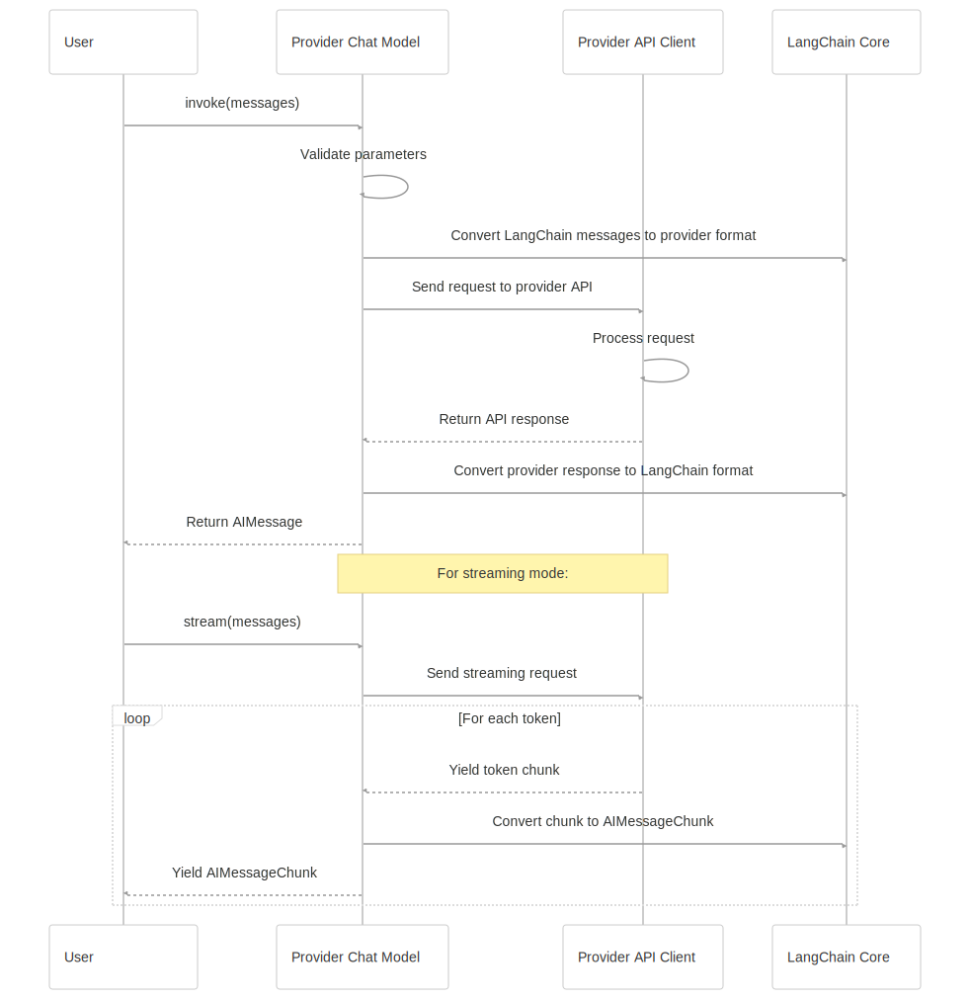

# Provider Integrations

[Powered by Devin](https://devin.ai)

[DeepWiki](https://deepwiki.com)

[DeepWiki](/)

[langchain-ai/langchain](https://github.com/langchain-ai/langchain)

[powered by

Devin](https://devin.ai)Share

Last indexed: 17 April 2025 ([b36c2b](https://github.com/langchain-ai/langchain/commits/b36c2bf8))

* [LangChain Overview](/langchain-ai/langchain/1-langchain-overview)
* [Core Architecture](/langchain-ai/langchain/2-core-architecture)
* [Package Structure](/langchain-ai/langchain/2.1-package-structure)
* [Runnable Interface & LCEL](/langchain-ai/langchain/2.2-runnable-interface-and-lcel)
* [Message System](/langchain-ai/langchain/2.3-message-system)
* [Provider Integrations](/langchain-ai/langchain/3-provider-integrations)
* [Model Interfaces](/langchain-ai/langchain/3.1-model-interfaces)
* [Provider-Specific Implementations](/langchain-ai/langchain/3.2-provider-specific-implementations)
* [Retrieval and Vector Stores](/langchain-ai/langchain/4-retrieval-and-vector-stores)
* [Chains and Agents](/langchain-ai/langchain/5-chains-and-agents)
* [Chain Types and Implementation](/langchain-ai/langchain/5.1-chain-types-and-implementation)
* [Agent System](/langchain-ai/langchain/5.2-agent-system)
* [Tools and Evaluation](/langchain-ai/langchain/6-tools-and-evaluation)
* [Tool System](/langchain-ai/langchain/6.1-tool-system)
* [Evaluation and Testing](/langchain-ai/langchain/6.2-evaluation-and-testing)
* [Developer Tools](/langchain-ai/langchain/7-developer-tools)
* [CLI and Templates](/langchain-ai/langchain/7.1-cli-and-templates)
* [CI/CD and Release Process](/langchain-ai/langchain/7.2-cicd-and-release-process)
* [Documentation System](/langchain-ai/langchain/8-documentation-system)
* [User Documentation](/langchain-ai/langchain/8.1-user-documentation)
* [API Reference Generation](/langchain-ai/langchain/8.2-api-reference-generation)

Menu

# Provider Integrations

Relevant source files

* [docs/docs/how\_to/document\_loader\_web.ipynb](https://github.com/langchain-ai/langchain/blob/b36c2bf8/docs/docs/how_to/document_loader_web.ipynb)
* [docs/docs/integrations/chat/anthropic.ipynb](https://github.com/langchain-ai/langchain/blob/b36c2bf8/docs/docs/integrations/chat/anthropic.ipynb)
* [docs/docs/integrations/chat/openai.ipynb](https://github.com/langchain-ai/langchain/blob/b36c2bf8/docs/docs/integrations/chat/openai.ipynb)
* [docs/docs/integrations/document\_loaders/hyperbrowser.ipynb](https://github.com/langchain-ai/langchain/blob/b36c2bf8/docs/docs/integrations/document_loaders/hyperbrowser.ipynb)
* [docs/docs/integrations/document\_loaders/index.mdx](https://github.com/langchain-ai/langchain/blob/b36c2bf8/docs/docs/integrations/document_loaders/index.mdx)
* [docs/docs/integrations/document\_loaders/notion.ipynb](https://github.com/langchain-ai/langchain/blob/b36c2bf8/docs/docs/integrations/document_loaders/notion.ipynb)
* [docs/docs/integrations/document\_loaders/pymupdf4llm.ipynb](https://github.com/langchain-ai/langchain/blob/b36c2bf8/docs/docs/integrations/document_loaders/pymupdf4llm.ipynb)
* [docs/docs/integrations/document\_loaders/xml.ipynb](https://github.com/langchain-ai/langchain/blob/b36c2bf8/docs/docs/integrations/document_loaders/xml.ipynb)
* [docs/docs/integrations/llms/anthropic.ipynb](https://github.com/langchain-ai/langchain/blob/b36c2bf8/docs/docs/integrations/llms/anthropic.ipynb)
* [docs/docs/integrations/providers/galaxia.mdx](https://github.com/langchain-ai/langchain/blob/b36c2bf8/docs/docs/integrations/providers/galaxia.mdx)
* [docs/docs/integrations/providers/goat.mdx](https://github.com/langchain-ai/langchain/blob/b36c2bf8/docs/docs/integrations/providers/goat.mdx)
* [docs/docs/integrations/providers/hyperbrowser.mdx](https://github.com/langchain-ai/langchain/blob/b36c2bf8/docs/docs/integrations/providers/hyperbrowser.mdx)
* [docs/docs/integrations/providers/notion.mdx](https://github.com/langchain-ai/langchain/blob/b36c2bf8/docs/docs/integrations/providers/notion.mdx)
* [docs/docs/integrations/providers/pymupdf4llm.ipynb](https://github.com/langchain-ai/langchain/blob/b36c2bf8/docs/docs/integrations/providers/pymupdf4llm.ipynb)
* [docs/docs/integrations/providers/ydb.mdx](https://github.com/langchain-ai/langchain/blob/b36c2bf8/docs/docs/integrations/providers/ydb.mdx)
* [docs/docs/integrations/retrievers/galaxia-retriever.ipynb](https://github.com/langchain-ai/langchain/blob/b36c2bf8/docs/docs/integrations/retrievers/galaxia-retriever.ipynb)
* [docs/docs/integrations/text\_embedding/mistralai.ipynb](https://github.com/langchain-ai/langchain/blob/b36c2bf8/docs/docs/integrations/text_embedding/mistralai.ipynb)
* [docs/docs/integrations/text\_embedding/together.ipynb](https://github.com/langchain-ai/langchain/blob/b36c2bf8/docs/docs/integrations/text_embedding/together.ipynb)
* [docs/docs/integrations/tools/goat.ipynb](https://github.com/langchain-ai/langchain/blob/b36c2bf8/docs/docs/integrations/tools/goat.ipynb)
* [docs/docs/integrations/tools/hyperbrowser\_browser\_agent\_tools.ipynb](https://github.com/langchain-ai/langchain/blob/b36c2bf8/docs/docs/integrations/tools/hyperbrowser_browser_agent_tools.ipynb)
* [docs/docs/integrations/tools/hyperbrowser\_web\_scraping\_tools.ipynb](https://github.com/langchain-ai/langchain/blob/b36c2bf8/docs/docs/integrations/tools/hyperbrowser_web_scraping_tools.ipynb)
* [docs/docs/integrations/vectorstores/ydb.ipynb](https://github.com/langchain-ai/langchain/blob/b36c2bf8/docs/docs/integrations/vectorstores/ydb.ipynb)
* [docs/scripts/packages\_yml\_get\_downloads.py](https://github.com/langchain-ai/langchain/blob/b36c2bf8/docs/scripts/packages_yml_get_downloads.py)
* [docs/scripts/partner\_pkg\_table.py](https://github.com/langchain-ai/langchain/blob/b36c2bf8/docs/scripts/partner_pkg_table.py)
* [docs/scripts/tool\_feat\_table.py](https://github.com/langchain-ai/langchain/blob/b36c2bf8/docs/scripts/tool_feat_table.py)
* [docs/src/theme/FeatureTables.js](https://github.com/langchain-ai/langchain/blob/b36c2bf8/docs/src/theme/FeatureTables.js)
* [libs/packages.yml](https://github.com/langchain-ai/langchain/blob/b36c2bf8/libs/packages.yml)
* [libs/partners/anthropic/Makefile](https://github.com/langchain-ai/langchain/blob/b36c2bf8/libs/partners/anthropic/Makefile)
* [libs/partners/anthropic/langchain\_anthropic/\_\_init\_\_.py](https://github.com/langchain-ai/langchain/blob/b36c2bf8/libs/partners/anthropic/langchain_anthropic/__init__.py)
* [libs/partners/anthropic/langchain\_anthropic/chat\_models.py](https://github.com/langchain-ai/langchain/blob/b36c2bf8/libs/partners/anthropic/langchain_anthropic/chat_models.py)
* [libs/partners/anthropic/pyproject.toml](https://github.com/langchain-ai/langchain/blob/b36c2bf8/libs/partners/anthropic/pyproject.toml)
* [libs/partners/anthropic/tests/integration\_tests/test\_chat\_models.py](https://github.com/langchain-ai/langchain/blob/b36c2bf8/libs/partners/anthropic/tests/integration_tests/test_chat_models.py)
* [libs/partners/anthropic/tests/unit\_tests/test\_chat\_models.py](https://github.com/langchain-ai/langchain/blob/b36c2bf8/libs/partners/anthropic/tests/unit_tests/test_chat_models.py)
* [libs/partners/anthropic/tests/unit\_tests/test\_imports.py](https://github.com/langchain-ai/langchain/blob/b36c2bf8/libs/partners/anthropic/tests/unit_tests/test_imports.py)
* [libs/partners/anthropic/uv.lock](https://github.com/langchain-ai/langchain/blob/b36c2bf8/libs/partners/anthropic/uv.lock)
* [libs/partners/chroma/Makefile](https://github.com/langchain-ai/langchain/blob/b36c2bf8/libs/partners/chroma/Makefile)
* [libs/partners/exa/Makefile](https://github.com/langchain-ai/langchain/blob/b36c2bf8/libs/partners/exa/Makefile)
* [libs/partners/fireworks/Makefile](https://github.com/langchain-ai/langchain/blob/b36c2bf8/libs/partners/fireworks/Makefile)
* [libs/partners/fireworks/langchain\_fireworks/chat\_models.py](https://github.com/langchain-ai/langchain/blob/b36c2bf8/libs/partners/fireworks/langchain_fireworks/chat_models.py)
* [libs/partners/fireworks/pyproject.toml](https://github.com/langchain-ai/langchain/blob/b36c2bf8/libs/partners/fireworks/pyproject.toml)
* [libs/partners/fireworks/tests/integration\_tests/test\_chat\_models.py](https://github.com/langchain-ai/langchain/blob/b36c2bf8/libs/partners/fireworks/tests/integration_tests/test_chat_models.py)
* [libs/partners/fireworks/uv.lock](https://github.com/langchain-ai/langchain/blob/b36c2bf8/libs/partners/fireworks/uv.lock)
* [libs/partners/groq/Makefile](https://github.com/langchain-ai/langchain/blob/b36c2bf8/libs/partners/groq/Makefile)
* [libs/partners/groq/langchain\_groq/chat\_models.py](https://github.com/langchain-ai/langchain/blob/b36c2bf8/libs/partners/groq/langchain_groq/chat_models.py)
* [libs/partners/groq/pyproject.toml](https://github.com/langchain-ai/langchain/blob/b36c2bf8/libs/partners/groq/pyproject.toml)
* [libs/partners/groq/tests/integration\_tests/test\_chat\_models.py](https://github.com/langchain-ai/langchain/blob/b36c2bf8/libs/partners/groq/tests/integration_tests/test_chat_models.py)
* [libs/partners/groq/tests/unit\_tests/test\_chat\_models.py](https://github.com/langchain-ai/langchain/blob/b36c2bf8/libs/partners/groq/tests/unit_tests/test_chat_models.py)
* [libs/partners/groq/uv.lock](https://github.com/langchain-ai/langchain/blob/b36c2bf8/libs/partners/groq/uv.lock)
* [libs/partners/huggingface/Makefile](https://github.com/langchain-ai/langchain/blob/b36c2bf8/libs/partners/huggingface/Makefile)
* [libs/partners/mistralai/Makefile](https://github.com/langchain-ai/langchain/blob/b36c2bf8/libs/partners/mistralai/Makefile)
* [libs/partners/mistralai/README.md](https://github.com/langchain-ai/langchain/blob/b36c2bf8/libs/partners/mistralai/README.md)
* [libs/partners/mistralai/langchain\_mistralai/\_\_init\_\_.py](https://github.com/langchain-ai/langchain/blob/b36c2bf8/libs/partners/mistralai/langchain_mistralai/__init__.py)
* [libs/partners/mistralai/langchain\_mistralai/chat\_models.py](https://github.com/langchain-ai/langchain/blob/b36c2bf8/libs/partners/mistralai/langchain_mistralai/chat_models.py)
* [libs/partners/mistralai/langchain\_mistralai/embeddings.py](https://github.com/langchain-ai/langchain/blob/b36c2bf8/libs/partners/mistralai/langchain_mistralai/embeddings.py)
* [libs/partners/mistralai/pyproject.toml](https://github.com/langchain-ai/langchain/blob/b36c2bf8/libs/partners/mistralai/pyproject.toml)
* [libs/partners/mistralai/tests/integration\_tests/test\_chat\_models.py](https://github.com/langchain-ai/langchain/blob/b36c2bf8/libs/partners/mistralai/tests/integration_tests/test_chat_models.py)
* [libs/partners/mistralai/tests/integration\_tests/test\_embeddings.py](https://github.com/langchain-ai/langchain/blob/b36c2bf8/libs/partners/mistralai/tests/integration_tests/test_embeddings.py)
* [libs/partners/mistralai/tests/unit\_tests/test\_chat\_models.py](https://github.com/langchain-ai/langchain/blob/b36c2bf8/libs/partners/mistralai/tests/unit_tests/test_chat_models.py)
* [libs/partners/mistralai/tests/unit\_tests/test\_embeddings.py](https://github.com/langchain-ai/langchain/blob/b36c2bf8/libs/partners/mistralai/tests/unit_tests/test_embeddings.py)
* [libs/partners/mistralai/tests/unit\_tests/test\_imports.py](https://github.com/langchain-ai/langchain/blob/b36c2bf8/libs/partners/mistralai/tests/unit_tests/test_imports.py)
* [libs/partners/mistralai/uv.lock](https://github.com/langchain-ai/langchain/blob/b36c2bf8/libs/partners/mistralai/uv.lock)
* [libs/partners/nomic/Makefile](https://github.com/langchain-ai/langchain/blob/b36c2bf8/libs/partners/nomic/Makefile)
* [libs/partners/openai/.gitignore](https://github.com/langchain-ai/langchain/blob/b36c2bf8/libs/partners/openai/.gitignore)
* [libs/partners/openai/Makefile](https://github.com/langchain-ai/langchain/blob/b36c2bf8/libs/partners/openai/Makefile)
* [libs/partners/openai/langchain\_openai/chat\_models/base.py](https://github.com/langchain-ai/langchain/blob/b36c2bf8/libs/partners/openai/langchain_openai/chat_models/base.py)
* [libs/partners/openai/pyproject.toml](https://github.com/langchain-ai/langchain/blob/b36c2bf8/libs/partners/openai/pyproject.toml)
* [libs/partners/openai/tests/integration\_tests/chat\_models/audio\_input.wav](https://github.com/langchain-ai/langchain/blob/b36c2bf8/libs/partners/openai/tests/integration_tests/chat_models/audio_input.wav)
* [libs/partners/openai/tests/integration\_tests/chat\_models/test\_azure.py](https://github.com/langchain-ai/langchain/blob/b36c2bf8/libs/partners/openai/tests/integration_tests/chat_models/test_azure.py)
* [libs/partners/openai/tests/integration\_tests/chat\_models/test\_base.py](https://github.com/langchain-ai/langchain/blob/b36c2bf8/libs/partners/openai/tests/integration_tests/chat_models/test_base.py)
* [libs/partners/openai/tests/integration\_tests/chat\_models/test\_responses\_api.py](https://github.com/langchain-ai/langchain/blob/b36c2bf8/libs/partners/openai/tests/integration_tests/chat_models/test_responses_api.py)
* [libs/partners/openai/tests/unit\_tests/chat\_models/test\_base.py](https://github.com/langchain-ai/langchain/blob/b36c2bf8/libs/partners/openai/tests/unit_tests/chat_models/test_base.py)
* [libs/partners/openai/tests/unit\_tests/test\_token\_counts.py](https://github.com/langchain-ai/langchain/blob/b36c2bf8/libs/partners/openai/tests/unit_tests/test_token_counts.py)
* [libs/partners/openai/uv.lock](https://github.com/langchain-ai/langchain/blob/b36c2bf8/libs/partners/openai/uv.lock)
* [libs/partners/qdrant/Makefile](https://github.com/langchain-ai/langchain/blob/b36c2bf8/libs/partners/qdrant/Makefile)
* [libs/partners/voyageai/Makefile](https://github.com/langchain-ai/langchain/blob/b36c2bf8/libs/partners/voyageai/Makefile)

This page documents how LangChain integrates with various language model providers (OpenAI, Anthropic, MistralAI, etc.). It explains the architecture of provider packages, their relationship to core interfaces, and how to understand the implementation patterns across different providers.

For details on model interfaces that providers implement, see [Model Interfaces](/langchain-ai/langchain/3.1-model-interfaces).

## Architecture Overview

Provider integrations are specialized packages that connect LangChain's core abstractions to specific AI model providers. These packages allow users to easily switch between different AI services while maintaining a consistent interface.



Sources: [libs/packages.yml1-645](https://github.com/langchain-ai/langchain/blob/b36c2bf8/libs/packages.yml#L1-L645) [libs/partners/openai/pyproject.toml1-87](https://github.com/langchain-ai/langchain/blob/b36c2bf8/libs/partners/openai/pyproject.toml#L1-L87) [libs/partners/anthropic/pyproject.toml1-75](https://github.com/langchain-ai/langchain/blob/b36c2bf8/libs/partners/anthropic/pyproject.toml#L1-L75) [libs/partners/mistralai/pyproject.toml1-64](https://github.com/langchain-ai/langchain/blob/b36c2bf8/libs/partners/mistralai/pyproject.toml#L1-L64) [libs/partners/groq/pyproject.toml1-60](https://github.com/langchain-ai/langchain/blob/b36c2bf8/libs/partners/groq/pyproject.toml#L1-L60)

## Provider Package Structure

Each provider integration is structured as an independent package following a consistent pattern:

* **Package naming**: `langchain-{provider}` (e.g., `langchain-openai`, `langchain-anthropic`)
* **Repository location**: Typically under `libs/partners/{provider}/`
* **Core components**:
  + Chat models (primary integration)
  + LLMs (where applicable)
  + Embeddings models
  + Provider-specific utilities



Sources: [libs/partners/openai/pyproject.toml1-87](https://github.com/langchain-ai/langchain/blob/b36c2bf8/libs/partners/openai/pyproject.toml#L1-L87) [libs/partners/anthropic/pyproject.toml1-75](https://github.com/langchain-ai/langchain/blob/b36c2bf8/libs/partners/anthropic/pyproject.toml#L1-L75) [libs/partners/mistralai/pyproject.toml1-64](https://github.com/langchain-ai/langchain/blob/b36c2bf8/libs/partners/mistralai/pyproject.toml#L1-L64) [libs/partners/groq/pyproject.toml1-60](https://github.com/langchain-ai/langchain/blob/b36c2bf8/libs/partners/groq/pyproject.toml#L1-L60) [libs/packages.yml1-645](https://github.com/langchain-ai/langchain/blob/b36c2bf8/libs/packages.yml#L1-L645)

## Integration Pattern

Provider integrations follow a consistent pattern where they implement core interfaces from `langchain-core` to provide provider-specific functionality.

### Base Chat Model Implementation

The most common integration is the implementation of `BaseChatModel` from `langchain-core`. Each provider customizes this implementation to work with their specific API.



Sources: [libs/partners/openai/langchain\_openai/chat\_models/base.py1-1142](https://github.com/langchain-ai/langchain/blob/b36c2bf8/libs/partners/openai/langchain_openai/chat_models/base.py#L1-L1142) [libs/partners/anthropic/langchain\_anthropic/chat\_models.py1-706](https://github.com/langchain-ai/langchain/blob/b36c2bf8/libs/partners/anthropic/langchain_anthropic/chat_models.py#L1-L706) [libs/partners/mistralai/langchain\_mistralai/chat\_models.py1-573](https://github.com/langchain-ai/langchain/blob/b36c2bf8/libs/partners/mistralai/langchain_mistralai/chat_models.py#L1-L573) [libs/partners/groq/langchain\_groq/chat\_models.py1-88](https://github.com/langchain-ai/langchain/blob/b36c2bf8/libs/partners/groq/langchain_groq/chat_models.py#L1-L88)

## Key Implementation Components

Provider integrations typically include these key components:

### 1. Provider Client Configuration

Each provider integration initializes and configures the underlying API client:

```
# Example from ChatOpenAI
self.client = openai.OpenAI(
    api_key=api_key,
    base_url=base_url,
    timeout=timeout,
    # ... other client params
)
```

### 2. Message Conversion

Providers need to convert between LangChain's message format and the provider's own format:

```
# Converting LangChain messages to provider format
def _convert_message_to_dict(message):
    # Transform BaseMessage to provider's format
    if isinstance(message, HumanMessage):
        return {"role": "user", "content": message.content}
    elif isinstance(message, AIMessage):
        return {"role": "assistant", "content": message.content}
    # ... other message types
```

### 3. API Communication

Providers implement methods to send requests to the API and handle responses:

```
# Generation method (simplified)
def _generate(self, messages, stop):
    # 1. Convert messages
    message_dicts = [_convert_message_to_dict(m) for m in messages]
    
    # 2. Call API
    response = self.client.chat.completions.create(
        model=self.model_name,
        messages=message_dicts,
        # ... other parameters
    )
    
    # 3. Process response
    return self._create_chat_result(response)
```

### 4. Streaming Support

Most providers implement streaming for incremental token generation:

```
# Streaming method (simplified)
def _stream(self, messages, stop):
    # 1. Convert messages
    message_dicts = [_convert_message_to_dict(m) for m in messages]
    
    # 2. Call API with streaming
    response = self.client.chat.completions.create(
        model=self.model_name,
        messages=message_dicts,
        stream=True,
        # ... other parameters
    )
    
    # 3. Yield tokens incrementally
    for chunk in response:
        yield self._convert_chunk_to_message(chunk)
```

Sources: [libs/partners/openai/langchain\_openai/chat\_models/base.py450-773](https://github.com/langchain-ai/langchain/blob/b36c2bf8/libs/partners/openai/langchain_openai/chat_models/base.py#L450-L773) [libs/partners/anthropic/langchain\_anthropic/chat\_models.py395-706](https://github.com/langchain-ai/langchain/blob/b36c2bf8/libs/partners/anthropic/langchain_anthropic/chat_models.py#L395-L706) [libs/partners/mistralai/langchain\_mistralai/chat\_models.py375-573](https://github.com/langchain-ai/langchain/blob/b36c2bf8/libs/partners/mistralai/langchain_mistralai/chat_models.py#L375-L573) [libs/partners/groq/langchain\_groq/chat\_models.py85-88](https://github.com/langchain-ai/langchain/blob/b36c2bf8/libs/partners/groq/langchain_groq/chat_models.py#L85-L88)

## Special Features

Provider integrations implement several special features to enhance their functionality:

### Tool Calling Support

Many providers support tool calling (function calling) capabilities:

```
# Example of binding tools to a model
llm_with_tools = chat_model.bind_tools([
    {
        "name": "get_weather",
        "description": "Get weather data",
        "parameters": {
            "type": "object",
            "properties": {
                "location": {"type": "string"}
            },
            "required": ["location"]
        }
    }
])
```

### Structured Output

Providers implement structured output to provide strongly-typed outputs:

```
# Example of structured output
from pydantic import BaseModel

class WeatherInfo(BaseModel):
    location: str
    temperature: float
    conditions: str

structured_llm = chat_model.with_structured_output(WeatherInfo)
result = structured_llm.invoke("What's the weather in San Francisco?")
# result is a WeatherInfo object
```

Sources: [libs/partners/openai/langchain\_openai/chat\_models/base.py450-773](https://github.com/langchain-ai/langchain/blob/b36c2bf8/libs/partners/openai/langchain_openai/chat_models/base.py#L450-L773) [libs/partners/anthropic/langchain\_anthropic/chat\_models.py395-706](https://github.com/langchain-ai/langchain/blob/b36c2bf8/libs/partners/anthropic/langchain_anthropic/chat_models.py#L395-L706) [libs/partners/mistralai/langchain\_mistralai/chat\_models.py375-573](https://github.com/langchain-ai/langchain/blob/b36c2bf8/libs/partners/mistralai/langchain_mistralai/chat_models.py#L375-L573) [libs/partners/groq/langchain\_groq/chat\_models.py85-88](https://github.com/langchain-ai/langchain/blob/b36c2bf8/libs/partners/groq/langchain_groq/chat_models.py#L85-L88)

## Provider Capabilities

The table below compares capabilities across major LLM providers:

| Provider | Package | Tool Calling | Structured Output | JSON Mode | Multimodal | Local |
| --- | --- | --- | --- | --- | --- | --- |
| ChatOpenAI | langchain-openai | ✅ | ✅ | ✅ | ✅ | ❌ |
| ChatAnthropic | langchain-anthropic | ✅ | ✅ | ❌ | ✅ | ❌ |
| ChatMistralAI | langchain-mistralai | ✅ | ✅ | ❌ | ❌ | ❌ |
| ChatGroq | langchain-groq | ✅ | ✅ | ✅ | ❌ | ❌ |
| ChatFireworks | langchain-fireworks | ✅ | ✅ | ✅ | ❌ | ❌ |
| ChatOllama | langchain-ollama | ✅ | ✅ | ✅ | ❌ | ✅ |
| ChatHuggingFace | langchain-huggingface | ✅ | ✅ | ❌ | ❌ | ✅ |

Sources: [docs/src/theme/FeatureTables.js1-675](https://github.com/langchain-ai/langchain/blob/b36c2bf8/docs/src/theme/FeatureTables.js#L1-L675)

## Common Provider Integration Pattern

The following diagram illustrates the common pattern shared across provider integrations:



Sources: [libs/partners/openai/langchain\_openai/chat\_models/base.py450-773](https://github.com/langchain-ai/langchain/blob/b36c2bf8/libs/partners/openai/langchain_openai/chat_models/base.py#L450-L773) [libs/partners/anthropic/langchain\_anthropic/chat\_models.py395-706](https://github.com/langchain-ai/langchain/blob/b36c2bf8/libs/partners/anthropic/langchain_anthropic/chat_models.py#L395-L706) [libs/partners/mistralai/langchain\_mistralai/chat\_models.py375-573](https://github.com/langchain-ai/langchain/blob/b36c2bf8/libs/partners/mistralai/langchain_mistralai/chat_models.py#L375-L573) [libs/partners/groq/langchain\_groq/chat\_models.py85-88](https://github.com/langchain-ai/langchain/blob/b36c2bf8/libs/partners/groq/langchain_groq/chat_models.py#L85-L88)

## Adding a New Provider Integration

When creating a new provider integration:

1. **Create package structure**:

   * Follow the pattern `langchain-{provider}`
   * Set up appropriate dependencies in `pyproject.toml`
2. **Implement core interfaces**:

   * Implement `BaseChatModel` from `langchain-core`
   * Implement `Embeddings` if the provider offers embeddings
3. **Message conversion**:

   * Create conversion functions between LangChain and provider message formats
4. **Handle authentication**:

   * Support both explicit API keys and environment variables
   * Follow security best practices (using `SecretStr`)
5. **Support streaming**:

   * Implement both synchronous and asynchronous streaming interfaces
6. **Implement special features**:

   * Add tool calling support if the provider has it
   * Add structured output capabilities
7. **Include tests**:

   * Unit tests for core functionality
   * Integration tests for API communication

Sources: [libs/packages.yml1-645](https://github.com/langchain-ai/langchain/blob/b36c2bf8/libs/packages.yml#L1-L645) [libs/partners/openai/pyproject.toml1-87](https://github.com/langchain-ai/langchain/blob/b36c2bf8/libs/partners/openai/pyproject.toml#L1-L87) [libs/partners/anthropic/pyproject.toml1-75](https://github.com/langchain-ai/langchain/blob/b36c2bf8/libs/partners/anthropic/pyproject.toml#L1-L75) [libs/partners/mistralai/pyproject.toml1-64](https://github.com/langchain-ai/langchain/blob/b36c2bf8/libs/partners/mistralai/pyproject.toml#L1-L64) [libs/partners/groq/pyproject.toml1-60](https://github.com/langchain-ai/langchain/blob/b36c2bf8/libs/partners/groq/pyproject.toml#L1-L60)

## Conclusion

Provider integrations are a core part of the LangChain ecosystem, allowing seamless interaction with various AI model providers. Each integration follows a consistent pattern while accounting for provider-specific capabilities and requirements. The modular design enables users to easily switch between providers while maintaining a consistent interface.

Auto-refresh not enabled yet

Try DeepWiki on your private codebase with [Devin](/private-repo)

### On this page

* [Provider Integrations](#provider-integrations)
* [Architecture Overview](#architecture-overview)
* [Provider Package Structure](#provider-package-structure)
* [Integration Pattern](#integration-pattern)
* [Base Chat Model Implementation](#base-chat-model-implementation)
* [Key Implementation Components](#key-implementation-components)
* [1. Provider Client Configuration](#1-provider-client-configuration)
* [2. Message Conversion](#2-message-conversion)
* [3. API Communication](#3-api-communication)
* [4. Streaming Support](#4-streaming-support)
* [Special Features](#special-features)
* [Tool Calling Support](#tool-calling-support)
* [Structured Output](#structured-output)
* [Provider Capabilities](#provider-capabilities)
* [Common Provider Integration Pattern](#common-provider-integration-pattern)
* [Adding a New Provider Integration](#adding-a-new-provider-integration)
* [Conclusion](#conclusion)

Ask Devin about langchain-ai/langchain

Deep Research