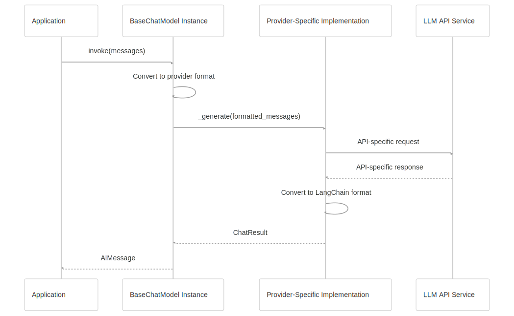

# Model Interfaces

[Powered by Devin](https://devin.ai)

[DeepWiki](https://deepwiki.com)

[DeepWiki](/)

[langchain-ai/langchain](https://github.com/langchain-ai/langchain)

[powered by

Devin](https://devin.ai)Share

Last indexed: 17 April 2025 ([b36c2b](https://github.com/langchain-ai/langchain/commits/b36c2bf8))

* [LangChain Overview](/langchain-ai/langchain/1-langchain-overview)
* [Core Architecture](/langchain-ai/langchain/2-core-architecture)
* [Package Structure](/langchain-ai/langchain/2.1-package-structure)
* [Runnable Interface & LCEL](/langchain-ai/langchain/2.2-runnable-interface-and-lcel)
* [Message System](/langchain-ai/langchain/2.3-message-system)
* [Provider Integrations](/langchain-ai/langchain/3-provider-integrations)
* [Model Interfaces](/langchain-ai/langchain/3.1-model-interfaces)
* [Provider-Specific Implementations](/langchain-ai/langchain/3.2-provider-specific-implementations)
* [Retrieval and Vector Stores](/langchain-ai/langchain/4-retrieval-and-vector-stores)
* [Chains and Agents](/langchain-ai/langchain/5-chains-and-agents)
* [Chain Types and Implementation](/langchain-ai/langchain/5.1-chain-types-and-implementation)
* [Agent System](/langchain-ai/langchain/5.2-agent-system)
* [Tools and Evaluation](/langchain-ai/langchain/6-tools-and-evaluation)
* [Tool System](/langchain-ai/langchain/6.1-tool-system)
* [Evaluation and Testing](/langchain-ai/langchain/6.2-evaluation-and-testing)
* [Developer Tools](/langchain-ai/langchain/7-developer-tools)
* [CLI and Templates](/langchain-ai/langchain/7.1-cli-and-templates)
* [CI/CD and Release Process](/langchain-ai/langchain/7.2-cicd-and-release-process)
* [Documentation System](/langchain-ai/langchain/8-documentation-system)
* [User Documentation](/langchain-ai/langchain/8.1-user-documentation)
* [API Reference Generation](/langchain-ai/langchain/8.2-api-reference-generation)

Menu

# Model Interfaces

Relevant source files

* [.github/workflows/check\_core\_versions.yml](https://github.com/langchain-ai/langchain/blob/b36c2bf8/.github/workflows/check_core_versions.yml)
* [.github/workflows/codspeed.yml](https://github.com/langchain-ai/langchain/blob/b36c2bf8/.github/workflows/codspeed.yml)
* [.gitignore](https://github.com/langchain-ai/langchain/blob/b36c2bf8/.gitignore)
* [docs/docs/integrations/chat/anthropic.ipynb](https://github.com/langchain-ai/langchain/blob/b36c2bf8/docs/docs/integrations/chat/anthropic.ipynb)
* [docs/docs/integrations/chat/openai.ipynb](https://github.com/langchain-ai/langchain/blob/b36c2bf8/docs/docs/integrations/chat/openai.ipynb)
* [docs/docs/integrations/llms/anthropic.ipynb](https://github.com/langchain-ai/langchain/blob/b36c2bf8/docs/docs/integrations/llms/anthropic.ipynb)
* [docs/docs/integrations/text\_embedding/mistralai.ipynb](https://github.com/langchain-ai/langchain/blob/b36c2bf8/docs/docs/integrations/text_embedding/mistralai.ipynb)
* [docs/docs/integrations/text\_embedding/together.ipynb](https://github.com/langchain-ai/langchain/blob/b36c2bf8/docs/docs/integrations/text_embedding/together.ipynb)
* [libs/community/Makefile](https://github.com/langchain-ai/langchain/blob/b36c2bf8/libs/community/Makefile)
* [libs/community/tests/integration\_tests/callbacks/test\_langchain\_tracer.py](https://github.com/langchain-ai/langchain/blob/b36c2bf8/libs/community/tests/integration_tests/callbacks/test_langchain_tracer.py)
* [libs/core/Makefile](https://github.com/langchain-ai/langchain/blob/b36c2bf8/libs/core/Makefile)
* [libs/core/langchain\_core/\_\_init\_\_.py](https://github.com/langchain-ai/langchain/blob/b36c2bf8/libs/core/langchain_core/__init__.py)
* [libs/core/langchain\_core/callbacks/base.py](https://github.com/langchain-ai/langchain/blob/b36c2bf8/libs/core/langchain_core/callbacks/base.py)
* [libs/core/langchain\_core/callbacks/file.py](https://github.com/langchain-ai/langchain/blob/b36c2bf8/libs/core/langchain_core/callbacks/file.py)
* [libs/core/langchain\_core/callbacks/manager.py](https://github.com/langchain-ai/langchain/blob/b36c2bf8/libs/core/langchain_core/callbacks/manager.py)
* [libs/core/langchain\_core/callbacks/stdout.py](https://github.com/langchain-ai/langchain/blob/b36c2bf8/libs/core/langchain_core/callbacks/stdout.py)
* [libs/core/langchain\_core/callbacks/streaming\_stdout.py](https://github.com/langchain-ai/langchain/blob/b36c2bf8/libs/core/langchain_core/callbacks/streaming_stdout.py)
* [libs/core/langchain\_core/language\_models/base.py](https://github.com/langchain-ai/langchain/blob/b36c2bf8/libs/core/langchain_core/language_models/base.py)
* [libs/core/langchain\_core/language\_models/chat\_models.py](https://github.com/langchain-ai/langchain/blob/b36c2bf8/libs/core/langchain_core/language_models/chat_models.py)
* [libs/core/langchain\_core/language\_models/fake\_chat\_models.py](https://github.com/langchain-ai/langchain/blob/b36c2bf8/libs/core/langchain_core/language_models/fake_chat_models.py)
* [libs/core/langchain\_core/language\_models/llms.py](https://github.com/langchain-ai/langchain/blob/b36c2bf8/libs/core/langchain_core/language_models/llms.py)
* [libs/core/langchain\_core/output\_parsers/base.py](https://github.com/langchain-ai/langchain/blob/b36c2bf8/libs/core/langchain_core/output_parsers/base.py)
* [libs/core/langchain\_core/output\_parsers/transform.py](https://github.com/langchain-ai/langchain/blob/b36c2bf8/libs/core/langchain_core/output_parsers/transform.py)
* [libs/core/langchain\_core/tracers/base.py](https://github.com/langchain-ai/langchain/blob/b36c2bf8/libs/core/langchain_core/tracers/base.py)
* [libs/core/langchain\_core/tracers/core.py](https://github.com/langchain-ai/langchain/blob/b36c2bf8/libs/core/langchain_core/tracers/core.py)
* [libs/core/langchain\_core/tracers/evaluation.py](https://github.com/langchain-ai/langchain/blob/b36c2bf8/libs/core/langchain_core/tracers/evaluation.py)
* [libs/core/langchain\_core/tracers/langchain.py](https://github.com/langchain-ai/langchain/blob/b36c2bf8/libs/core/langchain_core/tracers/langchain.py)
* [libs/core/langchain\_core/tracers/langchain\_v1.py](https://github.com/langchain-ai/langchain/blob/b36c2bf8/libs/core/langchain_core/tracers/langchain_v1.py)
* [libs/core/langchain\_core/tracers/root\_listeners.py](https://github.com/langchain-ai/langchain/blob/b36c2bf8/libs/core/langchain_core/tracers/root_listeners.py)
* [libs/core/langchain\_core/tracers/schemas.py](https://github.com/langchain-ai/langchain/blob/b36c2bf8/libs/core/langchain_core/tracers/schemas.py)
* [libs/core/langchain\_core/tracers/stdout.py](https://github.com/langchain-ai/langchain/blob/b36c2bf8/libs/core/langchain_core/tracers/stdout.py)
* [libs/core/langchain\_core/utils/html.py](https://github.com/langchain-ai/langchain/blob/b36c2bf8/libs/core/langchain_core/utils/html.py)
* [libs/core/langchain\_core/utils/loading.py](https://github.com/langchain-ai/langchain/blob/b36c2bf8/libs/core/langchain_core/utils/loading.py)
* [libs/core/langchain\_core/utils/mustache.py](https://github.com/langchain-ai/langchain/blob/b36c2bf8/libs/core/langchain_core/utils/mustache.py)
* [libs/core/langchain\_core/version.py](https://github.com/langchain-ai/langchain/blob/b36c2bf8/libs/core/langchain_core/version.py)
* [libs/core/pyproject.toml](https://github.com/langchain-ai/langchain/blob/b36c2bf8/libs/core/pyproject.toml)
* [libs/core/tests/benchmarks/\_\_init\_\_.py](https://github.com/langchain-ai/langchain/blob/b36c2bf8/libs/core/tests/benchmarks/__init__.py)
* [libs/core/tests/benchmarks/test\_async\_callbacks.py](https://github.com/langchain-ai/langchain/blob/b36c2bf8/libs/core/tests/benchmarks/test_async_callbacks.py)
* [libs/core/tests/benchmarks/test\_imports.py](https://github.com/langchain-ai/langchain/blob/b36c2bf8/libs/core/tests/benchmarks/test_imports.py)
* [libs/core/tests/unit\_tests/fake/test\_fake\_chat\_model.py](https://github.com/langchain-ai/langchain/blob/b36c2bf8/libs/core/tests/unit_tests/fake/test_fake_chat_model.py)
* [libs/core/tests/unit\_tests/language\_models/chat\_models/test\_base.py](https://github.com/langchain-ai/langchain/blob/b36c2bf8/libs/core/tests/unit_tests/language_models/chat_models/test_base.py)
* [libs/core/tests/unit\_tests/language\_models/chat\_models/test\_cache.py](https://github.com/langchain-ai/langchain/blob/b36c2bf8/libs/core/tests/unit_tests/language_models/chat_models/test_cache.py)
* [libs/core/tests/unit\_tests/language\_models/llms/test\_base.py](https://github.com/langchain-ai/langchain/blob/b36c2bf8/libs/core/tests/unit_tests/language_models/llms/test_base.py)
* [libs/core/tests/unit\_tests/runnables/test\_tracing\_interops.py](https://github.com/langchain-ai/langchain/blob/b36c2bf8/libs/core/tests/unit_tests/runnables/test_tracing_interops.py)
* [libs/core/tests/unit\_tests/tracers/test\_async\_base\_tracer.py](https://github.com/langchain-ai/langchain/blob/b36c2bf8/libs/core/tests/unit_tests/tracers/test_async_base_tracer.py)
* [libs/core/tests/unit\_tests/tracers/test\_base\_tracer.py](https://github.com/langchain-ai/langchain/blob/b36c2bf8/libs/core/tests/unit_tests/tracers/test_base_tracer.py)
* [libs/core/tests/unit\_tests/tracers/test\_langchain.py](https://github.com/langchain-ai/langchain/blob/b36c2bf8/libs/core/tests/unit_tests/tracers/test_langchain.py)
* [libs/core/uv.lock](https://github.com/langchain-ai/langchain/blob/b36c2bf8/libs/core/uv.lock)
* [libs/langchain/Makefile](https://github.com/langchain-ai/langchain/blob/b36c2bf8/libs/langchain/Makefile)
* [libs/partners/anthropic/Makefile](https://github.com/langchain-ai/langchain/blob/b36c2bf8/libs/partners/anthropic/Makefile)
* [libs/partners/anthropic/langchain\_anthropic/\_\_init\_\_.py](https://github.com/langchain-ai/langchain/blob/b36c2bf8/libs/partners/anthropic/langchain_anthropic/__init__.py)
* [libs/partners/anthropic/langchain\_anthropic/chat\_models.py](https://github.com/langchain-ai/langchain/blob/b36c2bf8/libs/partners/anthropic/langchain_anthropic/chat_models.py)
* [libs/partners/anthropic/pyproject.toml](https://github.com/langchain-ai/langchain/blob/b36c2bf8/libs/partners/anthropic/pyproject.toml)
* [libs/partners/anthropic/tests/integration\_tests/test\_chat\_models.py](https://github.com/langchain-ai/langchain/blob/b36c2bf8/libs/partners/anthropic/tests/integration_tests/test_chat_models.py)
* [libs/partners/anthropic/tests/unit\_tests/test\_chat\_models.py](https://github.com/langchain-ai/langchain/blob/b36c2bf8/libs/partners/anthropic/tests/unit_tests/test_chat_models.py)
* [libs/partners/anthropic/tests/unit\_tests/test\_imports.py](https://github.com/langchain-ai/langchain/blob/b36c2bf8/libs/partners/anthropic/tests/unit_tests/test_imports.py)
* [libs/partners/anthropic/uv.lock](https://github.com/langchain-ai/langchain/blob/b36c2bf8/libs/partners/anthropic/uv.lock)
* [libs/partners/chroma/Makefile](https://github.com/langchain-ai/langchain/blob/b36c2bf8/libs/partners/chroma/Makefile)
* [libs/partners/exa/Makefile](https://github.com/langchain-ai/langchain/blob/b36c2bf8/libs/partners/exa/Makefile)
* [libs/partners/fireworks/Makefile](https://github.com/langchain-ai/langchain/blob/b36c2bf8/libs/partners/fireworks/Makefile)
* [libs/partners/fireworks/langchain\_fireworks/chat\_models.py](https://github.com/langchain-ai/langchain/blob/b36c2bf8/libs/partners/fireworks/langchain_fireworks/chat_models.py)
* [libs/partners/fireworks/pyproject.toml](https://github.com/langchain-ai/langchain/blob/b36c2bf8/libs/partners/fireworks/pyproject.toml)
* [libs/partners/fireworks/tests/integration\_tests/test\_chat\_models.py](https://github.com/langchain-ai/langchain/blob/b36c2bf8/libs/partners/fireworks/tests/integration_tests/test_chat_models.py)
* [libs/partners/fireworks/uv.lock](https://github.com/langchain-ai/langchain/blob/b36c2bf8/libs/partners/fireworks/uv.lock)
* [libs/partners/groq/Makefile](https://github.com/langchain-ai/langchain/blob/b36c2bf8/libs/partners/groq/Makefile)
* [libs/partners/groq/langchain\_groq/chat\_models.py](https://github.com/langchain-ai/langchain/blob/b36c2bf8/libs/partners/groq/langchain_groq/chat_models.py)
* [libs/partners/groq/pyproject.toml](https://github.com/langchain-ai/langchain/blob/b36c2bf8/libs/partners/groq/pyproject.toml)
* [libs/partners/groq/tests/integration\_tests/test\_chat\_models.py](https://github.com/langchain-ai/langchain/blob/b36c2bf8/libs/partners/groq/tests/integration_tests/test_chat_models.py)
* [libs/partners/groq/tests/unit\_tests/test\_chat\_models.py](https://github.com/langchain-ai/langchain/blob/b36c2bf8/libs/partners/groq/tests/unit_tests/test_chat_models.py)
* [libs/partners/groq/uv.lock](https://github.com/langchain-ai/langchain/blob/b36c2bf8/libs/partners/groq/uv.lock)
* [libs/partners/huggingface/Makefile](https://github.com/langchain-ai/langchain/blob/b36c2bf8/libs/partners/huggingface/Makefile)
* [libs/partners/mistralai/Makefile](https://github.com/langchain-ai/langchain/blob/b36c2bf8/libs/partners/mistralai/Makefile)
* [libs/partners/mistralai/README.md](https://github.com/langchain-ai/langchain/blob/b36c2bf8/libs/partners/mistralai/README.md)
* [libs/partners/mistralai/langchain\_mistralai/\_\_init\_\_.py](https://github.com/langchain-ai/langchain/blob/b36c2bf8/libs/partners/mistralai/langchain_mistralai/__init__.py)
* [libs/partners/mistralai/langchain\_mistralai/chat\_models.py](https://github.com/langchain-ai/langchain/blob/b36c2bf8/libs/partners/mistralai/langchain_mistralai/chat_models.py)
* [libs/partners/mistralai/langchain\_mistralai/embeddings.py](https://github.com/langchain-ai/langchain/blob/b36c2bf8/libs/partners/mistralai/langchain_mistralai/embeddings.py)
* [libs/partners/mistralai/pyproject.toml](https://github.com/langchain-ai/langchain/blob/b36c2bf8/libs/partners/mistralai/pyproject.toml)
* [libs/partners/mistralai/tests/integration\_tests/test\_chat\_models.py](https://github.com/langchain-ai/langchain/blob/b36c2bf8/libs/partners/mistralai/tests/integration_tests/test_chat_models.py)
* [libs/partners/mistralai/tests/integration\_tests/test\_embeddings.py](https://github.com/langchain-ai/langchain/blob/b36c2bf8/libs/partners/mistralai/tests/integration_tests/test_embeddings.py)
* [libs/partners/mistralai/tests/unit\_tests/test\_chat\_models.py](https://github.com/langchain-ai/langchain/blob/b36c2bf8/libs/partners/mistralai/tests/unit_tests/test_chat_models.py)
* [libs/partners/mistralai/tests/unit\_tests/test\_embeddings.py](https://github.com/langchain-ai/langchain/blob/b36c2bf8/libs/partners/mistralai/tests/unit_tests/test_embeddings.py)
* [libs/partners/mistralai/tests/unit\_tests/test\_imports.py](https://github.com/langchain-ai/langchain/blob/b36c2bf8/libs/partners/mistralai/tests/unit_tests/test_imports.py)
* [libs/partners/mistralai/uv.lock](https://github.com/langchain-ai/langchain/blob/b36c2bf8/libs/partners/mistralai/uv.lock)
* [libs/partners/nomic/Makefile](https://github.com/langchain-ai/langchain/blob/b36c2bf8/libs/partners/nomic/Makefile)
* [libs/partners/openai/.gitignore](https://github.com/langchain-ai/langchain/blob/b36c2bf8/libs/partners/openai/.gitignore)
* [libs/partners/openai/Makefile](https://github.com/langchain-ai/langchain/blob/b36c2bf8/libs/partners/openai/Makefile)
* [libs/partners/openai/langchain\_openai/chat\_models/base.py](https://github.com/langchain-ai/langchain/blob/b36c2bf8/libs/partners/openai/langchain_openai/chat_models/base.py)
* [libs/partners/openai/pyproject.toml](https://github.com/langchain-ai/langchain/blob/b36c2bf8/libs/partners/openai/pyproject.toml)
* [libs/partners/openai/tests/integration\_tests/chat\_models/audio\_input.wav](https://github.com/langchain-ai/langchain/blob/b36c2bf8/libs/partners/openai/tests/integration_tests/chat_models/audio_input.wav)
* [libs/partners/openai/tests/integration\_tests/chat\_models/test\_azure.py](https://github.com/langchain-ai/langchain/blob/b36c2bf8/libs/partners/openai/tests/integration_tests/chat_models/test_azure.py)
* [libs/partners/openai/tests/integration\_tests/chat\_models/test\_base.py](https://github.com/langchain-ai/langchain/blob/b36c2bf8/libs/partners/openai/tests/integration_tests/chat_models/test_base.py)
* [libs/partners/openai/tests/integration\_tests/chat\_models/test\_responses\_api.py](https://github.com/langchain-ai/langchain/blob/b36c2bf8/libs/partners/openai/tests/integration_tests/chat_models/test_responses_api.py)
* [libs/partners/openai/tests/unit\_tests/chat\_models/test\_base.py](https://github.com/langchain-ai/langchain/blob/b36c2bf8/libs/partners/openai/tests/unit_tests/chat_models/test_base.py)
* [libs/partners/openai/tests/unit\_tests/test\_token\_counts.py](https://github.com/langchain-ai/langchain/blob/b36c2bf8/libs/partners/openai/tests/unit_tests/test_token_counts.py)
* [libs/partners/openai/uv.lock](https://github.com/langchain-ai/langchain/blob/b36c2bf8/libs/partners/openai/uv.lock)
* [libs/partners/qdrant/Makefile](https://github.com/langchain-ai/langchain/blob/b36c2bf8/libs/partners/qdrant/Makefile)
* [libs/partners/voyageai/Makefile](https://github.com/langchain-ai/langchain/blob/b36c2bf8/libs/partners/voyageai/Makefile)

This page documents the core model interfaces in LangChain, explaining the abstract base classes that define how different types of language models interact with the rest of the system. These interfaces establish the contracts that all language model implementations must follow, enabling interoperability between different provider implementations.

For information about specific model implementations, see [Provider-Specific Implementations](/langchain-ai/langchain/3.2-provider-specific-implementations). For an overview of the provider integration system, see [Provider Integrations](/langchain-ai/langchain/3-provider-integrations).

## Interface Hierarchy

LangChain provides a clean abstraction for working with different types of language models through a well-defined hierarchy of interfaces. This hierarchy enables standardized interaction with models from various providers like OpenAI, Anthropic, MistralAI, and others.



Sources:

* [libs/core/langchain\_core/language\_models/base.py](https://github.com/langchain-ai/langchain/blob/b36c2bf8/libs/core/langchain_core/language_models/base.py)
* [libs/core/langchain\_core/language\_models/chat\_models.py](https://github.com/langchain-ai/langchain/blob/b36c2bf8/libs/core/langchain_core/language_models/chat_models.py)
* [libs/core/langchain\_core/language\_models/llms.py](https://github.com/langchain-ai/langchain/blob/b36c2bf8/libs/core/langchain_core/language_models/llms.py)
* [libs/partners/openai/langchain\_openai/chat\_models/base.py](https://github.com/langchain-ai/langchain/blob/b36c2bf8/libs/partners/openai/langchain_openai/chat_models/base.py)
* [libs/partners/anthropic/langchain\_anthropic/chat\_models.py](https://github.com/langchain-ai/langchain/blob/b36c2bf8/libs/partners/anthropic/langchain_anthropic/chat_models.py)
* [libs/partners/mistralai/langchain\_mistralai/chat\_models.py](https://github.com/langchain-ai/langchain/blob/b36c2bf8/libs/partners/mistralai/langchain_mistralai/chat_models.py)
* [libs/partners/groq/langchain\_groq/chat\_models.py](https://github.com/langchain-ai/langchain/blob/b36c2bf8/libs/partners/groq/langchain_groq/chat_models.py)

## BaseLanguageModel

The `BaseLanguageModel` is the foundational abstract class for all language models in LangChain. It inherits from the `Runnable` interface, making language models composable with other components in the LangChain ecosystem.

### Key Attributes and Methods


| Method | Description |
| --- | --- |
| `predict` | Generate text from a string input |
| `predict_messages` | Generate a message from a list of messages |
| `get_num_tokens` | Calculate the number of tokens in a text string |
| `generate` | Main method for generating completions from multiple prompts |
| `invoke` | Process a single input (inherited from Runnable) |
| `stream` | Stream generated content (inherited from Runnable) |

Sources:

* [libs/core/langchain\_core/language\_models/base.py10-200](https://github.com/langchain-ai/langchain/blob/b36c2bf8/libs/core/langchain_core/language_models/base.py#L10-L200)

### Input/Output Handling

`BaseLanguageModel` defines a generic type parameter for inputs, allowing for flexibility in implementing different types of language models:

```
# Generic definition
class BaseLanguageModel(Generic[LanguageModelInput], Runnable[LanguageModelInput, Any], ABC):
```

The `LanguageModelInput` type represents the various formats that can be provided to a language model:

* Strings (for raw text prompts)
* Lists of messages
* PromptValue objects

Sources:

* [libs/core/langchain\_core/language\_models/base.py30-45](https://github.com/langchain-ai/langchain/blob/b36c2bf8/libs/core/langchain_core/language_models/base.py#L30-L45)

## BaseLLM Interface

`BaseLLM` extends `BaseLanguageModel` and serves as the abstract base class for traditional text completion models (as opposed to chat models). These models take a text prompt and return a completion.

### Key Methods


| Method | Description |
| --- | --- |
| `_generate` | The core implementation method that subclasses must implement |
| `_agenerate` | Async version of \_generate (optional for subclasses) |
| `generate` | Public method that handles callbacks and caching before calling \_generate |
| `agenerate` | Async version of generate |
| `_stream` | Stream generated content in chunks (optional for subclasses) |
| `_astream` | Async version of \_stream (optional for subclasses) |

The minimum required implementation for a subclass is the `_generate` method.

Sources:

* [libs/core/langchain\_core/language\_models/llms.py200-600](https://github.com/langchain-ai/langchain/blob/b36c2bf8/libs/core/langchain_core/language_models/llms.py#L200-L600)

### Output Format

LLMs produce results in the `LLMResult` format, which contains:

```
class LLMResult(BaseModel):
    generations: List[List[Generation]]
    llm_output: Optional[dict] = None
    run: Optional[List[RunInfo]] = None
```

Each `Generation` includes:

* `text`: The generated text content
* `generation_info`: Optional metadata about the generation
* `message`: Optional message representation of the generation

Sources:

* [libs/core/langchain\_core/outputs.py](https://github.com/langchain-ai/langchain/blob/b36c2bf8/libs/core/langchain_core/outputs.py)

## BaseChatModel Interface

`BaseChatModel` extends `BaseLanguageModel` and serves as the abstract base class for chat-based language models. These models work with sequences of messages and maintain a conversational context.

### Key Methods


| Method | Description |
| --- | --- |
| `_generate` | The core implementation method that subclasses must implement |
| `_agenerate` | Async version of \_generate (optional for subclasses) |
| `generate_prompt` | Process ChatPromptValues before passing to \_generate |
| `agenerate_prompt` | Async version of generate\_prompt |
| `_stream` | Stream generated content in message chunks (optional) |
| `_astream` | Async version of \_stream (optional) |
| `bind_tools` | Create a chat model that can use tools/functions |
| `with_structured_output` | Create a model that returns structured output |

The minimum required implementation for a subclass is the `_generate` method.

Sources:

* [libs/core/langchain\_core/language\_models/chat\_models.py200-600](https://github.com/langchain-ai/langchain/blob/b36c2bf8/libs/core/langchain_core/language_models/chat_models.py#L200-L600)

### Message Types

Chat models work with a variety of message types, all inheriting from `BaseMessage`:


Sources:

* [libs/core/langchain\_core/messages/\_\_init\_\_.py](https://github.com/langchain-ai/langchain/blob/b36c2bf8/libs/core/langchain_core/messages/__init__.py)

## Provider Implementation Patterns

Provider-specific implementations follow standard patterns for implementing the base interfaces. Here's a typical implementation flow:



### Common Implementation Components

Provider implementations typically include:

1. **Initialization parameters**:

   * Model-specific parameters (model name, temperature, etc.)
   * Authentication (API keys)
   * Client configuration (timeout, retry logic)
2. **Message conversion**:

   * Converting LangChain message types to provider formats
   * Converting provider responses back to LangChain types
3. **API communication**:

   * Making HTTP requests to provider APIs
   * Handling streaming responses
   * Error handling and retries
4. **Extended functionality**:

   * Tool/function calling support
   * Structured output parsing
   * Streaming optimization

Sources:

* [libs/partners/openai/langchain\_openai/chat\_models/base.py100-400](https://github.com/langchain-ai/langchain/blob/b36c2bf8/libs/partners/openai/langchain_openai/chat_models/base.py#L100-L400)
* [libs/partners/anthropic/langchain\_anthropic/chat\_models.py100-400](https://github.com/langchain-ai/langchain/blob/b36c2bf8/libs/partners/anthropic/langchain_anthropic/chat_models.py#L100-L400)
* [libs/partners/mistralai/langchain\_mistralai/chat\_models.py100-400](https://github.com/langchain-ai/langchain/blob/b36c2bf8/libs/partners/mistralai/langchain_mistralai/chat_models.py#L100-L400)
* [libs/partners/groq/langchain\_groq/chat\_models.py100-400](https://github.com/langchain-ai/langchain/blob/b36c2bf8/libs/partners/groq/langchain_groq/chat_models.py#L100-L400)

## Implementation Example

Let's examine how `ChatOpenAI` implements the `BaseChatModel` interface as an example:


Key implementation elements:

1. **Client management**: Creating and managing the OpenAI client
2. **Parameter handling**: Converting LangChain parameters to OpenAI format
3. **Message conversion**: Transforming between LangChain and OpenAI message formats
4. **Response processing**: Parsing OpenAI responses into LangChain outputs
5. **Error handling**: Dealing with rate limits, authentication issues, etc.

Sources:

* [libs/partners/openai/langchain\_openai/chat\_models/base.py454-674](https://github.com/langchain-ai/langchain/blob/b36c2bf8/libs/partners/openai/langchain_openai/chat_models/base.py#L454-L674)

## Comparison of Model Types

Let's look at the key differences between LLMs and Chat models:

| Feature | BaseLLM | BaseChatModel |
| --- | --- | --- |
| Input format | Text strings | Message sequences |
| Context handling | No built-in context | Maintains conversation context |
| Primary output | Text completions | AI messages |
| Typical use case | Text generation, completion | Conversational agents |
| Common providers | OpenAI Completions, Cohere | OpenAI ChatGPT, Claude, Mistral |
| Tool usage | Limited | Built-in support via `bind_tools()` |

Sources:

* [libs/core/langchain\_core/language\_models/llms.py](https://github.com/langchain-ai/langchain/blob/b36c2bf8/libs/core/langchain_core/language_models/llms.py)
* [libs/core/langchain\_core/language\_models/chat\_models.py](https://github.com/langchain-ai/langchain/blob/b36c2bf8/libs/core/langchain_core/language_models/chat_models.py)

## Extending the Model Interfaces

Developers can extend model interfaces in several ways:

1. **Creating new provider implementations**:

   * Implementing `_generate` for new providers
   * Converting provider-specific formats to LangChain formats
2. **Adding new capabilities**:

   * Extending base classes with new methods
   * Implementing custom streaming behavior
3. **Customizing behavior**:

   * Overriding methods like `_get_invocation_params`
   * Implementing custom caching logic
4. **Creating composite models**:

   * Using the `Runnable` interface to compose models with other components
   * Implementing fallback strategies across multiple models

Sources:

* [libs/core/langchain\_core/language\_models/chat\_models.py230-270](https://github.com/langchain-ai/langchain/blob/b36c2bf8/libs/core/langchain_core/language_models/chat_models.py#L230-L270)

## Summary

The model interfaces in LangChain provide a standardized way to interact with different language models:

* `BaseLanguageModel` establishes the foundation for all language models
* `BaseLLM` specializes in text completion models
* `BaseChatModel` handles conversational models with message sequences

These interfaces enable:

* Provider-agnostic code
* Consistent streaming behavior
* Unified error handling
* Interoperability between models and other LangChain components

When implementing a custom language model, start by choosing the appropriate base class (`BaseLLM` or `BaseChatModel`) and implement the required `_generate` method at minimum.

Sources:

* [libs/core/langchain\_core/language\_models/base.py](https://github.com/langchain-ai/langchain/blob/b36c2bf8/libs/core/langchain_core/language_models/base.py)
* [libs/core/langchain\_core/language\_models/chat\_models.py](https://github.com/langchain-ai/langchain/blob/b36c2bf8/libs/core/langchain_core/language_models/chat_models.py)
* [libs/core/langchain\_core/language\_models/llms.py](https://github.com/langchain-ai/langchain/blob/b36c2bf8/libs/core/langchain_core/language_models/llms.py)

Auto-refresh not enabled yet

Try DeepWiki on your private codebase with [Devin](/private-repo)

### On this page

* [Model Interfaces](#model-interfaces)
* [Interface Hierarchy](#interface-hierarchy)
* [BaseLanguageModel](#baselanguagemodel)
* [Key Attributes and Methods](#key-attributes-and-methods)
* [Input/Output Handling](#inputoutput-handling)
* [BaseLLM Interface](#basellm-interface)
* [Key Methods](#key-methods)
* [Output Format](#output-format)
* [BaseChatModel Interface](#basechatmodel-interface)
* [Key Methods](#key-methods-1)
* [Message Types](#message-types)
* [Provider Implementation Patterns](#provider-implementation-patterns)
* [Common Implementation Components](#common-implementation-components)
* [Implementation Example](#implementation-example)
* [Comparison of Model Types](#comparison-of-model-types)
* [Extending the Model Interfaces](#extending-the-model-interfaces)
* [Summary](#summary)

Ask Devin about langchain-ai/langchain

Deep Research