# Provider-Specific Implementations

[Powered by Devin](https://devin.ai)

[DeepWiki](https://deepwiki.com)

[DeepWiki](/)

[langchain-ai/langchain](https://github.com/langchain-ai/langchain)

[powered by

Devin](https://devin.ai)Share

Last indexed: 17 April 2025 ([b36c2b](https://github.com/langchain-ai/langchain/commits/b36c2bf8))

* [LangChain Overview](/langchain-ai/langchain/1-langchain-overview)
* [Core Architecture](/langchain-ai/langchain/2-core-architecture)
* [Package Structure](/langchain-ai/langchain/2.1-package-structure)
* [Runnable Interface & LCEL](/langchain-ai/langchain/2.2-runnable-interface-and-lcel)
* [Message System](/langchain-ai/langchain/2.3-message-system)
* [Provider Integrations](/langchain-ai/langchain/3-provider-integrations)
* [Model Interfaces](/langchain-ai/langchain/3.1-model-interfaces)
* [Provider-Specific Implementations](/langchain-ai/langchain/3.2-provider-specific-implementations)
* [Retrieval and Vector Stores](/langchain-ai/langchain/4-retrieval-and-vector-stores)
* [Chains and Agents](/langchain-ai/langchain/5-chains-and-agents)
* [Chain Types and Implementation](/langchain-ai/langchain/5.1-chain-types-and-implementation)
* [Agent System](/langchain-ai/langchain/5.2-agent-system)
* [Tools and Evaluation](/langchain-ai/langchain/6-tools-and-evaluation)
* [Tool System](/langchain-ai/langchain/6.1-tool-system)
* [Evaluation and Testing](/langchain-ai/langchain/6.2-evaluation-and-testing)
* [Developer Tools](/langchain-ai/langchain/7-developer-tools)
* [CLI and Templates](/langchain-ai/langchain/7.1-cli-and-templates)
* [CI/CD and Release Process](/langchain-ai/langchain/7.2-cicd-and-release-process)
* [Documentation System](/langchain-ai/langchain/8-documentation-system)
* [User Documentation](/langchain-ai/langchain/8.1-user-documentation)
* [API Reference Generation](/langchain-ai/langchain/8.2-api-reference-generation)

Menu

# Provider-Specific Implementations

Relevant source files

* [docs/docs/how\_to/document\_loader\_web.ipynb](https://github.com/langchain-ai/langchain/blob/b36c2bf8/docs/docs/how_to/document_loader_web.ipynb)
* [docs/docs/integrations/chat/anthropic.ipynb](https://github.com/langchain-ai/langchain/blob/b36c2bf8/docs/docs/integrations/chat/anthropic.ipynb)
* [docs/docs/integrations/chat/openai.ipynb](https://github.com/langchain-ai/langchain/blob/b36c2bf8/docs/docs/integrations/chat/openai.ipynb)
* [docs/docs/integrations/document\_loaders/hyperbrowser.ipynb](https://github.com/langchain-ai/langchain/blob/b36c2bf8/docs/docs/integrations/document_loaders/hyperbrowser.ipynb)
* [docs/docs/integrations/document\_loaders/index.mdx](https://github.com/langchain-ai/langchain/blob/b36c2bf8/docs/docs/integrations/document_loaders/index.mdx)
* [docs/docs/integrations/document\_loaders/notion.ipynb](https://github.com/langchain-ai/langchain/blob/b36c2bf8/docs/docs/integrations/document_loaders/notion.ipynb)
* [docs/docs/integrations/document\_loaders/pymupdf4llm.ipynb](https://github.com/langchain-ai/langchain/blob/b36c2bf8/docs/docs/integrations/document_loaders/pymupdf4llm.ipynb)
* [docs/docs/integrations/document\_loaders/xml.ipynb](https://github.com/langchain-ai/langchain/blob/b36c2bf8/docs/docs/integrations/document_loaders/xml.ipynb)
* [docs/docs/integrations/llms/anthropic.ipynb](https://github.com/langchain-ai/langchain/blob/b36c2bf8/docs/docs/integrations/llms/anthropic.ipynb)
* [docs/docs/integrations/providers/galaxia.mdx](https://github.com/langchain-ai/langchain/blob/b36c2bf8/docs/docs/integrations/providers/galaxia.mdx)
* [docs/docs/integrations/providers/goat.mdx](https://github.com/langchain-ai/langchain/blob/b36c2bf8/docs/docs/integrations/providers/goat.mdx)
* [docs/docs/integrations/providers/hyperbrowser.mdx](https://github.com/langchain-ai/langchain/blob/b36c2bf8/docs/docs/integrations/providers/hyperbrowser.mdx)
* [docs/docs/integrations/providers/notion.mdx](https://github.com/langchain-ai/langchain/blob/b36c2bf8/docs/docs/integrations/providers/notion.mdx)
* [docs/docs/integrations/providers/pymupdf4llm.ipynb](https://github.com/langchain-ai/langchain/blob/b36c2bf8/docs/docs/integrations/providers/pymupdf4llm.ipynb)
* [docs/docs/integrations/providers/ydb.mdx](https://github.com/langchain-ai/langchain/blob/b36c2bf8/docs/docs/integrations/providers/ydb.mdx)
* [docs/docs/integrations/retrievers/galaxia-retriever.ipynb](https://github.com/langchain-ai/langchain/blob/b36c2bf8/docs/docs/integrations/retrievers/galaxia-retriever.ipynb)
* [docs/docs/integrations/text\_embedding/mistralai.ipynb](https://github.com/langchain-ai/langchain/blob/b36c2bf8/docs/docs/integrations/text_embedding/mistralai.ipynb)
* [docs/docs/integrations/text\_embedding/together.ipynb](https://github.com/langchain-ai/langchain/blob/b36c2bf8/docs/docs/integrations/text_embedding/together.ipynb)
* [docs/docs/integrations/tools/goat.ipynb](https://github.com/langchain-ai/langchain/blob/b36c2bf8/docs/docs/integrations/tools/goat.ipynb)
* [docs/docs/integrations/tools/hyperbrowser\_browser\_agent\_tools.ipynb](https://github.com/langchain-ai/langchain/blob/b36c2bf8/docs/docs/integrations/tools/hyperbrowser_browser_agent_tools.ipynb)
* [docs/docs/integrations/tools/hyperbrowser\_web\_scraping\_tools.ipynb](https://github.com/langchain-ai/langchain/blob/b36c2bf8/docs/docs/integrations/tools/hyperbrowser_web_scraping_tools.ipynb)
* [docs/docs/integrations/vectorstores/ydb.ipynb](https://github.com/langchain-ai/langchain/blob/b36c2bf8/docs/docs/integrations/vectorstores/ydb.ipynb)
* [docs/scripts/packages\_yml\_get\_downloads.py](https://github.com/langchain-ai/langchain/blob/b36c2bf8/docs/scripts/packages_yml_get_downloads.py)
* [docs/scripts/partner\_pkg\_table.py](https://github.com/langchain-ai/langchain/blob/b36c2bf8/docs/scripts/partner_pkg_table.py)
* [docs/scripts/tool\_feat\_table.py](https://github.com/langchain-ai/langchain/blob/b36c2bf8/docs/scripts/tool_feat_table.py)
* [docs/src/theme/FeatureTables.js](https://github.com/langchain-ai/langchain/blob/b36c2bf8/docs/src/theme/FeatureTables.js)
* [libs/packages.yml](https://github.com/langchain-ai/langchain/blob/b36c2bf8/libs/packages.yml)
* [libs/partners/anthropic/Makefile](https://github.com/langchain-ai/langchain/blob/b36c2bf8/libs/partners/anthropic/Makefile)
* [libs/partners/anthropic/langchain\_anthropic/\_\_init\_\_.py](https://github.com/langchain-ai/langchain/blob/b36c2bf8/libs/partners/anthropic/langchain_anthropic/__init__.py)
* [libs/partners/anthropic/langchain\_anthropic/chat\_models.py](https://github.com/langchain-ai/langchain/blob/b36c2bf8/libs/partners/anthropic/langchain_anthropic/chat_models.py)
* [libs/partners/anthropic/pyproject.toml](https://github.com/langchain-ai/langchain/blob/b36c2bf8/libs/partners/anthropic/pyproject.toml)
* [libs/partners/anthropic/tests/integration\_tests/test\_chat\_models.py](https://github.com/langchain-ai/langchain/blob/b36c2bf8/libs/partners/anthropic/tests/integration_tests/test_chat_models.py)
* [libs/partners/anthropic/tests/unit\_tests/test\_chat\_models.py](https://github.com/langchain-ai/langchain/blob/b36c2bf8/libs/partners/anthropic/tests/unit_tests/test_chat_models.py)
* [libs/partners/anthropic/tests/unit\_tests/test\_imports.py](https://github.com/langchain-ai/langchain/blob/b36c2bf8/libs/partners/anthropic/tests/unit_tests/test_imports.py)
* [libs/partners/anthropic/uv.lock](https://github.com/langchain-ai/langchain/blob/b36c2bf8/libs/partners/anthropic/uv.lock)
* [libs/partners/chroma/Makefile](https://github.com/langchain-ai/langchain/blob/b36c2bf8/libs/partners/chroma/Makefile)
* [libs/partners/exa/Makefile](https://github.com/langchain-ai/langchain/blob/b36c2bf8/libs/partners/exa/Makefile)
* [libs/partners/fireworks/Makefile](https://github.com/langchain-ai/langchain/blob/b36c2bf8/libs/partners/fireworks/Makefile)
* [libs/partners/fireworks/langchain\_fireworks/chat\_models.py](https://github.com/langchain-ai/langchain/blob/b36c2bf8/libs/partners/fireworks/langchain_fireworks/chat_models.py)
* [libs/partners/fireworks/pyproject.toml](https://github.com/langchain-ai/langchain/blob/b36c2bf8/libs/partners/fireworks/pyproject.toml)
* [libs/partners/fireworks/tests/integration\_tests/test\_chat\_models.py](https://github.com/langchain-ai/langchain/blob/b36c2bf8/libs/partners/fireworks/tests/integration_tests/test_chat_models.py)
* [libs/partners/fireworks/uv.lock](https://github.com/langchain-ai/langchain/blob/b36c2bf8/libs/partners/fireworks/uv.lock)
* [libs/partners/groq/Makefile](https://github.com/langchain-ai/langchain/blob/b36c2bf8/libs/partners/groq/Makefile)
* [libs/partners/groq/langchain\_groq/chat\_models.py](https://github.com/langchain-ai/langchain/blob/b36c2bf8/libs/partners/groq/langchain_groq/chat_models.py)
* [libs/partners/groq/pyproject.toml](https://github.com/langchain-ai/langchain/blob/b36c2bf8/libs/partners/groq/pyproject.toml)
* [libs/partners/groq/tests/integration\_tests/test\_chat\_models.py](https://github.com/langchain-ai/langchain/blob/b36c2bf8/libs/partners/groq/tests/integration_tests/test_chat_models.py)
* [libs/partners/groq/tests/unit\_tests/test\_chat\_models.py](https://github.com/langchain-ai/langchain/blob/b36c2bf8/libs/partners/groq/tests/unit_tests/test_chat_models.py)
* [libs/partners/groq/uv.lock](https://github.com/langchain-ai/langchain/blob/b36c2bf8/libs/partners/groq/uv.lock)
* [libs/partners/huggingface/Makefile](https://github.com/langchain-ai/langchain/blob/b36c2bf8/libs/partners/huggingface/Makefile)
* [libs/partners/mistralai/Makefile](https://github.com/langchain-ai/langchain/blob/b36c2bf8/libs/partners/mistralai/Makefile)
* [libs/partners/mistralai/README.md](https://github.com/langchain-ai/langchain/blob/b36c2bf8/libs/partners/mistralai/README.md)
* [libs/partners/mistralai/langchain\_mistralai/\_\_init\_\_.py](https://github.com/langchain-ai/langchain/blob/b36c2bf8/libs/partners/mistralai/langchain_mistralai/__init__.py)
* [libs/partners/mistralai/langchain\_mistralai/chat\_models.py](https://github.com/langchain-ai/langchain/blob/b36c2bf8/libs/partners/mistralai/langchain_mistralai/chat_models.py)
* [libs/partners/mistralai/langchain\_mistralai/embeddings.py](https://github.com/langchain-ai/langchain/blob/b36c2bf8/libs/partners/mistralai/langchain_mistralai/embeddings.py)
* [libs/partners/mistralai/pyproject.toml](https://github.com/langchain-ai/langchain/blob/b36c2bf8/libs/partners/mistralai/pyproject.toml)
* [libs/partners/mistralai/tests/integration\_tests/test\_chat\_models.py](https://github.com/langchain-ai/langchain/blob/b36c2bf8/libs/partners/mistralai/tests/integration_tests/test_chat_models.py)
* [libs/partners/mistralai/tests/integration\_tests/test\_embeddings.py](https://github.com/langchain-ai/langchain/blob/b36c2bf8/libs/partners/mistralai/tests/integration_tests/test_embeddings.py)
* [libs/partners/mistralai/tests/unit\_tests/test\_chat\_models.py](https://github.com/langchain-ai/langchain/blob/b36c2bf8/libs/partners/mistralai/tests/unit_tests/test_chat_models.py)
* [libs/partners/mistralai/tests/unit\_tests/test\_embeddings.py](https://github.com/langchain-ai/langchain/blob/b36c2bf8/libs/partners/mistralai/tests/unit_tests/test_embeddings.py)
* [libs/partners/mistralai/tests/unit\_tests/test\_imports.py](https://github.com/langchain-ai/langchain/blob/b36c2bf8/libs/partners/mistralai/tests/unit_tests/test_imports.py)
* [libs/partners/mistralai/uv.lock](https://github.com/langchain-ai/langchain/blob/b36c2bf8/libs/partners/mistralai/uv.lock)
* [libs/partners/nomic/Makefile](https://github.com/langchain-ai/langchain/blob/b36c2bf8/libs/partners/nomic/Makefile)
* [libs/partners/openai/.gitignore](https://github.com/langchain-ai/langchain/blob/b36c2bf8/libs/partners/openai/.gitignore)
* [libs/partners/openai/Makefile](https://github.com/langchain-ai/langchain/blob/b36c2bf8/libs/partners/openai/Makefile)
* [libs/partners/openai/langchain\_openai/chat\_models/base.py](https://github.com/langchain-ai/langchain/blob/b36c2bf8/libs/partners/openai/langchain_openai/chat_models/base.py)
* [libs/partners/openai/pyproject.toml](https://github.com/langchain-ai/langchain/blob/b36c2bf8/libs/partners/openai/pyproject.toml)
* [libs/partners/openai/tests/integration\_tests/chat\_models/audio\_input.wav](https://github.com/langchain-ai/langchain/blob/b36c2bf8/libs/partners/openai/tests/integration_tests/chat_models/audio_input.wav)
* [libs/partners/openai/tests/integration\_tests/chat\_models/test\_azure.py](https://github.com/langchain-ai/langchain/blob/b36c2bf8/libs/partners/openai/tests/integration_tests/chat_models/test_azure.py)
* [libs/partners/openai/tests/integration\_tests/chat\_models/test\_base.py](https://github.com/langchain-ai/langchain/blob/b36c2bf8/libs/partners/openai/tests/integration_tests/chat_models/test_base.py)
* [libs/partners/openai/tests/integration\_tests/chat\_models/test\_responses\_api.py](https://github.com/langchain-ai/langchain/blob/b36c2bf8/libs/partners/openai/tests/integration_tests/chat_models/test_responses_api.py)
* [libs/partners/openai/tests/unit\_tests/chat\_models/test\_base.py](https://github.com/langchain-ai/langchain/blob/b36c2bf8/libs/partners/openai/tests/unit_tests/chat_models/test_base.py)
* [libs/partners/openai/tests/unit\_tests/test\_token\_counts.py](https://github.com/langchain-ai/langchain/blob/b36c2bf8/libs/partners/openai/tests/unit_tests/test_token_counts.py)
* [libs/partners/openai/uv.lock](https://github.com/langchain-ai/langchain/blob/b36c2bf8/libs/partners/openai/uv.lock)
* [libs/partners/qdrant/Makefile](https://github.com/langchain-ai/langchain/blob/b36c2bf8/libs/partners/qdrant/Makefile)
* [libs/partners/voyageai/Makefile](https://github.com/langchain-ai/langchain/blob/b36c2bf8/libs/partners/voyageai/Makefile)

This page documents how LangChain implements integrations with different AI model providers (like OpenAI, Anthropic, MistralAI, Groq, Fireworks, etc.) through provider-specific packages. It explains the architecture of these implementations, common patterns, and how they connect to core LangChain interfaces. For information about the core model interfaces that these provider implementations build upon, see [Model Interfaces](/langchain-ai/langchain/3.1-model-interfaces).

## Provider Package Architecture

LangChain follows a modular package architecture where each provider has its own dedicated package. This enables users to install only the dependencies they need and allows for independent versioning and updates across providers.

Sources:

* [libs/packages.yml1-599](https://github.com/langchain-ai/langchain/blob/b36c2bf8/libs/packages.yml#L1-L599)
* [libs/partners/openai/pyproject.toml1-87](https://github.com/langchain-ai/langchain/blob/b36c2bf8/libs/partners/openai/pyproject.toml#L1-L87)
* [libs/partners/anthropic/pyproject.toml1-75](https://github.com/langchain-ai/langchain/blob/b36c2bf8/libs/partners/anthropic/pyproject.toml#L1-L75)
* [libs/partners/mistralai/pyproject.toml1-64](https://github.com/langchain-ai/langchain/blob/b36c2bf8/libs/partners/mistralai/pyproject.toml#L1-L64)
* [libs/partners/groq/pyproject.toml1-60](https://github.com/langchain-ai/langchain/blob/b36c2bf8/libs/partners/groq/pyproject.toml#L1-L60)
* [libs/partners/fireworks/pyproject.toml1-68](https://github.com/langchain-ai/langchain/blob/b36c2bf8/libs/partners/fireworks/pyproject.toml#L1-L68)

### Package Structure

Each provider package typically follows a similar structure:

1. **Package metadata**: Dependencies, version info
2. **Model implementations**: Chat models, LLMs, Embeddings
3. **Helper utilities**: For token counting, request formatting, etc.
4. **Tests**: Unit and integration tests

Sources:

* [libs/partners/openai/pyproject.toml1-87](https://github.com/langchain-ai/langchain/blob/b36c2bf8/libs/partners/openai/pyproject.toml#L1-L87)
* [libs/partners/openai/langchain\_openai/chat\_models/base.py1-100](https://github.com/langchain-ai/langchain/blob/b36c2bf8/libs/partners/openai/langchain_openai/chat_models/base.py#L1-L100)
* [libs/partners/anthropic/langchain\_anthropic/chat\_models.py1-100](https://github.com/langchain-ai/langchain/blob/b36c2bf8/libs/partners/anthropic/langchain_anthropic/chat_models.py#L1-L100)
* [libs/partners/mistralai/langchain\_mistralai/chat\_models.py1-100](https://github.com/langchain-ai/langchain/blob/b36c2bf8/libs/partners/mistralai/langchain_mistralai/chat_models.py#L1-L100)
* [libs/partners/mistralai/langchain\_mistralai/embeddings.py1-50](https://github.com/langchain-ai/langchain/blob/b36c2bf8/libs/partners/mistralai/langchain_mistralai/embeddings.py#L1-L50)

## Common Implementation Patterns

While each provider has unique features, there are common patterns across all implementations. This section focuses primarily on chat model implementations since they're the most widely used.

### Base Chat Model Implementation

Provider-specific chat models implement the `BaseChatModel` abstract class from `langchain-core`:

Sources:

* [libs/partners/openai/langchain\_openai/chat\_models/base.py454-772](https://github.com/langchain-ai/langchain/blob/b36c2bf8/libs/partners/openai/langchain_openai/chat_models/base.py#L454-L772)
* [libs/partners/anthropic/langchain\_anthropic/chat\_models.py395-666](https://github.com/langchain-ai/langchain/blob/b36c2bf8/libs/partners/anthropic/langchain_anthropic/chat_models.py#L395-L666)
* [libs/partners/mistralai/langchain\_mistralai/chat\_models.py375-550](https://github.com/langchain-ai/langchain/blob/b36c2bf8/libs/partners/mistralai/langchain_mistralai/chat_models.py#L375-L550)
* [libs/partners/groq/langchain\_groq/chat\_models.py85-200](https://github.com/langchain-ai/langchain/blob/b36c2bf8/libs/partners/groq/langchain_groq/chat_models.py#L85-L200)

### Key Implementation Components

Each provider's chat model implementation typically includes:

1. **Configuration**: API keys, model parameters, and endpoint configuration
2. **Message conversion**: Functions to convert LangChain messages to provider-specific formats
3. **API client management**: Initialization and configuration of the underlying API client
4. **Request handling**: Methods to generate responses from the API
5. **Streaming support**: Methods for streaming responses
6. **Error handling**: Provider-specific error handling and retries

Sources:

* [libs/partners/openai/langchain\_openai/chat\_models/base.py766-921](https://github.com/langchain-ai/langchain/blob/b36c2bf8/libs/partners/openai/langchain_openai/chat_models/base.py#L766-L921)
* [libs/partners/anthropic/langchain\_anthropic/chat\_models.py650-900](https://github.com/langchain-ai/langchain/blob/b36c2bf8/libs/partners/anthropic/langchain_anthropic/chat_models.py#L650-L900)
* [libs/partners/mistralai/langchain\_mistralai/chat\_models.py550-700](https://github.com/langchain-ai/langchain/blob/b36c2bf8/libs/partners/mistralai/langchain_mistralai/chat_models.py#L550-L700)
* [libs/partners/groq/langchain\_groq/chat\_models.py200-400](https://github.com/langchain-ai/langchain/blob/b36c2bf8/libs/partners/groq/langchain_groq/chat_models.py#L200-L400)

## Message Format Conversion

A critical aspect of provider implementations is converting between LangChain's message format and the provider's native format. Each provider has specific requirements for how messages should be structured.

### OpenAI Message Conversion

Sources:

* [libs/partners/openai/langchain\_openai/chat\_models/base.py117-187](https://github.com/langchain-ai/langchain/blob/b36c2bf8/libs/partners/openai/langchain_openai/chat_models/base.py#L117-L187)
* [libs/partners/openai/langchain\_openai/chat\_models/base.py260-326](https://github.com/langchain-ai/langchain/blob/b36c2bf8/libs/partners/openai/langchain_openai/chat_models/base.py#L260-L326)

### Anthropic Message Conversion

Sources:

* [libs/partners/anthropic/langchain\_anthropic/chat\_models.py133-392](https://github.com/langchain-ai/langchain/blob/b36c2bf8/libs/partners/anthropic/langchain_anthropic/chat_models.py#L133-L392)
* [libs/partners/anthropic/langchain\_anthropic/chat\_models.py251-392](https://github.com/langchain-ai/langchain/blob/b36c2bf8/libs/partners/anthropic/langchain_anthropic/chat_models.py#L251-L392)

## Provider-Specific Features

Each provider has unique features and capabilities. Here's a comparison of features supported by different provider implementations:

| Provider | Tool calling | Structured output | JSON mode | Multimodal | Package |
| --- | --- | --- | --- | --- | --- |
| ChatOpenAI | ✅ | ✅ | ✅ | ✅ | langchain-openai |
| ChatAnthropic | ✅ | ✅ | ❌ | ✅ | langchain-anthropic |
| ChatMistralAI | ✅ | ✅ | ❌ | ❌ | langchain-mistralai |
| ChatGroq | ✅ | ✅ | ✅ | ❌ | langchain-groq |
| ChatFireworks | ✅ | ✅ | ✅ | ❌ | langchain-fireworks |

Sources:

* [docs/src/theme/FeatureTables.js8-240](https://github.com/langchain-ai/langchain/blob/b36c2bf8/docs/src/theme/FeatureTables.js#L8-L240)
* [docs/docs/integrations/chat/openai.ipynb1-80](https://github.com/langchain-ai/langchain/blob/b36c2bf8/docs/docs/integrations/chat/openai.ipynb#L1-L80)
* [docs/docs/integrations/chat/anthropic.ipynb1-40](https://github.com/langchain-ai/langchain/blob/b36c2bf8/docs/docs/integrations/chat/anthropic.ipynb#L1-L40)

## Advanced Features Implementation

Provider implementations extend beyond basic chat functionality to include advanced features like tool calling, structured output, and multimodal input handling.

### Tool Calling Implementation

Tool calling (function calling) is implemented with similar patterns across providers, adapting to each provider's specific API requirements:

Sources:

* [libs/partners/openai/langchain\_openai/chat\_models/base.py85-100](https://github.com/langchain-ai/langchain/blob/b36c2bf8/libs/partners/openai/langchain_openai/chat_models/base.py#L85-L100)
* [libs/partners/anthropic/langchain\_anthropic/chat\_models.py81-105](https://github.com/langchain-ai/langchain/blob/b36c2bf8/libs/partners/anthropic/langchain_anthropic/chat_models.py#L81-L105)
* [libs/partners/mistralai/langchain\_mistralai/chat\_models.py290-315](https://github.com/langchain-ai/langchain/blob/b36c2bf8/libs/partners/mistralai/langchain_mistralai/chat_models.py#L290-L315)

### Structured Output Implementation

Structured output is typically implemented using the provider's function/tool calling capabilities or JSON mode:

Sources:

* [libs/partners/openai/tests/integration\_tests/chat\_models/test\_base.py400-500](https://github.com/langchain-ai/langchain/blob/b36c2bf8/libs/partners/openai/tests/integration_tests/chat_models/test_base.py#L400-L500)
* [libs/partners/anthropic/tests/integration\_tests/test\_chat\_models.py550-580](https://github.com/langchain-ai/langchain/blob/b36c2bf8/libs/partners/anthropic/tests/integration_tests/test_chat_models.py#L550-L580)

## Package Dependencies

Provider packages have specific dependencies on the provider's SDK and other required libraries:

| Provider Package | Main Dependencies |
| --- | --- |
| langchain-openai | openai>=1.68.2, tiktoken>=0.7, langchain-core>=0.3.52 |
| langchain-anthropic | anthropic>=0.49.0, langchain-core>=0.3.52 |
| langchain-mistralai | httpx>=0.25.2, httpx-sse>=0.3.1, tokenizers>=0.15.1, langchain-core>=0.3.49 |
| langchain-groq | groq>=0.4.1, langchain-core>=0.3.49 |
| langchain-fireworks | fireworks-ai>=0.13.0, openai>=1.10.0, langchain-core>=0.3.49 |

Sources:

* [libs/partners/openai/pyproject.toml9-13](https://github.com/langchain-ai/langchain/blob/b36c2bf8/libs/partners/openai/pyproject.toml#L9-L13)
* [libs/partners/anthropic/pyproject.toml9-13](https://github.com/langchain-ai/langchain/blob/b36c2bf8/libs/partners/anthropic/pyproject.toml#L9-L13)
* [libs/partners/mistralai/pyproject.toml9-15](https://github.com/langchain-ai/langchain/blob/b36c2bf8/libs/partners/mistralai/pyproject.toml#L9-L15)
* [libs/partners/groq/pyproject.toml9-10](https://github.com/langchain-ai/langchain/blob/b36c2bf8/libs/partners/groq/pyproject.toml#L9-L10)
* [libs/partners/fireworks/pyproject.toml9-15](https://github.com/langchain-ai/langchain/blob/b36c2bf8/libs/partners/fireworks/pyproject.toml#L9-L15)

## Implementation Lifecycle

The typical lifecycle of a provider implementation follows these steps:

Sources:

* [libs/partners/openai/pyproject.toml1-87](https://github.com/langchain-ai/langchain/blob/b36c2bf8/libs/partners/openai/pyproject.toml#L1-L87)
* [libs/partners/openai/tests/integration\_tests/chat\_models/test\_base.py1-50](https://github.com/langchain-ai/langchain/blob/b36c2bf8/libs/partners/openai/tests/integration_tests/chat_models/test_base.py#L1-L50)
* [libs/partners/anthropic/tests/integration\_tests/test\_chat\_models.py1-50](https://github.com/langchain-ai/langchain/blob/b36c2bf8/libs/partners/anthropic/tests/integration_tests/test_chat_models.py#L1-L50)

## Key Implementation Classes

The most important classes in provider implementations include:

1. **ChatOpenAI**: OpenAI chat models implementation
2. **ChatAnthropic**: Anthropic chat models implementation
3. **ChatMistralAI**: Mistral chat models implementation
4. **ChatGroq**: Groq chat models implementation
5. **ChatFireworks**: Fireworks chat models implementation

Each of these implements the BaseChatModel abstract class and provides provider-specific functionality including:

* Authentication
* Message format conversion
* Request construction
* Response parsing
* Streaming support
* Error handling
* Advanced features (tool calling, structured output, etc.)

Sources:

* [libs/partners/openai/langchain\_openai/chat\_models/base.py454-550](https://github.com/langchain-ai/langchain/blob/b36c2bf8/libs/partners/openai/langchain_openai/chat_models/base.py#L454-L550)
* [libs/partners/anthropic/langchain\_anthropic/chat\_models.py395-450](https://github.com/langchain-ai/langchain/blob/b36c2bf8/libs/partners/anthropic/langchain_anthropic/chat_models.py#L395-L450)
* [libs/partners/mistralai/langchain\_mistralai/chat\_models.py375-425](https://github.com/langchain-ai/langchain/blob/b36c2bf8/libs/partners/mistralai/langchain_mistralai/chat_models.py#L375-L425)
* [libs/partners/groq/langchain\_groq/chat\_models.py85-125](https://github.com/langchain-ai/langchain/blob/b36c2bf8/libs/partners/groq/langchain_groq/chat_models.py#L85-L125)
* [libs/partners/fireworks/langchain\_fireworks/chat\_models.py85-125](https://github.com/langchain-ai/langchain/blob/b36c2bf8/libs/partners/fireworks/langchain_fireworks/chat_models.py#L85-L125)

## Common Implementation Challenges

Provider implementations must handle several common challenges:

1. **Message format differences**: Each provider has a unique message format
2. **Authentication methods**: Different authentication requirements
3. **Streaming implementation**: Different approaches to streaming responses
4. **Error handling**: Provider-specific error types and retry logic
5. **Token counting**: Different methods for calculating token usage
6. **Feature support**: Varying support for features like tool calling and multimodal inputs

Sources:

* [libs/partners/openai/langchain\_openai/chat\_models/base.py117-326](https://github.com/langchain-ai/langchain/blob/b36c2bf8/libs/partners/openai/langchain_openai/chat_models/base.py#L117-L326)
* [libs/partners/anthropic/langchain\_anthropic/chat\_models.py133-392](https://github.com/langchain-ai/langchain/blob/b36c2bf8/libs/partners/anthropic/langchain_anthropic/chat_models.py#L133-L392)
* [libs/partners/mistralai/langchain\_mistralai/chat\_models.py290-315](https://github.com/langchain-ai/langchain/blob/b36c2bf8/libs/partners/mistralai/langchain_mistralai/chat_models.py#L290-L315)
* [libs/partners/groq/langchain\_groq/chat\_models.py89-289](https://github.com/langchain-ai/langchain/blob/b36c2bf8/libs/partners/groq/langchain_groq/chat_models.py#L89-L289)
* [libs/partners/fireworks/langchain\_fireworks/chat\_models.py89-289](https://github.com/langchain-ai/langchain/blob/b36c2bf8/libs/partners/fireworks/langchain_fireworks/chat_models.py#L89-L289)

## Conclusion

Provider-specific implementations in LangChain follow a consistent pattern while adapting to the unique requirements of each provider's API. These implementations enable LangChain to support a wide range of AI model providers through a unified interface, allowing applications to easily switch between providers or use multiple providers simultaneously.

The modularity of these implementations, with each provider in its own package, allows for independent versioning and updates, enabling rapid integration of new provider features while maintaining backward compatibility.

Auto-refresh not enabled yet

Try DeepWiki on your private codebase with [Devin](/private-repo)

### On this page

* [Provider-Specific Implementations](#provider-specific-implementations)
* [Provider Package Architecture](#provider-package-architecture)
* [Package Structure](#package-structure)
* [Common Implementation Patterns](#common-implementation-patterns)
* [Base Chat Model Implementation](#base-chat-model-implementation)
* [Key Implementation Components](#key-implementation-components)
* [Message Format Conversion](#message-format-conversion)
* [OpenAI Message Conversion](#openai-message-conversion)
* [Anthropic Message Conversion](#anthropic-message-conversion)
* [Provider-Specific Features](#provider-specific-features)
* [Advanced Features Implementation](#advanced-features-implementation)
* [Tool Calling Implementation](#tool-calling-implementation)
* [Structured Output Implementation](#structured-output-implementation)
* [Package Dependencies](#package-dependencies)
* [Implementation Lifecycle](#implementation-lifecycle)
* [Key Implementation Classes](#key-implementation-classes)
* [Common Implementation Challenges](#common-implementation-challenges)
* [Conclusion](#conclusion)

Ask Devin about langchain-ai/langchain

Deep Research