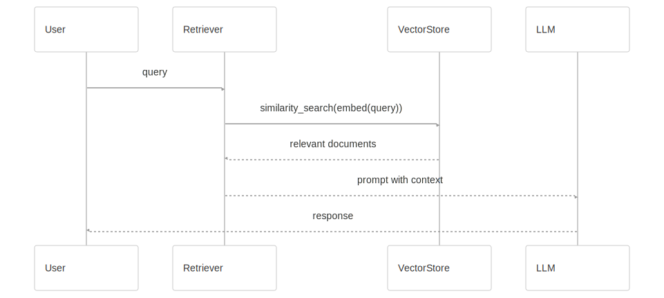

# Retrieval and Vector Stores

[Powered by Devin](https://devin.ai)

[DeepWiki](https://deepwiki.com)

[DeepWiki](/)

[langchain-ai/langchain](https://github.com/langchain-ai/langchain)

[powered by

Devin](https://devin.ai)Share

Last indexed: 17 April 2025 ([b36c2b](https://github.com/langchain-ai/langchain/commits/b36c2bf8))

* [LangChain Overview](/langchain-ai/langchain/1-langchain-overview)
* [Core Architecture](/langchain-ai/langchain/2-core-architecture)
* [Package Structure](/langchain-ai/langchain/2.1-package-structure)
* [Runnable Interface & LCEL](/langchain-ai/langchain/2.2-runnable-interface-and-lcel)
* [Message System](/langchain-ai/langchain/2.3-message-system)
* [Provider Integrations](/langchain-ai/langchain/3-provider-integrations)
* [Model Interfaces](/langchain-ai/langchain/3.1-model-interfaces)
* [Provider-Specific Implementations](/langchain-ai/langchain/3.2-provider-specific-implementations)
* [Retrieval and Vector Stores](/langchain-ai/langchain/4-retrieval-and-vector-stores)
* [Chains and Agents](/langchain-ai/langchain/5-chains-and-agents)
* [Chain Types and Implementation](/langchain-ai/langchain/5.1-chain-types-and-implementation)
* [Agent System](/langchain-ai/langchain/5.2-agent-system)
* [Tools and Evaluation](/langchain-ai/langchain/6-tools-and-evaluation)
* [Tool System](/langchain-ai/langchain/6.1-tool-system)
* [Evaluation and Testing](/langchain-ai/langchain/6.2-evaluation-and-testing)
* [Developer Tools](/langchain-ai/langchain/7-developer-tools)
* [CLI and Templates](/langchain-ai/langchain/7.1-cli-and-templates)
* [CI/CD and Release Process](/langchain-ai/langchain/7.2-cicd-and-release-process)
* [Documentation System](/langchain-ai/langchain/8-documentation-system)
* [User Documentation](/langchain-ai/langchain/8.1-user-documentation)
* [API Reference Generation](/langchain-ai/langchain/8.2-api-reference-generation)

Menu

# Retrieval and Vector Stores

Relevant source files

* [Makefile](https://github.com/langchain-ai/langchain/blob/b36c2bf8/Makefile)
* [docs/docs/how\_to/multimodal\_inputs.ipynb](https://github.com/langchain-ai/langchain/blob/b36c2bf8/docs/docs/how_to/multimodal_inputs.ipynb)
* [docs/docs/how\_to/multimodal\_prompts.ipynb](https://github.com/langchain-ai/langchain/blob/b36c2bf8/docs/docs/how_to/multimodal_prompts.ipynb)
* [docs/docs/integrations/chat/llamacpp.ipynb](https://github.com/langchain-ai/langchain/blob/b36c2bf8/docs/docs/integrations/chat/llamacpp.ipynb)
* [docs/docs/integrations/chat/octoai.ipynb](https://github.com/langchain-ai/langchain/blob/b36c2bf8/docs/docs/integrations/chat/octoai.ipynb)
* [docs/docs/integrations/chat/perplexity.ipynb](https://github.com/langchain-ai/langchain/blob/b36c2bf8/docs/docs/integrations/chat/perplexity.ipynb)
* [docs/docs/integrations/document\_loaders/bilibili.ipynb](https://github.com/langchain-ai/langchain/blob/b36c2bf8/docs/docs/integrations/document_loaders/bilibili.ipynb)
* [docs/docs/integrations/providers/llamacpp.mdx](https://github.com/langchain-ai/langchain/blob/b36c2bf8/docs/docs/integrations/providers/llamacpp.mdx)
* [docs/docs/integrations/providers/maritalk.mdx](https://github.com/langchain-ai/langchain/blob/b36c2bf8/docs/docs/integrations/providers/maritalk.mdx)
* [docs/docs/integrations/providers/mlx.mdx](https://github.com/langchain-ai/langchain/blob/b36c2bf8/docs/docs/integrations/providers/mlx.mdx)
* [docs/docs/integrations/providers/octoai.mdx](https://github.com/langchain-ai/langchain/blob/b36c2bf8/docs/docs/integrations/providers/octoai.mdx)
* [docs/docs/integrations/providers/perplexity.mdx](https://github.com/langchain-ai/langchain/blob/b36c2bf8/docs/docs/integrations/providers/perplexity.mdx)
* [docs/docs/integrations/text\_embedding/llamacpp.ipynb](https://github.com/langchain-ai/langchain/blob/b36c2bf8/docs/docs/integrations/text_embedding/llamacpp.ipynb)
* [libs/community/langchain\_community/chat\_models/octoai.py](https://github.com/langchain-ai/langchain/blob/b36c2bf8/libs/community/langchain_community/chat_models/octoai.py)
* [libs/community/langchain\_community/chat\_models/perplexity.py](https://github.com/langchain-ai/langchain/blob/b36c2bf8/libs/community/langchain_community/chat_models/perplexity.py)
* [libs/community/langchain\_community/document\_loaders/bilibili.py](https://github.com/langchain-ai/langchain/blob/b36c2bf8/libs/community/langchain_community/document_loaders/bilibili.py)
* [libs/community/pyproject.toml](https://github.com/langchain-ai/langchain/blob/b36c2bf8/libs/community/pyproject.toml)
* [libs/community/tests/integration\_tests/chat\_models/test\_octoai.py](https://github.com/langchain-ai/langchain/blob/b36c2bf8/libs/community/tests/integration_tests/chat_models/test_octoai.py)
* [libs/community/tests/integration\_tests/chat\_models/test\_perplexity.py](https://github.com/langchain-ai/langchain/blob/b36c2bf8/libs/community/tests/integration_tests/chat_models/test_perplexity.py)
* [libs/community/tests/integration\_tests/document\_loaders/test\_bilibili.py](https://github.com/langchain-ai/langchain/blob/b36c2bf8/libs/community/tests/integration_tests/document_loaders/test_bilibili.py)
* [libs/community/tests/unit\_tests/chat\_models/test\_octoai.py](https://github.com/langchain-ai/langchain/blob/b36c2bf8/libs/community/tests/unit_tests/chat_models/test_octoai.py)
* [libs/community/tests/unit\_tests/chat\_models/test\_perplexity.py](https://github.com/langchain-ai/langchain/blob/b36c2bf8/libs/community/tests/unit_tests/chat_models/test_perplexity.py)
* [libs/community/tests/unit\_tests/test\_dependencies.py](https://github.com/langchain-ai/langchain/blob/b36c2bf8/libs/community/tests/unit_tests/test_dependencies.py)
* [libs/community/uv.lock](https://github.com/langchain-ai/langchain/blob/b36c2bf8/libs/community/uv.lock)
* [libs/langchain/pyproject.toml](https://github.com/langchain-ai/langchain/blob/b36c2bf8/libs/langchain/pyproject.toml)
* [libs/langchain/tests/unit\_tests/test\_dependencies.py](https://github.com/langchain-ai/langchain/blob/b36c2bf8/libs/langchain/tests/unit_tests/test_dependencies.py)
* [libs/langchain/uv.lock](https://github.com/langchain-ai/langchain/blob/b36c2bf8/libs/langchain/uv.lock)
* [pyproject.toml](https://github.com/langchain-ai/langchain/blob/b36c2bf8/pyproject.toml)

This document explains LangChain's retrieval and vector store systems, which form the foundation for Retrieval Augmented Generation (RAG) applications. It covers the architecture, interfaces, and implementations that allow for storing, indexing, and retrieving relevant information to augment LLM capabilities. For information about how these components are used in higher-level abstractions like chains and agents, see [Chains and Agents](/langchain-ai/langchain/5-chains-and-agents).

## Overview

Retrieval systems in LangChain enable applications to find relevant information from external knowledge sources to provide to language models. Vector stores are specialized databases that index and store vector embeddings of documents, allowing for semantic similarity search. Together, these components enable the creation of RAG applications that enhance LLM responses with contextually relevant information.

The retrieval and vector store system in LangChain consists of several key components:

1. **Document Loaders**: Load documents from various sources
2. **Text Splitters**: Break documents into smaller chunks
3. **Embedding Models**: Convert text into vector embeddings
4. **Vector Stores**: Store and index embeddings for efficient retrieval
5. **Retrievers**: Interface for retrieving relevant documents

Sources: [libs/langchain/pyproject.toml1-161](https://github.com/langchain-ai/langchain/blob/b36c2bf8/libs/langchain/pyproject.toml#L1-L161) [pyproject.toml1-96](https://github.com/langchain-ai/langchain/blob/b36c2bf8/pyproject.toml#L1-L96) [libs/community/pyproject.toml1-124](https://github.com/langchain-ai/langchain/blob/b36c2bf8/libs/community/pyproject.toml#L1-L124)

## Architectural Overview

The retrieval and vector store components are distributed across different packages in the LangChain ecosystem:

* **langchain-core**: Defines the core interfaces like `BaseRetriever` and `Embeddings`
* **langchain**: Contains higher-level retrieval abstractions and RAG implementations
* **langchain-community**: Houses numerous integrations with third-party vector stores and document loaders

This separation allows for a clean abstraction layer while supporting a wide range of external integrations.

### RAG Architecture in LangChain


Sources: [pyproject.toml1-96](https://github.com/langchain-ai/langchain/blob/b36c2bf8/pyproject.toml#L1-L96)

### Component Hierarchy

Sources: [pyproject.toml1-96](https://github.com/langchain-ai/langchain/blob/b36c2bf8/pyproject.toml#L1-L96) [libs/langchain/pyproject.toml1-161](https://github.com/langchain-ai/langchain/blob/b36c2bf8/libs/langchain/pyproject.toml#L1-L161)

## Document Processing Pipeline

The document processing pipeline consists of several stages that transform raw data into vector embeddings that can be stored and retrieved.

### Document Loaders

Document loaders extract content from various data sources and convert them into a standard `Document` format. LangChain provides numerous loaders for different sources:

* **File-based**: PDF, HTML, Markdown, CSV, etc.
* **Web-based**: Web pages, APIs, Notion, etc.
* **Database**: SQL, MongoDB, etc.
* **Media**: YouTube, Bilibili (video transcripts), etc.

Each loader implements a `load()` method that returns a list of `Document` objects containing the extracted content and associated metadata.

Example integrations include:



Sources: [libs/community/langchain\_community/document\_loaders/bilibili.py1-137](https://github.com/langchain-ai/langchain/blob/b36c2bf8/libs/community/langchain_community/document_loaders/bilibili.py#L1-L137) [libs/community/tests/integration\_tests/document\_loaders/test\_bilibili.py1-19](https://github.com/langchain-ai/langchain/blob/b36c2bf8/libs/community/tests/integration_tests/document_loaders/test_bilibili.py#L1-L19) [docs/docs/integrations/document\_loaders/bilibili.ipynb1-112](https://github.com/langchain-ai/langchain/blob/b36c2bf8/docs/docs/integrations/document_loaders/bilibili.ipynb#L1-L112)

### Text Splitters

Text splitters divide documents into smaller chunks to accommodate context window limitations of embedding models and LLMs:

* **Character-based splitters**: Split by character count
* **Token-based splitters**: Split based on token estimates
* **Semantic splitters**: Split based on semantic units (e.g., paragraphs, sentences)
* **Recursive splitters**: Apply splitting recursively based on different separators

Text splitters implement methods like `split_text()` and `split_documents()` to handle either raw text or Document objects.

### Embedding Models

Embedding models convert text into numerical vector representations that capture semantic meaning. LangChain supports various embedding models:

* **Provider-specific**: OpenAI, Cohere, HuggingFace, etc.
* **Local**: LlamaCpp embeddings, etc.
* **Custom**: User-defined embedding functions

The `Embeddings` interface in langchain-core defines the standard contract:

```
embed_documents(texts: List[str]) -> List[List[float]]
embed_query(text: str) -> List[float]

```

Sources: [docs/docs/integrations/text\_embedding/llamacpp.ipynb1-67](https://github.com/langchain-ai/langchain/blob/b36c2bf8/docs/docs/integrations/text_embedding/llamacpp.ipynb#L1-L67)

## Vector Stores

Vector stores are specialized databases that index vector embeddings for efficient similarity search. LangChain provides a unified interface to interact with many vector store implementations.

### Core Functionality

The `VectorStore` interface provides methods for:

* **Adding documents**: Add documents and their embeddings to the store
* **Similarity search**: Find documents similar to a query vector
* **Deletion**: Remove documents from the store
* **Retriever conversion**: Create a retriever from the vector store

### Available Integrations

LangChain's community package includes integrations with numerous vector store providers:

| Vector Store | Local | Cloud | Metadata Filtering | Description |
| --- | --- | --- | --- | --- |
| FAISS | ✅ | ❌ | ❌ | Facebook AI Similarity Search, efficient similarity search |
| Chroma | ✅ | ✅ | ✅ | Open-source embedding database |
| PGVector | ✅ | ✅ | ✅ | PostgreSQL extension for vector similarity search |
| Weaviate | ✅ | ✅ | ✅ | Vector database with GraphQL API |
| Pinecone | ❌ | ✅ | ✅ | Cloud vector database service |
| Milvus | ✅ | ✅ | ✅ | Open-source vector database |
| Qdrant | ✅ | ✅ | ✅ | Vector database with filtering |
| Many others... |  |  |  |  |

Sources: [pyproject.toml1-96](https://github.com/langchain-ai/langchain/blob/b36c2bf8/pyproject.toml#L1-L96) [libs/community/pyproject.toml1-124](https://github.com/langchain-ai/langchain/blob/b36c2bf8/libs/community/pyproject.toml#L1-L124)

### Integration Architecture



Sources: [pyproject.toml1-96](https://github.com/langchain-ai/langchain/blob/b36c2bf8/pyproject.toml#L1-L96) [libs/community/pyproject.toml1-124](https://github.com/langchain-ai/langchain/blob/b36c2bf8/libs/community/pyproject.toml#L1-L124)

## Retriever Interface

The `BaseRetriever` interface defines the standard contract for retrieving relevant information:

```
get_relevant_documents(query: str) -> List[Document]
aget_relevant_documents(query: str) -> AsyncIterator[Document]

```

Retrievers are a key abstraction in LangChain that decouple:

1. The storage mechanism (how documents are stored)
2. The retrieval strategy (how documents are selected)

### Vector Store Retrievers

The most common type of retriever is the `VectorStoreRetriever`, which retrieves documents from a vector store based on semantic similarity. When you call `vectorstore.as_retriever()`, it creates a VectorStoreRetriever with configurable search parameters:

* **Search type**: similarity, mmr (maximum marginal relevance), etc.
* **k**: Number of documents to retrieve
* **Score threshold**: Minimum similarity score for retrieval
* **Filter**: Metadata filters to apply during search

### Other Retriever Types

Beyond vector store retrievers, LangChain supports various retrieval strategies:

* **Self-querying retrievers**: Automatically generate structured queries from natural language
* **Contextual compression retrievers**: Filter or rerank retrieved documents
* **Multi-vector retrievers**: Use multiple embeddings per document
* **Parent-document retrievers**: Retrieve both chunks and their parent documents
* **Time-weighted retrievers**: Prioritize more recent documents

Sources: [pyproject.toml1-96](https://github.com/langchain-ai/langchain/blob/b36c2bf8/pyproject.toml#L1-L96) [libs/langchain/pyproject.toml1-161](https://github.com/langchain-ai/langchain/blob/b36c2bf8/libs/langchain/pyproject.toml#L1-L161)

## Building RAG Applications

The retrieval and vector store components can be composed with other LangChain abstractions to build powerful RAG applications.

### Basic RAG Pattern



### Integration with Runnable Interface

The retrieval components implement the `Runnable` interface, allowing them to be composed using the LangChain Expression Language (LCEL):

```
from langchain.schema.runnable import RunnablePassthrough
from langchain_core.prompts import ChatPromptTemplate
from langchain_core.output_parsers import StrOutputParser

retriever = vectorstore.as_retriever()
prompt = ChatPromptTemplate.from_template("""Answer based on the following context:
{context}
Question: {question}""")

rag_chain = (
    {"context": retriever, "question": RunnablePassthrough()}
    | prompt
    | llm
    | StrOutputParser()
)

response = rag_chain.invoke("What is LangChain?")

```

Sources: [pyproject.toml1-96](https://github.com/langchain-ai/langchain/blob/b36c2bf8/pyproject.toml#L1-L96) [libs/langchain/pyproject.toml1-161](https://github.com/langchain-ai/langchain/blob/b36c2bf8/libs/langchain/pyproject.toml#L1-L161)

## Advanced Features and Best Practices

### Metadata Filtering

Many vector stores support metadata filtering, allowing retrieval based on both semantic similarity and structured metadata:

```
# Retrieve documents about AI published after 2022
retriever = vectorstore.as_retriever(
    search_kwargs={
        "filter": {"topic": "AI", "year": {"$gt": 2022}}
    }
)

```

### Hybrid Search

Combining vector search with traditional keyword search can improve retrieval quality:

```
# Hybrid retriever combining BM25 and vector search
from langchain_community.retrievers import BM25Retriever
from langchain.retrievers import EnsembleRetriever

bm25_retriever = BM25Retriever.from_documents(documents)
vector_retriever = vectorstore.as_retriever()

hybrid_retriever = EnsembleRetriever(
    retrievers=[bm25_retriever, vector_retriever],
    weights=[0.5, 0.5]
)

```

### Chunking Strategies

Effective chunking improves retrieval quality:

* **Chunk size**: Balance between context and relevance
* **Chunk overlap**: Prevent breaking semantically meaningful units
* **Hierarchical retrieval**: Retrieve chunks but return parent documents

Sources: [pyproject.toml1-96](https://github.com/langchain-ai/langchain/blob/b36c2bf8/pyproject.toml#L1-L96) [libs/langchain/pyproject.toml1-161](https://github.com/langchain-ai/langchain/blob/b36c2bf8/libs/langchain/pyproject.toml#L1-L161)

## Conclusion

The retrieval and vector store system is a foundational component of LangChain, enabling the creation of powerful RAG applications. By providing a unified interface to various document sources, embedding models, and vector stores, LangChain simplifies the development of context-enhanced LLM applications. The modular design allows for easy swapping of components, supporting both local development and production deployments with various technologies.

For more information on building applications with these components, refer to [Chains and Agents](/langchain-ai/langchain/5-chains-and-agents) which covers higher-level abstractions that leverage retrieval systems.

Sources: [libs/langchain/pyproject.toml1-161](https://github.com/langchain-ai/langchain/blob/b36c2bf8/libs/langchain/pyproject.toml#L1-L161) [pyproject.toml1-96](https://github.com/langchain-ai/langchain/blob/b36c2bf8/pyproject.toml#L1-L96) [libs/community/pyproject.toml1-124](https://github.com/langchain-ai/langchain/blob/b36c2bf8/libs/community/pyproject.toml#L1-L124)

Auto-refresh not enabled yet

Try DeepWiki on your private codebase with [Devin](/private-repo)

### On this page

* [Retrieval and Vector Stores](#retrieval-and-vector-stores)
* [Overview](#overview)
* [Architectural Overview](#architectural-overview)
* [RAG Architecture in LangChain](#rag-architecture-in-langchain)
* [Component Hierarchy](#component-hierarchy)
* [Document Processing Pipeline](#document-processing-pipeline)
* [Document Loaders](#document-loaders)
* [Text Splitters](#text-splitters)
* [Embedding Models](#embedding-models)
* [Vector Stores](#vector-stores)
* [Core Functionality](#core-functionality)
* [Available Integrations](#available-integrations)
* [Integration Architecture](#integration-architecture)
* [Retriever Interface](#retriever-interface)
* [Vector Store Retrievers](#vector-store-retrievers)
* [Other Retriever Types](#other-retriever-types)
* [Building RAG Applications](#building-rag-applications)
* [Basic RAG Pattern](#basic-rag-pattern)
* [Integration with Runnable Interface](#integration-with-runnable-interface)
* [Advanced Features and Best Practices](#advanced-features-and-best-practices)
* [Metadata Filtering](#metadata-filtering)
* [Hybrid Search](#hybrid-search)
* [Chunking Strategies](#chunking-strategies)
* [Conclusion](#conclusion)

Ask Devin about langchain-ai/langchain

Deep Research

Syntax error in textmermaid version 11.6.0