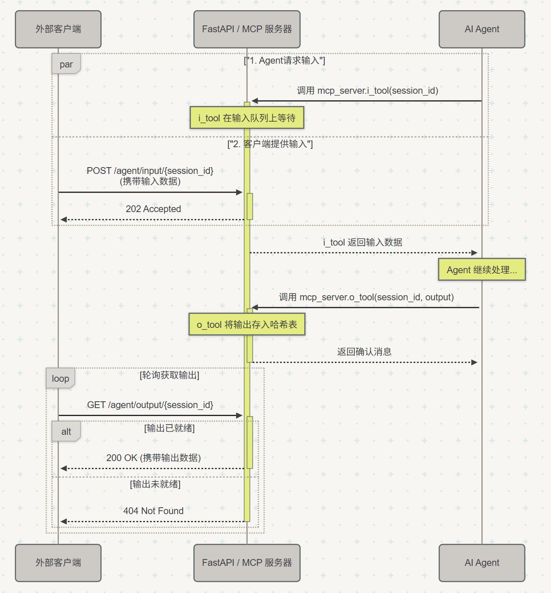
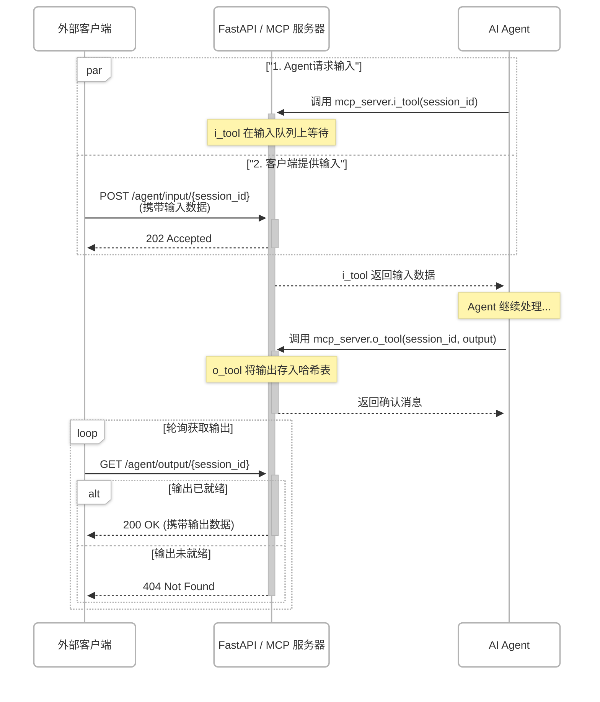

# MCP IO 服务器架构文档

## 1. 概述

本项目实现了一个基于 `FastAPI` 和 `FastMCP` 的服务器，旨在为 AI Agent 提供异步的输入/输出（I/O）能力。服务器通过两种方式与外部世界交互：

1.  **MCP (Model Context Protocol)**: Agent 可以调用服务器注册的 `tool` 来请求输入或提交输出。
2.  **RESTful API**: 外部客户端（例如，用户界面、测试脚本）可以通过 HTTP 请求为 Agent 提供输入，或获取 Agent 处理完成的输出。

这种架构解耦了 Agent 的核心逻辑与外部 I/O，允许 Agent 在需要时暂停执行以等待用户输入，并在完成后将结果异步传递给外部系统。

## 2. 核心组件

系统由以下几个核心组件构成：

### 2.1. FastAPI 应用

- **框架**: `FastAPI`
- **职责**: 作为 Web 服务器的骨架，处理所有 HTTP 请求。它承载了 RESTful API 和 FastMCP 服务。
- **主文件**: `src/main.py`

### 2.2. FastMCP 服务器

- **框架**: `FastMCP`
- **职责**: 实现 MCP 协议，向 AI Agent 暴露工具 (`tool`)。Agent 通过调用这些工具与服务器进行交互。
- **挂载点**: 在 FastAPI 应用的 `/mcp` 路径下运行。

### 2.3. IO 工具 (`io_tools`)

这是 Agent 可以调用的核心功能，定义在 `src/mcp_server/io_tools.py` 中。

- `i_tool(session_id: str) -> str`:

  - **功能**: Agent 调用此工具来获取输入。
  - **机制**: 当被调用时，它会从与 `session_id` 关联的输入队列中异步等待一条消息。在消息到达之前，Agent 的执行将在此处暂停。

- `o_tool(session_id: str, output: str) -> str`:
  - **功能**: Agent 调用此工具来提交其最终输出。
  - **机制**: 它将接收到的 `output` 存储在一个以 `session_id` 为键的共享哈希表（字典）中，供外部通过 RESTful API 拉取。

### 2.4. RESTful API (`api`)

这是外部与服务器交互的 HTTP 接口，定义在 `src/mcp_server/api.py` 中，所有端点都在 `/agent` 前缀下。

- `POST /agent/input/{session_id}`:

  - **功能**: 向指定的会话提供输入。
  - **机制**: 接收请求体中的数据，并将其放入与 `session_id` 对应的输入队列中。如果 `i_tool` 正在等待该会话的输入，它将被唤醒并接收此数据。

- `GET /agent/output/{session_id}`:
  - **功能**: 获取指定会话的输出结果。
  - **机制**: 检查与 `session_id` 关联的输出存储。如果 `o_tool` 已经提交了输出，接口会返回该输出并将其从存储中删除。如果输出尚不存在，则返回 `404 Not Found`。

### 2.5. 共享状态 (`state`)

为了在不同的组件（MCP 工具和 API 端点）之间安全地共享数据，我们使用了集中的状态管理，定义在 `src/mcp_server/state.py`。

- `input_queues: DefaultDict[str, asyncio.Queue]`:

  - **类型**: 一个默认字典，其值为 `asyncio.Queue`。
  - **职责**: 核心的消息队列。每个 `session_id` 都有自己的输入队列。`defaultdict` 的使用简化了代码，无需在首次访问时手动检查和创建队列。
  - **线程安全**: `asyncio.Queue` 本身是为异步环境设计的，其操作是原子的，因此在单个 FastAPI 进程内是安全的。

- `output_storage: dict[str, Any]`:

  - **类型**: 标准字典。
  - **职责**: 存储由 `o_tool` 产生的输出，直到被 `/agent/output` 接口消费。

- `output_storage_lock: asyncio.Lock`:
  - **职责**: 一个异步锁，用于保护对 `output_storage` 的并发访问（读/写），确保在多任务环境下操作的原子性，防止竞态条件。

## 3. 工作流程与数据流

一个典型的会话流程如下：

1.  **Agent 等待输入**: AI Agent 在其任务流程中需要用户输入时，调用 `i_tool(session_id="some-uuid")`。服务器的 `i_tool` 开始在 `input_queues["some-uuid"]` 上等待。

2.  **外部提供输入**: 用户通过一个前端应用（或其他客户端）与系统交互。该客户端向 `POST /agent/input/some-uuid` 发送一个包含输入数据的请求。

3.  **输入传递给 Agent**: API 端点接收到请求，并将输入数据放入 `input_queues["some-uuid"]` 队列。`i_tool` 立刻获取到数据，解除阻塞，并将数据返回给 Agent。Agent 继续其处理任务。

4.  **Agent 产生输出**: Agent 完成任务后，调用 `o_tool(session_id="some-uuid", output="final result")`。服务器的 `o_tool` 将 "final result" 存储在 `output_storage["some-uuid"]` 中。

5.  **外部获取输出**: 外部客户端轮询 `GET /agent/output/some-uuid` 接口。
    - 起初，由于 `o_tool` 可能还未被调用，接口返回 404。
    - 一旦 `o_tool` 存储了结果，下一次轮询请求将成功，并收到包含 "final result" 的 200 OK 响应。服务器同时会清除该输出，以防重复获取。

## 4. 系统架构图

