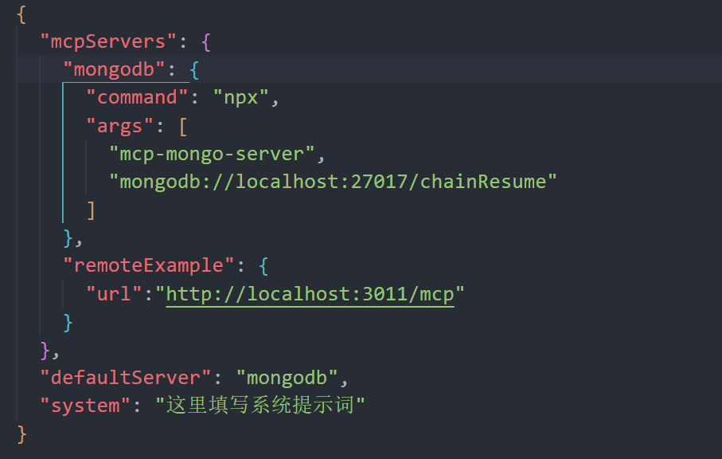
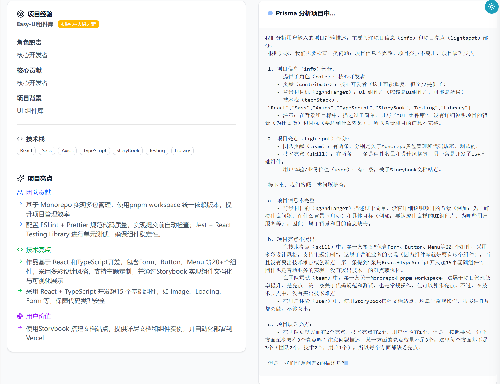
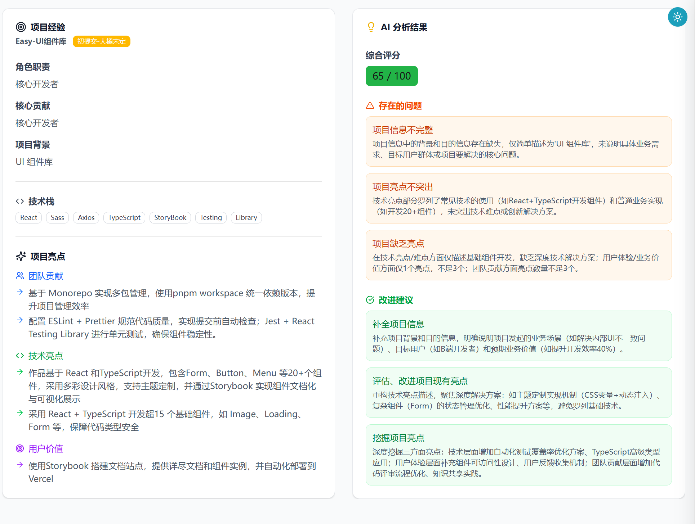
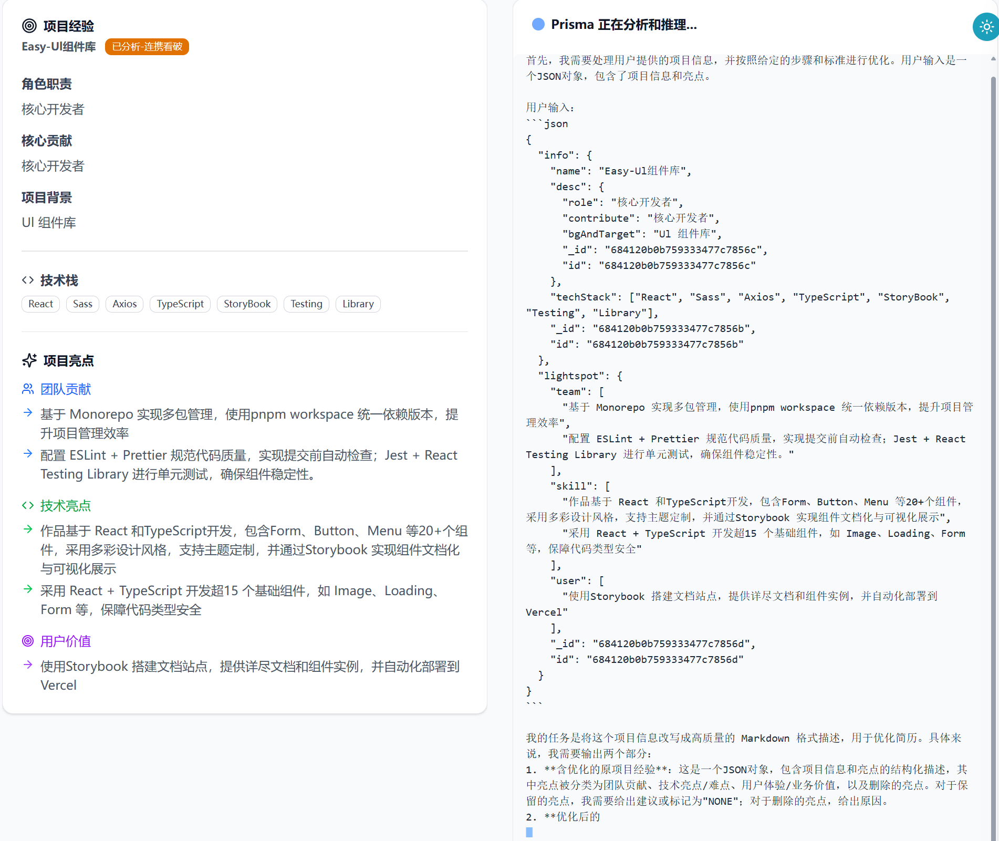
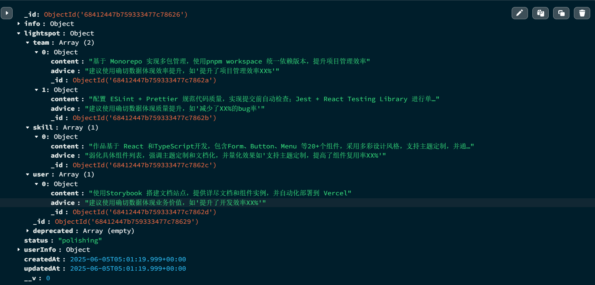
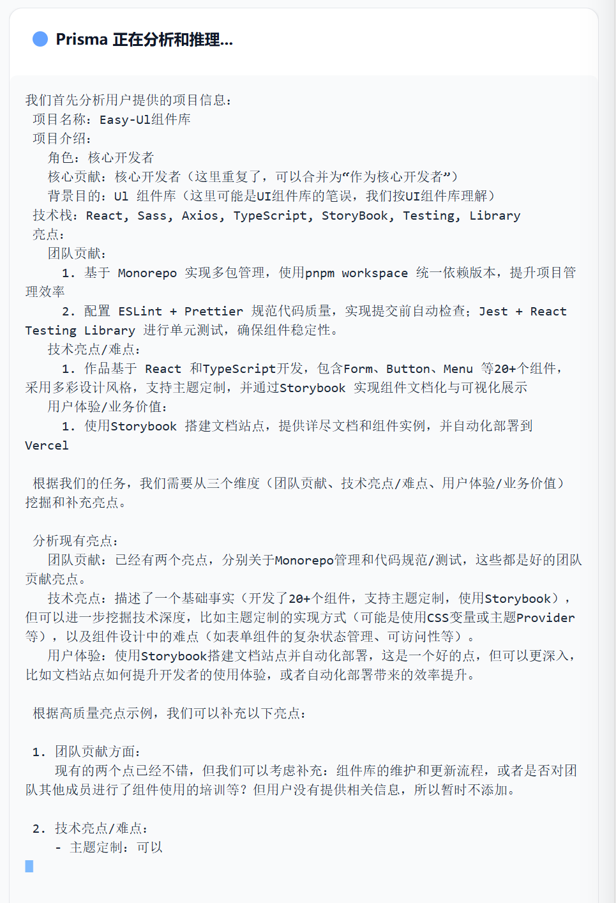
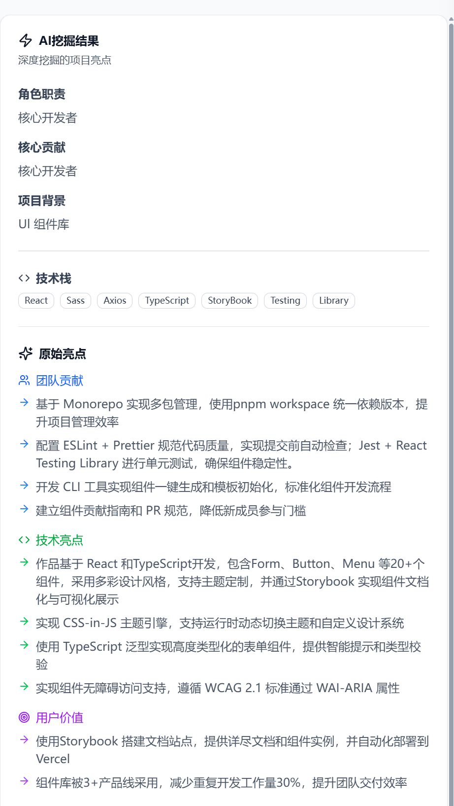

# prisma-ai 介绍

prisma-ai 搭建了一个实现rag、agent + mcp范式的paas平台，以及在此基础上实现一个llm saas应用——帮助用户从简历到拿到offer的saas应用——简历灵感菇。

## 功能介绍

平台方面，

prisma-ai平台通过langchain、pincone以及openai的embedding modle 支持rag范式。

通过扩展langchain能力，实现了支持 mcp 的 agent。通过 mcp-sdk 开发了mcp client，支持本地、远程mcp server交互。

从而支持了agent+mcp范式。

应用方面，

简历灵感菇通过langchain、deepseek的llm、prompt egineering实现了高度智能的简历优化 AI 助手 Prisma。

通过nest + react 的前后端分离架构，结合任务队列、熔断、限流、重试实现高可用的AI 服务。

清晰的业务流程拆分与规划、高质量的prompt，合理的fallback，

以及deepseek r1 5/28 对JSON格式化输出的支持、更深的思考能力，

Prisma 可以高效高质量地分析、优化用户的简历。

**prisma-ai paas平台 实现了LLM 技术范式的工程化落地，通过 saas应用 "简历灵感菇" 验证了平台能力，也体现了 AI 重塑传统场景的能力。其 Agent+MCP 架构为复杂工作流提供新范式，而全链路类型安全与流式高可用设计，达到了工业级 LLM 应用标准。**

# prisma-ai 功能

## prisma-ai 平台功能

### Agent + MCP 范式支持

例如使用内置的mcp client给llm提供mongodb数据库查询tool：

1.配置mcp server:


2.deepseek v3 通过 client模块调用 mcp server tool 查询mongodb 数据库：


### 功能架构

```
rag范式支持：rag模块
- 向量数据库：pinecone
- embedding模型：openai
- 实现：langchain
agent + mcp 范式支持
- agent模块
  - mcp支持：langchain、mcp client 模块 tool服务
- mcp client模块
  - mcp server 连接服务
  - agent tool 服务
```

## 简历灵感菇应用功能

### 1.项目经验分析



分析结果：



### 2.项目经验优化



优化结果：



### 3.项目经验亮点挖掘



挖掘结果：



### 功能架构

```
用户注册登录及鉴权
- 鉴权：jwt、单token方案
- 注册登录：mysql + prisma

后端响应
- 会话管理、任务队列、redis缓存
- sse流式响应与断点接传：两步请求、redis缓存

前端展示
- 缓存：react-query
- 状态管理：react-query、redux
- 富文本：milkdown crepe、yjs
- 聊天助手：

数据CRUD：技术栈、项目经验
- mongodb + mongoose

项目经验优化
- 分析
- 优化
- 亮点挖掘

知识库构建
- mongodb + mongoose
- rag
- agent + tool(mcp-mongo-server)
```

一次完整的对llm服务的请求-响应过程：

```
前端
- 建立会话及上下文
- react-query管理、axios发送网络请求
- EventSource建立http长连接接收sse流式返回的数据

后端
- 会话管理
- 任务队列
- llm缓存
- llm服务
- 数据库、redis缓存
- 日志
- sse流式返回

```

# prisma-ai 技术架构

## 技术选型

### 前端

```
框架：react、ts

构建工具：vite

生态：react-query、redux、react-router

富文本：milkdown、yjs

样式管理：taiwind、styled-components

组件库：shadcn-ui
```

### 后端

```
框架：nest、ts

生态：opossum、puppeteer

数据库：mongodb、mysql、redis

数据库生态：mongoose、prisma

OSS：minio
```

### llm

```
框架：langchain、langgraph、copilotkit

生态：pinecone、mcp-sdk、langsmith
```

### devops

```
部署：docker、阿里云 ECS

CI/CD：jenkins
```

## 系统架构

使用pnpm workspace + learn monorepo，使用tsup构建共享库shared，进行高效的代码共享和版本管理。

简历灵感菇。

```
前端
- 组件（表示）层：react、shadcn再封装、tailwind
- 页面（路由）层：react-router路由管理
- 状态（逻辑）层：异步状态及缓存react-query、同步状态react原生 + redux
- 服务层：axios进行网络请求、react-query进行网络请求管理
- 工具层：hook封装sse请求、主题管理、错误处理

后端
- Controller层
  - DTO、VO
  - 中间件（AOP）
    - 鉴权
    - 统一错误处理和返回格式
- service层
  - 模块解耦：EventBus
- Model层
 - Entity：ORM、ODM
 - 缓存：redis
 - 向量数据库：pinecone
- View层：前端（前后端分离）
```

# prisma-ai 的亮点

## 整体

- 使用`pnpm、lerna`实现`monorepo`，实现代码共享、发版管理

  - 共享库使用构建工具`tsup`，提供更好的开发体验

- `docker`支持部署
- 使用`ts`、`zod schema`定义了统一的类型系统
- 使用DTO、VO实现数据库、后端、前端的类型解耦

## 前端

- 状态管理使用react-query、react原生、redux结合的方案，灵活而强大

  - 优雅封装axios，提供分层的拦截器配置和更清晰的类型约束

  - 优雅封装react-query，简化react-query的使用并提供统一的错误处理

- hook封装

  - 封装useSseAnswer hook，实现会话状态感知和SSE数据接收、并支持新连接的SSE接传

  - 封装useTheme实现主题管理，tailwind + css变量实现主题切换

- 富文本

  - milkdown编辑器实现外部值同步支持，即时渲染表单输入，并通过防抖节流优化，提高用户体验
  - 使用yjs和milkdown实现可协作的md编辑器

- 组件封装
  - 封装data-table组件，实现可高度复用和定制的支持排序、搜索、过滤、分页、选中的数据表格

## 后端

- 使用`mysql + prisma`、`mongodb + mogoose`双数据库方案，优雅适配llm应用

- 直接从`zod schema`生成类型、定义`dto`，减少冗余代码

- 通过`nest`的`interceptor`、`exception filter`，定义错误码和错误信息，统一错误处理和响应格式

- 使用`nest`的`guard`、`jwt`进行登录鉴权并使用`单token方案无感续token`

  > 支持用户多端登录：因为只要能从`token`解析出用户信息就认为登录成功。

- 使用`SSE`返回`llm`结果，避免了轮询的低效和`websocket`的高开销

- `SSE`通过任务队列 + `redis`与`http`连接解耦，并提供双端的会话管理，支持页面刷新或者关闭后续传，提供了良好的用户体验

- 使用向量数据库和redis实现`llm`生成结果缓存层

- `redis`缓存优化用户体验

## ai

langchain

- `langchain`构建可复用的`chain`
  - 自定义`chat_history`提供更大的灵活度
- 实现了rag、agent+mcp范式
  - 自定义langchain agent使其支持mcp tools
  - 自定义langgraph，使其支持事件驱动

mcp

- 本地自定义 mcp client为agent提供mcp tools

copiotkit

- 通过copilotkit在应用程序中集成AI助手

# 总结

## **一、项目价值**

1. **双范式平台**
   - 打造支持 **RAG** 和 **Agent + MCP 范式** 的 LLM 应用开发平台（PaaS）
   - 基于平台构建 SaaS 应用 **"简历灵感菇"**，提供从简历优化到求职的全流程 AI 服务
2. **解决核心痛点**
   - 降低 LLM 应用开发门槛，提供开箱即用的 RAG/Agent 能力
   - 通过深度简历优化，解决求职者简历竞争力不足的问题

## **二、技术成果**

| 领域         | 成果                                                                                                                                                                                      |
| :----------- | :---------------------------------------------------------------------------------------------------------------------------------------------------------------------------------------- |
| **AI 范式**  | ▶️ 实现 **RAG 工业化流程**：Pinecone + OpenAI Embedding + LangChain ▶️ 提供 **Agent+MCP 融合架构**：扩展 LangChain 支持 MCP 协议，开发 mcp-client 实现跨环境工具调用                      |
| **工程架构** | ▶️ 前后端分离：React（前端） + Nest（后端） ▶️ 高可用设计：任务队列 + Redis 缓存 + 熔断限流 ▶️ **SSE 流式响应 + 异常恢复**：解耦 HTTP 连接与会话状态，支持异常恢复                        |
| **开发范式** | ▶️ **Monorepo 管理**：pnpm + lerna + tsup 构建共享库 ▶️ **统一类型生态**：TS + Zod Schema → DTO/VO 全链路类型安全 ▶️ **双数据库方案**：MySQL（关系型）+ MongoDB（文档型）精准匹配业务场景 |
