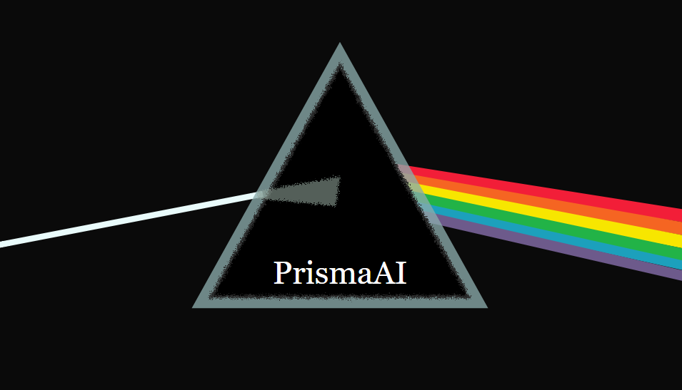

# prisma-ai:免费开源，一站式解决项目经验没亮点、简历石沉大海等痛点

[](...)

简体中文 | [English](i18n/README-EN.md)

## ⚡快速开始

建议使用`docker`构建、启动本项目,除了你的 apikey 外零配置。

没有安装`docker`环境的可以按照[1分钟学会Win/Linux/Mac上安装Docker，零失败](https://www.bilibili.com/video/BV1vm421T7Kw/?spm_id_from=333.337.search-card.all.click&vd_source=fb073c2174b0ff1ae25a8042f5eaf690)来安装。

本地启动需要安装`node`环境和必要的数据库。

### 🐳 Docker

```bash
# 克隆仓库
git clone https://github.com/weicanie/prisma-ai.git
```

然后打开`packages/backend`, 配置`.env、.env.production`对应的环境变量。
然后配置人岗匹配用到的模型：

```bash
# 下载模型到本地
git clone https://hf-mirror.com/moka-ai/m3e-base models/moka-ai/m3e-base
# 配置python环境
./python-setup.sh
# 获取模型onnx文件
./model-onnx.sh
```

注意：你需要先将本地模型配置完毕,以在容器中使用模型

```bash
# 构建服务,在仓库根目录执行
docker compose -f compose.yaml up --build
```

然后浏览器访问`localhost`即可使用!

### 👨‍💻本地启动

```bash
# 克隆仓库
git clone https://github.com/weicanie/prisma-ai.git

# 安装依赖
pnpm install
```

然后打开`packages/backend`, 配置`.env、.env.development`对应的环境变量。
然后配置人岗匹配用到的模型：

```bash
# 下载模型到本地
git clone https://hf-mirror.com/moka-ai/m3e-base models/moka-ai/m3e-base
# 配置python环境
./python-setup.sh
# 获取模型onnx文件
./model-onnx.sh
```

```bash
# 启动项目,在仓库根目录执行
pnpm run dev
```

## 1、项目的核心价值/解决的痛点

痛点1: 项目经验没亮点，只会罗列些常见技术和业务😤
解决: deepseek-r1进行深度分析、改进，深度挖掘亮点👌

痛点2: 简历海投，岗位不匹配也摁投，海投几千，面试寥寥!😤
解决1: deepseek-r1面对岗位定制简历，匹配化、契合化👌
解决2: 爬取招聘网站岗位数据、SBERT模型+deepseek-v3进行人岗匹配👌

痛点3: 八股太多了背了忘忘了背😤
解决1: 爬取面试题数据，根据简历延伸细节、匹配八股👌(因为面试官一般是根据你的简历来聊的，当然基础的八股得熟)
解决2: 仿anki科学刷八股、费曼学习法突破难啃八股👌(借助llm)

## 2、可以在下一秒用到吗？

可以的，兄弟，可以的。

免费开源，持续更新。
项目地址:

demo网站:ISP备案通过了，还在公安备案阶段。

docker一行命令构建、启动🥰。
除了你的deepseek 等apikey外零配置。

当然也支持本地node环境启动。

有帮助的话点个star吧，这对我真的很重要😉。

欢迎提issue、提功能!

## 3、核心价值是如何实现的?

1、优秀的简历质量指标和流程设计，源自c开头的某位老师，专为it岗位的同学设计，我主要做了整个流程的prompt抽象和进一步的扩展🧐。
2、主要基于deepseek r1 5/28，高质量的prompt、全流程数据结构化，高质量的输出🤩。
3、内置爬虫爬取某boss数据，使用SBERT双塔模型进行召回、llm进行重排🥴。
4、学习路线生成(面向offer学习)、项目亮点实现(目前的方案是读取你的代码库，理解后将方案以prompt和上下文的形式生成，给到cursor、windsurf这样的专业代码生成工具实现，术业有专攻、不重复造轮子)

## 4、项目目前的进展

v1.0.0 开箱即用的流程llm (√)
1、(✓)项目经验分析、优化、亮点挖掘
2、(✓)根据岗位定制简历
3、(✓)内置爬虫爬取岗位数据(测试爬了差不多两千条数据ip被封了一天😂，悲，现在大大改进了伪装但还没实测)
4、(✓)本地部署SBERT模型做岗位信息嵌入、pinecone数据库做岗位信息召回、llm做重排和分析
5、(√)人岗匹配前端实现

v2.0.0 QAG + RAG 的 AI Agent ()
1、()结构化存储 + 向量存储的知识库
2、()统筹现有工具,专注项目亮点实现的AI Agent
...

## 5、接下来还会发生什么?

我所在的项目组(9个人，本硕都有)正在进行大量企业、个人走访和人岗数据收集及分析项目，在这个过程中获得的insight和数据会持续更新到这个项目中🧐。

## 6、欢迎contribute

欢迎任何形式的contribute，欢迎star、issue、pr😉。

项目后端: nest(ts)，mysql、mongodb、redis，langchain、copilotkit

项目前端: react(ts)、vite、react-query、redux、tailwind

1、全链路类型安全，dto、vo；
2、清晰统一的响应和全链路错误处理；
3、清晰的模块划分、组件封装；

**codebase：**

| language       | files |   code | comment | blank |  total |
| :------------- | ----: | -----: | ------: | ----: | -----: |
| TypeScript JSX |    98 | 10,277 |     469 |   932 | 11,678 |
| TypeScript     |   171 | 10,048 |   2,549 | 1,463 | 14,060 |
| Markdown       |    25 |  1,522 |       2 |   628 |  2,152 |
| CSS            |     4 |    799 |      22 |    88 |    909 |
| JavaScript     |     9 |    166 |      14 |    18 |    198 |
| Shell Script   |     5 |    123 |      66 |    49 |    238 |

## 7、欢迎加群交流

930291816


## 8、声明

本人抵制任何形式的简历造假行为，通过运行本项目产出的任何数据都应该只作为参考和学习路线规划用。

## 9、F&Q

1、项目的目标?
最有效的一站式it就业解决方案。

项目之后还会做更多自定义功能，比如引入flowise做可视化流程自定义编排。还有mcp功能(其实目前已经支持得很完善了)。

## 10、文档教程

1、[岗位数据爬取教程](/doc/岗位数据爬取教程.md)