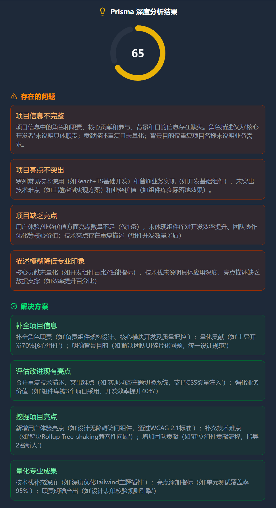
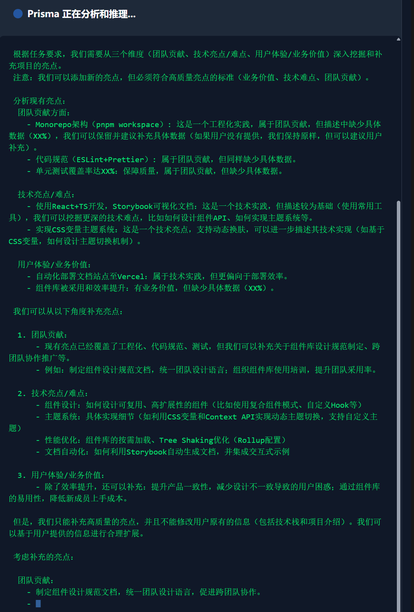

# prisma-ai - 从简历到offer

[](...)

简体中文 | [English](i18n/README-EN.md)

## ⚡快速开始

```bash
# 克隆仓库
git clone https://github.com/weicanie/prisma-ai.git

# 安装依赖
pnpm install
```

然后打开packages/backend, 配置.env、.env.development对应的环境变量。

```bash
# 启动项目
pnpm lerna dev --parallel
```

## 🐳 Docker

```bash
# 克隆仓库
git clone https://github.com/weicanie/prisma-ai.git
```

然后打开packages/backend, 配置.env、.env.production对应的环境变量。

```bash
# 构建服务,在仓库根目录执行
docker compose -f compose.yaml up --build
```

然后浏览器访问localhost即可使用!

## 一、prisma-ai 介绍

一个实现`agent(代理) + mcp(模型上下文协议)`等 `llm(大语言模型)` 应用开发范式的平台，以及在此基础上实现的`llm`应用——**简历灵感菇**——帮助用户把简历变成offer。

### ⚡1、解决核心痛点

#### 🎯你比你想的还要不会写简历, 更不会充分利用简历！

你是`项目经验苦手`, 亮点憋不出来, 难点想不出来。

你是海刷面试题的姜太公——愿题上钩, 殊不知`80%的面试问题`会从你的简历展开。

你是3天一份简历的速成选手, 殊不知一份优秀的简历自己手写需要花费几周及以上的时间。

你是海投几千面试几个的耐投王, 殊不知必须`面向岗位定制简历`。

你是公司用啥我学啥的"实用主义者", 殊不知在残酷的互联网就业市场, 只有`面向offer学习`一途。

**prisma-ai** 的目标就是提供`开箱即用的一站式解决平台`,

让你惊叹简历的价值竟如此大, 而自己充分利用后, 如`鱼入offer海、鸟上高薪天`——再不受羁绊了！

#### 🎯降低 LLM 应用开发门槛，提供开箱即用的 Agent + MCP 能力

`MCP协议`火爆至今, 在各厂商的营销下显然已经变味, 诸如"没MCP就没有工具调用"、"MCP协议和restful谁更好用"等事实性错误令人忍俊不禁。
究其根本,是 AI 问答服务存在滞后、新技术存在一定门槛。
本项目通过开箱即用、完全手写的`mcp client`、`mcp server`, 让你直接入手`agent + mcp`的开发范式。

### 📝2、简历灵感菇

#### ✨简历分析、优化、亮点挖掘

简历灵感菇使用最新的`deepseek r1 5/28`模型，更深的思考能力、更强的输出能力，以及系列`prompt egineering(提示词工程)`实现了强大的简历优化助手 **Prisma**。

**Prisma** 可以高效高质量地分析、优化用户的简历、挖掘用户简历亮点。

#### 💼简历岗位匹配化、契合化（很快到来）

#### 🚀学习路线规划、面试题知识库管理（很快到来）

### 👨‍💻 3、开发者平台

#### 🤖agent+mcp 范式支持

`prisma-ai`平台通过扩展`langchain`能力，实现了支持 `mcp` 的 `agent`。通过 `mcp-sdk` 开发了`mcp client`，支持本地、远程`mcp server`交互。

#### 🔄 rag范式 支持

通过`langchain`、`pincone`以及`openai`的`embedding modle` 支持`rag`范式。

#### 📊qag范式（很快到来）

一种通过 `sql`、`nosql` 数据库构建结构化知识库, `llm agent`使用提供的`tool`进行结构化查询、增强生成的`llm` 开发范式。

本项目目前已支持 `llm agent` 查询 `mongodb` 数据库。

## 二、prisma-ai 功能使用示例

### 📝1、简历灵感菇

#### 🔍1.项目经验分析


分析结果✨：



#### ⚡2.项目经验优化


优化结果✨：


#### 💎3.项目经验亮点挖掘



挖掘结果✨：


### 👨‍💻2、开发者平台

### 🤖Agent + MCP 范式

例如使用内置的mcp client给llm提供mongodb数据库查询tool：

1.配置mcp server⚙️:


2.deepseek v3 agent 调用 mcp server tool 查询 mongodb 数据库成功🚀：


## 三、技术价值

| 领域         | 成果                                                                                                                                                                                      |
| :----------- | :---------------------------------------------------------------------------------------------------------------------------------------------------------------------------------------- |
| **AI 范式**  | ▶️ 实现 **RAG 工业化流程**：Pinecone + OpenAI Embedding + LangChain ▶️ 提供 **Agent+MCP 融合架构**：扩展 LangChain 支持 MCP 协议，开发 mcp-client 实现跨环境工具调用                      |
| **工程架构** | ▶️ 前后端分离：React（前端） + Nest（后端） ▶️ 高可用设计：任务队列 + Redis 缓存 + 熔断限流 ▶️ **SSE 流式响应 + 异常恢复**：解耦 HTTP 连接与会话状态，支持异常恢复                        |
| **开发范式** | ▶️ **Monorepo 管理**：pnpm + lerna + tsup 构建共享库 ▶️ **统一类型生态**：TS + Zod Schema → DTO/VO 全链路类型安全 ▶️ **双数据库方案**：MySQL（关系型）+ MongoDB（文档型）精准匹配业务场景 |
